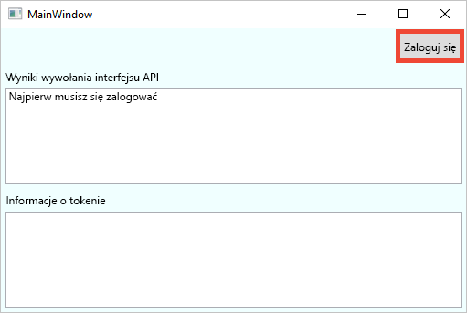
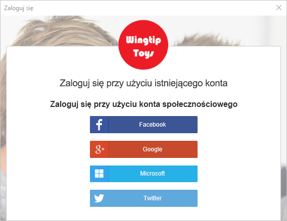
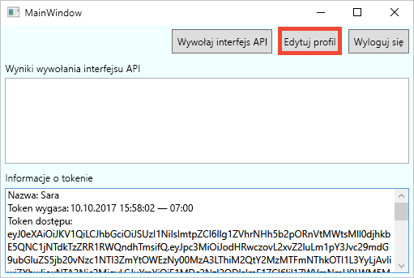
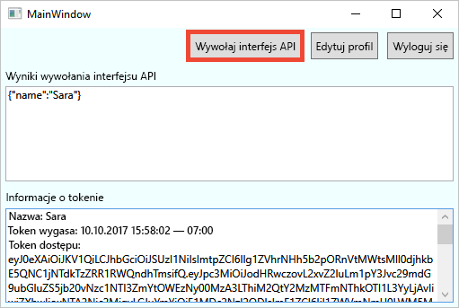

# <a name="quickstart-set-up-sign-in-for-a-desktop-app-using-azure-active-directory-b2c"></a>Szybki start: konfigurowanie logowania dla aplikacji klasycznej przy użyciu usługi Azure Active Directory B2C 

Usługa Azure Active Directory (Azure AD) B2C umożliwia zarządzanie tożsamościami w chmurze, chroniąc Twoją aplikację, firmę i klientów. Usługa Azure AD B2C umożliwia aplikacjom uwierzytelnianie względem kont społecznościowych i firmowych za pomocą protokołów zgodnych z otwartymi standardami. W tym przewodniku Szybki start przykładowa aplikacja klasyczna platformy Windows Presentation Foundation (WPF) jest używana do logowania za pomocą dostawcy tożsamości społecznościowych i wywoływania chronionego internetowego interfejsu API usługi Azure AD B2C.

[!INCLUDE [quickstarts-free-trial-note](../../includes/quickstarts-free-trial-note.md)]

## <a name="prerequisites"></a>Wymagania wstępne

- [Visual Studio 2019](https://www.visualstudio.com/downloads/) z **ASP.NET i tworzenie aplikacji internetowych** obciążenia. 
- Konto w sieci społecznościowej: Facebook, Google, Microsoft lub Twitter.
- [Pobierz plik zip](https://github.com/Azure-Samples/active-directory-b2c-dotnet-desktop/archive/master.zip) lub sklonuj przykładową aplikację internetową z usługi GitHub.

    ```
    git clone https://github.com/Azure-Samples/active-directory-b2c-dotnet-desktop.git
    ```

## <a name="run-the-application-in-visual-studio"></a>Uruchamianie aplikacji w programie Visual Studio

1. W folderze projektu przykładowej aplikacji otwórz rozwiązanie **active-directory-b2c-wpf.sln** w programie Visual Studio.
2. Naciśnij klawisz **F5**, aby debugować aplikację.

## <a name="sign-in-using-your-account"></a>Logowanie się przy użyciu swojego konta

1. Kliknij pozycję **Zaloguj**, aby uruchomić przepływ pracy **Rejestrowanie lub logowanie**.

    

    Przykład obsługuje kilka opcji rejestracji. Te opcje obejmują przy użyciu dostawcy tożsamości społecznościowych lub tworzenia konta lokalnego przy użyciu adresu e-mail. Dla tego przewodnika Szybki start należy użyć konta dostawcy tożsamości dla sieci społecznościowej Facebook, Google, Microsoft lub Twitter. 


2. Dla przykładowej aplikacji internetowej usługa Azure AD B2C wyświetla niestandardową stronę logowania fikcyjnej marki Wingtip Toys. Aby zarejestrować się przy użyciu dostawcy tożsamości dla sieci społecznościowej, kliknij przycisk dostawcy tożsamości, którego chcesz użyć. 

    

    Uwierzytelniasz się (Zaloguj) przy użyciu konta społecznościowego poświadczeń i Autoryzuj aplikację do odczytywania informacji z konta społecznościowego. Po udzieleniu dostępu aplikacji może ona pobrać informacje z profilu na koncie w sieci społecznościowej, takie jak Twoje nazwisko i miasto. 

2. Zakończ proces logowania dla dostawcy tożsamości.

    Szczegóły profilu na nowym koncie są wstępnie wypełnione informacjami z konta w sieci społecznościowej.

## <a name="edit-your-profile"></a>Edycja profilu

Usługa Azure AD B2C zawiera funkcję umożliwiającą użytkownikom aktualizowanie profilów. Przykładowa aplikacja internetowa używa przepływu użytkownika profilu edycji usługi Azure AD B2C dla przepływu pracy. 

1. Na pasku menu aplikacji kliknij pozycję **Edit profile** (Edytuj profil), aby edytować utworzony profil.

    

2. Wybierz dostawcę tożsamości skojarzonego z utworzonym kontem. Jeśli na przykład użyto usługi Twitter jako dostawcy tożsamości podczas tworzenia konta, wybierz usługę Twitter, aby zmodyfikować szczegóły skojarzonego profilu.

3. W polu **Display name** zmień swoją nazwę wyświetlaną, a w polu **City** — miejscowość, a następnie kliknij przycisk **Continue** (Kontynuuj).

    Nowy token dostępu zostanie wyświetlony w polu tekstowym *Informacje o tokenie*. Jeśli chcesz zweryfikować zmiany profilu, skopiuj i wklej token dostępu do dekodera tokenów na stronie https://jwt.ms.

## <a name="access-a-protected-api-resource"></a>Uzyskiwanie dostępu do chronionego zasobu interfejsu API

Kliknij pozycję **Wywołaj interfejs API**, aby wysłać żądanie do chronionego zasobu. 

    

    The application includes the Azure AD access token in the request to the protected web API resource. The web API sends back the display name contained in the access token.

Pomyślnie użyto konta użytkownika usługi Azure AD B2C do wykonania autoryzowanego wywołania chronionego internetowego interfejsu API usługi Azure AD B2C.

## <a name="clean-up-resources"></a>Oczyszczanie zasobów

Jeśli planujesz wypróbować inne przewodniki Szybki start lub samouczki usługi Azure AD B2C, możesz użyć swojej dzierżawy usługi Azure AD B2C. Możesz [usunąć dzierżawę usługi Azure AD B2C](active-directory-b2c-faqs.md#how-do-i-delete-my-azure-ad-b2c-tenant), gdy nie będzie już potrzebna.

## <a name="next-steps"></a>Kolejne kroki

W tym przewodniku Szybki Start użyto przykładowej aplikacji klasycznej do: 

* Zaloguj się przy użyciu niestandardowej strony logowania
* Zaloguj się przy użyciu dostawcy tożsamości społecznościowych
* Tworzenie konta usługi Azure AD B2C
* Wywoływanie internetowego interfejsu API chronionego przez usługę Azure AD B2C

Wprowadzenie do tworzenia własnej dzierżawy usługi Azure AD B2C. 

> [!div class="nextstepaction"]
> [Tworzenie dzierżawy usługi Azure Active Directory B2C w witrynie Azure Portal](tutorial-create-tenant.md)
