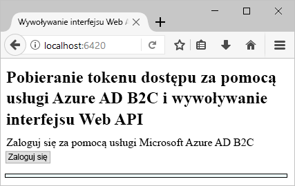
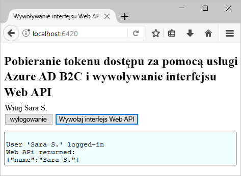

# <a name="quickstart-set-up-sign-in-for-a-single-page-app-using-azure-active-directory-b2c"></a>Szybki start: konfigurowanie logowania dla aplikacji jednostronicowej przy użyciu usługi Azure Active Directory B2C

Usługa Azure Active Directory (Azure AD) B2C umożliwia zarządzanie tożsamościami w chmurze, chroniąc Twoją aplikację, firmę i klientów. Usługa Azure AD B2C umożliwia aplikacjom uwierzytelnianie względem kont społecznościowych i firmowych za pomocą protokołów zgodnych z otwartymi standardami. W tym przewodniku Szybki start aplikacja jednostronicowa jest używana do logowania za pomocą dostawcy tożsamości społecznościowych i wywoływania chronionego internetowego interfejsu API usługi Azure AD B2C.

[!INCLUDE [quickstarts-free-trial-note](../../includes/quickstarts-free-trial-note.md)]

## <a name="prerequisites"></a>Wymagania wstępne

- [Visual Studio 2019](https://www.visualstudio.com/downloads/) z **ASP.NET i tworzenie aplikacji internetowych** obciążenia.
- Zainstalować środowisko [Node.js](https://nodejs.org/en/download/).
- Konto w sieci społecznościowej: Facebook, Google, Microsoft lub Twitter.
- [Pobierz plik zip](https://github.com/Azure-Samples/active-directory-b2c-javascript-msal-singlepageapp/archive/master.zip) lub sklonuj przykładową aplikację internetową z usługi GitHub.

    ```
    git clone https://github.com/Azure-Samples/active-directory-b2c-javascript-msal-singlepageapp.git
    ```

## <a name="run-the-application"></a>Uruchamianie aplikacji

1. Uruchom serwer za pomocą następującego polecenia w wierszu polecenia środowiska Node.js:

    ```
    cd active-directory-b2c-javascript-msal-singlepageapp
    npm install && npm update
    node server.js
    ```

    Skrypt Server.js generuje numer portu, którego nasłuchuje na hoście lokalnym.

    ```
    Listening on port 6420...
    ```

2. Przejdź do adresu URL aplikacji. Na przykład `http://localhost:6420`.

## <a name="sign-in-using-your-account"></a>Logowanie się przy użyciu swojego konta

1. Kliknij przycisk **Login** (Zaloguj), aby uruchomić przepływ pracy.

    

    Przykład obsługuje kilka opcji rejestracji, w tym przy użyciu dostawcy tożsamości dla sieci społecznościowej, lub tworzenia konta lokalnego przy użyciu adresu e-mail. Dla tego przewodnika Szybki start należy użyć konta dostawcy tożsamości dla sieci społecznościowej Facebook, Google, Microsoft lub Twitter.

2. Dla przykładowej aplikacji internetowej usługa Azure AD B2C wyświetla niestandardową stronę logowania fikcyjnej marki Wingtip Toys. Aby zarejestrować się przy użyciu dostawcy tożsamości dla sieci społecznościowej, kliknij przycisk dostawcy tożsamości, którego chcesz użyć.

    

    Uwierzytelniasz się (Zaloguj) przy użyciu konta społecznościowego poświadczeń i Autoryzuj aplikację do odczytywania informacji z konta społecznościowego. Po udzieleniu dostępu aplikacji może ona pobrać informacje z profilu na koncie w sieci społecznościowej, takie jak Twoje nazwisko i miasto.

3. Zakończ proces logowania dla dostawcy tożsamości.

## <a name="access-a-protected-api-resource"></a>Uzyskiwanie dostępu do chronionego zasobu interfejsu API

Kliknij przycisk **Call Web API** (Wywołaj internetowy interfejs API), aby uzyskać swoją nazwę wyświetlaną zwróconą jako obiekt JSON z wywołania internetowego interfejsu API.



Przykładowa aplikacja jednostronicowa dołącza token dostępu do żądania wysłanego do chronionego zasobu internetowego interfejsu API.

## <a name="clean-up-resources"></a>Oczyszczanie zasobów

Jeśli planujesz wypróbować inne przewodniki Szybki start lub samouczki usługi Azure AD B2C, możesz użyć swojej dzierżawy usługi Azure AD B2C. Możesz [usunąć dzierżawę usługi Azure AD B2C](active-directory-b2c-faqs.md#how-do-i-delete-my-azure-ad-b2c-tenant), gdy nie będzie już potrzebna.

## <a name="next-steps"></a>Kolejne kroki

W tym przewodniku Szybki Start użyto przykładowej aplikacji jednostronicowej w celu:

* Zaloguj się przy użyciu niestandardowej strony logowania
* Zaloguj się przy użyciu dostawcy tożsamości społecznościowych
* Tworzenie konta usługi Azure AD B2C
* Wywoływanie internetowego interfejsu API chronionego przez usługę Azure AD B2C

Wprowadzenie do tworzenia własnej dzierżawy usługi Azure AD B2C.

> [!div class="nextstepaction"]
> [Tworzenie dzierżawy usługi Azure Active Directory B2C w witrynie Azure Portal](tutorial-create-tenant.md)
