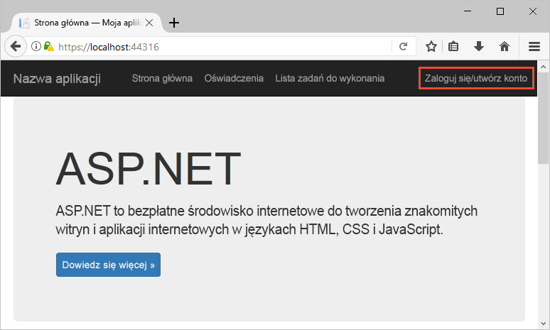
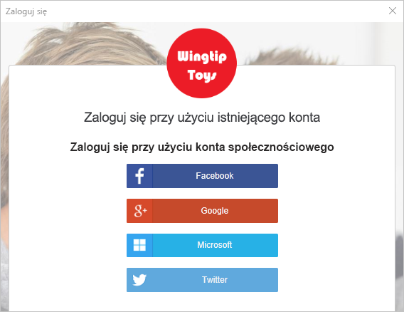
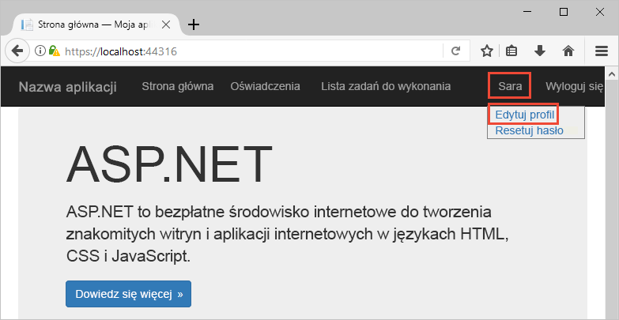
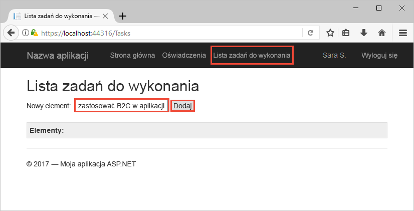

# <a name="quickstart-set-up-sign-in-for-an-aspnet-application-using-azure-active-directory-b2c"></a>Quickstart: Set up sign in for an ASP.NET application using Azure Active Directory B2C

Azure Active Directory B2C (Azure AD B2C) provides cloud identity management to keep your application, business, and customers protected. Usługa Azure AD B2C umożliwia aplikacjom uwierzytelnianie względem kont społecznościowych i firmowych za pomocą protokołów zgodnych z otwartymi standardami. W tym przewodniku Szybki start aplikacja platformy ASP.NET jest używana do logowania za pomocą dostawcy tożsamości społecznościowych i wywoływania chronionego internetowego interfejsu API usługi Azure AD B2C.

[!INCLUDE [quickstarts-free-trial-note](../../includes/quickstarts-free-trial-note.md)]

## <a name="prerequisites"></a>Wymagania wstępne

- [Visual Studio 2019](https://www.visualstudio.com/downloads/) with the **ASP.NET and web development** workload.
- A social account from Facebook, Google, or Microsoft.
- [Pobierz plik zip](https://github.com/Azure-Samples/active-directory-b2c-dotnet-webapp-and-webapi/archive/master.zip) lub sklonuj przykładową aplikację internetową z usługi GitHub.

    ```
    git clone https://github.com/Azure-Samples/active-directory-b2c-dotnet-webapp-and-webapi.git
    ```

    There are two projects are in the sample solution:

    - **TaskWebApp** — aplikacja internetowa, która pozwala tworzyć i edytować listę zadań. The web application uses the **sign-up or sign-in** user flow to sign up or sign in users.
    - **TaskService** — internetowy interfejs API, który obsługuje następujące funkcje listy zadań: tworzenie, odczytywanie, aktualizowanie i usuwanie. Internetowy interfejs API jest chroniony przez usługę Azure AD B2C i wywoływany przez aplikację internetową.

## <a name="run-the-application-in-visual-studio"></a>Uruchamianie aplikacji w programie Visual Studio

1. W folderze projektu przykładowej aplikacji otwórz rozwiązanie **B2C-WebAPI-DotNet.sln** w programie Visual Studio.
2. Na potrzeby tego przewodnika Szybki start uruchomisz równocześnie projekty **TaskWebApp** i **TaskService**. Kliknij prawym przyciskiem myszy rozwiązanie **B2C-WebAPI-DotNet** w Eksploratorze rozwiązań i wybierz pozycję **Ustaw projekty startowe**.
3. Wybierz pozycję **Wiele projektów startowych** i zmień **Akcję** dla obu projektów na **Uruchom**.
4. Kliknij przycisk **OK**.
5. Naciśnij klawisz **F5**, aby debugować obie aplikacje. Każda z aplikacji zostanie otwarta we własnej karcie przeglądarki:

    - `https://localhost:44316/` — aplikacja internetowa platformy ASP.NET. W przewodniku Szybki start ta aplikacja jest używana bezpośrednio.
    - `https://localhost:44332/` — internetowy interfejs API wywoływany przez internetową aplikację platformy ASP.NET.

## <a name="sign-in-using-your-account"></a>Logowanie się przy użyciu swojego konta

1. Kliknij pozycję **Sign up / Sign in** (Zarejestruj się / Zaloguj się) w aplikacji internetowej platformy ASP.NET, aby uruchomić przepływ pracy.

    

    Przykład obsługuje kilka opcji rejestracji, w tym przy użyciu dostawcy tożsamości dla sieci społecznościowej, lub tworzenia konta lokalnego przy użyciu adresu e-mail. For this quickstart, use a social identity provider account from either Facebook, Google, or Microsoft.

2. Azure AD B2C presents a sign-in page for a fictitious company called Fabrikam for the sample web application. Aby zarejestrować się przy użyciu dostawcy tożsamości dla sieci społecznościowej, kliknij przycisk dostawcy tożsamości, którego chcesz użyć.

    

    You authenticate (sign in) using your social account credentials and authorize the application to read information from your social account. Po udzieleniu dostępu aplikacji może ona pobrać informacje z profilu na koncie w sieci społecznościowej, takie jak Twoje nazwisko i miasto.

3. Zakończ proces logowania dla dostawcy tożsamości.

## <a name="edit-your-profile"></a>Edycja profilu

Usługa Azure Active Directory B2C zawiera funkcję umożliwiającą użytkownikom aktualizowanie profilów. Przykładowa aplikacja internetowa używa przepływu użytkownika profilu edycji usługi Azure AD B2C dla przepływu pracy.

1. Na pasku menu aplikacji kliknij nazwę profilu, a następnie wybierz pozycję **Edit profile** (Edytuj profil), aby edytować utworzony profil.

    

2. W polu **Display name** zmień swoją nazwę wyświetlaną, a w polu **City** — miejscowość, a następnie kliknij przycisk **Continue** (Kontynuuj), aby zaktualizować profil.

    Zmienione dane są wyświetlane w prawej górnej części strony głównej aplikacji internetowej.

## <a name="access-a-protected-api-resource"></a>Uzyskiwanie dostępu do chronionego zasobu interfejsu API

1. Kliknij pozycję **Lista zadań do wykonania**, aby określić i zmodyfikować pozycje listy zadań do wykonania.

2. Wpisz tekst w polu tekstowym **Nowy element**. Kliknij pozycję **Dodaj**, aby wywołać chroniony internetowy interfejs API usługi Azure AD B2C, który dodaje pozycję listy zadań do wykonania.

    

    Aplikacja internetowa platformy ASP.NET dołącza token dostępu usługi Azure AD do żądania skierowanego do chronionego zasobu internetowego interfejsu API w celu wykonania operacji na pozycjach listy zadań do wykonania użytkownika.

Pomyślnie użyto konta użytkownika usługi Azure AD B2C do wykonania autoryzowanego wywołania chronionego internetowego interfejsu API usługi Azure AD B2C.

## <a name="clean-up-resources"></a>Oczyszczanie zasobów

Jeśli planujesz wypróbować inne przewodniki Szybki start lub samouczki usługi Azure AD B2C, możesz użyć swojej dzierżawy usługi Azure AD B2C. Możesz [usunąć dzierżawę usługi Azure AD B2C](active-directory-b2c-faqs.md#how-do-i-delete-my-azure-ad-b2c-tenant), gdy nie będzie już potrzebna.

## <a name="next-steps"></a>Następne kroki

In this quickstart, you used a sample ASP.NET application to:

* Sign in with a custom login page
* Sign in with a social identity provider
* Create an Azure AD B2C account
* Call a web API protected by Azure AD B2C

Wprowadzenie do tworzenia własnej dzierżawy usługi Azure AD B2C.

> [!div class="nextstepaction"]
> [Tworzenie dzierżawy usługi Azure Active Directory B2C w witrynie Azure Portal](tutorial-create-tenant.md)
