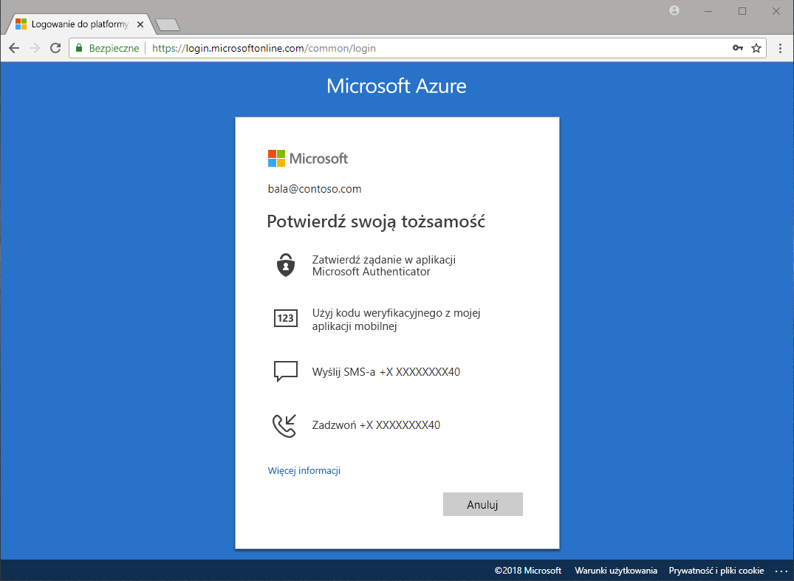

# Jakie są dostępne metody uwierzytelniania?

W wiadomościach pojawiają się informacje o kradzieży haseł i naruszeniu bezpieczeństwa tożsamości. Wymaganie drugiego składnika, oprócz hasła, natychmiast zwiększa bezpieczeństwo Twojej organizacji. Usługa Microsoft Azure Active Directory (Azure AD) zawiera funkcje, takie jak Azure Multi-Factor Authentication (Azure MFA) i samoobsługowe resetowanie haseł usługi Azure AD (SSPR, self-service password reset), które pomagają administratorom w chronieniu organizacji i użytkowników za pomocą dodatkowych metod uwierzytelniania.

Istnieje wiele scenariuszy, które obejmują: logowanie do aplikacji, resetowanie swojego hasła, włączanie usługi Windows Hello i inne, w których użytkownicy mogą zostać poproszeni o dostarczenie dodatkowej weryfikacji w celu potwierdzenia, że są tym, za kogo się podają.

Dodatkowa weryfikacja może mieć formę następujących metod uwierzytelniania:

* Kod dostarczony w wiadomości e-mail lub SMS
* Połączenie telefoniczne
* Powiadomienie lub kod na telefonie
* Odpowiedzi na pytania zabezpieczające

Usługa Azure MFA i samoobsługowe resetowanie haseł usługi Azure AD dają administratorom kontrolę nad konfiguracją, zasadami, monitorowaniem i raportowaniem za pomocą usługi Azure AD i witryny Azure Portal w celu ochrony organizacji.

## Samoobsługowe resetowanie hasła

Samoobsługowe resetowanie haseł umożliwia użytkownikom resetowanie ich haseł bez udziału administratora w dowolnym miejscu i czasie.

> [!VIDEO https://www.youtube.com/embed/hc97Yx5PJiM]

Samoobsługowe resetowanie haseł obejmuje następujące elementy:

* **Zmiana hasła:** znam swoje hasło, ale chcę je zmienić na inne.
* **Resetowanie hasła:** nie mogę się zalogować i chcę zresetować swoje hasło za pomocą co najmniej jednej zatwierdzonej metody uwierzytelniania.
* **Odblokowywanie konta:** nie mogę się zalogować, ponieważ moje konto jest zablokowane, i chcę je odblokować za pomocą co najmniej jednej zatwierdzonej metody uwierzytelniania.

## Multi-Factor Authentication

Azure Multi-Factor Authentication (MFA) to rozwiązanie firmy Microsoft służące do przeprowadzania weryfikacji dwuetapowej. Przy użyciu zatwierdzonych przez administratora metod uwierzytelniania usługa Azure MFA pomaga w zabezpieczaniu dostępu do danych i aplikacji, jednocześnie spełniając wymagania dotyczące prostoty procesu logowania.

## Wymagania licencyjne

[!INCLUDE [Active Directory P1 license](../../../includes/active-directory-p1-license.md)]

## Kolejne kroki

Następnym krokiem jest praktyczne skonfigurowanie samoobsługowego resetowania haseł i usługi Azure Multi-Factor Authentication.

Aby rozpocząć pracę z samoobsługowym resetowaniem haseł, zobacz [przewodnik Szybki start dotyczący funkcji SSPR](quickstart-sspr.md).

Więcej informacji na temat samoobsługowego resetowania haseł znajduje się w artykule [Jak to działa: samoobsługowe resetowania haseł usługi Azure AD](concept-sspr-howitworks.md).

Więcej informacji na temat usługi Azure Multi-Factor Authentication znajduje się w artykule [Jak to działa: usługa Azure Multi-Factor Authentication](concept-mfa-howitworks.md)
