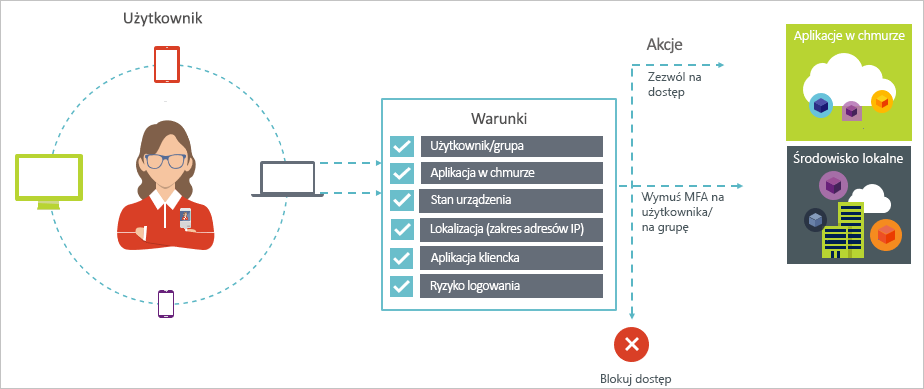

# Co to jest dostęp warunkowy w usłudze Azure Active Directory?

Zabezpieczenia są niezwykle ważne dla organizacji korzystających z chmury. Kluczowym aspektem zabezpieczeń w chmurze jest zarządzanie tożsamościami i dostępem do zasobów w chmurze. W świecie zdominowanym przez urządzenia mobilne i rozwiązania chmurowe użytkownicy mogą uzyskiwać dostęp do zasobów organizacji z dowolnego miejsca, za pomocą wielu różnych urządzeń i aplikacji. Dlatego nie wystarczy już tylko kontrolować tego, kto może uzyskać dostęp do zasobu. Aby zapewnić właściwą równowagę między bezpieczeństwem a produktywnością, należy w decyzjach dotyczących kontroli dostępu uwzględnić też to, w jaki sposób uzyskuje się dostęp do zasobu. Funkcja dostępu warunkowego w usłudze Azure Active Directory (Azure AD) pozwala sprostać temu wymaganiu. Dostęp warunkowy jest funkcją usługi Azure Active Directory. Dzięki tej funkcji można zautomatyzować decyzje dotyczące kontroli dostępu do aplikacji w chmurze, zgodnie z określonymi warunkami.

Zasady dostępu warunkowego są wymuszane po zakończeniu uwierzytelniania pierwszego stopnia. Dlatego dostęp warunkowy nie ma służyć jako pierwsza linia obrony w takich scenariuszach jak ataki typu „odmowa usługi” (ataki DoS), ale może korzystać z sygnałów z tych zdarzeń (np. poziomu ryzyka logowania, lokalizacji żądania, itp.) w celu określenia dostępu.  

W tym artykule omówiona została koncepcja dostępu warunkowego w usłudze Azure AD.

## Typowe scenariusze

W świecie zdominowanym przez urządzenia mobilne i rozwiązania chmurowe usługa Azure Active Directory umożliwia logowanie jednokrotne na urządzeniach oraz w usługach i aplikacjach, z dowolnego miejsca. Upowszechnienie różnorodnych urządzeń (w tym urządzeń prywatnych używanych do pracy), pracy poza siecią firmową i zewnętrznych aplikacji SaaS spowodowało, że stoją przed Tobą dwa przeciwstawne cele:

- Umożliwienie użytkownikom produktywnej pracy w dowolnym czasie i miejscu.
- Ochrona zasobów firmowych przez cały czas.

Korzystając z zasad dostępu warunkowego, możesz stosować odpowiednie mechanizmy kontroli dostępu w odpowiednich warunkach. Dostęp warunkowy w usłudze Azure AD zapewnia dodatkowe zabezpieczenia wtedy, gdy są potrzebne, ale nie przeszkadza użytkownikom w pozostałych sytuacjach.

Poniżej przedstawiono kilka powszechnych problemów związanych z dostępem, w których rozwiązaniu może pomóc dostęp warunkowy:

- **[Ryzyko logowania](conditions.md#sign-in-risk)**: usługa Azure AD Identity Protection wykrywa zagrożenia związane z logowaniem. Jak można ograniczyć dostęp w przypadku wykrycia ryzykownego logowania, wskazującego na złośliwego użytkownika? Co zrobić, aby uzyskać potwierdzenie, że logowanie pochodziło od uprawnionego użytkownika? Co, jeśli wątpliwości są na tyle poważne, że uzasadniają zablokowanie określonym użytkownikom dostępu do aplikacji?  

- **[Lokalizacja sieciowa](location-condition.md)**: usługa Azure AD jest dostępna z każdego miejsca. Co zrobić w przypadku próby uzyskania dostępu z lokalizacji sieciowej poza kontrolą Twojego działu IT? Kombinacja nazwy użytkownika i hasła może wystarczyć do potwierdzenia tożsamości w przypadku prób dostępu z poziomu sieci firmowej. Co zrobić, jeśli potrzebujesz pewniejszego potwierdzenia tożsamości w przypadku prób dostępu z nieoczekiwanych lokalizacji, takich jak inne kraje czy regiony świata? Co, jeśli chcesz zablokować próby dostępu z określonych lokalizacji?  

- **[Zarządzanie urządzeniami](conditions.md#device-platforms)**: w usłudze Azure AD użytkownicy mogą uzyskać dostęp do aplikacji w chmurze za pomocą wielu różnych urządzeń, w tym urządzeń mobilnych i prywatnych. Co zrobić, jeśli chcesz zezwolić tylko na próby dostępu z urządzeń zarządzanych przez Twój dział IT? Co, jeśli chcesz zablokować próby dostępu do aplikacji chmurowych w Twoim środowisku z określonych typów urządzeń?

- **[Aplikacja kliencka](conditions.md#client-apps)**: obecnie można uzyskiwać dostęp do wielu aplikacji w chmurze za pomocą różnego typu aplikacji, na przykład aplikacji internetowych, mobilnych i klasycznych. Co zrobić w przypadku próby dostępu za pomocą typu aplikacji klienckiej, który powoduje znane problemy? Co, jeśli chcesz, aby określone typy aplikacji były używane tylko na urządzeniach zarządzanych przez Twój dział IT?

Te pytania oraz odpowiedzi na nie określają typowe scenariusze zastosowania dostępu warunkowego w usłudze Azure AD.
Dostęp warunkowy to funkcja usługi Azure Active Directory umożliwiająca obsługę dostępu na podstawie zasad.

> [!VIDEO https://www.youtube.com/embed/eLAYBwjCGoA]

## Zasady dostępu warunkowego

Zasady dostępu warunkowego definiują scenariusz dostępu zgodnie z następującym wzorcem:

Element **Zrób to:** w zasadach określa reakcję. Należy pamiętać, że celem zasad dostępu warunkowego nie jest udzielanie dostępu do aplikacji w chmurze. W usłudze Azure AD do udzielania dostępu do aplikacji w chmurze służą przypisania użytkowników. Zasady dostępu warunkowego umożliwiają określanie, w jaki sposób autoryzowani użytkownicy (czyli ci, którym udzielono dostępu do aplikacji w chmurze) mogą korzystać z aplikacji w chmurze w określonych warunkach. Reakcja określona w zasadach może wprowadzać dodatkowe wymagania, na przykład dotyczące uwierzytelniania wieloskładnikowego, zarządzanego urządzenia i nie tylko. W kontekście dostępu warunkowego w usłudze Azure AD wymagania wprowadzane przez zasady nazywane są mechanizmami kontroli dostępu. W najbardziej restrykcyjnym wariancie zasady mogą blokować dostęp. Aby uzyskać więcej informacji, zobacz [Access controls in Azure Active Directory conditional access (Mechanizmy kontroli dostępu w funkcji dostępu warunkowego usługi Azure Active Directory)](controls.md).

Element **W takiej sytuacji:** w zasadach określa przyczynę uaktywnienia zasad. Taka przyczyna występuje w przypadku spełnienia określonej grupy warunków. W funkcji dostępu warunkowego w usłudze Azure AD szczególną rolę pełnią dwa warunki związane z przypisaniem:

- **[Użytkownicy](conditions.md#users-and-groups)**: użytkownicy podejmujący próbę uzyskania dostępu (**„kto”**).

- **[Aplikacje w chmurze](conditions.md#cloud-apps-and-actions)**: docelowe elementy, do których użytkownicy próbują uzyskać dostęp (**„co”**).

Te dwa warunki są obowiązkowe w zasadach dostępu warunkowego. Oprócz dwóch warunków obowiązkowych można zastosować dodatkowe warunki określające sposób uzyskiwania dostępu. Typowe przykłady to użycie urządzenia mobilnego lub próba dostępu z lokalizacji poza siecią firmową. Aby uzyskać więcej informacji, zobacz [Conditions in Azure Active Directory conditional access (Warunki w funkcji dostępu warunkowego usługi Azure Active Directory)](conditions.md).

Kombinacja warunków i mechanizmów kontroli dostępu tworzy zasadę dostępu warunkowego.

Funkcja dostępu warunkowego w usłudze Azure AD umożliwia określanie, w jaki sposób autoryzowani użytkownicy mogą uzyskiwać dostęp do aplikacji w chmurze. Celem zasad dostępu warunkowego jest zastosowanie dodatkowych mechanizmów kontroli dostępu, odpowiednio do sposobu, w jaki użytkownik próbuje uzyskać dostęp do aplikacji w chmurze.

Ochrona dostępu do aplikacji w chmurze na podstawie zasad umożliwia rozpoczęcie projektowania wymagań dotyczących zasad w środowisku, zgodnie ze strukturą omówioną w tym artykule, bez zastanawiania się nad technicznym wdrożeniem tych wymagań.

## Uwierzytelnianie federacyjne i dostęp warunkowy usługi Azure AD

Zasady dostępu warunkowego bezproblemowo współdziałają z [uwierzytelnianiem federacyjnym](../../security/azure-ad-choose-authn.md#federated-authentication). Ta obsługa obejmuje wszystkie obsługiwane warunki i kontrolki i wgląd w jaki sposób zasady są stosowane do aktywnego użytkownika logowania [raportów usługi Azure AD](../reports-monitoring/concept-sign-ins.md).

*Uwierzytelnianie federacyjne w usłudze Azure AD* umożliwia obsługę uwierzytelniania użytkowników w usłudze Azure AD przez zaufaną usługę uwierzytelniania. Zaufana usługa uwierzytelniania to na przykład usługi Active Directory Federation Services (AD FS) lub dowolna inna usługa federacyjna. W tej konfiguracji podstawowe uwierzytelnianie użytkownika jest wykonywane w usłudze, a logowanie się do poszczególnych aplikacji jest wykonywane w usłudze Azure AD. Dostęp warunkowy usługi Azure AD jest stosowany przed udzieleniem dostępu do aplikacji, do której użytkownik uzyskuje dostęp. 

Jeśli skonfigurowane zasady dostępu warunkowego wymagają uwierzytelniania wieloskładnikowego, usługa Azure AD domyślnie użyje usługi Azure MFA. Jeśli używasz usługi federacyjnej na potrzeby uwierzytelniania MFA, możesz skonfigurować usługę Azure AD w celu przekierowywania do usługi federacyjnej, gdy uwierzytelnianie wieloskładnikowe jest wymagane, przez ustawienie wartości `$true` dla elementu `-SupportsMFA` w programie [PowerShell](https://docs.microsoft.com/powershell/module/msonline/set-msoldomainfederationsettings). To ustawienie działa w przypadku usług uwierzytelniania federacyjnego, które obsługują żądanie uwierzytelniania MFA wystawione przez usługę Azure AD przy użyciu elementu `wauth= http://schemas.microsoft.com/claims/multipleauthn`.

Gdy użytkownik zaloguje się w usłudze uwierzytelniania federacyjnego, pozostałe wymagania dotyczące zasad, takie jak zgodność urządzeń lub zatwierdzona aplikacja, zostaną obsłużone przez usługę Azure AD.

## Wymagania licencyjne podczas stosowania dostępu warunkowego

Do korzystania z funkcji dostępu warunkowego wymagana jest licencja usługi Azure AD w wersji Premium. Aby znaleźć licencję odpowiednią do wymagań, zobacz [porównanie ogólnodostępnych funkcji w wersji bezpłatnej, podstawowej i premium](https://azure.microsoft.com/pricing/details/active-directory/).

## Kolejne kroki

Aby dowiedzieć się, jak wdrożyć dostęp warunkowy w danym środowisku, zobacz [Planowanie wdrożenia dostępu warunkowego w usłudze Azure Active Directory](plan-conditional-access.md).
