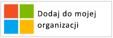

# Wytyczne dotyczące aplikacji oznaczania marką

W tym artykule omówiono wytycznych znakowania, które należy stosować podczas tworzenia aplikacji w usłudze Azure Active Directory (Azure AD). Te wskazówki pomogą, bezpośredni klienci mogą chcieć użyć swojego konta firmowego lub szkolnego, zarządzane w usłudze Azure AD lub osobistego konta dla rejestracji i logowania do aplikacji.

## Konta osobiste, a praca lub kont służbowych od firmy Microsoft

Firma Microsoft zarządza dwa rodzaje kont użytkowników:

* **Konta osobiste** (znanego wcześniej jako identyfikator Windows Live ID). Konta te reprezentują relację między *poszczególnych* użytkowników i firmy Microsoft i są używane do dostępu do urządzeń konsumenckich i usług firmy Microsoft. Te konta są przeznaczone do użytku osobistego.
* **Konta służbowego lub szkolnego.** Te konta są zarządzane przez firmę Microsoft w imieniu organizacji, które używają usługi Azure Active Directory. Te konta są używane do logowania do usługi Office 365 i innych usług biznesowych firmy Microsoft.

Microsoft konta służbowego lub szkolnego zwykle są przypisane do użytkownicy końcowi (pracownicy, studentów, pracowników federalnych) w organizacji (firmy, szkoły, agencję rządową). Te konta zarządzanych bezpośrednio w chmurze (na platformie Azure AD), lub synchronizowana z usługą Azure AD z poziomu katalogu lokalnego, np. Windows Server Active Directory. Firma Microsoft jest *nadzorcą* pracy lub szkoły konta, ale kont są własnością i kontrolowane przez organizację.

## Odwołujące się do konta usługi Azure AD w aplikacji

Microsoft nie zapewnia użytkownikom końcowym platformy Azure lub usługi Active Directory nazw marek i nie należy.

* Po zalogowaniu użytkownicy Użyj nazwy i logo jak najszerzej w organizacji. To jest lepsze niż przy użyciu ogólnych warunków, takich jak "Twojej organizacji."
* Gdy użytkownicy nie jest zalogowany, odnoszą się do swoich kont jako "pracy konta służbowe" i Użyj logo firmy Microsoft do przekazania, że firma Microsoft zarządza tych kont. Nie używaj terminy, takie jak "enterprise konto", "konto firmowe" lub "konto firmowe", który mylenia użytkowników.

## Piktogram konta użytkownika

We wcześniejszej wersji tych wytycznych zaleca się korzystanie piktogramu "niebieski badge". Na podstawie opinii użytkowników i deweloperów teraz zalecamy korzystanie z logo firmy Microsoft zamiast tego. Logo firmy Microsoft pomoże użytkownikom w zrozumieniu, że ich ponownie użyć konta, które korzystają z usługi Office 365 lub innych firmy Microsoft usługi biznesowe do logowania się do aplikacji.

## Można założyć i logowanie się przy użyciu usługi Azure AD

Aplikacja może wyświetlać osobnym ścieżkom do rejestracji i logowania i w poniższych sekcjach przedstawiono wskazówki visual oba scenariusze.

**Jeśli aplikacja obsługuje rejestracji (np. bezpłatnej wersji próbnej lub freemium modelu) użytkownika końcowego**: można wyświetlić **logowania** przycisk, który umożliwia użytkownikom dostęp do aplikacji przy użyciu konta służbowego lub konta osobistego. Usługa Azure AD wyświetli monit o wyrażenie zgody będą uzyskiwać dostęp do aplikacji po raz pierwszy.

**Jeśli aplikacja wymaga uprawnień, które tylko administratorzy mogą wyrazić zgodę na lub jeśli aplikacja wymaga licencjonowania organizacji**: oddziel nabycia administratora z logowania użytkownika. **Przycisk "Pobierz tę aplikację"** przekieruje administratorom Zaloguj, a następnie poproś go o przyznaniu zgody w imieniu użytkowników w organizacji, która ma jednocześnie ma dodatkową zaletę pomijanie monity zgody użytkownika końcowego do aplikacji.

## Wizualne wskazówki dotyczące pozyskiwania aplikacji

Link "Pobierz aplikację" należy przekierować użytkownika do usługi Azure AD udzielanie dostępu (autoryzacja) strony, aby umożliwić administratorowi w organizacji autoryzować aplikację, aby mieć dostęp do danych używanych w organizacji, która jest hostowana przez firmę Microsoft. Szczegóły dotyczące żądania dostępu zostały omówione w [Integrowanie aplikacji w usłudze Azure Active Directory](quickstart-v1-integrate-apps-with-azure-ad.md) artykułu.

Po zgody administratorów do aplikacji, można wybrać dodanie go do środowiska uruchamiania aplikacji usługi Office 365 ich użytkowników (dostępny z typu "gofr" i [ https://portal.office.com/myapps ](https://portal.office.com/myapps)). Jeśli chcesz reklamować tej funkcji, można użyć warunków, takich jak "Dodaj tę aplikację dla Twojej organizacji" i wyświetlić przycisk jak w przykładzie poniżej:

Firma Microsoft zaleca jednak pisania tekst objaśnienia, zamiast polegania na przyciskach. Na przykład:

> *Jeśli używasz już usługi Office 365 lub innych usług biznesowych firmy Microsoft, można przyznać < your_app_name > dostęp do danych organizacji. Umożliwi to użytkownikom dostępu do < your_app_name > przy użyciu istniejącego konta służbowego.*

Aby pobrać oficjalny logo firmy Microsoft do użycia w aplikacji, kliknij prawym przyciskiem myszy ten, którego chcesz użyć, a następnie zapisz go na komputerze.

| Zasób                                | PNG format | Formacie SVG |
| ------------------------------------ | ---------- | ---------- |
| Logo firmy Microsoft  |  |  |

## Wizualne wskazówki podczas logowania

Przycisk Zaloguj, który przekierowuje użytkowników do logowania punktu końcowego, który odnosi się do protokołu, który umożliwia integrację z usługą Azure AD powinien być wyświetlany w aplikacji. Poniższa sekcja zawiera szczegółowe informacje dotyczące tego przycisku wypełnionego.

### Piktogram i "Zaloguj się przy użyciu Microsoft"

To skojarzenie logo firmy Microsoft i warunki "Sign in with Microsoft", które jednoznacznie reprezentują usługi Azure AD, między innymi dostawcami tożsamości, aplikacja może obsługiwać. Jeśli nie masz wystarczającej ilości miejsca dla "Sign in with Microsoft" jest ok, aby skrócić go do zwrotu "Sign in". Schemat kolorów jasny i ciemny można użyć przycisków.

Na poniższym diagramie przedstawiono, że zalecanymi przez firmę Microsoft redlines, korzystając z zasobów z aplikacją. Redlines dotyczą krótszych wersji "Sign in" lub "Sign in with Microsoft".

Aby pobrać oficjalne obrazy do użycia w aplikacji, kliknij prawym przyciskiem myszy ten, którego chcesz użyć, a następnie zapisz go na komputerze.

| Zasób                                | PNG format | Formacie SVG |
| ------------------------------------ | ---------- | ---------- |
| Zaloguj się przy użyciu konta Microsoft (ciemny)  |  |  |
| Zaloguj się przy użyciu konta Microsoft (motyw jasny) |  |  |
| Zaloguj się (ciemny)                 |  |  |
| Zaloguj się (motyw jasny)                |  |  |

## Znakowanie porady

**CZY** Użyj "konto służbowe" w połączeniu z przyciskiem "Sign in with Microsoft" zapewnienie dodatkowego objaśnienia, aby ułatwić użytkownikom końcowym rozpoznać, czy mogą go używać. **Nie** użyć innych warunków, takich jak "enterprise konto", "konto firmowe" lub "konta firmowego."

**Nie** "Office 365 ID" lub "Azure identyfikatora." Usługi Office 365 jest również nazwa odbiorcy oferty firmy Microsoft, która nie korzysta z usługi Azure AD do uwierzytelniania.

**Nie** zmienić logo firmy Microsoft.

**Nie** udostępnić użytkownikom końcowym na marki platformy Azure lub usługi Active Directory. Jest to jednak te warunki za pomocą deweloperów, informatyków i administratorów.

## Porady nawigacji

**CZY** umożliwiają użytkownikom Wyloguj się i przełącz się do innego konta użytkownika. Chociaż większość osób pojedynczego konta osobistego od firmy Microsoft/Facebook/Google/Twitter, ludzie często skojarzone z więcej niż jednej z organizacji. Obsługa wielu zalogowanych użytkowników będzie dostępna wkrótce.
