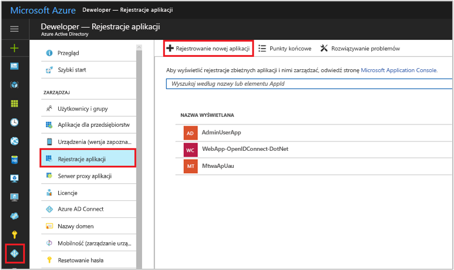
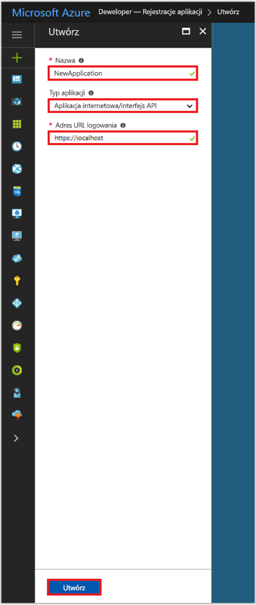

# Szybki start: Rejestrowanie aplikacji z punktem końcowym usługi Azure Active Directory w wersji 1.0

[!INCLUDE [active-directory-develop-applies-v1](../../../includes/active-directory-develop-applies-v1.md)]

Deweloperzy w przedsiębiorstwach i dostawcy oprogramowania jako usługi (SaaS, Software as a Service) mogą tworzyć komercyjne usługi w chmurze lub aplikacje biznesowe i integrować je z usługą Azure Active Directory (Azure AD), aby zapewnić bezpieczne logowanie i autoryzację dla swoich usług. Aby zintegrować aplikację lub usługę z usługą Azure AD, deweloper musi najpierw zarejestrować aplikację w usłudze Azure AD.

Każda aplikacja, która ma korzystać z funkcji usługi Azure AD, musi najpierw zostać zarejestrowana w dzierżawie usługi Azure AD. Proces rejestracji obejmuje przekazanie do usługi Azure AD szczegółów aplikacji, takich jak adres URL, pod którym jest zlokalizowana, adres URL do wysyłania odpowiedzi po uwierzytelnieniu użytkownika, identyfikator URI służący do zidentyfikowania aplikacji i tak dalej.

Z tego przewodnika Szybki start dowiesz się, jak dodać i zarejestrować aplikację w usłudze Azure AD przy użyciu istniejącego środowiska **Rejestracje aplikacji** w witrynie Azure Portal.

> [!NOTE]
> Rejestrujesz nową aplikację? Wypróbuj nowe środowisko **Rejestracje aplikacji (wersja zapoznawcza)** w witrynie Azure Portal. Aby rozpocząć pracę, zobacz [Rejestrowanie aplikacji (wersja zapoznawcza)](quickstart-register-app.md).

## Wymagania wstępne

Aby rozpocząć pracę, upewnij się, że masz dzierżawę usługi Azure AD, której możesz użyć do zarejestrowania aplikacji. Jeśli nie masz jeszcze dzierżawy, [dowiedz się, jak ją uzyskać](quickstart-create-new-tenant.md).

## Rejestrowanie nowej aplikacji w witrynie Azure Portal

1. Zaloguj się w witrynie [Azure Portal](https://portal.azure.com).
1. Jeśli Twoje konto umożliwia dostęp do więcej niż jednej dzierżawy, wybierz konto w prawym górnym rogu, a następnie ustaw sesję portalu na odpowiednią dzierżawę usługi Azure AD.
1. W okienku nawigacji po lewej stronie wybierz usługę **Azure Active Directory**.
1. Wybierz pozycję **Rejestracje aplikacji**, a następnie wybierz pozycję **Rejestrowanie nowej aplikacji**.

    

1. Po pojawieniu się strony **Utwórz** wprowadź informacje dotyczące rejestracji aplikacji: 

   - **Nazwa:** wprowadź opisową nazwę aplikacji
   - **Typ aplikacji:**
     - Wybierz opcję **Natywna** dla [aplikacji klienckich ](developer-glossary.md#client-application), które są zainstalowane lokalnie na urządzeniu. To ustawienie jest używane w przypadku [klientów natywnych](developer-glossary.md#native-client) publicznego protokołu OAuth.
     - Wybierz pozycję **Aplikacja internetowa/interfejs API** dla [aplikacji klienckich](developer-glossary.md#client-application) i [aplikacji zasobów/interfejsu API](developer-glossary.md#resource-server), które są instalowane na zabezpieczonym serwerze. To ustawienie jest używane w przypadku poufnych [klientów internetowych](developer-glossary.md#web-client) protokołu OAuth i publicznych [klientów opartych na użytkowniku-agencie](developer-glossary.md#user-agent-based-client). Ta sama aplikacja może ujawniać zarówno klienta, jak i interfejs API lub zasób.
   - **Adres URL logowania:** w przypadku aplikacji typu „Aplikacja internetowa/interfejs API” podaj podstawowy adres URL aplikacji. Na przykład ciąg `http://localhost:31544` może być adresem URL aplikacji internetowej uruchomionej na komputerze lokalnym. Użytkownicy mogą użyć tego adresu URL, aby zalogować się do aplikacji klienta internetowego. 
   - **Identyfikator URI przekierowania:** w przypadku aplikacji typu „Natywna” podaj identyfikator URI używany przez usługę Azure AD do zwracania odpowiedzi tokenu. Wprowadź wartość specyficzną dla Twojej aplikacji, na przykład `http://MyFirstAADApp`

     

     Jeśli chcesz poznać konkretne przykłady dotyczące aplikacji internetowych lub aplikacji natywnych, zapoznaj się z przewodnikami **Szybki start** w naszej dokumentacji.

1. Po zakończeniu wybierz pozycję **Utwórz**.

    Usługa Azure AD przypisze aplikacji unikatowy identyfikator, po czym nastąpi przeniesienie do strony głównej rejestracji aplikacji. W zależności od tego, czy aplikacja jest internetowa czy natywna, dostępne są różne opcje umożliwiające dodawanie dodatkowych funkcji do aplikacji.

      > [!NOTE]
      > Domyślnie nowo zarejestrowana aplikacja internetowa jest skonfigurowana tak, aby umożliwiać logowanie się do aplikacji **wyłącznie** użytkownikom z tej samej dzierżawy.

## Kolejne kroki

- Zobacz [Azure AD consent framework (Platforma wyrażania zgody usługi Azure AD)](consent-framework.md), aby zapoznać się z informacjami na temat wyrażania zgody.
- Aby włączyć dodatkowe funkcje konfiguracji w rejestracji aplikacji — takie jak poświadczenia, uprawnienia, włączanie logowania dla użytkowników z innych dzierżaw — zobacz [Update an application in Azure AD (Aktualizowanie aplikacji w usłudze Azure AD)](quickstart-v1-update-azure-ad-app.md).
- Aby dowiedzieć się więcej na temat dwóch obiektów usługi Azure AD reprezentujących zarejestrowaną aplikację i związku między nimi, zobacz [Application objects and service principal objects (Obiekty aplikacji i obiekty główne usługi)](app-objects-and-service-principals.md).
- Aby dowiedzieć się więcej na temat wytycznych dotyczących marki, do których należy stosować się podczas tworzenia aplikacji w usłudze Azure Active Directory, zobacz [Wytyczne dotyczące oznaczania aplikacji marką](howto-add-branding-in-azure-ad-apps.md).
