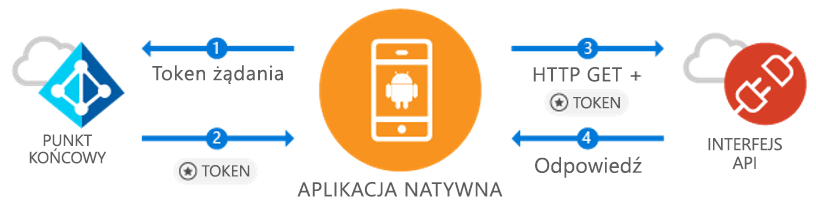

# <a name="quickstart-sign-in-users-and-call-the-microsoft-graph-api-from-an-android-app"></a>Szybki start: logowanie użytkowników i wywoływanie interfejsu API programu Microsoft Graph z poziomu aplikacji dla systemu Android

[!INCLUDE [active-directory-develop-applies-v1-adal](../../../includes/active-directory-develop-applies-v1-adal.md)]

Jeśli tworzysz aplikację dla systemu Android, firma Microsoft umożliwia łatwe logowanie użytkowników w usłudze Azure Active Directory (Azure AD). Usługa Azure AD umożliwia aplikacji uzyskanie dostępu do danych użytkowników za pośrednictwem programu Microsoft Graph lub Twojego własnego chronionego internetowego interfejsu API.

Biblioteka ADAL dla systemu Android umożliwia aplikacji rozpoczęcie korzystania z usługi [Microsoft Azure Cloud](https://cloud.microsoft.com) i [interfejsu API programu Microsoft Graph](https://developer.microsoft.com/graph) dzięki obsłudze [kont usługi Microsoft Azure Active Directory](https://azure.microsoft.com/services/active-directory/) korzystających z protokołu OAuth 2.0 i OpenID Connect, będących standardem w branży.

W tym przewodniku Szybki start zawarto informacje na temat wykonywania następujących czynności:

* Uzyskiwanie tokenów programu Microsoft Graph
* Odświeżanie tokenów
* Tworzenie wywołań do programu Microsoft Graph
* Wylogowywanie użytkowników

## <a name="prerequisites"></a>Wymagania wstępne

Aby rozpocząć pracę, konieczna jest dzierżawa usługi Azure AD, w której możesz tworzyć użytkowników i rejestrować aplikacje. Jeśli nie masz jeszcze dzierżawy, [dowiedz się, jak ją uzyskać](quickstart-create-new-tenant.md).

## <a name="scenario-sign-in-users-and-call-the-microsoft-graph"></a>Scenariusz: logowanie użytkowników i wywoływanie programu Microsoft Graph



Możesz używać tej aplikacji w przypadku wszystkich kont usługi Azure AD. Obsługiwane są zarówno scenariusze z jedną dzierżawą, jak i wieloma dzierżawami (odpowiednie informacje znajdują się w poszczególnych krokach). Pokazano tu, w jaki sposób można tworzyć aplikacje, które będą nawiązywały połączenie z użytkownikami firmowymi i uzyskiwały dostęp do danych platformy Azure oraz usługi O365 za pośrednictwem programu Microsoft Graph. Podczas przepływu autoryzacji użytkownicy końcowi będą musieli zalogować się i wyrazić zgodę na udzielenie uprawnień aplikacji, a w niektórych przypadkach to administrator będzie musiał wyrazić zgodę na aplikację. Większość logiki w tym przykładzie pokazuje, w jaki sposób autoryzować użytkownika końcowego i wykonać proste wywołanie do programu Microsoft Graph.

## <a name="sample-code"></a>Przykładowy kod

Gotowy kod przykładowy można znaleźć [w witrynie GitHub](https://github.com/Azure-Samples/active-directory-android).

```Java
// Initialize your app with MSAL
AuthenticationContext mAuthContext = new AuthenticationContext(
        MainActivity.this,
        AUTHORITY,
        false);


// Perform authentication requests
mAuthContext.acquireToken(
    getActivity(),
    RESOURCE_ID,
    CLIENT_ID,
    REDIRECT_URI,
    PromptBehavior.Auto,
    getAuthInteractiveCallback());

// ...

// Get tokens to call APIs like the Microsoft Graph
mAuthResult.getAccessToken()
```

## <a name="step-1-register-and-configure-your-app"></a>Krok 1: Rejestrowanie i konfigurowanie aplikacji

Potrzebna jest natywna aplikacja kliencka zarejestrowana w firmie Microsoft w witrynie [Azure Portal](https://portal.azure.com).

1. Przechodzenie do rejestrowania aplikacji
    - Przejdź do witryny [Azure Portal](https://aad.portal.azure.com).
    - Wybierz pozycję ***Azure Active Directory*** > ***Rejestracje aplikacji***.

2. Tworzymy aplikację.
    - Wybierz pozycję **Rejestrowanie nowej aplikacji**.
    - Wprowadź nazwę aplikacji w polu **Nazwa**.
    - W polu **Typ aplikacji** wybierz pozycję **Natywna**.
    - W polu **Identyfikator URI przekierowania** wprowadź ciąg `http://localhost`.

3. Konfigurowanie programu Microsoft Graph
    - Wybierz kolejno pozycje **Ustawienia > Wymagane uprawnienia**.
    - Wybierz polecenie **Dodaj**, a następnie w polu **Wybierz interfejs API** wybierz pozycję ***Microsoft Graph***.
    - Wybierz uprawnienie **Zaloguj się i odczytaj profil użytkownika** i kliknij przycisk **Wybierz**, aby je zapisać.
        - To uprawnienie jest mapowane na zakres `User.Read`.
    - Opcjonalnie: w obszarze **Wymagane uprawnienia > Windows Azure Active Directory** usuń wybrane uprawnienie **Zaloguj się i odczytaj profil użytkownika**. Dzięki temu na stronie ze zgodą użytkownika to uprawnienie nie będzie wymienione dwukrotnie.

4. Gratulacje! Aplikacja została pomyślnie skonfigurowana. W następnej sekcji konieczne będą następujące elementy:
    - `Application ID`
    - `Redirect URI`

## <a name="step-2-get-the-sample-code"></a>Krok 2: Pobieranie przykładowego kodu

1. Sklonuj kod.
    ```
    git clone https://github.com/Azure-Samples/active-directory-android
    ```
2. Otwórz kod przykładowy w programie Android Studio.
    - Wybierz pozycję **Open an existing Android Studio project** (Otwórz istniejący projekt Android Studio).

## <a name="step-3-configure-your-code"></a>Krok 3: Konfigurowanie kodu

Cała konfiguracja dla tego przykładowego kodu znajduje się w pliku ***src/main/java/com/azuresamples/azuresampleapp/MainActivity.java***.

1. Zastąp stałą `CLIENT_ID` ciągiem `ApplicationID`.
2. Zastąp stałą `REDIRECT URI` ciągiem `Redirect URI` skonfigurowanym wcześniej (`http://localhost`).

## <a name="step-4-run-the-sample"></a>Krok 4: Uruchamianie aplikacji przykładowej

1. Wybierz kolejno pozycje **Build > Clean Project** (Kompilacja > Wyczyść projekt).
2. Wybierz kolejno pozycje **Run > Run app** (Uruchom > Uruchom aplikację).
3. Aplikacja powinna zostać skompilowana, a następnie powinno zostać wyświetlone podstawowe środowisko użytkownika. Po kliknięciu przycisku `Call Graph API` pojawi się monit o zalogowanie, a następnie interfejs API programu Microsoft Graph zostanie dyskretnie wywołany przy użyciu nowego tokenu.

## <a name="next-steps"></a>Kolejne kroki

1. Sprawdź [witrynę Wiki dotyczącą biblioteki ADAL dla systemu Android](https://github.com/AzureAD/azure-activedirectory-library-for-android/wiki), aby uzyskać więcej informacji na temat działania biblioteki i tego, w jaki sposób konfigurować nowe scenariusze i funkcje.
2. W scenariuszach natywnych aplikacja będzie używać osadzonej aplikacji Webview i nie opuści aplikacji. Identyfikator `Redirect URI` może być dowolny.
3. Problemy lub pytania? Możesz zgłosić problem lub opublikować go na forum Stack Overflow, dodając tag `azure-active-directory`.

### <a name="cross-app-sso"></a>Logowanie jednokrotne dla wielu aplikacji

Dowiedz się, [jak włączyć logowanie jednokrotne dla wielu aplikacji w systemie Android przy użyciu biblioteki ADAL](howto-v1-enable-sso-android.md)

### <a name="auth-telemetry"></a>Informacje telemetryczne dotyczące autoryzacji

Biblioteka ADAL udostępnia dane telemetryczne dotyczące autoryzacji, które umożliwiają deweloperom aplikacji przeanalizowanie działania aplikacji, a dzięki temu tworzenie lepszego środowiska dla użytkowników. Możesz rejestrować informacje na temat pomyślnych logowań, aktywnych użytkowników i nie tylko. Korzystanie z danych telemetrycznych na temat autoryzacji nie wymaga od deweloperów tworzenia usługi telemetrii w celu agregowania i przechowywania zdarzeń.

Aby dowiedzieć się więcej na temat danych telemetrycznych dotyczących autoryzacji, zapoznaj się z artykułem [ADAL Android auth telemetry (Dane telemetryczne dotyczące autoryzacji dla biblioteki ADAL w systemie Android)](https://github.com/AzureAD/azure-activedirectory-library-for-android/wiki/Telemetry).
