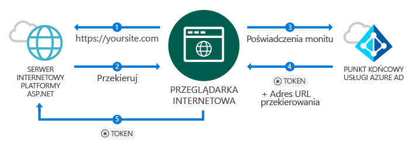
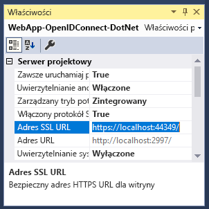
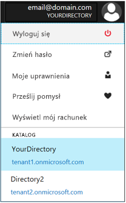
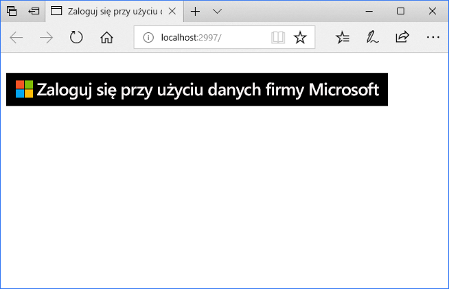
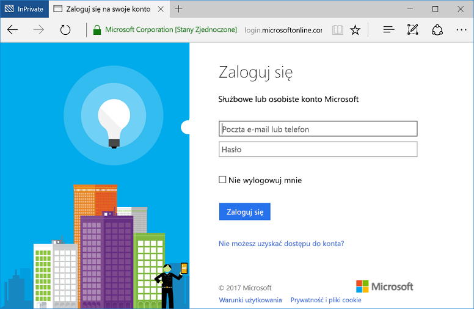

# <a name="quickstart-add-sign-in-with-microsoft-to-an-aspnet-web-app"></a>Szybki start: Dodawanie logowania przy użyciu konta Microsoft do aplikacji internetowej ASP.NET

[!INCLUDE [active-directory-develop-applies-v1](../../../includes/active-directory-develop-applies-v1.md)]

W tym przewodniku Szybki Start dowiesz się, jak zaimplementować logowania z firmą Microsoft przy użyciu rozwiązania ASP.NET kontrolera MVC (Model View) przy użyciu tradycyjnych aplikacji sieci web opartej na przeglądarce przy użyciu protokołu OpenID Connect. Dowiesz się, jak włączyć logowanie z poziomu kont służbowych w aplikacji ASP.NET.

Na zakończenie tego przewodnika Szybki start aplikacja będzie akceptować logowania kont służbowych organizacji, które zostały zintegrowane z usługą Azure Active Directory (Azure AD).

> [!NOTE]
> Jeśli musisz włączyć logowania dla osobistych kont oprócz oraz do kont służbowych, możesz użyć  *[punktu końcowego platformy tożsamości firmy Microsoft](azure-ad-endpoint-comparison.md)*. Aby uzyskać więcej informacji, zobacz [w tym samouczku ASP.NET](tutorial-v2-asp-webapp.md) także [w tym artykule](active-directory-v2-limitations.md) wyjaśniających *punktu końcowego platformy tożsamości firmy Microsoft*.

## <a name="prerequisites"></a>Wymagania wstępne

Przed rozpoczęciem pracy upewnij się, że są spełnione następujące wymagania wstępne:

* Masz program Visual Studio 2015 Update 3 lub zainstalowany program Visual Studio 2019 r. Nie masz tego programu? [Pobierz bezpłatnie program Visual Studio 2019 r.](https://www.visualstudio.com/downloads/)

## <a name="scenario-sign-in-users-from-work-and-school-accounts-in-your-aspnet-app"></a>Scenariusz: logowanie użytkowników z poziomu kont służbowych w aplikacji ASP.NET



Przeglądarka uzyskuje dostęp do witryny sieci web ASP.NET i żądań użytkownika do uwierzytelniania za pomocą znaku przycisku w tym scenariuszu. W tym scenariuszu większość działań związanych z renderowaniem strony internetowej odbywa się po stronie serwera.

Samouczek Szybki Start przedstawia sposób logowania użytkowników w aplikacji sieci web ASP.NET, zaczynając od pustego szablonu. Również obejmuje czynności, takie jak dodanie przycisku logowania i każdego kontrolera i metody oraz omówienie pojęć dotyczących tych zadań. Można również utworzyć projekt do logowania użytkowników usługi Azure AD (kont służbowych) przy użyciu [szablonu sieci web programu Visual Studio](https://docs.microsoft.com/aspnet/visual-studio/overview/2013/creating-web-projects-in-visual-studio#organizational-account-authentication-options) i wybierając polecenie **kont organizacyjnych** i następnie jedną z opcji cloud - to Opcja przy użyciu bardziej rozbudowane szablonu, za pomocą metod, widoków i kontrolerów dodatkowe.

## <a name="libraries"></a>Biblioteki

Ten przewodnik Szybki start używa następujących pakietów:

| Biblioteka | Opis |
|---|---|
| [Microsoft.Owin.Security.OpenIdConnect](https://www.nuget.org/packages/Microsoft.Owin.Security.OpenIdConnect/) | Oprogramowanie pośredniczące, które umożliwia aplikacji wykorzystywanie do uwierzytelniania protokołu OpenIdConnect |
| [Microsoft.Owin.Security.Cookies](https://www.nuget.org/packages/Microsoft.Owin.Security.Cookies) |Oprogramowanie pośredniczące, które umożliwia aplikacji obsługę sesji użytkownika przy użyciu plików cookie |
| [Microsoft.Owin.Host.SystemWeb](https://www.nuget.org/packages/Microsoft.Owin.Host.SystemWeb) | Umożliwia uruchamianie aplikacji zgodnych ze standardem OWIN w ramach usług IIS przy użyciu potoku żądań programu ASP.NET |
|  |  |

## <a name="step-1-set-up-your-project"></a>Krok 1: konfigurowanie projektu

Te kroki pokazują, jak zainstalować i skonfigurować potok uwierzytelniania za pomocą oprogramowania pośredniczącego OWIN w projekcie ASP.NET przy użyciu protokołu OpenID Connect.

Aby zamiast tego pobrać ten przykładowy projekt programu Visual Studio, wykonaj następujące kroki:
1. [Pobierz projekt w witrynie GitHub](https://github.com/AzureADQuickStarts/WebApp-OpenIdConnect-DotNet/archive/GuidedSetup.zip).
1. Przejdź do kroku konfiguracji, aby skonfigurować przykładowy kod przed wykonaniem.

## <a name="step-2-create-your-aspnet-project"></a>Krok 2: tworzenie projektu ASP.NET

1. W programie Visual Studio przejdź do polecenia **Plik > Nowy > Projekt**.
2. W pozycji **Visual C#\Internet** wybierz opcję **Aplikacja internetowa ASP.NET (.NET Framework)**.
3. Nadaj nazwę aplikacji, a następnie wybierz przycisk **OK**.
4. Wybierz pozycję **Pusty**, a następnie zaznacz pole wyboru, aby dodać odwołania **MVC**.

## <a name="step-3-add-authentication-components"></a>Krok 3: dodawanie składników uwierzytelniania

1. W programie Visual Studio przejdź do pozycji **Narzędzia > Menedżer pakietów NuGet > Konsola menedżera pakietów**.
2. Dodaj **pakiety NuGet oprogramowania pośredniczącego OWIN**, wpisując następujące polecenie w oknie Konsola menedżera pakietów:

    ```powershell
    Install-Package Microsoft.Owin.Security.OpenIdConnect
    Install-Package Microsoft.Owin.Security.Cookies
    Install-Package Microsoft.Owin.Host.SystemWeb
    ```

<!--start-collapse-->
> ### <a name="about-these-packages"></a>Informacje na temat tych pakietów
>Powyższe biblioteki włączają logowanie jednokrotne (SSO) przy użyciu protokołu OpenID Connect za pośrednictwem uwierzytelniania w oparciu o pliki cookie. Po zakończeniu uwierzytelniania i wysłaniu tokenu reprezentującego użytkownika do aplikacji oprogramowanie pośredniczące OWIN tworzy plik cookie sesji. Następnie przeglądarka używa tego pliku cookie przy okazji kolejnych żądań, dzięki czemu użytkownik nie musi się ponownie uwierzytelniać i nie jest wymagana dodatkowa weryfikacja.
<!--end-collapse-->

## <a name="step-4-configure-the-authentication-pipeline"></a>Krok 4: konfigurowanie potoku uwierzytelniania

Wykonaj te kroki, aby utworzyć*klasę początkową* oprogramowania pośredniczącego OWIN w celu skonfigurowania uwierzytelniania z użyciem protokołu OpenID Connect. Ta klasa jest wykonywana automatycznie.

> [!TIP]
> Jeśli projekt nie ma pliku `Startup.cs` w folderze głównym:<br/>
> 1. Kliknij prawym przyciskiem myszy folder główny projektu: > **Dodaj > Nowy element... > Klasa początkowa OWIN**<br/>
> 2. Nadaj jej nazwę `Startup.cs`<br/>
>
>> Upewnij się, że wybrana klasa to klasa początkowa OWIN, a nie standardowa klasa C#. Potwierdź to, sprawdzając obecność ciągu `[assembly: OwinStartup(typeof({NameSpace}.Startup))]` powyżej przestrzeni nazw.

W celu utworzenia *klasy początkowej* oprogramowania pośredniczącego OWIN:

1. Dodaj przestrzenie nazw *OWIN* i *Microsoft.IdentityModel* w klasie `Startup.cs`:

    [!code-csharp[main](../../../WebApp-OpenIDConnect-DotNet/WebApp-OpenIDConnect-DotNet/Startup.cs?name=AddedNameSpaces "Startup.cs")]

2. Zastąp klasę początkową następującym kodem:

    [!code-csharp[main](../../../WebApp-OpenIDConnect-DotNet/WebApp-OpenIDConnect-DotNet/Startup.cs?name=Startup "Startup.cs")]

<!--start-collapse-->
> [!NOTE]
> Parametry podane w pozycji *OpenIDConnectAuthenticationOptions* służą jako współrzędne dla aplikacji do komunikowania się z usługą Azure AD. Ponieważ oprogramowanie pośredniczące OpenID Connect używa plików cookie, należy skonfigurować uwierzytelnianie przy użyciu plików cookie zgodnie z poprzedzającym kodem. Wartość *ValidateIssuer* informuje oprogramowanie OpenIdConnect, aby nie ograniczać dostępu do jednej konkretnej organizacji.
<!--end-collapse-->

<!--end-setup-->

<!--start-use-->

## <a name="step-5-add-a-controller-to-handle-sign-in-and-sign-out-requests"></a>Krok 5: dodawanie kontrolera do obsługi żądań logowania i wylogowania

Utwórz nowy kontroler do udostępnienia metod logowania i wylogowywania.

1.  Kliknij prawym przyciskiem myszy folder **Kontrolery** i wybierz polecenie **Dodaj > Kontroler**
2.  Wybierz pozycję **Kontroler MVC (wersja platformy .NET) — Pusty**.
3.  Wybierz pozycję **Dodaj**.
4.  Nadaj mu nazwę `HomeController` i wybierz pozycję **Dodaj**.
5.  Dodaj przestrzenie nazw **OWIN** do klasy:

    [!code-csharp[main](../../../WebApp-OpenIDConnect-DotNet/WebApp-OpenIDConnect-DotNet/Controllers/HomeController.cs?name=AddedNameSpaces "HomeController.cs")]

6. Dodaj następujące metody do obsługi logowania do kontrolera i wylogowywania z niego, inicjując wezwanie do uwierzytelnienia za pomocą kodu:

    [!code-csharp[main](../../../WebApp-OpenIDConnect-DotNet/WebApp-OpenIDConnect-DotNet/Controllers/HomeController.cs?name=SigInAndSignOut "HomeController.cs")]

## <a name="step-6-create-the-apps-home-page-to-sign-in-users-via-a-sign-in-button"></a>Krok 6: tworzenie strony głównej aplikacji do logowania użytkowników za pomocą przycisku logowania

W programie Visual Studio utwórz nowy widok, aby dodać przycisk logowania i wyświetlić informacje o użytkowniku po uwierzytelnieniu:

1. Kliknij prawym przyciskiem myszy folder **Views\Home** i wybierz polecenie **Dodaj widok**.
1. Nadaj mu nazwę **Index**.
1. Dodaj do pliku następujący kod HTML, który zawiera przycisk logowania:

    [!code-html[main](../../../WebApp-OpenIDConnect-DotNet/WebApp-OpenIDConnect-DotNet/Views/Home/Index.cshtml "Index.cshtml")]

<!--start-collapse-->
Ta strona dodaje przycisk logowania w formacie SVG z czarnym tle:<br/><br/> Aby znaleźć więcej przycisków logowania, przejdź do tematu [Wytyczne dotyczące oznaczania aplikacji marką](howto-add-branding-in-azure-ad-apps.md).
<!--end-collapse-->

## <a name="step-7-display-users-claims-by-adding-a-controller"></a>Krok 7: wyświetlenie oświadczeń użytkownika przez dodanie kontrolera

Ten kontroler pokazuje wykorzystanie atrybutu `[Authorize]` do ochrony kontrolera. Ten atrybut ogranicza dostęp do kontrolera, zezwalając na dostęp tylko uwierzytelnionym użytkownikom. Poniższy kod wykorzystuje ten atrybut do wyświetlania oświadczeń użytkowników, które zostały pobrane w ramach logowania.

1. Kliknij prawym przyciskiem myszy folder **Controllers**, a następnie wybierz polecenie **Dodaj > Kontroler**.
1. Wybierz pozycję **Kontroler MVC {version} — Pusty**.
1. Wybierz pozycję **Dodaj**.
1. Nadaj mu nazwę **ClaimsController**.
1. Zastąp kod klasy kontrolera następującym kodem — ten przykład dodaje `[Authorize]` do klasy atrybutu:

    [!code-csharp[main](../../../WebApp-OpenIDConnect-DotNet/WebApp-OpenIDConnect-DotNet/Controllers/ClaimsController.cs?name=ClaimsController "ClaimsController.cs")]

<!--start-collapse-->
> [!NOTE]
> Z powodu użycia atrybutu `[Authorize]` wszystkie metody tego kontrolera można wykonać tylko wtedy, gdy użytkownik jest uwierzytelniony. Jeśli użytkownik nie jest uwierzytelniony i próbuje uzyskać dostęp do kontrolera, oprogramowanie OWIN inicjuje żądanie uwierzytelnienia i zmusza użytkownika do uwierzytelnienia. Powyższy kod przegląda kolekcję oświadczeń użytkownika pod kątem określonych atrybutów zawartych w tokenie użytkownika. Te atrybuty obejmują imię i nazwisko użytkownika oraz nazwę użytkownika, a także podmiot globalnego identyfikatora. Zawiera on także *identyfikator dzierżawy*, który reprezentuje identyfikator organizacji użytkownika.
<!--end-collapse-->

## <a name="step-8-create-a-view-to-display-the-users-claims"></a>Krok 8: tworzenie widoku w celu wyświetlenia oświadczeń użytkownika

W programie Visual Studio utwórz nowy widok w celu wyświetlenia oświadczeń użytkownika na stronie internetowej:

1. Kliknij prawym przyciskiem myszy folder **Views\Claims**, a następnie wybierz pozycję **Dodaj widok**.
1. Nadaj mu nazwę **Index**.
1. Dodaj następujący kod HTML do pliku:

    [!code-html[main](../../../WebApp-OpenIDConnect-DotNet/WebApp-OpenIDConnect-DotNet/Views/Claims/Index.cshtml "Index.cshtml")]

<!--end-use-->

<!--start-configure-->

## <a name="step-9-configure-your-webconfig-and-register-an-application"></a>Krok 9: konfigurowanie pliku *web.config* i rejestrowanie aplikacji

1. W programie Visual Studio dodaj następujący kod w pliku `web.config` (znajdującym się w folderze głównym) w sekcji `configuration\appSettings`:

    ```xml
    <add key="ClientId" value="Enter_the_Application_Id_here" />
    <add key="RedirectUrl" value="Enter_the_Redirect_Url_here" />
    <add key="Tenant" value="common" />
    <add key="Authority" value="https://login.microsoftonline.com/{0}" />
    ```
2. W Eksploratorze rozwiązań wybierz projekt i spójrz na okno <i>Właściwości</i> (jeśli nie widzisz okna Właściwości, naciśnij klawisz F4)
3. Zmień opcję Włączony protokół SSL na <code>True</code>
4. Skopiuj adres SSL URL projektu do schowka:<br/><br/><br />
5. W pliku <code>web.config</code> zastąp ciąg <code>Enter_the_Redirect_URL_here</code> adresem SSL URL swojego projektu.

### <a name="register-your-application-in-the-azure-portal-then-add-its-information-to-webconfig"></a>Zarejestruj swoją aplikację w witrynie Azure portal, a następnie dodaj informacje do *pliku web.config*

1. Przejdź do witryny [Microsoft Azure Portal — rejestracje aplikacji](https://portal.azure.com/#blade/Microsoft_AAD_IAM/ActiveDirectoryMenuBlade/RegisteredApps), aby zarejestrować aplikację.
2. Wybierz pozycję **Rejestrowanie nowej aplikacji**.
3. Wprowadź nazwę aplikacji.
4. Wklej *adresu SSL URL* projektu programu Visual Studio w pozycji**Adres URL logowania**. Ten adres URL również jest automatycznie dodawany do listy adresów URL odpowiedzi dla aplikacji, którą teraz rejestrowanie.
5. Wybierz pozycję **Utwórz**, aby zarejestrować aplikację. Ta akcja spowoduje powrót do listy aplikacji.
6. Następnie wyszukaj i/lub wybierz utworzoną aplikację, aby otworzyć jej właściwości.
7. Skopiuj identyfikator GUID w obszarze **Identyfikator aplikacji** do schowka.
8. Wróć do programu Visual Studio, a w `web.config`, Zastąp `Enter_the_Application_Id_here` identyfikatorem aplikacji z poziomu aplikacji została zarejestrowana.

> [!TIP]
> Jeśli Twoje konto jest skonfigurowane, aby uzyskiwać dostęp do wielu katalogów, upewnij się, że wybrano odpowiedni katalog dla organizacji, w której aplikacja ma być zarejestrowana, klikając prawym przyciskiem myszy nazwę konta w prawym górnym rogu witryny Azure Portal, a następnie sprawdzając wybrany katalog jak wskazano:<br/>

## <a name="step-10-configure-sign-in-options"></a>Krok 10: konfigurowanie opcji logowania

Można skonfigurować aplikację tak, aby zezwolić tylko użytkownicy, którzy należą do jednej z organizacji wystąpienia usługi Azure AD, aby zalogować się, lub zaakceptować logowania użytkowników, które należą do każdej organizacji. Postępuj zgodnie z instrukcjami w jednej z następujących opcji:

### <a name="configure-your-application-to-allow-sign-ins-of-work-and-school-accounts-from-any-company-or-organization-multi-tenant"></a>Konfigurowanie aplikacji tak, aby zezwalała na logowanie kont służbowych z dowolnej firmy lub organizacji (wiele dzierżaw)

Wykonaj następujące kroki, jeśli chcesz zezwalać na logowanie kont służbowych z dowolnej firmy lub organizacji, która została zintegrowana z usługą Azure AD. Ten scenariusz jest typowy dla *aplikacji SaaS*:

1. Wróć do [portalu Microsoft Azure — rejestracje aplikacji](https://portal.azure.com/#blade/Microsoft_AAD_IAM/ActiveDirectoryMenuBlade/RegisteredApps) i Znajdź aplikację, został zarejestrowany.
2. W obszarze **Wszystkie ustawienia** wybierz pozycję **Właściwości**.
3. Zmień wartość właściwości **Z wieloma dzierżawami** na **Tak**, a następnie wybierz pozycję **Zapisz**.

Aby uzyskać więcej informacji na temat tego ustawienia i koncepcji aplikacji wielodostępnych, zobacz [Omówienie wielodostępu](howto-convert-app-to-be-multi-tenant.md).

### <a name="restrict-users-from-only-one-organizations-active-directory-instance-to-sign-in-to-your-application-single-tenant"></a>Ograniczenie możliwości logowania się do aplikacji do użytkowników tylko jednego wystąpienia usługi Active Directory organizacji (pojedyncza dzierżawa)

Ta opcja to typowy scenariusz w przypadku aplikacji biznesowych.

Jeśli chcesz, aby Twoja aplikacja akceptowała logowania tylko z kont należących do określonego wystąpienia usługi Azure AD (w tym *kont gości* tego wystąpienia), wykonaj następujące kroki:

1. Zastąp parametr `Tenant` w pliku *web.config* z obszaru `Common` nazwą dzierżawy organizacji, na przykład *contoso.onmicrosoft.com*.
1. Zmień argument `ValidateIssuer` w [*klasie początkowej OWIN*](#step-4-configure-the-authentication-pipeline) na `true`.

Aby zezwalać tylko na dostęp użytkowników z listy określonych organizacji, wykonaj następujące kroki:

1. Ustaw wartość argumentu `ValidateIssuer` na true.
1. Użyj parametru `ValidIssuers`, aby określić listę organizacji.

Innym rozwiązaniem jest zaimplementowanie niestandardowej metody do sprawdzania wystawcy przy użyciu parametru *IssuerValidator*. Aby uzyskać więcej informacji na temat `TokenValidationParameters`, zobacz [w tym artykule MSDN](https://msdn.microsoft.com/library/system.identitymodel.tokens.tokenvalidationparameters.aspx "artykuł w witrynie MSDN TokenValidationParameters").

<!--end-configure-->

<!--start-configure-arp-->
<!--
## Configure your ASP.NET Web App with the application's registration information

In this step, you will configure your project to use SSL, and then use the SSL URL to configure your application’s registration information. After this, add the application’ registration information to your solution via *web.config*.

1.  In Solution Explorer, select the project and look at the `Properties` window (if you don’t see a Properties window, press F4)
2.  Change `SSL Enabled` to `True`
3.  Copy the value from `SSL URL` above and paste it in the `Redirect URL` field on the top of this page, then click *Update*:<br/><br/><br />
4.  Add the following in `web.config` file located in root’s folder, under section `configuration\appSettings`:

```xml
<add key="ClientId" value="[Enter the application Id here]" />
<add key="RedirectUri" value="[Enter the Redirect URL here]" />
<add key="Tenant" value="common" />
<add key="Authority" value="https://login.microsoftonline.com/{0}" /> 
```
-->
<!--end-configure-arp-->
<!--start-test-->

## <a name="step-11-test-your-code"></a>Krok 11: testowanie kodu

1. Naciśnij klawisz **F5**, aby uruchomić projekt w programie Visual Studio. Zostanie otwarta przeglądarka i nastąpi przekierowanie do adresu `http://localhost:{port}`, gdzie zobaczysz przycisk**Zaloguj się przy użyciu konta Microsoft**.
1. Wybierz przycisk, aby się zalogować.

### <a name="sign-in"></a>Logowanie

Gdy wszystko będzie gotowe do testowania, użyj konta służbowego (Azure AD), aby się zalogować.





#### <a name="expected-results"></a>Oczekiwane wyniki

Gdy użytkownik się zaloguje, użytkownik jest przekierowywany na stronę główną witryny sieci web, czyli adres URL HTTPS, określone w aplikacji informacje rejestracyjne w portalu rejestracji aplikacji firmy Microsoft. Ta strona wyświetla obecnie komunikat *Witaj, {User}*, link do wylogowania oraz link pozwalający wyświetlić oświadczenia użytkownika — czyli link do utworzonego wcześniej kontrolera Authorize.

### <a name="see-users-claims"></a>Wyświetlenie oświadczeń użytkownika

Wybierz hiperlink, aby wyświetlić oświadczenia użytkownika. Ta akcja prowadzi do kontrolera i widoku, który jest dostępny tylko dla uwierzytelnionych użytkowników.

#### <a name="expected-results"></a>Oczekiwane wyniki

 Powinna zostać wyświetlona tabela zawierająca podstawowe właściwości zalogowanego użytkownika:

| Właściwość | Wartość | Opis |
|---|---|---|
| Name (Nazwa) | {User Full Name} | Imię i nazwisko użytkownika |
| Nazwa użytkownika | <span>user@domain.com</span> | Nazwa użytkownika używana do identyfikacji zalogowanego użytkownika |
| Podmiot| {Subject} |Ciąg do unikatowego identyfikowania użytkownika, zaloguj się w sieci web |
| Identyfikator dzierżawy | {Guid} | Identyfikator *guid* jednoznacznie reprezentujący organizację usługi Azure AD użytkownika |

Ponadto zobaczysz tabelę zawierającą wszystkie oświadczenia użytkownika dołączone do żądania uwierzytelnienia. Aby uzyskać listę wszystkich oświadczeń w tokenie identyfikacyjnym oraz ich wyjaśnienie, zobacz [Lista oświadczeń w tokenie identyfikacyjnym](https://docs.microsoft.com/azure/active-directory/develop/active-directory-token-and-claims).

### <a name="optional-access-a-method-that-has-an-authorize-attribute"></a>(Opcjonalnie) Dostęp do metody posiadającej atrybut *[Authorize]*

W tym kroku przetestujesz uzyskiwanie dostępu do kontrolera oświadczeń jako użytkownik anonimowy:<br/>
Wybierz link umożliwiający wylogowanie użytkownika i ukończ proces wylogowywania.<br/>
Następnie wpisz w przeglądarce adres `http://localhost:{port}/claims`, aby uzyskać dostęp do kontrolera, który jest chroniony za pomocą atrybutu `[Authorize]`

#### <a name="expected-results"></a>Oczekiwane wyniki

Powinien zostać wyświetlony monit wymagający od użytkownika uwierzytelnienia, aby wyświetlić widok.

## <a name="additional-information"></a>Dodatkowe informacje

<!--start-collapse-->
### <a name="protect-your-entire-web-site"></a>Ochrona całej witryny internetowej

Aby zapewnić ochronę całej witryny internetowej, dodaj atrybut `AuthorizeAttribute` do `GlobalFilters` w metodzie `Global.asax` `Application_Start`:

```csharp
GlobalFilters.Filters.Add(new AuthorizeAttribute());
```
<!--end-collapse-->

<div></div>
<br/>

<!--end-test-->

## <a name="next-steps"></a>Kolejne kroki

Możesz teraz przejść do dodatkowych scenariuszy.

> [!div class="nextstepaction"]
> [Samouczek platformy ASP.NET](https://docs.microsoft.com/azure/active-directory/develop/tutorial-v2-asp-webapp)
