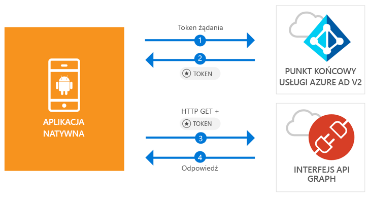

# <a name="quickstart-sign-in-users-and-call-the-microsoft-graph-api-from-an-android-app"></a>Szybki start: logowanie użytkowników i wywoływanie interfejsu API programu Microsoft Graph z poziomu aplikacji dla systemu Android

[!INCLUDE [active-directory-develop-applies-v2-msal](../../../includes/active-directory-develop-applies-v2-msal.md)]

Ten przewodnik Szybki start zawiera przykładowy kod, który pokazuje, jak aplikacja systemu Android umożliwia logowanie na kontach osobistych i służbowych, uzyskiwanie tokenów dostępu i wywoływanie interfejsu API programu Microsoft Graph.



> [!NOTE]
> **Wymagania wstępne**
> * Program Android Studio 3 lub nowszy
> * Wymagany jest zestaw Android SDK 21 lub nowszy (zalecany jest zestaw SDK 27)

> [!div renderon="docs"]
> ## <a name="register-and-download"></a>Rejestrowanie i pobieranie
> ### <a name="register-and-configure-your-application-and-code-sample"></a>Rejestrowanie i konfigurowanie aplikacji i przykładowego kodu
> #### <a name="step-1-register-your-application"></a>Krok 1: Rejestrowanie aplikacji
> Aby zarejestrować aplikację i dodać informacje na temat rejestracji aplikacji do rozwiązania, wykonaj następujące czynności:
> 1. Przejdź do [portalu rejestracji aplikacji firmy Microsoft](https://apps.dev.microsoft.com/portal/register-app), aby zarejestrować aplikację.
> 1. W polu **Application Name** (Nazwa aplikacji) wprowadź nazwę aplikacji.
> 1. Upewnij się, że pole **Guided Setup** (Konfiguracja z przewodnikiem) jest wyczyszczone, a następnie wybierz pozycję **Create** (Utwórz).
> 1. Wybierz kolejno pozycje **Add platform** (Dodaj platformę), **Native Application** (Aplikacja natywna) i **Save** (Zapisz).

> [!div renderon="portal" class="sxs-lookup"]
> #### <a name="step-1-configure-your-application"></a>Krok 1: Konfigurowanie aplikacji
> Aby przykładowy kod z tego przewodnika Szybki start działał, musisz dodać adres URL odpowiedzi w formie **msal{AppId}://auth** (gdzie {AppId} jest identyfikatorem Twojej aplikacji).
> > [!div renderon="portal" id="makechanges" class="nextstepaction"]
> > [Wprowadź tę zmianę automatycznie]()
>
> > [!div id="appconfigured" class="alert alert-info"]
> >  (Już skonfigurowano) Twoja aplikacja została skonfigurowana za pomocą tych atrybutów

#### <a name="step-2-download-the-project"></a>Krok 2: Pobieranie projektu

* [Pobierz projekt programu Android Studio](https://github.com/Azure-Samples/active-directory-android-native-v2/archive/master.zip)

#### <a name="step-3-configure-your-project"></a>Krok 3: Konfigurowanie projektu

1. Wyodrębnij i otwórz projekt w programie Android Studio.
1. W obszarze **app** > **java** > **<i>{host}.{namespace}</i>**, otwórz pozycję **MainActivity**.
1. Zastąp wiersz rozpoczynający się od `final static String CLIENT_ID` za pomocą ciągu:

    > [!div renderon="portal" class="sxs-lookup"]
    > ```java
    > final static String CLIENT_ID = "ENTER_THE_APPLICATION_ID_HERE";
    > ```

    > [!div renderon="docs"]
    > ```java
    > final static String CLIENT_ID = "<ENTER_THE_APPLICATION_ID_HERE>";
    > ```

1. Otwórz plik: **app** > **manifests** > **AndroidManifest.xml**.
1. Dodaj następujące działanie do węzła **manifest\application**. Ten fragment kodu rejestruje działanie **BrowserTabActivity**, aby umożliwić systemowi operacyjnemu wznowienie działania aplikacji po zakończeniu uwierzytelniania:

    > [!div renderon="docs"]
    > ```xml
    > <!--Intent filter to capture System Browser calling back to our app after Sign In-->
    > <activity
    >     android:name="com.microsoft.identity.client.BrowserTabActivity">
    >     <intent-filter>
    >         <action android:name="android.intent.action.VIEW" />
    >         <category android:name="android.intent.category.DEFAULT" />
    >         <category android:name="android.intent.category.BROWSABLE" />
    > 
    >         <!--Add in your scheme/host from registered redirect URI-->
    >         <!--By default, the scheme should be similar to 'msal[appId]' -->
    >         <data android:scheme="msal<ENTER_THE_APPLICATION_ID_HERE>"
    >             android:host="auth" />
    >     </intent-filter>
    > </activity>
    > ```

    > [!div renderon="portal" class="sxs-lookup"]
    > ```xml
    > <!--Intent filter to capture System Browser calling back to our app after Sign In-->
    > <activity
    >     android:name="com.microsoft.identity.client.BrowserTabActivity">
    >     <intent-filter>
    >         <action android:name="android.intent.action.VIEW" />
    >         <category android:name="android.intent.category.DEFAULT" />
    >         <category android:name="android.intent.category.BROWSABLE" />
    > 
    >         <!--Add in your scheme/host from registered redirect URI-->
    >         <!--By default, the scheme should be similar to 'msal[appId]' -->
    >         <data android:scheme="msalENTER_THE_APPLICATION_ID_HERE"
    >             android:host="auth" />
    >     </intent-filter>
    > </activity>
    > ```

> [!div renderon="docs"]
> <span>6.</span> Zastąp ciąg `<ENTER_THE_APPLICATION_ID_HERE>` *identyfikatorem aplikacji*. Jeśli chcesz znaleźć *identyfikator aplikacji*, przejdź do strony *Omówienie*.

## <a name="more-information"></a>Więcej informacji

Przeczytaj poniższe sekcje, aby uzyskać więcej informacji o tym przewodniku Szybki start.

### <a name="msal"></a>BIBLIOTEKA MSAL

Biblioteka MSAL ([com.microsoft.identity.client](https://javadoc.io/doc/com.microsoft.identity.client/msal)) to biblioteka używana do logowania użytkowników i przesyłania żądań tokenów, które zostały użyte do uzyskania dostępu do interfejsu API chronionego przez usługę Azure Active Directory (Azure AD). Można ją zainstalować przy użyciu programu Gradle, dodając poniższy w obszarze **Gradle Scripts** > **build.gradle (Module: app)** w sekcji **Dependencies** (Zależności):

```gradle  
implementation 'com.android.volley:volley:1.1.1'
implementation 'com.microsoft.identity.client:msal:0.1.+'
```

### <a name="msal-initialization"></a>Inicjowanie biblioteki MSAL

Aby dodać odwołanie do biblioteki MSAL, dodaj następujący kod:

```java
import com.microsoft.identity.client.*;
```

Następnie zainicjuj bibliotekę MSAL, używając następującego kodu:

```java
sampleApp = new PublicClientApplication(
        this.getApplicationContext(),
        CLIENT_ID);
```

> |Gdzie: ||
> |---------|---------|
> |`CLIENT_ID` | Identyfikator aplikacji z aplikacji zarejestrowanej w witrynie *portal.azure.com* |

### <a name="requesting-tokens"></a>Przesyłanie żądań tokenów

Biblioteka MSAL oferuje dwie metody uzyskiwania tokenów: `acquireToken` i `acquireTokenSilentAsync`

#### <a name="getting-a-user-token-interactively"></a>Interaktywne pobieranie tokenu użytkownika

Niektóre sytuacje wymagają wymuszenia na użytkowniku interakcji z punktem końcowym usługi Azure AD 2.0, co powoduje przełączenie kontekstu do przeglądarki systemu w celu weryfikacji poświadczeń użytkownika lub uzyskania zgody. Oto niektóre przykłady:

* Gdy nowi użytkownicy logują się do aplikacji po raz pierwszy.
* Gdy użytkownicy muszą ponownie wprowadzić poświadczenia, ponieważ hasło wygasło.
* Gdy aplikacja żąda dostępu do zasobów wymagającego zgody użytkownika.
* Gdy wymagane jest uwierzytelnianie dwuetapowe.

```java
sampleApp.acquireToken(this, SCOPES, getAuthInteractiveCallback());
```

> |Gdzie:||
> |---------|---------|
> | `SCOPES` | Zawiera żądane zakresy (czyli `{ "user.read" }` dla programu Microsoft Graph lub `{ "<Application ID URL>/scope" }` dla niestandardowych interfejsów internetowych API, np. `api://<Application ID>/access_as_user`) |
> | `getAuthInteractiveCallback` | Wywołanie zwrotne wykonywane, gdy kontrola zostanie przekazana z powrotem do aplikacji po uwierzytelnieniu |

#### <a name="getting-a-user-token-silently"></a>Dyskretne pobieranie tokenu użytkownika

Nie chcesz, aby użytkownik musiał weryfikować swoje poświadczenia za każdym razem, gdy musi uzyskać dostęp do zasobu. Przez większość czasu uzyskiwanie i odnawianie tokenów powinno odbywać się bez żadnej interakcji z użytkownikiem. Możesz użyć metody `AcquireTokenSilentAsync` do uzyskiwania tokenów umożliwiających dostęp do chronionych zasobów po początkowym skorzystaniu z metody `acquireToken`:

```java
sampleApp.acquireToken(getActivity(), SCOPES, getAuthInteractiveCallback());
```

> |Gdzie:||
> |---------|---------|
> | `SCOPES` | Zawiera żądane zakresy (czyli `{ "user.read" }` dla programu Microsoft Graph lub `{ "<Application ID URL>/scope" }` dla niestandardowych interfejsów internetowych API, np. `api://<Application ID>/access_as_user`) |
> | `getAuthInteractiveCallback` | Wywołanie zwrotne wykonywane, gdy kontrola zostanie przekazana z powrotem do aplikacji po uwierzytelnieniu |

## <a name="next-steps"></a>Następne kroki

### <a name="learn-the-steps-to-create-the-application-used-in-this-quickstart"></a>Dowiedz się więcej na temat czynności, które są wymagane to utworzenia aplikacji użytej w tym przewodniku Szybki start

Wypróbuj samouczek systemu Android, aby uzyskać instrukcje krok po kroku dotyczące tworzenia aplikacji i nowych funkcji, w tym pełne objaśnienie informacji zawartych w tym przewodniku Szybki start.

> [!div class="nextstepaction"]
> [Samouczek: wywołanie interfejsu API programu Graph dla systemu Android](https://docs.microsoft.com/azure/active-directory/develop/guidedsetups/active-directory-android)

### <a name="msal-for-android-library-wiki"></a>Strona typu wiki: biblioteka MSAL dla systemu Android

Przeczytaj więcej informacji na temat biblioteki MSAL dla systemu Android:

> [!div class="nextstepaction"]
> [Strona typu wiki: biblioteka MSAL dla systemu Android](https://github.com/AzureAD/microsoft-authentication-library-for-android/wiki)

[!INCLUDE [Help and support](../../../includes/active-directory-develop-help-support-include.md)]
