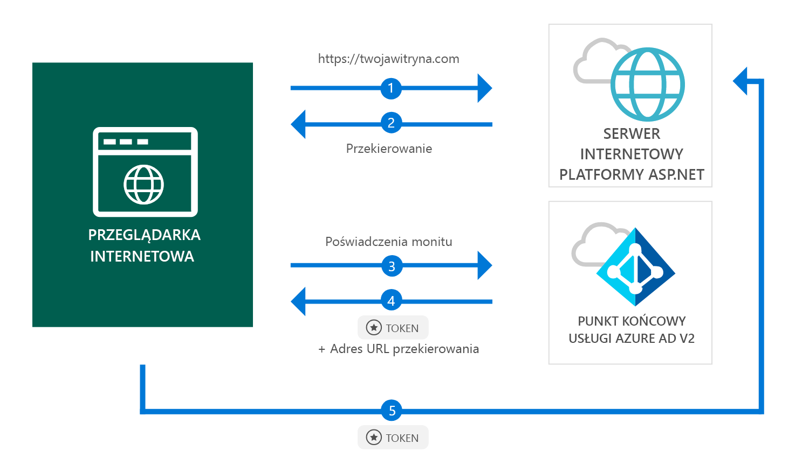

# <a name="quickstart-add-sign-in-with-microsoft-to-an-aspnet-web-app"></a>Szybki start: dodawanie logowania przy użyciu konta Microsoft do aplikacji internetowej ASP.NET

[!INCLUDE [active-directory-develop-applies-v2](../../../includes/active-directory-develop-applies-v2.md)]

W tym przewodniku Szybki start dowiesz się, w jaki sposób aplikacja internetowa ASP.NET może przeprowadzać logowanie kont osobistych (hotmail.com, outlook.com itp.) oraz kont służbowych z dowolnego wystąpienia usługi Azure Active Directory (Azure AD).



> [!div renderon="docs"]
> ## <a name="register-your-application-and-download-your-quickstart-app"></a>Rejestrowanie aplikacji i pobieranie aplikacji Szybki start
>
> ### <a name="register-and-configure-your-application-and-code-sample"></a>Rejestrowanie i konfigurowanie aplikacji i przykładowego kodu
> #### <a name="step-1-register-your-application"></a>Krok 1. Rejestrowanie aplikacji
> 
> 1. Przejdź do [portalu rejestracji aplikacji firmy Microsoft](https://apps.dev.microsoft.com/portal/register-app).
> 1. Wprowadź nazwę aplikacji, upewnij się, że pole wyboru **Guided Setup** (Konfiguracja z przewodnikiem) nie jest zaznaczone, a następnie kliknij przycisk **Create** (Utwórz).
> 1. Kliknij pozycję `Add Platform`, a następnie wybierz pozycję `Web`.
> 1. Upewnij się, że pole wyboru **Zezwalaj na niejawny przepływ** jest *zaznaczone*.
> 1. W polu **Identyfikatory URL przekierowań** wprowadź ciąg `https://localhost:44368/`.
> 1. Przewiń w dół do końca strony, a następnie kliknij pozycję **Zapisz**.

> [!div class="sxs-lookup" renderon="portal"]
> #### <a name="step-1-configure-your-application-in-azure-portal"></a>Krok 1. Konfigurowanie aplikacji w witrynie Azure Portal
> Aby przykład kodu z tego samouczka działał, należy jako adres URL odpowiedzi dodać adres `https://localhost:44368/`.
> > [!div renderon="portal" id="makechanges" class="nextstepaction"]
> > [Wprowadź tę zmianę automatycznie]()
>
> > [!div id="appconfigured" class="alert alert-info"]
> >  (Już skonfigurowano) Twoja aplikacja została skonfigurowana za pomocą tego atrybutu

#### <a name="step-2-download-your-project"></a>Krok 2. Pobieranie projektu

[Pobierz rozwiązanie programu Visual Studio 2017.](https://github.com/AzureADQuickStarts/AppModelv2-WebApp-OpenIDConnect-DotNet/archive/master.zip)

#### <a name="step-3-configure-your-visual-studio-project"></a>Krok 3. Konfigurowanie projektu programu Visual Studio

1. Wyodrębnij plik zip do folderu lokalnego bliższego folderowi głównemu, na przykład **C:\Azure-Samples**
1. Otwórz rozwiązanie w programie Visual Studio (AppModelv2-WebApp-OpenIDConnect-DotNet.sln)
1. Dokonaj edycji pliku **Web.config** i zastąp ciąg `Enter_the_Application_Id_here` identyfikatorem aplikacji skopiowanym z zarejestrowanej właśnie aplikacji:

    ```xml
    <add key="ClientId" value="Enter_the_Application_Id_here" />
    ```
    
> [!div class="sxs-lookup" renderon="portal"]
> [!IMPORTANT]
> Jeśli Twoja aplikacja jest *aplikacją z jedną dzierżawą* (przeznaczoną tylko dla kont znajdujących się w tym katalogu), w pliku **Web.config** znajdź parametr `Tenant` i zastąp wartość parametru `common` swoim **identyfikatorem dzierżawy** lub **nazwą dzierżawy** (na przykład contoso.microsoft.com). Nazwę dzierżawy możesz uzyskać na stronie **Przegląd**.

## <a name="more-information"></a>Więcej informacji

Ta sekcja zawiera omówienie kodu wymaganego do logowania użytkowników. Przydatne może być zrozumienie działania kodu i głównych argumentów oraz poznanie kwestii dotyczących tego, czy warto dodawać funkcję logowania do istniejącej aplikacji ASP.NET.

### <a name="owin-middleware-nuget-packages"></a>Pakiety NuGet oprogramowania pośredniczącego OWIN

Potok uwierzytelniania można skonfigurować przy użyciu uwierzytelniania na podstawie plików cookie, korzystając z protokołu OpenID Connect na platformie ASP.NET wraz z pakietami oprogramowania pośredniczącego OWIN. Te pakiety można zainstalować, uruchamiając następujące polecenia w **konsoli menedżera pakietów** programu Visual Studio:

```powershell
Install-Package Microsoft.Owin.Security.OpenIdConnect
Install-Package Microsoft.Owin.Security.Cookies
Install-Package Microsoft.Owin.Host.SystemWeb
```

### <a name="owin-startup-class"></a>Klasa początkowa OWIN

Oprogramowanie pośredniczące OWIN używa *klasy początkowej* wykonywanej, gdy inicjowany jest proces hostingu (w przypadku tego przewodnika Szybki start jest to plik *startup.cs* znajdujący się w folderze głównym). W poniższym kodzie przedstawiono parametr użyty w tym przewodniku Szybki start:

```csharp
public void Configuration(IAppBuilder app)
{
    app.SetDefaultSignInAsAuthenticationType(CookieAuthenticationDefaults.AuthenticationType);

    app.UseCookieAuthentication(new CookieAuthenticationOptions());
    app.UseOpenIdConnectAuthentication(
        new OpenIdConnectAuthenticationOptions
        {
            // Sets the ClientId, authority, RedirectUri as obtained from web.config
            ClientId = clientId,
            Authority = authority,
            RedirectUri = redirectUri,
            // PostLogoutRedirectUri is the page that users will be redirected to after sign-out. In this case, it is using the home page
            PostLogoutRedirectUri = redirectUri,
            Scope = OpenIdConnectScope.OpenIdProfile,
            // ResponseType is set to request the id_token - which contains basic information about the signed-in user
            ResponseType = OpenIdConnectResponseType.IdToken,
            // ValidateIssuer set to false to allow personal and work accounts from any organization to sign in to your application
            // To only allow users from a single organizations, set ValidateIssuer to true and 'tenant' setting in web.config to the tenant name
            // To allow users from only a list of specific organizations, set ValidateIssuer to true and use ValidIssuers parameter 
            TokenValidationParameters = new TokenValidationParameters()
            {
                ValidateIssuer = false
            },
            // OpenIdConnectAuthenticationNotifications configures OWIN to send notification of failed authentications to OnAuthenticationFailed method
            Notifications = new OpenIdConnectAuthenticationNotifications
            {
                AuthenticationFailed = OnAuthenticationFailed
            }
        }
    );
}
```

> |Lokalizacja  |  |
> |---------|---------|
> | `ClientId`     | Identyfikator aplikacji z aplikacji zarejestrowanej w witrynie Azure Portal |
> | `Authority`    | Punkt końcowy usługi STS na potrzeby uwierzytelnienia użytkownika. Zazwyczaj jest to adres https://login.microsoftonline.com/{tenant}/v2.0 dla chmury publicznej, gdzie parametr {tenant} jest nazwą dzierżawy, identyfikatorem dzierżawy lub ma wartość *common* na potrzeby odwołania do wspólnego punktu końcowego (używany dla aplikacji z wieloma dzierżawami) |
> | `RedirectUri`  | Adres URL, do którego przekierowywani są użytkownicy po uwierzytelnianiu względem punktu końcowego usługi Azure AD w wersji 2.0 |
> | `PostLogoutRedirectUri`     | Adres URL, do którego przekierowywani są użytkownicy po wylogowaniu |
> | `Scope`     | Lista zażądanych zakresów oddzielonych spacjami |
> | `ResponseType`     | Żądanie, którego odpowiedź z procesu uwierzytelniania zawiera identyfikator tokenu |
> | `TokenValidationParameters`     | Lista parametrów na potrzeby weryfikacji tokenu. W tym przypadku parametr `ValidateIssuer` ustawiono na wartość `false`, aby wskazać, że może akceptować logowania z dowolnych kont osobistych i służbowych |
> | `Notifications`     | Lista obiektów delegowanych, które mogą być wykonywane w ramach różnych komunikatów *OpenIdConnect* |

### <a name="initiate-an-authentication-challenge"></a>Inicjowanie żądania uwierzytelnienia

Możesz wymusić logowanie użytkownika, wysyłając żądanie uwierzytelnienia w kontrolerze:

```csharp
public void SignIn()
{
    if (!Request.IsAuthenticated)
    {
        HttpContext.GetOwinContext().Authentication.Challenge(
            new AuthenticationProperties{ RedirectUri = "/" },
            OpenIdConnectAuthenticationDefaults.AuthenticationType);
    }
}
```

> [!TIP]
> Wysłanie żądania uwierzytelnienia przy użyciu powyższej metody jest opcjonalne i jest zwykle używane, gdy chcesz, aby widok był dostępny zarówno dla uwierzytelnionych, jak i nieuwierzytelnionych użytkowników. Innym rozwiązaniem jest ochrona kontrolerów przy użyciu metody opisanej w następnej sekcji.

### <a name="protect-a-controller-or-a-controllers-method"></a>Ochrona kontrolera lub metody kontrolera

Kontroler lub akcje kontrolera można chronić za pomocą atrybutu `[Authorize]`. Ten atrybut ogranicza dostęp do kontrolera lub akcji, zezwalając na dostęp do akcji w kontrolerze tylko uwierzytelnionym użytkownikom, co oznacza, że żądanie uwierzytelnienia zostanie wysłane automatycznie, gdy *nieuwierzytelniony* użytkownik podejmie próbę uzyskania dostępu do jednej z akcji lub kontrolera oznaczonego za pomocą atrybutu `[Authorize]`.

## <a name="next-steps"></a>Następne kroki

Wypróbuj samouczek platformy ASP.NET, aby uzyskać instrukcje krok po kroku dotyczące tworzenia aplikacji i nowych funkcji, w tym pełne objaśnienie informacji zawartych w tym przewodniku Szybki start.

### <a name="learn-the-steps-to-create-the-application-used-in-this-quickstart"></a>Dowiedz się więcej na temat czynności, które są wymagane to utworzenia aplikacji użytej w tym przewodniku Szybki start

> [!div class="nextstepaction"]
> [Samouczek dotyczący logowania](.\tutorial-v2-asp-webapp.md)

[!INCLUDE [Help and support](../../../includes/active-directory-develop-help-support-include.md)]