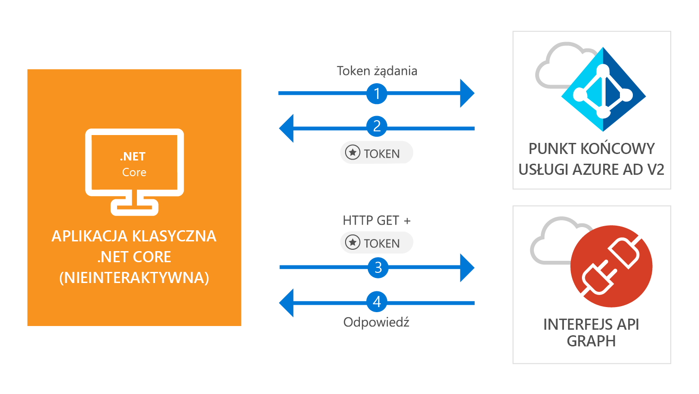

# <a name="quickstart-acquire-a-token-and-call-microsoft-graph-api-from-a-console-app-using-apps-identity"></a>Szybki start: uzyskiwanie tokenu i wywoływanie interfejsu API programu Microsoft Graph z poziomu aplikacji konsolowej za pomocą tożsamości aplikacji

[!INCLUDE [active-directory-develop-applies-v2-msal](../../../includes/active-directory-develop-applies-v2-msal.md)]

W tym przewodniku Szybki start dowiesz się, jak napisać aplikację .NET Core, która może uzyskać token dostępu przy użyciu własnej tożsamości aplikacji, a następnie wywołać interfejs API programu Microsoft Graph w celu wyświetlenia [listy użytkowników](https://docs.microsoft.com/graph/api/user-list) w katalogu. Ten scenariusz przydaje się w sytuacjach, które wymagają uruchamiania bezobsługowego, nienadzorowanego zadania lub usługi systemu Windows przy użyciu tożsamości aplikacji, a nie tożsamości użytkownika.



## <a name="prerequisites"></a>Wymagania wstępne

Ten przewodnik Szybki start wymaga platformy [.NET Core 2.1](https://www.microsoft.com/net/download/dotnet-core/2.1).

> [!div renderon="docs"]
> ## <a name="register-and-download-your-quickstart-app"></a>Rejestrowanie i pobieranie aplikacji Szybki start

> [!div renderon="docs" class="sxs-lookup"]
>
> Istnieją dwie opcje uruchamiania aplikacji Szybki start:
> * [Ekspresowo] [Opcja 1: zarejestrowanie i automatyczne skonfigurowanie aplikacji, a następnie pobranie przykładowego kodu](#option-1-register-and-auto-configure-your-app-and-then-download-your-code-sample)
> * [Ręcznie] [Opcja 2: zarejestrowanie i ręczne skonfigurowanie aplikacji oraz przykładowego kodu](#option-2-register-and-manually-configure-your-application-and-code-sample)
>
> ### <a name="option-1-register-and-auto-configure-your-app-and-then-download-your-code-sample"></a>Opcja 1: zarejestrowanie i automatyczne skonfigurowanie aplikacji, a następnie pobranie przykładowego kodu
>
> 1. Przejdź do witryny [Azure Portal — Rejestracja aplikacji (wersja zapoznawcza)](https://portal.azure.com/?Microsoft_AAD_RegisteredApps=true#blade/Microsoft_AAD_RegisteredApps/applicationsListBlade/quickStartType/DotNetCoreDaemonQuickstartPage/sourceType/docs).
> 1. Wprowadź nazwę aplikacji i wybierz pozycję **Zarejestruj**.
> 1. Postępuj zgodnie z instrukcjami, aby pobrać i automatycznie skonfigurować nową aplikację za pomocą tylko jednego kliknięcia.
>
> ### <a name="option-2-register-and-manually-configure-your-application-and-code-sample"></a>Opcja 2: zarejestrowanie i ręczne skonfigurowanie aplikacji oraz przykładowego kodu

> [!div renderon="docs"]
> #### <a name="step-1-register-your-application"></a>Krok 1: Rejestrowanie aplikacji
> Aby ręcznie zarejestrować aplikację i dodać informacje na temat rejestracji aplikacji do rozwiązania, wykonaj następujące czynności:
>
> 1. Zaloguj się do [witryny Azure Portal](https://portal.azure.com) przy użyciu służbowego lub osobistego konta Microsoft.
> 1. Jeśli Twoje konto umożliwia dostęp do więcej niż jednej dzierżawy, wybierz konto w prawym górnym rogu, a następnie ustaw sesję portalu na odpowiednią dzierżawę usługi Azure AD.
> 1. W okienku nawigacji po lewej stronie wybierz usługę **Azure Active Directory**, a następnie pozycję **Rejestracje aplikacji (wersja zapoznawcza)** > **Nowa rejestracja**.
> 1. W sekcji **Nazwa** podaj zrozumiałą nazwę aplikacji, która będzie widoczna dla użytkowników, na przykład `Daemon-console`, a następnie wybierz pozycję **Zarejestruj**, aby utworzyć aplikację.
> 1. Po jej zarejestrowaniu wybierz menu **Certyfikaty i klucze tajne**.
> 1. W obszarze **Klucze tajne klienta** wybierz pozycję **+ Nowy klucz tajny klienta**. Nadaj kluczowi nazwę i wybierz pozycję **Dodaj**. Skopiuj klucz tajny do bezpiecznej lokalizacji. Będzie on używany w kodzie.
> 1. Wybierz menu **Uprawnienia interfejsu API**, wybierz przycisk **+ Dodaj uprawnienie**, a następnie wybierz pozycję **Microsoft Graph**.
> 1. Wybierz pozycję **Uprawnienia aplikacji**.
> 1. W węźle **Użytkownik** wybierz pozycję **User.Read.All**, a następnie wybierz pozycję **Dodaj uprawnienia**.

> [!div class="sxs-lookup" renderon="portal"]
> ### <a name="download-and-configure-your-quickstart-app"></a>Pobieranie i konfigurowanie aplikacji Szybki Start
> 
> #### <a name="step-1-configure-your-application-in-azure-portal"></a>Krok 1: konfigurowanie aplikacji w witrynie Azure Portal
> Aby działał przykładowy kod z tego przewodnika Szybki start, musisz utworzyć klucz tajny klienta i dodać uprawnienie aplikacji **User.Read.All** interfejsu API programu Graph.
> > [!div renderon="portal" id="makechanges" class="nextstepaction"]
> > [Wprowadź zmiany automatycznie]()
>
> > [!div id="appconfigured" class="alert alert-info"]
> >  Twoja aplikacja została skonfigurowana za pomocą tych atrybutów.

#### <a name="step-2-download-your-visual-studio-project"></a>Krok 2: pobieranie projektu programu Visual Studio

[Pobierz projekt programu Visual Studio](https://github.com/Azure-Samples/active-directory-dotnetcore-daemon-v2/archive/master.zip)

#### <a name="step-3-configure-your-visual-studio-project"></a>Krok 3: konfigurowanie projektu programu Visual Studio

1. Wyodrębnij plik zip do folderu lokalnego blisko folderu głównego dysku, na przykład **C:\Azure-Samples**.
1. Otwórz rozwiązanie w programie Visual Studio — **daemon-console.sln** (opcjonalnie).
1. Zmodyfikuj plik **appsettings.json**, zastępując wartości pól `ClientId`, `Tenant` i `ClientSecret` następującym kodem:

    ```json
    "Tenant": "Enter_the_Tenant_Id_Here",
    "ClientId": "Enter_the_Application_Id_Here",
    "ClientSecret": "Enter_the_Client_Secret_Here"
    ```
    > > [!div renderon="portal" id="certandsecretspage" class="sxs-lookup"]
    > > [Generowanie nowego klucza tajnego klienta]()
    
    > [!div renderon="docs"]
    >> Gdzie:
    >> * `Enter_the_Application_Id_Here` jest **identyfikatorem aplikacji (klienta)** dla zarejestrowanej aplikacji.
    >> * `Enter_the_Tenant_Id_Here` — zastąp tę wartość wartością **Identyfikator dzierżawy** lub **Nazwa dzierżawy** (na przykład contoso.microsoft.com)
    >> * `Enter_the_Client_Secret_Here` — zastąp tę wartość kluczem tajnym klienta utworzonym w kroku 1.

    > [!div renderon="docs"]
    > > [!TIP]
    > > Aby znaleźć wartości **Identyfikator aplikacji (klienta)**, **Identyfikator katalogu (dzierżawy)**, przejdź do strony **Przegląd** aplikacji w witrynie Azure Portal. Aby wygenerować nowy klucz, przejdź do strony **Certyfikaty i klucze tajne**.
    
#### <a name="step-4-admin-consent"></a>Krok 4: zgoda administratora

Jeśli na tym etapie zostanie podjęta próba uruchomienia aplikacji, subskrybent zobaczy komunikat *HTTP 403 — Dostęp zabroniony* błąd: `Insufficient privileges to complete the operation`. Dzieje się tak, ponieważ wszelkie *uprawnienia dotyczące tylko aplikacji* wymagają zgody administratora. Oznacza to, że administrator globalny katalogu musi wyrazić zgodę na użytkowanie aplikacji. Wybierz jedną z poniższych opcji w zależności od swojej roli:

##### <a name="global-tenant-administrator"></a>Administrator globalny dzierżawy

> [!div renderon="docs"]
> Jeśli jesteś administratorem globalnym dzierżawy, przejdź do strony **Uprawnienia interfejsu API** w obszarze rejestracji aplikacji (w wersji zapoznawczej) witryny Azure Portal i wybierz pozycję **Wyraź zgodę administratora dla katalogu {nazwa dzierżawy}** ({nazwa dzierżawy} jest nazwą katalogu).

> [!div renderon="portal" class="sxs-lookup"]
> Jeśli jesteś administratorem globalnym, przejdź do strony **Uprawnienia interfejsu API** i wybierz pozycję **Wyraź zgodę administratora dla katalogu wpisz_tutaj_nazwę_dzierżawy**
> > [!div id="apipermissionspage"]
> > [Przejdź do strony Uprawnienia interfejsu API]()

##### <a name="standard-user"></a>Użytkownik standardowy

Jeśli jesteś użytkownikiem standardowym w dzierżawie, musisz poprosić administratora globalnego o udzielenie zgody dla aplikacji. Aby to zrobić, udostępnij administratorowi następujący adres URL:

```url
https://login.microsoftonline.com/Enter_the_Tenant_Id_Here/adminconsent?client_id=Enter_the_Application_Id_Here
```

> [!div renderon="docs"]
>> Gdzie:
>> * `Enter_the_Tenant_Id_Here` — zastąp tę wartość wartością **Identyfikator dzierżawy** lub **Nazwa dzierżawy** (na przykład contoso.microsoft.com)
>> * `Enter_the_Application_Id_Here` jest **identyfikatorem aplikacji (klienta)** dla zarejestrowanej aplikacji.

> [!NOTE]
> Po udzieleniu zgody dla aplikacji za pomocą powyższego adresu URL może zostać wyświetlony komunikat o błędzie *„AADSTS50011: brak adresów odpowiedzi zarejestrowanych dla aplikacji”*. Należy go zignorować — dzieje się tak, ponieważ aplikacja i adres URL nie mają identyfikatora URI przekierowania.

#### <a name="step-5-run-the-application"></a>Krok 5. Uruchamianie aplikacji

Jeśli używasz programu Visual Studio, naciśnij klawisz **F5**, aby uruchomić aplikację. W przeciwnym razie uruchom aplikację za pomocą wiersza polecenia lub konsoli:

```console
cd {ProjectFolder}\daemon-console
dotnet run
```

> Gdzie:
> * *{ProjectFolder}*  — folder, w którym wyodrębniono plik zip, na przykład **C:\Azure-Samples\active-directory-dotnetcore-daemon-v2**

Powinna pojawić się lista użytkowników w katalogu usługi Azure AD.

> [!IMPORTANT]
> Aplikacja w tym przewodniku Szybki start używa klucza tajnego klienta do identyfikowania się jako klienta poufnego. Ponieważ klucz tajny klienta jest dodawany jako zwykły tekst w plikach projektu, ze względów bezpieczeństwa zaleca się używanie certyfikatu zamiast klucza tajnego klienta, zanim będzie można uznać aplikację za produkcyjną. Aby uzyskać więcej informacji na temat sposobu używania certyfikatu, zobacz [te instrukcje](https://github.com/Azure-Samples/active-directory-dotnetcore-daemon-v2/#variation-daemon-application-using-client-credentials-with-certificates) w repozytorium GitHub na potrzeby tego przykładu.

## <a name="more-information"></a>Więcej informacji

### <a name="msalnet"></a>MSAL.NET

Biblioteka MSAL ([Microsoft.Identity.Client](https://www.nuget.org/packages/Microsoft.Identity.Client)) to biblioteka umożliwiająca logowanie użytkowników i przesyłanie żądań tokenów używanych do uzyskania dostępu do interfejsu API chronionego przez usługę Azure Active Directory (Azure AD). Zgodnie z opisem żądania tokenów w tym przewodniku Szybki start używają własnej tożsamości aplikacji zamiast uprawnień delegowanych. W tym przypadku przepływ uwierzytelniania jest określany jako *[przepływ OAuth poświadczeń klienta](v2-oauth2-client-creds-grant-flow.md)*. Więcej informacji na temat używania platformy MSAL.NET z przepływem poświadczeń klienta można znaleźć w [tym artykule](https://aka.ms/msal-net-client-credentials).

 Platformę MSAL.NET można zainstalować, uruchamiając następujące polecenie w **konsoli menedżera pakietów** programu Visual Studio:

```powershell
Install-Package Microsoft.Identity.Client
```

Jeśli nie używasz programu Visual Studio, możesz również uruchomić następujące polecenie, aby dodać bibliotekę MSAL do projektu:

```console
dotnet add package Microsoft.Identity.Client
```

### <a name="msal-initialization"></a>Inicjowanie biblioteki MSAL

Aby dodać odwołanie do biblioteki MSAL, dodaj następujący kod:

```csharp
using Microsoft.Identity.Client;
```

Następnie zainicjuj bibliotekę MSAL, używając następującego kodu:

```csharp
ClientCredential clientCredentials = new ClientCredential(secret: config.ClientSecret);

var app = new ConfidentialClientApplication(
    clientId: config.ClientId, 
    authority: config.Authority, 
    redirectUri: "https://daemon", 
    clientCredential: clientCredentials, 
    userTokenCache: null, 
    appTokenCache: new TokenCache()
);
```

> | Gdzie: ||
> |---------|---------|
> | `secret` | Klucz tajny klienta utworzony dla aplikacji w witrynie Azure Portal. |
> | `clientId` | Jest **identyfikatorem aplikacji (klienta)** dla aplikacji zarejestrowanej w witrynie Azure Portal. Tę wartość można znaleźć na stronie **Przegląd** aplikacji w witrynie Azure Portal. |
> | `Authority`    | (Opcjonalnie) Punkt końcowy usługi STS umożliwiający uwierzytelnienia użytkownika. W chmurze publicznej jest to zwykle https://login.microsoftonline.com/{tenant}, gdzie {tenant} jest nazwą dzierżawy lub identyfikatorem dzierżawy.|
> | `redirectUri`  | Adres URL, do którego przekierowywani są użytkownicy po uwierzytelnieniu. W tym przypadku ten parametr nie jest używany, ponieważ mamy aplikację konsolową/nieinterakcyjną. |
> | `clientCredentials`  | Obiekt poświadczeń klienta zawierający klucz tajny lub certyfikat |
> | `userTokenCache`  | Wystąpienie pamięci podręcznej tokenu dla użytkownika. Ponieważ aplikacja jest uruchamiana w kontekście aplikacji, a nie użytkownika, parametr ten ma wartość null|
> | `appTokenCache`  | Wystąpienie pamięci podręcznej tokenu dla aplikacji|

Więcej informacji można znaleźć w [dokumentacji dotyczącej konstruktorów `ConfidentialClientApplication`](https://docs.microsoft.com/dotnet/api/microsoft.identity.client.confidentialclientapplication.-ctor?view=azure-dotnet)

### <a name="requesting-tokens"></a>Przesyłanie żądań tokenów

Aby zażądać tokenu przy użyciu tożsamości aplikacji, należy użyć metody `AcquireTokenForClientAsync`:

```csharp
result = await app.AcquireTokenForClientAsync(scopes);
```

> |Gdzie:| |
> |---------|---------|
> | `scopes` | Zawiera żądane zakresy. W przypadku klientów poufnych format powinien być podobny do `{Application ID URI}/.default`, aby wskazać, że żądane zakresy są zdefiniowane statycznie w obiekcie aplikacji ustawionym w witrynie Azure Portal (w przypadku programu Microsoft Graph element `{Application ID URI}` wskazuje na adres `https://graph.microsoft.com`). W przypadku niestandardowych internetowych interfejsów API element `{Application ID URI}` jest zdefiniowany w sekcji **Uwidocznij interfejs API** w obszarze rejestracji aplikacji (w wersji zapoznawczej) witryny Azure Portal. |

Więcej informacji można znaleźć w [dokumentacji dotyczącej metody `AcquireTokenForClientAsync`](https://docs.microsoft.com/dotnet/api/microsoft.identity.client.confidentialclientapplication.acquiretokenforclientasync?view=azure-dotnet#Microsoft_Identity_Client_ConfidentialClientApplication_AcquireTokenForClientAsync_System_Collections_Generic_IEnumerable_System_String__)

[!INCLUDE [Help and support](../../../includes/active-directory-develop-help-support-include.md)]

## <a name="next-steps"></a>Następne kroki

Dowiedz się więcej na temat uprawnień i wyrażania zgody:

> [!div class="nextstepaction"]
> [Uprawnienia i wyrażanie zgody](v2-permissions-and-consent.md)

Aby dowiedzieć się więcej na temat przepływu autoryzacji w tym scenariuszu, zapoznaj się z przepływem poświadczeń klienta OAuth 2.0:

> [!div class="nextstepaction"]
> [Client credentials Oauth flow (Przepływ OAuth poświadczeń klienta)](v2-oauth2-client-creds-grant-flow.md)

> [!div class="nextstepaction"]
> [Client credential flows with MSAL.NET (Przepływy poświadczeń klienta korzystające z platformy MSAL.NET)](https://aka.ms/msal-net-client-credentials)
