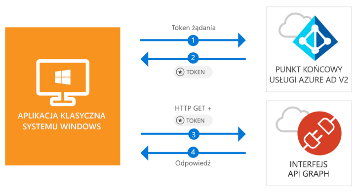

# <a name="quickstart-acquire-a-token-and-call-microsoft-graph-api-from-a-windows-desktop-app"></a>Szybki start: uzyskiwanie tokenu i wywoływanie interfejsu API programu Microsoft Graph z poziomu aplikacji klasycznej w systemie Windows

[!INCLUDE [active-directory-develop-applies-v2-msal](../../../includes/active-directory-develop-applies-v2-msal.md)]

W tym przewodniku Szybki start dowiesz się, w jaki sposób można logować się na kontach osobistych i służbowych, uzyskiwać tokeny dostępu i wywoływać interfejs API programu Microsoft Graph z poziomu aplikacji klasycznej .NET (WPF) w systemie Windows.



> [!div renderon="docs"]
> ## <a name="register-and-download"></a>Rejestrowanie i pobieranie
> ### <a name="register-and-configure-your-application-and-code-sample"></a>Rejestrowanie i konfigurowanie aplikacji i przykładowego kodu
> #### <a name="step-1-register-your-application"></a>Krok 1. Rejestrowanie aplikacji
> Aby zarejestrować aplikację i dodać informacje na temat rejestracji aplikacji do rozwiązania, wykonaj następujące czynności:
> 1. Przejdź do [portalu rejestracji aplikacji firmy Microsoft](https://apps.dev.microsoft.com/portal/register-app), aby zarejestrować aplikację.
> 1. W polu **Application Name** (Nazwa aplikacji) wprowadź nazwę aplikacji.
> 1. Upewnij się, że pole **Guided Setup** (Konfiguracja z przewodnikiem) jest wyczyszczone, a następnie wybierz pozycję **Create** (Utwórz).
> 1. Wybierz kolejno pozycje **Add platform** (Dodaj platformę), **Native Application** (Aplikacja natywna) i **Save** (Zapisz).

> [!div renderon="portal" class="sxs-lookup"]
> #### <a name="step-1-configure-your-application"></a>Krok 1. Konfigurowanie aplikacji
> Aby kod przykładowy z tego samouczka działał, należy dodać adres URL odpowiedzi w formacie **urn:ietf:wg:oauth:2.0:oob**.
> > [!div renderon="portal" id="makechanges" class="nextstepaction"]
> > [Wprowadź tę zmianę automatycznie]()
>
> > [!div id="appconfigured" class="alert alert-info"]
> >  (Już skonfigurowano) Twoja aplikacja została skonfigurowana za pomocą tych atrybutów

#### <a name="step-2-download-your-visual-studio-project"></a>Krok 2. Pobieranie projektu programu Visual Studio

[Pobierz projekt programu Visual Studio 2017](https://github.com/Azure-Samples/active-directory-dotnet-desktop-msgraph-v2/archive/master.zip)

#### <a name="step-3-configure-your-visual-studio-project"></a>Krok 3. Konfigurowanie projektu programu Visual Studio

1. Wyodrębnij plik zip do folderu lokalnego (na przykład **C:\Azure-Samples**)
1. Otwórz projekt w programie Visual Studio.
1. Edytuj pole **App.Xaml.cs** i zastąp wiersz rozpoczynający się od ciągu `private static string ClientId` identyfikatorem zarejestrowanej aplikacji:

```csharp
private static string ClientId = "Enter_the_Application_Id_here";
```

## <a name="more-information"></a>Więcej informacji

### <a name="msalnet"></a>MSAL.NET

Biblioteka MSAL ([Microsoft.Identity.Client](https://www.nuget.org/packages/Microsoft.Identity.Client)) to biblioteka umożliwiająca logowanie użytkowników i przesyłanie żądań tokenów używanych do uzyskania dostępu do interfejsu API chronionego przez usługę Azure Active Directory (Azure AD). Można ją zainstalować, uruchamiając następujące polecenie w **Konsoli menedżera pakietów** programu Visual Studio:

```powershell
Install-Package Microsoft.Identity.Client -Pre
```

### <a name="msal-initialization"></a>Inicjowanie biblioteki MSAL

Aby dodać odwołanie do biblioteki MSAL, dodaj następujący kod:

```csharp
using Microsoft.Identity.Client;
```

Następnie zainicjuj bibliotekę MSAL, używając następującego kodu:

```csharp
public static PublicClientApplication PublicClientApp = new PublicClientApplication(ClientId);
```

> |Gdzie: ||
> |---------|---------|
> | `ClientId` | Identyfikator aplikacji zarejestrowanej w witrynie *portal.microsoft.com* |

### <a name="requesting-tokens"></a>Przesyłanie żądań tokenów

Biblioteka MSAL oferuje dwie metody uzyskiwania tokenów: `AcquireTokenAsync` i `AcquireTokenSilentAsync`.

#### <a name="get-a-user-token-interactively"></a>Interaktywne pobieranie tokenu użytkownika

W niektórych sytuacjach trzeba wymusić interakcję użytkowników z punktem końcowym usługi Azure AD w wersji 2.0 za pośrednictwem wyskakującego okienka w celu weryfikacji poświadczeń lub wyrażenia zgody. Oto niektóre przykłady:

- Gdy nowi użytkownicy logują się do aplikacji po raz pierwszy.
- Gdy użytkownicy muszą ponownie wprowadzić poświadczenia, ponieważ hasło wygasło.
- Gdy aplikacja żąda dostępu do zasobów wymagającego zgody użytkownika.
- Gdy wymagane jest uwierzytelnianie dwuetapowe.

```csharp
authResult = await App.PublicClientApp.AcquireTokenAsync(_scopes);
```

> |Gdzie:||
> |---------|---------|
> | `_scopes` | Zawiera żądane zakresy (czyli `{ "user.read" }` dla programu Microsoft Graph lub `{ "api://<Application ID>/access_as_user" }` dla niestandardowych interfejsów internetowych API) |

#### <a name="get-a-user-token-silently"></a>Dyskretne pobieranie tokenu użytkownika

Nie chcesz, aby użytkownik musiał weryfikować poświadczenia za każdym razem, gdy musi uzyskać dostęp do zasobu. Przez większość czasu uzyskiwanie i odnawianie tokenów powinno odbywać się bez żadnej interakcji z użytkownikiem. Możesz użyć metody `AcquireTokenSilentAsync` do uzyskiwania tokenów umożliwiających dostęp do chronionych zasobów po początkowym skorzystaniu z metody `AcquireTokenAsync`:

```csharp
var accounts = await App.PublicClientApp.GetAccountsAsync();
authResult = await App.PublicClientApp.AcquireTokenSilentAsync(scopes, accounts.FirstOrDefault());
```

> |Gdzie: ||
> |---------|---------|
> |scopes | Zawiera żądane zakresy (czyli `{ "user.read" }` dla programu Microsoft Graph lub `{ "api://<Application ID>/access_as_user" }` dla niestandardowych interfejsów internetowych API) |
> |accounts.FirstOrDefault() | Pierwszy użytkownik w pamięci podręcznej (biblioteka MSAL obsługuje wielu użytkowników w jednej aplikacji) |

## <a name="next-steps"></a>Następne kroki

Wypróbuj samouczek dotyczący aplikacji klasycznych systemu Windows, aby uzyskać instrukcje krok po kroku dotyczące tworzenia aplikacji i nowych funkcji, w tym pełne objaśnienie informacji zawartych w tym podręczniku Szybki start.

### <a name="learn-the-steps-to-create-the-application-used-in-this-quickstart"></a>Dowiedz się więcej na temat czynności, które są wymagane to utworzenia aplikacji użytej w tym przewodniku Szybki start

> [!div class="nextstepaction"]
> [Call Graph API tutorial (Samouczek dotyczący wywoływania interfejsu API programu Graph)](https://docs.microsoft.com/azure/active-directory/develop/guidedsetups/active-directory-windesktop)

[!INCLUDE [Help and support](../../../includes/active-directory-develop-help-support-include.md)]
