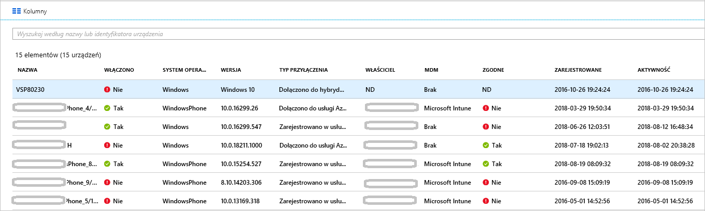

# <a name="how-to-manage-stale-devices-in-azure-ad"></a>Jak: Zarządzanie przestarzałymi urządzeniami w usłudze Azure AD

W idealnym przypadku, aby zakończyć cykl życia, zarejestrowane urządzenia powinny zostać wyrejestrowane, gdy nie są już potrzebne. Ale czasami, na przykład z powodu zgubienia, kradzieży lub uszkodzenia urządzenia albo ponownej instalacji systemu operacyjnego, w Twoim środowisku pojawiają się nieaktywne urządzenia. Jako administrator IT prawdopodobnie potrzebujesz metody usuwania takich nieaktywnych urządzeń, aby Twoje zasoby mogły skoncentrować się na zarządzaniu urządzeniami, które faktycznie wymagają zarządzania.

W tym artykule dowiesz się, jak skutecznie zarządzać nieaktywnymi urządzeniami we własnym środowisku.
  

## <a name="what-is-a-stale-device"></a>Co to jest nieaktywne urządzenie?

Nieaktywnym nazywamy urządzenie, które zostało zarejestrowane za pomocą usługi Azure AD, ale nie było używane do uzyskiwania dostępu do aplikacji w chmurze w określonym przedziale czasu. Nieaktywne urządzenia wpływają na możliwość obsługi urządzeń i użytkowników oraz zarządzania nimi w ramach dzierżawy z następujących powodów: 

- Zduplikowane urządzenia mogą utrudnić pracownikom działu pomocy technicznej zidentyfikowanie urządzenia, które jest aktualnie aktywne.
- Zwiększona liczba urządzeń tworzy niepotrzebne zapisywanie zwrotne urządzeń, co zwiększa czas synchronizacji łączy usługi Azure AD.
- W celu zachowania porządku i spełnienia wymagań dotyczących zgodności warto mieć „czysty” stan urządzeń. 

Istnienie nieaktywnych urządzeń w usłudze Azure AD może być niezgodne z ogólnymi zasadami cyklu życia urządzeń w Twojej organizacji.

## <a name="detect-stale-devices"></a>Wykrywanie nieaktywnych urządzeń

Ponieważ nieaktywne urządzenie jest zdefiniowane jako zarejestrowane urządzenie, które nie było używane do uzyskiwania dostępu do aplikacji w chmurze w określonym przedziale czasu, wykrywanie nieaktywnych urządzeń wymaga właściwości powiązanej ze znacznikiem czasu. W usłudze Azure AD ta właściwość nazywa się **ApproximateLastLogonTimestamp** lub **znacznik czasu aktywności**. Jeśli różnica między bieżącą datą a wartością **znacznika czasu aktywności** przekroczy przedział czasu zdefiniowany dla aktywnych urządzeń, urządzenie jest uznawane za nieaktywne. Ten **znacznik czasu aktywności** znajduje się obecnie w publicznej wersji zapoznawczej.

## <a name="how-is-the-value-of-the-activity-timestamp-managed"></a>Jak jest zarządzana wartość znacznika czasu aktywności?  

Obliczanie znacznika czasu aktywności jest wyzwalane przez próbę uwierzytelnienia urządzenia. Usługa Azure AD oblicza znacznik czasu aktywności w następujących sytuacjach:

- Wyzwolono zasady dostępu warunkowego wymagające [zarządzanych urządzeń](../conditional-access/require-managed-devices.md) lub [zatwierdzonych aplikacji klienckich.](../conditional-access/app-based-conditional-access.md)
- Wykazywanie aktywności w sieci przez urządzenia z systemem Windows 10, które są dołączone do usługi Azure AD lub dołączone hybrydowo do usługi Azure AD. 
- Zaewidencjonowanie w usłudze urządzeń zarządzanych przy użyciu usługi Intune.

Jeśli różnica między istniejącą wartością sygnatury czasowej działania a bieżącą wartością jest większa niż 14 dni (wariancja+/-5 dni), istniejąca wartość zostanie zastąpiona nową wartością.

## <a name="how-do-i-get-the-activity-timestamp"></a>Jak mogę uzyskać znacznik czasu aktywności?

Istnieją dwie możliwości uzyskania wartości znacznika czasu aktywności:

- Kolumna **Aktywność** na [stronie urządzeń](https://portal.azure.com/#blade/Microsoft_AAD_IAM/DevicesMenuBlade/Devices) w witrynie Azure Portal

    

- Polecenie cmdlet [Get-MsolDevice](/powershell/module/msonline/get-msoldevice?view=azureadps-1.0)

    

## <a name="plan-the-cleanup-of-your-stale-devices"></a>Planowanie oczyszczania nieaktywnych urządzeń

Aby skutecznie oczyścić nieaktywne urządzenia w swoim środowisku, zdefiniuj powiązane zasady. Te zasady pomagają zapewnić uwzględnienie wszystkich zagadnień dotyczących nieaktywnych urządzeń. Poniższe sekcje zawierają przykłady typowych zagadnień uwzględnianych w zasadach. 

### <a name="cleanup-account"></a>Konto oczyszczania

Aby zaktualizować urządzenie w usłudze Azure AD, potrzebne jest konto, które ma przypisaną jedną z następujących ról:

- Administrator globalny
- Administrator urządzeń w chmurze
- Administrator usługi Intune

W zasadach oczyszczania wybierz konta, które mają przypisane wymagane role. 

### <a name="timeframe"></a>Przedział czasu

Zdefiniuj przedział czasu, który jest wskaźnikiem służącym do wykrywania nieaktywnego urządzenia. Podczas definiowania przedziału czasowego należy uwzględnić okno odnotowane w celu zaktualizowania sygnatury czasowej aktywności do wartości. Na przykład nie należy traktować sygnatury czasowej, która jest młodsza niż 21 dni (zawiera wariancję) jako wskaźnik dla przestarzałego urządzenia. Istnieją sytuacje, w których urządzenie może wyglądać na nieaktywne, chociaż tak nie jest. Na przykład gdy właściciel urządzenia jest na urlopie lub na zwolnieniu lekarskim   przekraczającym przedział czasu zdefiniowany dla nieaktywnych urządzeń.

### <a name="disable-devices"></a>Wyłączanie urządzeń

Nie zaleca się natychmiastowego usuwania urządzenia, które wydaje się być nieaktualne, ponieważ takiego usunięcia nie można cofnąć, gdy uznanie urządzenia za nieaktywne okaże się wynikiem fałszywie dodatnim. Najlepszym rozwiązaniem jest wyłączenie urządzenia na okres prolongaty przed jego usunięciem. W zasadach zdefiniuj przedział czasu wyłączenia urządzenia przed jego usunięciem.

### <a name="mdm-controlled-devices"></a>Urządzenia kontrolowane przez rozwiązanie MDM

Jeśli urządzenie jest kontrolowane przez usługę Intune lub dowolne inne rozwiązanie do zarządzania urządzeniami mobilnymi (MDM), wycofaj to urządzenie z takiego rozwiązania przed jego wyłączeniem lub usunięciem.

### <a name="system-managed-devices"></a>Urządzenia zarządzane przez system

Nie należy usuwać urządzeń zarządzanych przez system. Są to zazwyczaj urządzenia, takie jak Autopilot. Po usunięciu tych urządzeń nie można ponownie aprowizji. Nowe polecenie cmdlet `get-msoldevice` domyślnie wyklucza urządzenia zarządzane przez system. 

### <a name="hybrid-azure-ad-joined-devices"></a>Urządzenia dołączone hybrydowo do usługi Azure AD

W przypadku urządzeń dołączonych hybrydowo do usługi Azure AD powinny być przestrzegane lokalne zasady zarządzania nieaktywnymi urządzeniami. 

Oczyszczanie w usłudze Azure AD:

- **Urządzenia z systemem Windows 10** — wyłącz lub usuń urządzenia z systemem Windows 10 w lokalnej usłudze AD i pozwól usłudze Azure AD Connect zsynchronizować zmieniony stan urządzenia z usługą Azure AD.
- **Windows 7/8** — najpierw wyłącz lub usuń urządzenia z systemem Windows 7/8 w lokalnej usłudze AD. Nie możesz używać programu Azure AD Connect do wyłączania ani usuwania urządzeń z systemem Windows 7 lub 8 w usłudze Azure AD. Zamiast tego po wprowadzeniu zmian w środowisku lokalnym, należy wyłączyć/usunąć w usłudze Azure AD.

> [!NOTE]
>* Usuwanie urządzeń w lokalnej usłudze AD lub usłudze Azure AD nie powoduje usunięcia rejestracji na kliencie. Uniemożliwi to dostęp do zasobów przy użyciu urządzenia jako tożsamości (np. dostępu warunkowego). Przeczytaj dodatkowe informacje na temat [usuwania rejestracji na kliencie](faq.md#hybrid-azure-ad-join-faq).
>* Usunięcie urządzenia z systemem Windows 10 tylko w usłudze Azure AD spowoduje ponowną synchronizację urządzenia z lokalnego urządzenia przy użyciu usługi Azure AD connect, ale jako nowy obiekt w stanie "Oczekujące". Na urządzeniu wymagana jest ponowna rejestracja.
>* Usunięcie urządzenia z zakresu synchronizacji dla urządzeń z systemem Windows 10/Server 2016 spowoduje usunięcie urządzenia usługi Azure AD. Dodanie go z powrotem do zakresu synchronizacji spowoduje umieszczenie nowego obiektu w stanie "Oczekujące". Wymagana jest ponowna rejestracja urządzenia.
>* Jeśli nie używasz urządzenia usługi Azure AD Connect dla urządzeń z systemem Windows 10 do synchronizacji (np. TYLKO przy użyciu usług AD FS do rejestracji), musisz zarządzać cyklem życia podobnym do urządzeń z systemem Windows 7/8.


### <a name="azure-ad-joined-devices"></a>Urządzenia dołączone do usługi Azure AD

Urządzenia dołączone do usługi Azure AD wyłącza się lub usuwa w usłudze Azure AD.

> [!NOTE]
>* Usunięcie urządzenia usługi Azure AD nie powoduje usunięcia rejestracji na kliencie. Uniemożliwi to dostęp do zasobów przy użyciu urządzenia jako tożsamości (np. dostęp warunkowy). 
>* Dowiedz się więcej o [tym, jak odłączyć dołączanie do usługi Azure AD](faq.md#azure-ad-join-faq) 

### <a name="azure-ad-registered-devices"></a>Urządzenia zarejestrowane w usłudze Azure AD

Urządzenia zarejestrowane w usłudze Azure AD wyłącza się lub usuwa w usłudze Azure AD.

> [!NOTE]
>* Usunięcie urządzenia zarejestrowanego usługi Azure AD w usłudze Azure AD nie powoduje usunięcia rejestracji na kliencie. Uniemożliwi to dostęp do zasobów przy użyciu urządzenia jako tożsamości (np. dostępu warunkowego).
>* Dowiedz się więcej [o tym, jak usunąć rejestrację na kliencie](faq.md#azure-ad-register-faq)

## <a name="clean-up-stale-devices-in-the-azure-portal"></a>Oczyszczanie nieaktywnych urządzeń w witrynie Azure Portal  

Nieaktywne urządzenia można oczyszczać w witrynie Azure Portal, ale bardziej wydajne jest wykonywanie tego za pomocą skryptu programu PowerShell. Użyj najnowszego modułu PowerShell V1, aby użyć filtru sygnatury czasowej i odfiltrować urządzenia zarządzane przez system, takie jak Autopilot. W tym przypadku użycie programu PowerShell w wersji 2 nie jest zalecane.

Typowa procedura obejmuje następujące czynności:

1. Nawiązywanie połączenia z usługą Azure Active Directory przy użyciu polecenia cmdlet [Connect-MsolService](/powershell/module/msonline/connect-msolservice?view=azureadps-1.0)
1. Pobieranie listy urządzeń
1. Wyłączanie urządzenia przy użyciu polecenia cmdlet [Disable-MsolDevice](/powershell/module/msonline/disable-msoldevice?view=azureadps-1.0) 
1. Przed usunięciem urządzenia poczekaj, aż upłynie wybrana przez Ciebie liczba dni okresu prolongaty.
1. Usuwanie urządzenia przy użyciu polecenia cmdlet [Remove-MsolDevice](/powershell/module/msonline/remove-msoldevice?view=azureadps-1.0)

### <a name="get-the-list-of-devices"></a>Pobieranie listy urządzeń

Aby uzyskać listę wszystkich urządzeń i zachować zwrócone dane w pliku CSV, użyj następującego polecenia:

```PowerShell
Get-MsolDevice -all | select-object -Property Enabled, DeviceId, DisplayName, DeviceTrustType, Approxi
mateLastLogonTimestamp | export-csv devicelist-summary.csv
```

Jeśli w katalogu jest duża liczba urządzeń, użyj filtru sygnatury czasowej, aby zawęzić liczbę zwróconych urządzeń. Aby uzyskać wszystkie urządzenia ze znacznikiem czasu starszym niż określona data oraz zachować zwrócone dane w pliku CSV, użyj następującego polecenia: 

```PowerShell
$dt = [datetime]’2017/01/01’
Get-MsolDevice -all -LogonTimeBefore $dt | select-object -Property Enabled, DeviceId, DisplayName, DeviceTrustType, ApproximateLastLogonTimestamp | export-csv devicelist-olderthan-Jan-1-2017-summary.csv
```

## <a name="what-you-should-know"></a>Co należy wiedzieć

### <a name="why-is-the-timestamp-not-updated-more-frequently"></a>Dlaczego znacznik czasu nie jest aktualizowany częściej?

Znacznik czasu jest aktualizowany w celu obsługi scenariuszy cyklu życia urządzenia. Nie jest to inspekcja. Aby wykonywać częstsze aktualizacje na urządzeniu, użyj dzienników inspekcji logowania.

### <a name="why-should-i-worry-about-my-bitlocker-keys"></a>Dlaczego muszę zadbać o klucze funkcji BitLocker?

Skonfigurowane klucze funkcji BitLocker dla urządzeń z systemem Windows 10 są przechowywane w obiekcie urządzenia w usłudze Azure AD. Jeśli usuwasz nieaktywne urządzenie, usuwasz również klucze funkcji BitLocker, które są przechowywane na tym urządzeniu. Przed usunięciem nieaktywnego urządzenia musisz sprawdzić, czy zasady oczyszczania są zgodne z rzeczywistym cyklem życia urządzenia. 

### <a name="why-should-i-worry-about-windows-autopilot-devices"></a>Dlaczego warto martwić się o urządzenia z systemem Windows Autopilot?

Gdy urządzenie usługi Azure AD został skojarzony z obiektu programu Windows Autopilot następujące trzy scenariusze mogą wystąpić, jeśli urządzenie zostanie zmieniona w przyszłości:
- W przypadku wdrożeń kierowanych przez użytkownika programu Windows Autopilot bez użycia białych rękawic zostanie utworzone nowe urządzenie usługi Azure AD, ale nie zostanie ono oznaczone identyfikatorem ZTDID.
- W systemie Windows Autopilot wdrożenia w trybie samodzielnego wdrażania, będą one nie powiodło się, ponieważ nie można odnaleźć skojarzonego urządzenia usługi Azure AD.  (Jest to mechanizm zabezpieczeń, aby upewnić się, że żadne "oszust" urządzenia próbują dołączyć do usługi Azure AD bez poświadczeń.) Błąd będzie wskazywać niezgodność ZTDID.
- W umieszczeniu białych rękawic z programem Windows Autopilot zakończy się niepowodzeniem, ponieważ nie można odnaleźć skojarzonego urządzenia usługi Azure AD. (Za kulisami wdrożenia białych rękawic używają tego samego procesu trybu samodzielnego wdrażania, więc wymuszają te same mechanizmy zabezpieczeń).

### <a name="how-do-i-know-all-the-type-of-devices-joined"></a>Jak mogę sprawdzić, czy wszystkie typy urządzeń zostały dołączone?

Aby dowiedzieć się więcej na temat różnych typów, zobacz [omówienie zarządzania urządzeniami](overview.md).

### <a name="what-happens-when-i-disable-a-device"></a>Co się stanie, gdy urządzenie zostanie wyłączone?

Każde uwierzytelnianie z użyciem urządzenia w usłudze Azure AD jest odrzucane. Typowe przykłady:

- **Urządzenie dołączone hybrydowo do usługi Azure AD** — użytkownicy mogą korzystać z urządzenia, aby zalogować się do swojej domeny lokalnej. Nie mogą jednak uzyskać dostępu do zasobów usługi Azure AD, takich jak usługa Office 365.
- **Urządzenia dołączone do usługi Azure AD** — użytkownicy nie mogą używać urządzenia do logowania. 
- **Urządzenia przenośne** — użytkownicy nie mogą uzyskać dostępu do zasobów usługi Azure AD, takich jak usługa Office 365. 

## <a name="next-steps"></a>Następne kroki

Aby uzyskać omówienie sposobu zarządzania urządzeniami w witrynie Azure Portal, zobacz [zarządzanie urządzeniami przy użyciu witryny Azure Portal](device-management-azure-portal.md)
