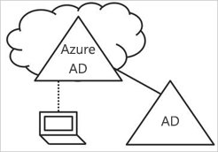
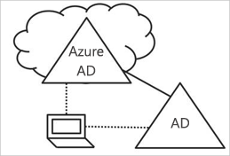

# Co to jest tożsamość urządzenia?

W świecie zdominowanym przez urządzenia przenośne i rozwiązania chmurowe usługa Azure Active Directory (Azure AD) umożliwia logowanie jednokrotne na urządzeniach oraz w usługach i aplikacjach z dowolnego miejsca. Powszechne stosowanie urządzeń — w tym modelu Przynieś własne urządzenie (BYOD, Bring Your Own Device) — stawia dwa przeciwstawne cele przed specjalistami IT:

- Umożliwienie użytkownikom końcowym produktywnej pracy w dowolnym czasie i miejscu.
- Ochrona zasobów firmowych przez cały czas.

Za pomocą urządzeń w usłudze Azure AD użytkownicy uzyskują dostęp do zasobów firmowych. Aby chronić Twoje zasoby firmowe, administrator IT, chcesz zarządzać tymi tożsamościami urządzeń. W ten sposób może zapewnić, że użytkownicy uzyskują dostęp do zasobów z urządzeń, które spełniają standardy dotyczące zabezpieczeń i zgodności.

Zarządzanie tożsamościami urządzeń jest również podstawą dla [dostępu warunkowego opartego na urządzeniu](../conditional-access/require-managed-devices.md). Korzystając z dostępu warunkowego opartego na urządzeniach, można zagwarantować, że dostęp do zasobów w środowisku jest możliwy tylko przy użyciu urządzeń zarządzanych.

## Pobieranie urządzenia w usłudze Azure AD

Aby uzyskać urządzenie w usłudze Azure AD, masz dwie opcje:

- Zarejestrowanie
- Dołączenie

**Zarejestrowanie** urządzenia w usłudze Azure AD umożliwia zarządzanie tożsamością urządzenia. Po zarejestrowaniu urządzenia usługa rejestracji urządzeń w usłudze Azure AD zapewnia urządzeniu tożsamość, która jest używana do uwierzytelniania urządzenia podczas logowania użytkownika w usłudze Azure AD. Możesz użyć tożsamości, aby włączyć lub wyłączyć urządzenie.

W przypadku połączenia z rozwiązaniem do zarządzania urządzeniami przenośnymi (MDM, mobile device management), takim jak usługa Microsoft Intune, atrybuty urządzenia w usłudze Azure AD są aktualizowane przy użyciu dodatkowych informacji o urządzeniu. Umożliwia to tworzenie reguł dostępu warunkowego, które wymuszają dostęp z urządzeń spełniających określone standardy zabezpieczeń i zgodności. Aby uzyskać więcej informacji na temat rejestrowania urządzeń w usłudze Microsoft Intune, zobacz artykuł [Co to jest rejestrowanie urządzenia?](https://docs.microsoft.com/intune/device-enrollment)

**Dołączenie** urządzenia jest rozszerzeniem zarejestrowania urządzenia. Oznacza to zapewnienie wszystkich korzyści z rejestrowania urządzenia oraz zmianę stanu lokalnego urządzenia. Zmiana stanu lokalnego umożliwia użytkownikom logowanie do urządzenia przy użyciu konta służbowego w organizacji zamiast konta osobistego.

## Urządzenia zarejestrowane w usłudze Azure AD

Celem stosowania urządzeń zarejestrowanych w usłudze Azure AD jest zapewnianie obsługi scenariusza **Przynieś własne urządzenie (BYOD)** . W tym scenariuszu użytkownik może uzyskać dostęp do zasobów kontrolowanych przez usługę Azure Active Directory w organizacji przy użyciu urządzenia osobistego.  

Dostęp jest oparty na koncie służbowym wprowadzonym na urządzeniu.  
Na przykład system Windows 10 umożliwia użytkownikom dodanie konta służbowego do komputera, tabletu lub telefonu osobistego.  
Gdy użytkownik doda konto służbowe, urządzenie zostanie zarejestrowane w usłudze Azure AD oraz, opcjonalnie, w systemie zarządzania urządzeniami przenośnymi (MDM) skonfigurowanym przez organizację.
Użytkownicy organizacji mogą wygodnie dodać konto służbowe do urządzenia osobistego:

- Podczas uzyskiwania dostępu do aplikacji roboczej po raz pierwszy
- Ręcznie za pośrednictwem menu **Ustawienia** w przypadku systemu Windows 10

Stan urządzenia zarejestrowane z usługi Azure AD można skonfigurować **systemu Windows 10 osobiste, iOS, Android i macOS** urządzeń.

## Urządzenia dołączone do usługi Azure AD

Celem urządzeń dołączonych do usługi Azure AD jest uproszczenie następujących kwestii:

- Wdrożenia urządzeń należących do firmy w systemie Windows
- Uzyskiwanie dostępu do aplikacji i zasobów organizacji z dowolnego urządzenia z systemem Windows
- Oparte na chmurze zarządzanie urządzeniami należącymi do firmy
- Użytkownikom na logowanie się do ich urządzeń przy użyciu ich w usłudze Azure AD lub zsynchronizowanych usługi Active Directory kont służbowych.

Dołączenie do usługi Azure AD można wdrożyć przy użyciu dowolnej z następujących metod:

- [Windows Autopilot](https://docs.microsoft.com/windows/deployment/windows-autopilot/windows-10-autopilot)
- [Wdrożenie zbiorcze](https://docs.microsoft.com/intune/windows-bulk-enroll)
- [Środowisko samoobsługowe](azuread-joined-devices-frx.md)

**Dołączenie do usługi Azure AD** jest przeznaczone dla organizacji, które chcą głównie używać chmury (tj. głównie używają usług w chmurze, aby zredukować użycie infrastruktury lokalnej) lub które używają wyłącznie chmury (bez infrastruktury lokalnej). Nie ma żadnych ograniczeń w zakresie rozmiaru lub typu organizacji, które mogą wdrożyć dołączenie do usługi Azure AD. Dołączenie do usługi Azure AD działa dobrze nawet w środowiskach hybrydowych, zapewniając dostęp do aplikacji i zasobów przechowywanych w chmurze i lokalnie.

Zaimplementowanie urządzeń dołączonych do usługi Azure AD zapewnia następujące korzyści:

- **Logowanie jednokrotne** do aplikacji i usług SaaS zarządzanych na platformie Azure. Użytkownicy nie zobaczą dodatkowych monitów o uwierzytelnienie podczas uzyskiwania dostępu do zasobów służbowych. Funkcji logowania jednokrotnego jest dostępna, nawet wtedy, gdy użytkownicy nie są połączone z siecią domeny.
- **Roaming zgodny z wymaganiami przedsiębiorstwa** dla ustawień użytkowników na dołączonych urządzeniach. Użytkownicy nie muszą łączyć konta Microsoft (np. Hotmail), aby zobaczyć ustawienia na urządzeniach.
- **Dostęp do sklepu Windows Store dla firm** przy użyciu konta usługi Azure AD. Użytkownicy mogą wybrać ze spisu aplikacji wstępnie wybranych przez organizację.
- Obsługa funkcji **Windows Hello** na potrzeby bezpiecznego i wygodnego dostępu do zasobów służbowych.
- **Ograniczenie dostępu** do aplikacji tylko do urządzeń spełniających zasady zgodności.
- **Bezproblemowy dostęp do zasobów lokalnych**, jeżeli urządzenie ma bezpośredni kontakt z kontrolerem domeny w środowisku lokalnym.

Chociaż dołączanie do usługi Azure AD jest przeznaczone głównie dla organizacji, które nie mają lokalnej infrastruktury usługi Active Directory systemu Windows Server, możesz bez obaw użyć tej funkcji w następujących scenariuszach:

- Chcesz przenieść zasoby do infrastruktury opartej na chmurze przy użyciu usługi Azure AD oraz funkcji zarządzania urządzeniami przenośnymi, np. usługi Intune.
- Nie możesz zastosować dołączania do domeny lokalnej, np. jeśli potrzebujesz kontrolować urządzenia przenośne, takie jak tablety i telefony.
- Użytkownicy przede wszystkim potrzebują dostępu do usługi Office 365 lub innych aplikacji SaaS zintegrowanych z usługą Azure AD.
- Chcesz zarządzać grupą użytkowników w usłudze Azure AD zamiast w usłudze Active Directory. Może to mieć zastosowanie na przykład w przypadku pracowników sezonowych, podwykonawców lub uczniów.
- Chcesz zapewnić możliwość dołączania pracownikom w odległych oddziałach z ograniczoną infrastrukturą lokalną.

Funkcję urządzeń dołączonych do usługi Azure AD możesz skonfigurować w przypadku urządzeń z systemem Windows 10.

## Urządzenia dołączone hybrydowo do usługi Azure AD

Przez ponad dekadę wiele organizacji używało przyłączania do domeny lokalnej usługi Active Directory, aby umożliwić wykonywanie następujących czynności:

- Zarządzanie urządzeniami firmowymi z centralnej lokalizacji przez działy IT.
- Logowanie się przez użytkowników na urządzeniach przy użyciu kont służbowych usługi Active Directory.

Zazwyczaj organizacje z dużą ilością zasobów lokalnych polegają na metodach obrazowania w przypadku aprowizacji urządzeń, a także często używają programu **System Center Configuration Manager (SCCM)** lub **zasad grupy** do zarządzania nimi.

Jeśli środowisko ma lokalną infrastrukturę usługi AD i chcesz również wykorzystać możliwości zapewniane przez usługę Azure Active Directory, możesz wdrożyć urządzenia dołączone hybrydowo do usługi Azure AD. Są to urządzenia dołączone do lokalnej usługi Active Directory oraz zarejestrowane w usłudze Azure Active Directory.

Urządzeń dołączonych hybrydowo do usługi Azure AD należy używać w następujących przypadkach:

- Masz aplikacje Win32 wdrożone na tych urządzeniach, które polegają na uwierzytelnianiu maszynowym usługi Active Directory.
- Potrzebujesz zasad grupy do zarządzania urządzeniami.
- Chcesz nadal używać rozwiązań obrazowania do konfigurowania urządzeń dla pracowników.

Funkcję urządzeń hybrydowo dołączonych do usługi Azure AD możesz skonfigurować dla urządzeń z systemem Windows 10 oraz starszymi systemami, np. Windows 8 i Windows 7.

## Podsumowanie

Zarządzanie tożsamościami urządzeń w usłudze Azure AD możesz wykonywać następujące czynności:

- Upraszcza proces łączy i zarządzanie urządzeniami w usłudze Azure AD
- Zapewnienie użytkownikom łatwego dostępu do zasobów organizacji opartych na chmurze

Ogólnie omówione typy urządzeń mają następujące zastosowania:

- Urządzenia zarejestrowane w usłudze Azure AD:
   - Urządzenia osobiste
   - Ręczne rejestrowanie urządzeń w usłudze Azure AD
- Urządzenia dołączone do usługi Azure AD:
   - Urządzenia, które są własnością organizacji
   - Urządzenia, które **nie** są dołączone do lokalnej usługi AD
   - Zmiana stanu lokalnego urządzenia
- Urządzenia dołączone hybrydowo do usługi Azure AD, jeśli te urządzenia są dołączone do lokalnej usługi AD:
   - Urządzenia, które są własnością organizacji
   - Urządzenia, które są dołączone do lokalnej usługi AD
   - Zmiana stanu lokalnego urządzenia

## Wymagania licencyjne

[!INCLUDE [Active Directory P1 license](../../../includes/active-directory-p1-license.md)]

## Kolejne kroki

- Aby uzyskać podstawowe informacje o Zarządzanie tożsamościami urządzeń w witrynie Azure portal, zobacz [Zarządzanie tożsamościami urządzeń przy użyciu witryny Azure portal](device-management-azure-portal.md).
- Aby skonfigurować:
   - Usługa Azure Active Directory zarejestrowanych urządzeń z systemem Windows 10, zobacz [sposób konfigurowania usługi Azure Active Directory zarejestrowanych urządzeń z systemem Windows 10](../user-help/device-management-azuread-registered-devices-windows10-setup.md).
   - Urządzenia przyłączone do usługi Azure Active Directory, zobacz [sposobu planowania wdrożenia usługi Azure Active Directory join](azureadjoin-plan.md).
   - Urządzenia dołączone hybrydowo do usługi Azure AD — zobacz [Jak planować implementację z dołączaniem hybrydowym do usługi Azure Active Directory](hybrid-azuread-join-plan.md).
- Aby dowiedzieć się więcej na temat dostępu warunkowego opartego na urządzeniach, zobacz [zasady dostępu warunkowego opartego na urządzeniu Azure skonfiguruj usługę Active Directory](../conditional-access/require-managed-devices.md).
