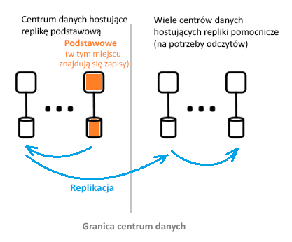

# Co to jest architektura usługi Azure Active Directory?
Usługa Azure Active Directory (Azure AD) umożliwia bezpieczne zarządzanie dostępem do usług i zasobów platformy Azure dla użytkowników. W ramach usługi Azure AD można skorzystać z pełnego zestawu możliwości zarządzania tożsamościami. Aby uzyskać więcej informacji na temat funkcji usługi Azure AD, zobacz [Co to jest usługa Azure Active Directory?](active-directory-whatis.md)

Za pomocą usługi Azure AD możesz tworzyć użytkowników i grupy oraz zarządzać nimi, a także zezwalać na dostęp do zasobów organizacji i odmawiać go przy użyciu uprawnień. Aby uzyskać informacje dotyczące zarządzania tożsamościami, zobacz [The fundamentals of Azure identity management](active-directory-whatis.md) (Podstawy zarządzania tożsamościami platformy Azure).

## Architektura usługi Azure AD
Rozproszona geograficznie Architektura usługi Azure AD łączy rozbudowane monitorowanie, automatyczne przekierowywanie, pracy awaryjnej i funkcje odzyskiwania, które dostarczają firmie dostępność i wydajność dla klientów.

W tym artykule omówione są następujące elementy architektury:
 *  Projekt architektury usługi
 *  Użyteczność 
 *  Ciągła dostępność
 *  Centra danych

### Projekt architektury usługi
Najczęstszym sposobem tworzenia dostępny i użytecznego, bogate w dane i system jest użycie niezależnych bloków konstrukcyjnych lub jednostek skalowania. W przypadku warstwy danych usługi Azure AD jednostki skalowania są nazywane *partycje*. 

Warstwa danych ma kilka usług frontonu, które zapewniają możliwość odczytu i zapisu. Na poniższym diagramie pokazano, w jaki składniki partycji pojedynczego katalogu są dostarczane w całym geograficznie rozproszonych centrów danych. 

  

Składniki architektury usługi Azure AD obejmują repliki podstawowe i pomocnicze.

**Replika podstawowa**

*Replika podstawowa* odbiera wszystkie operacje *zapisu* dla partycji, do której należy. Wszystkie operacje zapisu są natychmiast replikowane do repliki pomocniczej znajdującej się w innym centrum danych przed zwróceniem do obiektu wywołującego informacji o powodzeniu, co pozwala na zapewnienie nadmiarowej geograficznie trwałości zapisów.

**Repliki pomocnicze**

Wszystkie operacje *odczytu* z katalogu są obsługiwane przez *repliki pomocnicze* w centrach danych, które fizycznie znajdują się w różnych lokalizacjach geograficznych. Istnieje wiele replik pomocniczych, ponieważ dane są replikowane w sposób asynchroniczny. Operacje odczytu z katalogu, takie jak żądania uwierzytelniania są obsługiwane przez centra danych znajdujące się blisko klientów. Repliki pomocnicze są odpowiedzialne za skalowalność odczytu.

### Skalowalność

Skalowalność to możliwość rozszerzania działania usługi w związku z rosnącymi wymaganiami dotyczącymi wydajności. Skalowalność zapisu jest osiągana przez partycjonowanie danych. Skalowalność odczytu uzyskuje się przez replikację danych z jednej partycji do wielu replik pomocniczych rozproszonych na całym świecie.

Żądania z katalogu aplikacji są kierowane do centrum danych, które jest im fizycznie najbliższe. Zapisy są w sposób niewidoczny dla użytkownika przekierowywane do repliki podstawowej w celu zapewnienia spójności odczytu i zapisu. Repliki pomocnicze znacznie rozszerzają skalę partycji, ponieważ katalogi zazwyczaj przez większość czasu obsługują operacje odczytu.

Aplikacje katalogów nawiązują połączenie z najbliższymi centrami danych. To połączenie umożliwia zwiększenie wydajności i skalowania w poziomie jest możliwe. Ponieważ partycje katalogów mogą mieć wiele replik pomocniczych, repliki pomocnicze można umieścić bliżej klientów katalogu. Tylko wewnętrzne składniki usługi katalogu przeprowadzające wiele operacji odczytu bezpośrednio komunikują się z aktywną repliką podstawową.

### Ciągła dostępność

Dostępność (lub czas dostępności) definiuje możliwość wykonywania przez system nieprzerwanej pracy. Kluczem do wysokiej dostępności usługi Azure AD jest, że usługi możliwość szybkiego przełączania ruchu między wieloma geograficznie rozproszonych centrów danych. Każde centrum danych jest niezależne, co umożliwia wystąpienie nieskorelowanych trybów awarii.

Projekt partycji usługi Azure AD jest uproszczony w porównaniu do organizacyjnego projektu usługi AD, przy użyciu projekt pojedynczego elementu głównego, który obejmuje starannie zorganizowany i deterministyczny replikę podstawową procesu trybu failover.

**Odporność na uszkodzenia**

System jest bardziej dostępny, jeśli jest odporny na błędy sprzętu, sieci i oprogramowania. Dla każdej partycji w katalogu istnieje replika główna o wysokiej dostępności: Replika podstawowa. W ramach tej repliki są wykonywane tylko operacje zapisu. Ta replika jest stale i ściśle monitorowana, a operacje zapisu w przypadku wykrycia błędu mogą zostać natychmiast przełączone do innej repliki, która staje się wtedy nową repliką podstawową. Podczas pracy w trybie failover może to być związane z utratą dostępności do zapisu trwającą zwykle od 1 do 2 minut. Taka sytuacja nie ma wpływu na dostępność do odczytu.

Operacje odczytu (których liczba jest wiele rzędów wielkości większa od operacji zapisu) odbywają się tylko za pośrednictwem replik pomocniczych. Ponieważ repliki pomocnicze są idempotentne, utrata dowolnej repliki w danej partycji jest łatwo kompensowana przez przełączenie operacji odczytu do innej repliki, która zwykle znajduje się w tym samym centrum danych.

**Trwałość danych**

Operacja zapisu jest trwale zatwierdzana w co najmniej dwóch centrach danych przed potwierdzeniem. Najpierw ma miejsce zatwierdzanie operacji zapisu w replice podstawowej, a następnie operacja zapisu jest natychmiast replikowana do co najmniej jednego innego centrum danych. Ta akcja zapisu gwarantuje, że potencjalna krytyczna utrata centrum danych hostującego podstawową nie spowoduje utraty danych.

Usługa Azure AD obsługuje zerowy [cel czasu odzyskiwania (RTO)](https://en.wikipedia.org/wiki/Recovery_time_objective) nie utratę danych w tryb failover. Obejmuje to:
-  Wystawiania tokenów i operacje odczytu z katalogu
-  Zezwalanie tylko około 5 minut cel czasu odzyskiwania do zapisu w katalogu

### Centra danych

Repliki usługi Azure AD są przechowywane w centrach danych znajdujących się na całym świecie. Aby uzyskać więcej informacji, zobacz [Centra danych platformy Azure](https://azure.microsoft.com/overview/datacenters).

Działania usługi Azure AD względem centrów danych mają następujące cechy:

 * Uwierzytelnianie, wykresu i inne usługi AD znajdują się za usługą bramy. Brama zarządza równoważeniem obciążenia tych usług. Zakończy się niepowodzeniem przez automatycznie wszystkie serwery w złej kondycji w przypadku wykrycia użycie sond kondycji transakcyjnych. Na podstawie danych z tych sond kondycji brama dynamicznie kieruje ruch do centrów danych będących w dobrej kondycji.
 * Na potrzeby operacji *odczytu* katalog posiada repliki pomocnicze i odpowiednie usługi frontonu w ramach konfiguracji aktywne-aktywne działające w wielu centrach danych. W razie awarii całego centrum danych ruch zostanie automatycznie skierowany do innego centrum danych.
 *  Dla *zapisuje*, katalog przejdzie w tryb failover repliki podstawowej (głównej) w centrach danych za pośrednictwem planowanych (nowe podstawowa jest synchronizowana ze starego podstawowego) lub procedur awaryjnych trybu failover. Trwałość danych jest zapewniana przez replikowanie każdego zatwierdzenia do co najmniej dwóch centrów danych.

**Spójność danych**

Model katalogu to jeden z ostateczną wyborami. Jednym z typowych problemów z systemami rozproszonymi asynchronicznie replikowane jest, że z danymi zwróconymi z "konkretnej" repliki mogą nie być aktualne. 

Usługa Azure AD zapewnia spójność odczytu i zapisu dla aplikacji działających w ramach repliki pomocniczej, kierując jej operacje zapisu do repliki podstawowej i synchronicznie pobierając operacje zapisu do repliki pomocniczej.

Operacje zapisu aplikacji wykonywane za pomocą interfejsu API programu Graph usługi Azure AD są odseparowane od operacji zapewniania koligacji z repliką katalogu w celu zapewnienia spójności odczytu i zapisu. Usługa Azure AD Graph obsługuje sesję logiczną będącą w koligacji z repliką pomocniczą używaną do operacji odczytu; koligacja jest przechwytywana w ramach „tokenu repliki” buforowanego przez usługę Graph za pomocą rozproszonej pamięci podręcznej. Token ten jest następnie używany na potrzeby kolejnych operacji w ramach tej samej sesji logicznej. 

 >[!NOTE]
 >Operacje zapisu są natychmiast replikowane do repliki pomocniczej, dla której zostały utworzone operacje odczytu sesji logicznej.
 >

**Ochrona kopii zapasowych**

Katalog implementuje usuwanie elastyczne zamiast usuwania całkowitego w celu umożliwienia użytkownikom i dzierżawcom łatwego odzyskiwania w razie wykonania przypadkowego usunięcia przez klienta. Jeśli administrator dzierżawy przypadkowym usunie użytkowników, mogą łatwo cofnąć i przywrócić usuniętych użytkowników. 

Usługa Azure AD implementuje codzienne tworzenie kopii zapasowych wszystkich danych i w związku z tym umożliwia autorytatywne przywrócenie danych w przypadku wykonania jakichkolwiek logicznych operacji usuwania lub uszkodzenia danych. Warstwy danych korzystają z kodu służącego do korygowania, dzięki czemu mogą sprawdzić błędy i automatyczne naprawienie określonych rodzajów błędów na dysku.

**Metryki i monitory**

Uruchamianie usługi o wysokiej dostępności wymaga światowej klasy metryk i możliwości monitorowania. Usługa Azure AD stale analizuje i raportuje kluczowe metryki kondycji usługi i kryteria powodzenia dla każdej ze swoich usług. Dostępna jest również ciągłego rozwoju i dostrajanie metryk i monitorowania i alertów w każdym scenariuszu, w ramach każdej usługi Azure AD i wszystkich innych usług.

Jeśli z dowolnej usługi Azure AD nie działa zgodnie z oczekiwaniami, działania jest natychmiast podjęte w celu jak najszybszego przywrócenia jej funkcjonalności. Najważniejsze śledzi metryki usługi Azure AD jest jak szybko aktywnej witryny, problemy mogą być wykryte i skorygowane dla klientów. Ciężko pracujemy nad funkcjami monitorowania i alertów w celu zminimalizowania czasu wykrywania (docelowy czas wykrywania: poniżej 5 minut) oraz nad gotowością operacyjną w celu zminimalizowania czasu usuwania problemu (docelowy czas usuwania problemu: poniżej 30 minut).

**Zabezpieczanie operacji**

Przy użyciu kontrole operacyjne, takie jak uwierzytelnianie wieloskładnikowe (MFA) dla każdej operacji, a także inspekcję wszystkich operacji. Ponadto przy użyciu systemu podniesienia uprawnień just-in-time udzielenia niezbędnego tymczasowego dostępu dla wszelkich operacyjnych zadań na żądanie w sposób ciągły. Aby uzyskać więcej informacji, zobacz [Zaufana chmura](https://azure.microsoft.com/support/trust-center).

## Kolejne kroki
[Przewodnik dewelopera usługi Azure Active Directory](https://docs.microsoft.com/azure/active-directory/develop/active-directory-developers-guide)

