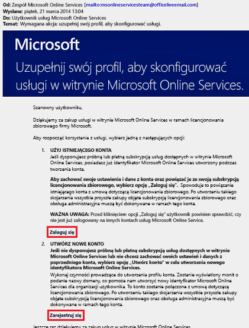
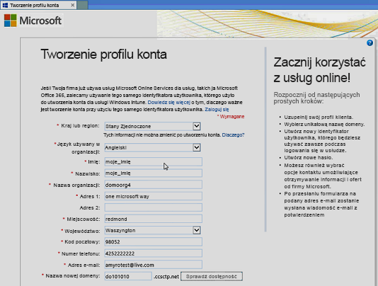
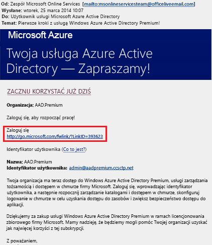
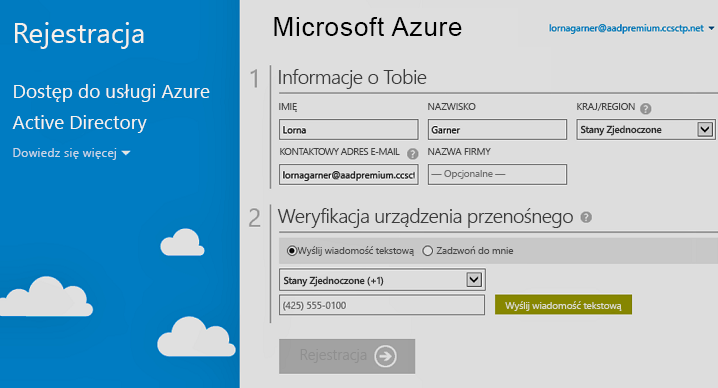

# Rejestrowanie w usłudze Azure Active Directory w wersji Premium
Istnieje możliwość zakupienia usługi Azure Active Directory (Azure AD) w wersji Premium i skojarzenia jej z Twoją subskrypcją platformy Azure. Jeśli chcesz utworzyć nową subskrypcję platformy Azure, musisz również uaktywnić plan licencjonowania i dostęp do usługi Azure AD.

> [!NOTE]
>Klienci w Chinach mogą używać wersji Premium i Podstawowa usługi Azure AD za pośrednictwem wystąpienia usługi Azure Active Directory dostępnego na całym świecie. Wersje Premium i Podstawowa usługi Azure AD nie są obecnie obsługiwane w usłudze platformy Azure świadczonej przez firmę 21Vianet w Chinach. Aby uzyskać więcej informacji, porozmawiaj z nami, korzystając z [forum usługi Azure Active Directory](https://feedback.azure.com/forums/169401-azure-active-directory/).

Zanim zarejestrujesz się w usłudze Active Directory — wersja Premium 1 lub Premium 2, musisz określić, która z istniejących subskrypcji lub który z istniejących planów mają być używane:

- Istniejąca subskrypcja platformy Azure lub usługi Office 365

- Plan licencjonowania pakietu Enterprise Mobility + Security

- Plan licencjonowania zbiorowego firmy Microsoft

Zarejestrowanie się przy użyciu subskrypcji platformy Azure zawierającej wcześniej zakupione i aktywowane licencje usługi Azure AD powoduje automatyczne aktywowanie licencji w tym samym katalogu. W przeciwnym razie musisz aktywować plan licencjonowania i dostęp do usługi Azure AD. Aby uzyskać więcej informacji na temat aktywowania planu licencjonowania, zobacz [Aktywowanie nowego planu licencjonowania](#activate-your-new-license-plan). Aby uzyskać więcej informacji na temat aktywowania dostępu do usługi Azure AD, zobacz [Aktywowanie dostępu do usługi Azure AD](#activate-your-azure-ad-access). 

## Rejestrowanie się przy użyciu istniejącej subskrypcji platformy Azure lub usługi Office 365
Jako subskrybent platformy Azure lub usługi Office 365 możesz zakupić usługę Azure Active Directory — wersje Premium w trybie online. Aby uzyskać szczegółowe kroki, zobacz [Jak kupić usługę Azure Active Directory Premium — nowi klienci](https://channel9.msdn.com/Series/Azure-Active-Directory-Videos-Demos/How-to-Purchase-Azure-Active-Directory-Premium-New-Customers).

## Rejestrowanie się przy użyciu planu licencjonowania pakietu Enterprise Mobility + Security
Enterprise Mobility + Security to pakiet składający się z usług Azure AD Premium, Azure Information Protection i Microsoft Intune. Jeśli już masz licencję pakietu EMS, możesz rozpocząć pracę z usługą Azure AD przy użyciu jednej z następujących opcji licencjonowania:

Aby uzyskać więcej informacji na temat pakietu EMS, zobacz [witrynę internetową pakietu Enterprise Mobility + Security](https://www.microsoft.com/cloud-platform/enterprise-mobility-security).

- Wypróbuj usługę EMS w ramach bezpłatnej [subskrypcji wersji próbnej usługi Enterprise Mobility + Security E5](https://signup.microsoft.com/Signup?OfferId=87dd2714-d452-48a0-a809-d2f58c4f68b7&ali=1)

- Kup [licencje usługi Enterprise Mobility + Security E5](https://signup.microsoft.com/Signup?OfferId=e6de2192-536a-4dc3-afdc-9e2602b6c790&ali=1)

- Kup [licencje usługi Enterprise Mobility + Security E3](https://signup.microsoft.com/Signup?OfferId=4BBA281F-95E8-4136-8B0F-037D6062F54C&ali=1)

## Rejestrowanie się przy użyciu planu licencjonowania zbiorowego firmy Microsoft
Korzystając z planu licencjonowania zbiorowego firmy Microsoft, możesz zarejestrować się w usłudze Azure AD — wersja Premium przy użyciu jednego z tych dwóch programów (w zależności od liczby licencji, które chcesz uzyskać):

- **250 lub więcej licencji.** [Microsoft Enterprise Agreement](https://www.microsoft.com/en-us/licensing/licensing-programs/enterprise.aspx)

- **Od 5 do 250 licencji.** [Licencja zbiorowa Open](https://www.microsoft.com/en-us/licensing/licensing-programs/open-license.aspx)

Aby uzyskać więcej informacji o opcjach zakupu licencjonowania zbiorowego, zobacz [Jak kupować w ramach licencjonowania zbiorowego](https://www.microsoft.com/en-us/licensing/how-to-buy/how-to-buy.aspx).

## Aktywowanie nowego planu licencjonowania
Jeśli rejestrujesz się, używając nowego planu licencjonowania usługi Azure AD, musisz aktywować go dla Twojej organizacji za pomocą wiadomości e-mail z potwierdzeniem wysyłanej po zakupie.

### Aby aktywować plan licencjonowania
- Otwórz wiadomość e-mail z potwierdzeniem otrzymaną od firmy Microsoft po zarejestrowaniu się, a następnie kliknij pozycję **Zaloguj** lub **Utwórz konto**.
   
    

    - **Rejestrowanie.** Wybierz ten link, jeśli masz istniejącą dzierżawę, a następnie zaloguj się przy użyciu istniejącego konta administratora. Musisz być administratorem globalnym w dzierżawie, w której są aktywowane licencje.

    - **Zarejestruj się.** Wybierz ten link, jeśli chcesz otworzyć stronę **Tworzenie profilu konta** i utworzyć nową dzierżawę usługi Azure AD na potrzeby Twojego planu licencjonowania.

        

Gdy wszystko będzie gotowe, zostanie wyświetlone okno dialogowe potwierdzenia z podziękowaniem za aktywowanie planu licencjonowania dla Twojej dzierżawy.

## Aktywowanie dostępu do usługi Azure AD
Jeśli dodajesz nowe licencje usługi Azure AD — wersja Premium do istniejącej subskrypcji, Twój dostęp do usługi Azure AD powinien już być aktywowany. W przeciwnym razie musisz aktywować dostęp do usługi Azure AD po otrzymaniu **powitalnej wiadomości e-mail**.  

Po aprowizowaniu zakupionych licencji w Twoim katalogu otrzymasz **powitalną wiadomość e-mail**. Ta wiadomość e-mail stanowi potwierdzenie, że możesz rozpocząć zarządzanie licencjami i funkcjami usługi Azure AD — wersja Premium lub pakietu Enterprise Mobility Suite + Security. 

> [!TIP]
> Dopóki nie aktywujesz dostępu do katalogu usługi Azure AD z powitalnej wiadomości e-mail, nie możesz uzyskać dostępu do usługi Azure AD dla nowej dzierżawy.

### Aby aktywować dostęp do usługi Azure AD

1. Otwórz **powitalną wiadomość e-mail**, a następnie kliknij link **Zaloguj**.
   
    

2. Po pomyślnym zalogowaniu się przejdziesz dwuetapową weryfikację za pomocą urządzenia przenośnego.
   
    

Proces aktywacji zazwyczaj zajmuje tylko kilka minut, a po jego zakończeniu możesz używać dzierżawy usługi Azure AD. 

## Następne kroki
Gdy już masz usługę Azure AD — wersja Premium, możesz [dostosować domenę](add-custom-domain.md), dodać swoje [znakowanie firmowe](customize-branding.md), [utworzyć dzierżawę](active-directory-access-create-new-tenant.md) oraz [dodać grupy](active-directory-groups-create-azure-portal.md) i [użytkowników](add-users-azure-active-directory.md).
