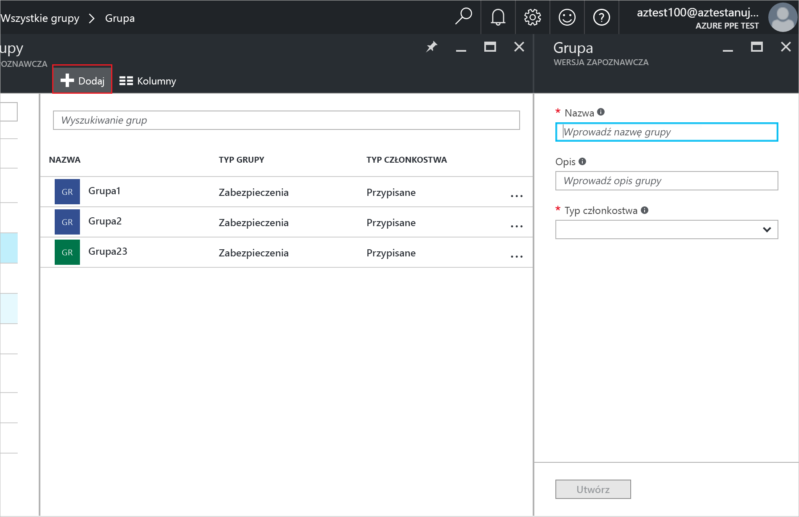
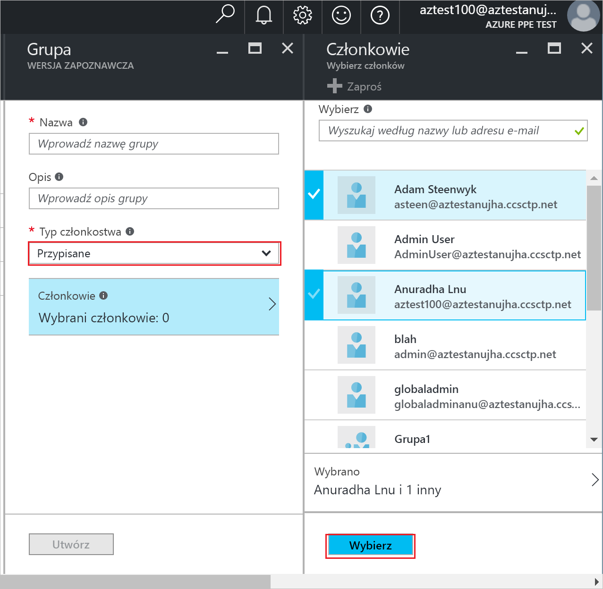
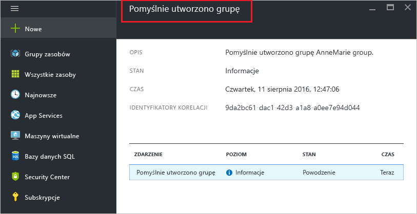

# Utwórz grupy i Dodaj elementy członkowskie w usłudze Azure Active Directory
> [!div class="op_single_selector"]
> * [Azure Portal](active-directory-groups-create-azure-portal.md)
> * [Program PowerShell](../active-directory-accessmanagement-groups-settings-v2-cmdlets.md)

W tym artykule opisano sposób tworzenia i wypełniania nową grupę w usłudze Azure Active Directory. Grupa służy do wykonywania zadań zarządzania, takich jak przypisywanie licencji lub uprawnień do liczby użytkowników lub urządzeń naraz.

## Jak utworzyć grupę?
1. Zaloguj się do [portalu Azure](https://portal.azure.com) przy użyciu konta, które jest administratorem globalnym katalogu.
2. Wybierz **wszystkie usługi**, wprowadź **użytkowników i grup** w polu tekstowym, a następnie wybierz **Enter**.

   
3. Na **użytkowników i grup** bloku, wybierz opcję **wszystkich grup**.

   
4. Na **użytkowników i grup — wszystkie grupy** bloku, wybierz opcję **Dodaj** polecenia.

   
5. Na **grupy** bloku, Dodaj nazwę i opis grupy.
6. Aby wybrać elementy członkowskie, aby dodać do grupy, wybierz **przypisane** w **Typ członkostwa** , a następnie wybierz **członków**. Aby uzyskać więcej informacji o sposobie zarządzania członkostwa w grupie dynamicznie, zobacz [tworzenie zaawansowanych reguł członkostwa w grupie za pomocą atrybutów](../active-directory-groups-dynamic-membership-azure-portal.md).

   
7. Na **członków** bloku, wybierz jeden lub więcej użytkowników lub urządzeń do dodania do grupy, a następnie wybierz **wybierz** przycisk w dolnej części bloku, aby dodać je do grupy. **Użytkownika** okno filtry wyświetlania na podstawie zgodności wpis do dowolnej części nazwy użytkownika lub urządzenia. Nie symbole wieloznaczne są akceptowane w tym polu.
8. Po zakończeniu dodawania członków do grupy, wybierz **Utwórz** na **grupy** bloku.    

   

## Kolejne kroki
Te artykuły zawierają dodatkowe informacje o usłudze Azure Active Directory.

* [Zobacz istniejących grup](active-directory-groups-view-azure-portal.md)
* [Zarządzanie ustawieniami grupy](active-directory-groups-settings-azure-portal.md)
* [Elementy członkowskie grupy zarządzania](active-directory-groups-members-azure-portal.md)
* [Zarządzanie członkostwami grup](active-directory-groups-membership-azure-portal.md)
* [Dynamiczne reguły dla użytkowników w grupie zarządzania](../active-directory-groups-dynamic-membership-azure-portal.md)
