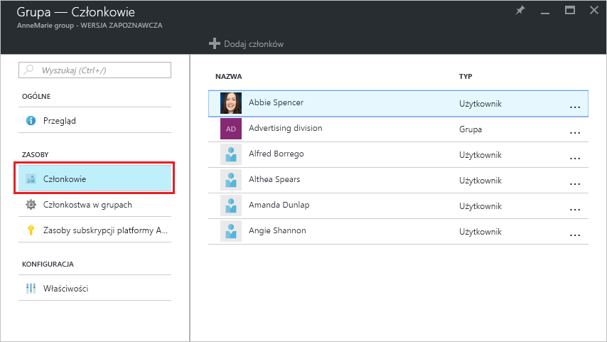
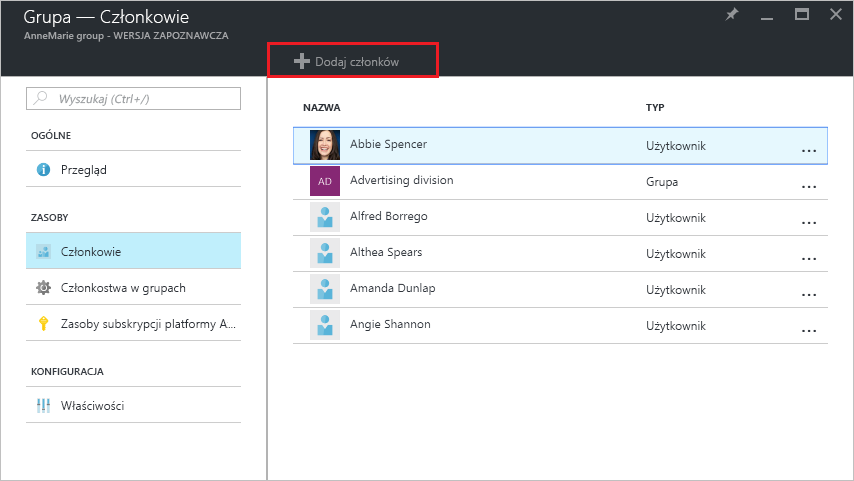
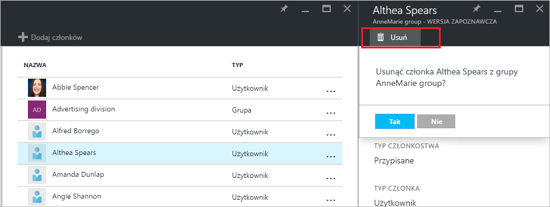

# Zarządzanie członkostwami grup użytkowników w dzierżawie usługi Azure Active Directory
W tym artykule wyjaśniono, jak można zarządzać członkami grupy w usłudze Azure Active Directory (Azure AD).

## Jak znaleźć członków i zarządzać nimi?
1. Zaloguj się do [portalu Azure](https://portal.azure.com) przy użyciu konta, które jest administratorem globalnym katalogu.
2. Wybierz **wszystkie usługi**, wprowadź **użytkowników i grup** w polu tekstowym, a następnie wybierz **Enter**.

   
3. Na **użytkowników i grup** bloku, wybierz opcję **wszystkich grup**.

   
4. Na **użytkowników i grup — wszystkie grupy** bloku, wybierz grupę.
5. Na **grupy - *groupname***  bloku, wybierz opcję **członków**.

   
6. Aby dodać członków do grupy, na **grupy - członków** bloku, wybierz opcję **Dodaj członków**.

   
7. Na **członków** bloku, wybierz jeden lub więcej użytkowników lub urządzeń do dodania do grupy, a następnie wybierz **wybierz** przycisk w dolnej części bloku, aby dodać je do grupy. **Użytkownika** okno filtry wyświetlania na podstawie zgodności wpis do dowolnej części nazwy użytkownika lub urządzenia. Nie symbole wieloznaczne są akceptowane w tym polu.
8. Aby usunąć członków z grupy, na **grupy - członków** bloku, wybierz element członkowski.
9. Na ***membername*** bloku, wybierz opcję **Usuń** polecenie i Potwierdź wybór w wierszu.

   
10. Po zakończeniu zmiana członków grupy, wybierz **zapisać**.

## Dodatkowe informacje
Te artykuły zawierają dodatkowe informacje o usłudze Azure Active Directory.

* [Zobacz istniejących grup](active-directory-groups-view-azure-portal.md)
* [Utwórz nową grupę i dodawanie członków](active-directory-groups-create-azure-portal.md)
* [Zarządzanie ustawieniami grupy](active-directory-groups-settings-azure-portal.md)
* [Zarządzanie członkostwami grup](active-directory-groups-membership-azure-portal.md)
* [Dynamiczne reguły dla użytkowników w grupie zarządzania](../active-directory-groups-dynamic-membership-azure-portal.md)
