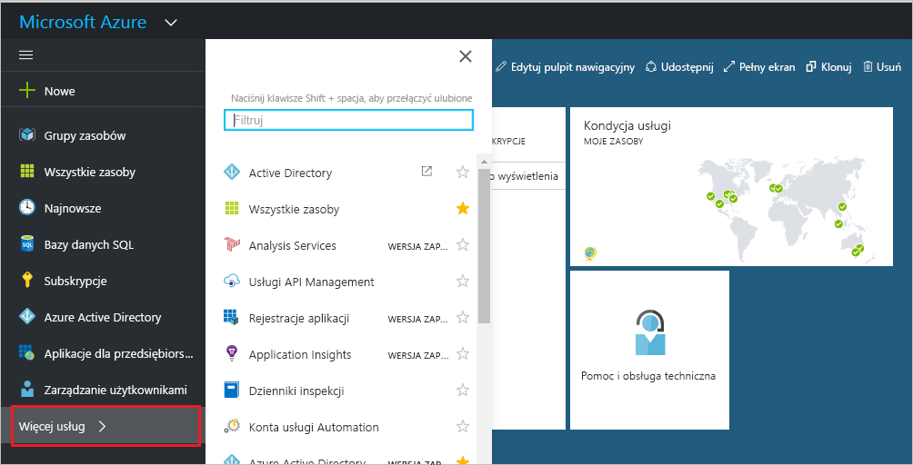
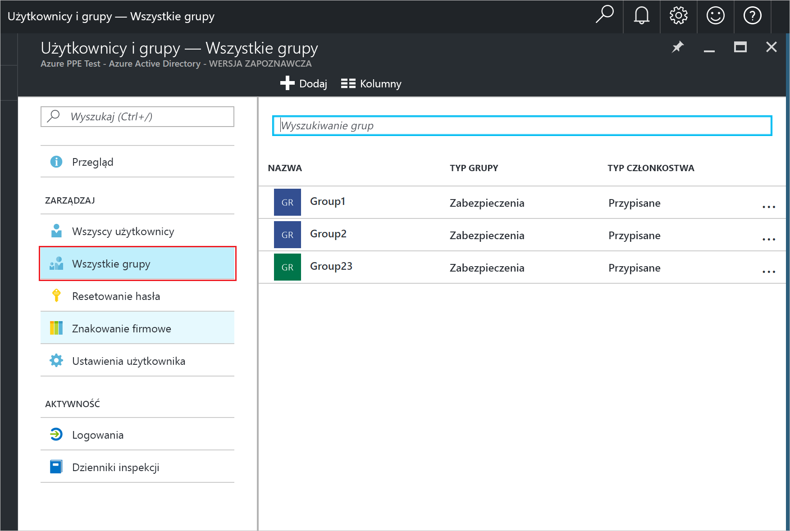
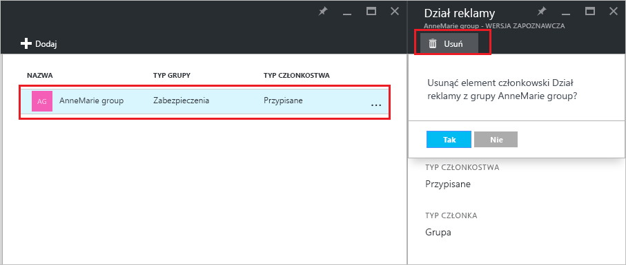

# Zarządzanie grupami, do których grupa należy w dzierżawie usługi Azure Active Directory
Grupy mogą zawierać inne grupy w usłudze Azure Active Directory. Poniżej przedstawiono sposób zarządzania członkostwem w tych grupach.

## Jak znaleźć grupy, których członkiem jest moja grupa?
1. Zaloguj się w [centrum administracyjnym usługi Azure AD](https://aad.portal.azure.com) przy użyciu konta, które jest administratorem globalnym katalogu.
2. Wybierz pozycję **Użytkownicy i grupy**.

   
1. Wybierz pozycję **Wszystkie grupy**.

   
1. Wybierz grupę.
2. Wybierz pozycję **Członkostwo w grupach**.

   
1. Aby dodać grupę jako członek innej grupy, w bloku **Grupa — Członkostwa w grupach** wybierz polecenie **Dodaj**.
2. Wybierz grupę w bloku **Wybierz grupę**, a następnie wybierz przycisk **Wybierz** znajdujący się u dołu bloku. Grupę można dodać tylko do jednej grupy naraz. Pole **Użytkownik** służy do filtrowania wyświetlanych danych na podstawie dopasowania wpisanej wartości do dowolnej części nazwy użytkownika lub urządzenia. W tym polu nie są akceptowane żadne symbole wieloznaczne.

   
8. Aby usunąć grupę jako członek innej grupy, w bloku **Grupa — Członkostwa w grupach** wybierz grupę.
9. Wybierz polecenie **Usuń** i potwierdź wybór po wyświetleniu monitu.

   
10. Po zakończeniu zmiany członkostw w grupach dla danej grupy wybierz pozycję **Zapisz**.

## Dodatkowe informacje
Te artykuły zawierają dodatkowe informacje o usłudze Azure Active Directory.

* [Wyświetlanie istniejących grup](active-directory-groups-view-azure-portal.md)
* [Tworzenie nowej grupy i dodawanie członków](active-directory-groups-create-azure-portal.md)
* [Zarządzanie ustawieniami grupy](active-directory-groups-settings-azure-portal.md)
* [Zarządzanie członkami grupy](active-directory-groups-members-azure-portal.md)
* [Zarządzanie regułami dynamicznymi dla użytkowników w grupie](../users-groups-roles/groups-dynamic-membership.md)
