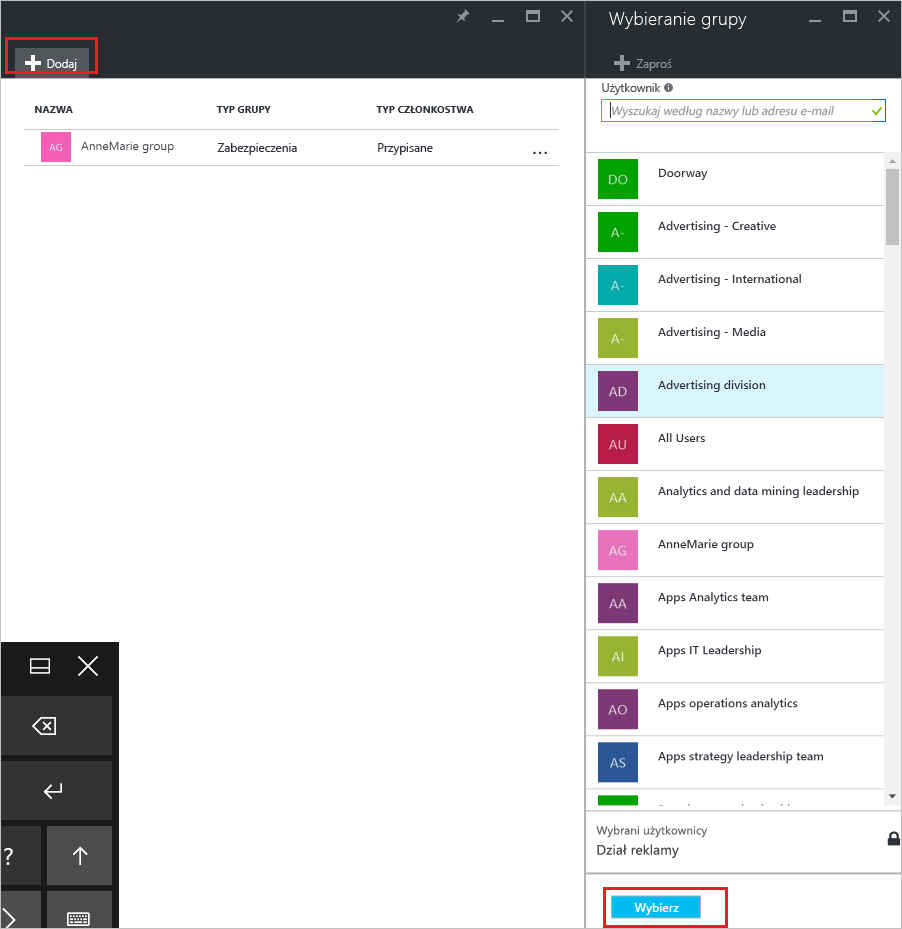
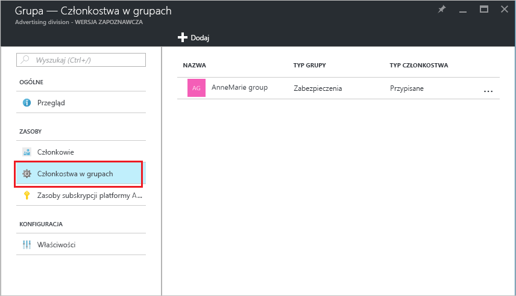

# Porady: Dodawanie lub usuwanie grupy z innej grupy za pomocą usługi Azure Active Directory
Ten artykuł ułatwia dodawanie i usuwanie grupy z innej grupy za pomocą usługi Azure Active Directory.

>[!Note]
>Jeśli próbujesz usunąć grupę nadrzędną, zobacz [jak zaktualizować lub usunąć grupę i jej elementów członkowskich](active-directory-groups-delete-group.md).

## Dodaj grupę jako członek do innej grupy
Możesz dodać istniejącą grupę, do innej grupy istniejących, tworzenie członka grupy (podgrupy) i grupy nadrzędnej. Element członkowski grupy dziedziczy atrybuty i właściwości grupy nadrzędnej, zaoszczędzić czas.

### Aby dodać grupę jako członek do innej grupy

1. Zaloguj się do [witryny Azure portal](https://portal.azure.com) przy użyciu konta administratora globalnego dla katalogu.

2. Wybierz **usługi Azure Active Directory**, a następnie wybierz pozycję **grup**.

3. Na **grupy — wszystkie grupy** strony, wyszukaj i wybierz grupę, która jest w stanie się członkiem innej grupy. Na potrzeby tego ćwiczenia używamy **zasad zarządzania urządzeniami Przenośnymi - Zachodnia** grupy.

    >[!Note]
    >Możesz dodać grupy jako członka do tylko jednej grupy naraz. Ponadto **wybierz grupę** okno filtry wyświetlania, w oparciu o dopasowanie zgłoszenia użytkownika do dowolnej części nazwy użytkownika lub urządzenia. Jednak symbole wieloznaczne nie są obsługiwane.

    

4. Na **członkostwa w grupach - Zachodnia — zasady zarządzania urządzeniami Przenośnymi** wybierz opcję **członkostwa w grupach**, wybierz opcję **Dodaj**, Znajdź grupę Twoja grupa ma być członkiem, a następnie wybierz  **Wybierz**. W tym ćwiczeniu używamy **zasady zarządzania urządzeniami Przenośnymi — wszystkie organizacji** grupy.

    **Zasad zarządzania urządzeniami Przenośnymi - Zachodnia** grupy jest teraz członkiem **zasady zarządzania urządzeniami Przenośnymi — wszystkie organizacji** grupy, dziedziczy wszystkie właściwości i konfiguracji zasad zarządzania urządzeniami Przenośnymi — wszystkie grupy w organizacji.

    

5. Przegląd **członkostwa w grupach - Zachodnia — zasady zarządzania urządzeniami Przenośnymi** strony, aby zobaczyć relację grupy i elementów członkowskich.

    

6. Aby uzyskać bardziej szczegółowy widok relacji grup i elementów członkowskich, wybierz nazwę grupy (**zasady zarządzania urządzeniami Przenośnymi — wszystkie organizacji**) i przyjrzyj się **zasady zarządzania urządzeniami Przenośnymi — zachodnie stany** strony szczegółów.

    

## Usuń grupę elementu członkowskiego z innej grupy
Możesz usunąć istniejącą grupę elementu członkowskiego z innej grupy. Jednak usunięcie członkostwa powoduje również usunięcie wszelkich atrybuty dziedziczone i właściwości dla użytkowników.

### Aby usunąć grupę elementu członkowskiego z innej grupy
1. Na **grupy — wszystkie grupy** strony, wyszukaj i wybierz grupę, która ma zostać usunięta, jest członkiem innej grupy. W tym ćwiczeniu ponownie używamy **zasad zarządzania urządzeniami Przenośnymi - Zachodnia** grupy.

2. Na **zasady zarządzania urządzeniami Przenośnymi — omówienie zachodnie** wybierz opcję **członkostwa w grupach**.

    

3. Wybierz **zasady zarządzania urządzeniami Przenośnymi — wszystkie organizacji** grupy z **członkostwa w grupach - Zachodnia — zasady zarządzania urządzeniami Przenośnymi** strony, a następnie wybierz pozycję **Usuń** z **zasad zarządzania urządzeniami Przenośnymi - Zachodnia** strony szczegółów.

    

## Dodatkowe informacje
Te artykuły zawierają dodatkowe informacje o usłudze Azure Active Directory.

- [Wyświetlanie grup i elementów członkowskich](active-directory-groups-view-azure-portal.md)

- [Utworzenie podstawowej grupy i dodawać członków](active-directory-groups-create-azure-portal.md)

- [Dodawanie lub usuwanie członków z grupy](active-directory-groups-members-azure-portal.md)

- [Edytuj ustawienia grupy](active-directory-groups-settings-azure-portal.md)

- [Przypisywanie licencji do użytkowników według grupy](../users-groups-roles/licensing-groups-assign.md)
