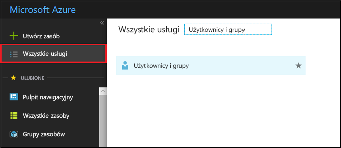
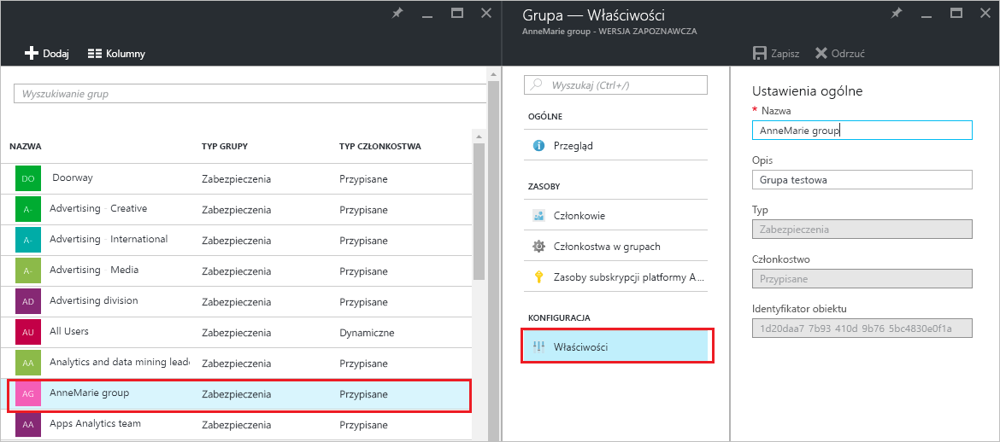
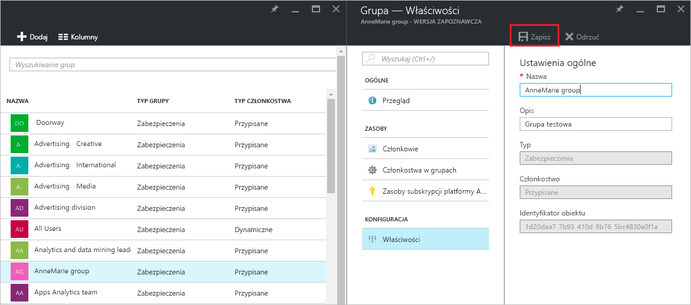

# Zarządzanie ustawieniami dla grupy w usłudze Azure Active Directory
W tym artykule wyjaśniono, jak zmienić ustawienia dla grupy w usłudze Azure Active Directory (Azure AD).

## Jak mogę znaleźć i zmienić ustawienia?
1. Zaloguj się w [centrum administracyjnym usługi Azure AD](https://aad.portal.azure.com) przy użyciu konta, które jest administratorem globalnym katalogu.
2. Wybierz pozycję **Wszystkie usługi**, w polu tekstowym wprowadź filtr **Użytkownicy i grupy**, a następnie naciśnij klawisz **Enter**.

   
3. W bloku **Użytkownicy i grupy** wybierz pozycję **Wszystkie grupy**.

   
4. W bloku **Użytkownicy i grupy — Wszystkie grupy** wybierz grupę.
5. W bloku **Grupa — *nazwa_grupy*** wybierz pozycję **Właściwości**.

   
6. Po zakończeniu modyfikowania właściwości grupy wybierz pozycję **Zapisz**.    

   

## Następne kroki
Te artykuły zawierają dodatkowe informacje o usłudze Azure Active Directory.

* [Wyświetlanie istniejących grup](active-directory-groups-view-azure-portal.md)
* [Tworzenie nowej grupy i dodawanie członków](active-directory-groups-create-azure-portal.md)
* [Zarządzanie członkami grupy](active-directory-groups-members-azure-portal.md)
* [Zarządzanie członkostwem w grupie](active-directory-groups-membership-azure-portal.md)
* [Zarządzanie regułami dynamicznymi dla użytkowników w grupie](../users-groups-roles/groups-dynamic-membership.md)
