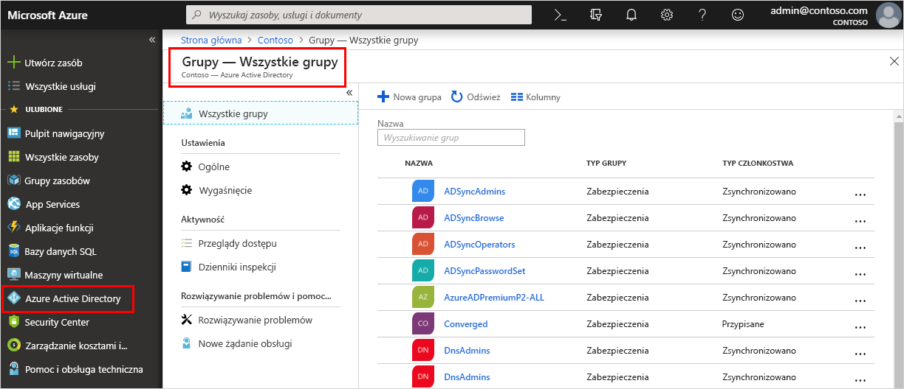

<!--As a brand-new Azure AD administrator, I need to view my organization’s groups along with the assigned members, so I can manage permissions to apps and services for people in my organization-->

# Szybki start: Wyświetlanie grup i członków w usłudze Azure Active Directory w danej organizacji
Przy użyciu witryny Azure Portal możesz wyświetlić istniejące grupy i członków tych grup w Twojej organizacji. Grupy umożliwiają zarządzanie użytkownikami (członkami), którzy potrzebują tego samego poziomu dostępu i uprawnień do aplikacji i usług z potencjalnie ograniczonym dostępem.

W tym przewodniku Szybki start wyświetlisz wszystkie istniejące grupy w organizacji wraz z przypisanymi do nich członkami.

Jeśli nie masz subskrypcji platformy Azure, przed rozpoczęciem utwórz [bezpłatne konto](https://azure.microsoft.com/free/). 

## Wymagania wstępne
Przed rozpoczęciem musisz wykonać następujące czynności:

- Utwórz dzierżawę usługi Azure Active Directory. Aby uzyskać więcej informacji, zobacz [Access the Azure Active Directory portal and create a new tenant (Uzyskiwanie dostępu do portalu usługi Azure Active Directory i tworzenie nowej dzierżawy)](active-directory-access-create-new-tenant.md).

## Logowanie się do witryny Azure Portal
Musisz zalogować się w witrynie [Azure Portal](https://portal.azure.com/) przy użyciu konta administratora globalnego dla katalogu.

## Tworzenie nowej grupy 
Utwórz nową grupę o nazwie _MDM policy - West_. Aby uzyskać więcej informacji na temat tworzenia grupy, zobacz [Jak utworzyć podstawową grupę i dodać członków](active-directory-groups-create-azure-portal.md).

1. Wybierz pozycje **Azure Active Directory** i **Grupy**, a następnie pozycję **Nowa grupa**.

2. Uzupełnij informacje na stronie **Grupa**:
    
    - **Typ grupy:** wybierz pozycję **Zabezpieczenia**.
    
    - **Nazwa grupy:** wpisz tekst _MDM policy - West_
    
    - **Typ członkostwa:** wybierz pozycję **Przypisane**.

3. Wybierz pozycję **Utwórz**.

## Tworzenie konta nowego użytkownika
Utwórz konto nowego użytkownika, który nazywa się _Alain Charon_. Użytkownik musi mieć konto, aby można było dodać go jako członka grupy. Aby uzyskać więcej informacji na temat tworzenia konta nowego użytkownika, zobacz [How to add or delete users (Jak dodawać i usuwać konta użytkowników)](add-users-azure-active-directory.md).

1. Wybierz pozycje **Azure Active Directory** i **Użytkownicy**, a następnie pozycję **Nowy użytkownik**.

2. Uzupełnij informacje na stronie **Użytkownik**:

    - **Nazwa:** wpisz tekst _Alain Charon_.

    - **Nazwa użytkownika:** Wpisz *Alain\@contoso.com*.

3. Skopiuj hasło automatycznie wygenerowane w polu **Hasło**, a następnie wybierz pozycję **Utwórz**.

## Dodawanie członka grupy
Gdy masz już grupę i konto użytkownika, możesz dodać użytkownika _Alain Charon_ jako członka grupy _MDM policy - West_. Aby uzyskać więcej informacji na temat dodawania członków do grupy, zobacz [How to add or remove group members (Jak dodawać i usuwać członków grupy)](active-directory-groups-members-azure-portal.md).

1. Wybierz pozycję **Azure Active Directory** > **Grupy**.

2. Na stronie **Grupy — Wszystkie grupy** wyszukaj grupę **MDM policy - West** i wybierz ją.

3. Na stronie przeglądu grupy **MDM policy - West** wybierz pozycję **Członkowie** w obszarze **Zarządzanie**.

4. Wybierz pozycję **Dodaj członków**, a następnie wyszukaj użytkownika **Alain Charon** i wybierz go.

5. Wybierz pozycję **Wybierz**.

## Wyświetlanie wszystkich grup
Na stronie **Grupy — Wszystkie grupy** w witrynie Azure Portal są widoczne wszystkie grupy w organizacji.

- Wybierz pozycję **Azure Active Directory** > **Grupy**.

    Zostanie wyświetlona strona **Grupy — Wszystkie grupy** zawierająca wszystkie aktywne grupy.

    

## Wyszukiwanie grupy
Możesz przeszukać stronę **Grupy — Wszystkie grupy**, aby znaleźć grupę **MDM policy – West**.

1. Na stronie **Grupy — Wszystkie grupy** wpisz tekst _MDM_ w polu **Wyszukaj**.

    Pod polem **Wyszukaj** pojawią się wyniki wyszukiwania, wśród których znajduje się grupa _MDM policy - West_.

    

3. Wybierz grupę **MDM policy – West**.

4. Strona przeglądu grupy **MDM policy - West** zawiera informacje o niej, w tym liczbę jej członków.

    

## Wyświetlanie członków grupy
Teraz możesz wyświetlić członków przypisanych do znalezionej grupy.

- Po wybraniu pozycji **Członkowie** w obszarze **Zarządzanie** możesz przejrzeć pełną listę nazwisk członków przypisanych do tej konkretnej grupy, która zawiera m.in. użytkownika _Alain Charon_.

    

## Oczyszczanie zasobów
Ta grupa jest używana w kilku procedurach zawartych w **przewodnikach z instrukcjami** w tej dokumentacji. Jeśli jednak nie chcesz używać tej grupy, możesz ją usunąć wraz z przypisanymi członkami, wykonując następujące czynności:

1. Na stronie **Grupy — Wszystkie grupy** znajdź grupę **MDM policy – West**.

2.  Wybierz grupę **MDM policy – West**.

    Zostanie wyświetlona strona przeglądu grupy **MDM policy – West**.

3. Wybierz pozycję **Usuń**.

    Spowoduje to usunięcie grupy wraz ze skojarzonymi z nią członkami.

    

    >[!Important]
    >Wykonanie tej czynności nie powoduje usunięcia konta użytkownika Alain Charon, a tylko jego członkostwa w usuwanej grupie.

## Kolejne kroki
W następnym artykule dowiesz się, jak skojarzyć subskrypcję z katalogiem usługi Azure AD.

> [!div class="nextstepaction"]
> [Kojarzenie subskrypcji platformy Azure](active-directory-how-subscriptions-associated-directory.md)
