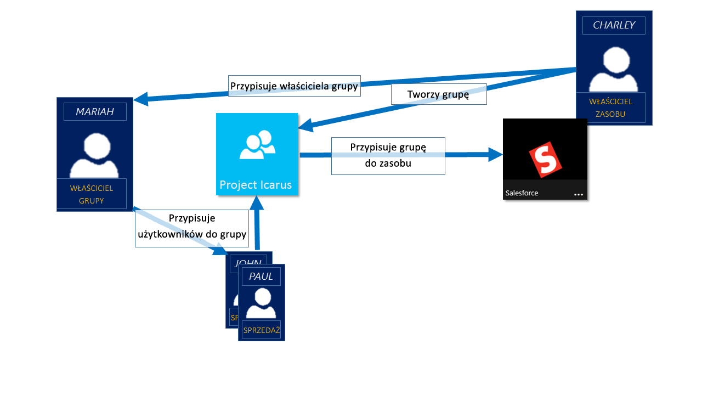
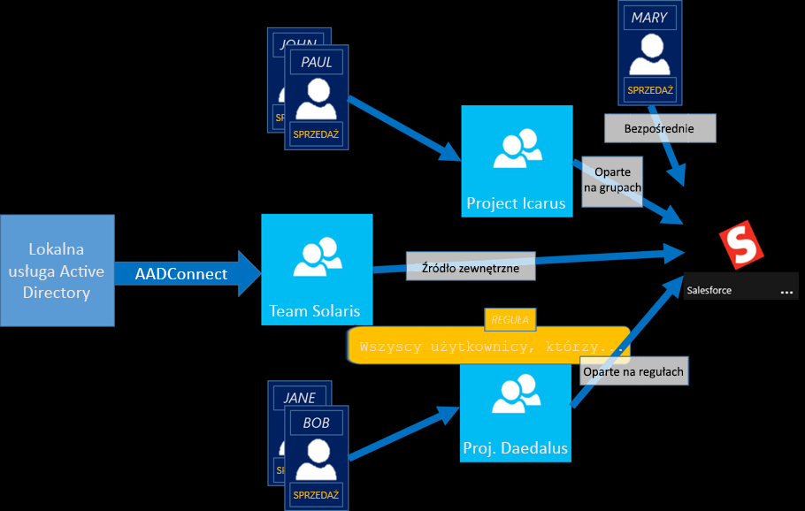

# Zarządzanie dostępem do aplikacji i zasobów przy użyciu grup usługi Azure Active Directory
Azure Active Directory (Azure AD) umożliwia używanie grup do zarządzania dostępem do aplikacji w chmurze, aplikacji lokalnych i zasobów. Twoje zasoby mogą być częścią organizacji usługi Azure AD, np. uprawnieniami do zarządzania obiektami za pomocą ról w usłudze Azure AD lub spoza organizacji, na przykład w przypadku aplikacji oprogramowania jako usługi (SaaS), usług platformy Azure, witryn programu SharePoint i zasobów lokalnych.

>[!NOTE]
>Aby korzystać z usługi Azure Active Directory, potrzebne jest konto platformy Azure. Jeśli nie masz konta, możesz [utworzyć bezpłatne konto platformy Azure](https://azure.microsoft.com/free/).
>
> W Azure Portal można zobaczyć niektóre grupy, których szczegóły członkostwa i grupy nie są zarządzane w portalu:
>
> - Grupy synchronizowane z lokalnym Active Directory mogą być zarządzane tylko w Active Directory lokalnym.
> - Inne typy grup, takie jak listy dystrybucyjne i grupy zabezpieczeń z włączoną obsługą poczty, są zarządzane tylko w centrum administracyjnym programu Exchange lub w centrum administracyjnym Microsoft 365. Aby zarządzać tymi grupami, musisz zalogować się w centrum administracyjnym programu Exchange lub Microsoft 365 centrum administracyjnym.

## Jak działa zarządzanie dostępem w usłudze Azure AD

Azure AD pomaga w zapewnieniu dostępu do zasobów organizacji, zapewniając praw dostępu do jednego użytkownika lub dla całej usługi Azure AD grupy. Przy użyciu grup umożliwia zasobu właściciela (lub właściciela katalogu usługi Azure AD), przypisać zestaw uprawnień dostępu do wszystkich członków tej grupy, nie trzeba podać praw pojedynczo. Właściciel zasobu lub katalogu można również przyznać uprawnienia do zarządzania dla listy elementów członkowskich do kogoś innego, takiego jak Menedżer działu lub administrator pomocy technicznej, umożliwiając mu Dodawanie i usuwanie elementów członkowskich, zgodnie z potrzebami. Aby uzyskać więcej informacji na temat zarządzenie właścicielami grup, zobacz [zarządzenie właścicielami grup](active-directory-accessmanagement-managing-group-owners.md)

## Sposoby przypisywania praw dostępu

Istnieją cztery sposoby przypisywania zasobów prawa dostępu dla użytkowników:

- **Bezpośrednie przypisania.** Właściciel zasobu przypisuje bezpośrednio do użytkownika do zasobu.

- **Przypisania grupy.** Właściciel zasobu przypisuje grupę usługi Azure AD do zasobu, który automatycznie zapewnia wszystkie dostępu członkom grupy zasobów. Członkostwo w grupie jest zarządzane zarówno przez właściciela grupy i właściciela zasobu, umożliwiając właściciel, albo dodać lub usunąć członków z grupy. Aby uzyskać więcej informacji na temat dodawania lub usuwania członkostwa w grupie zobacz [porady: Dodawanie lub usuwanie grupy z innej grupy przy użyciu portalu Azure Active Directory](active-directory-groups-membership-azure-portal.md). 

- **Przypisanie oparte na regułach.** Właściciel zasobu tworzy grupę i używa regułę w celu zdefiniowania, czyli użytkownicy przypisani do określonego zasobu. Reguła opiera się na atrybuty, które są przypisane do poszczególnych użytkowników. Właściciel zasobu zarządza reguły, określania atrybutów i wartości, które są wymagane, aby zezwolić na dostęp do zasobu. Aby uzyskać więcej informacji, zobacz [utworzyć grupę dynamiczną i sprawdzić stan](../users-groups-roles/groups-create-rule.md).

    Możesz też obejrzeć ten krótki film wideo, szybkie informacje na temat tworzenia i używania grup dynamicznych:

    >[!VIDEO https://channel9.msdn.com/Series/Azure-Active-Directory-Videos-Demos/Azure-AD--Introduction-to-Dynamic-Memberships-for-Groups/player]

- **Przypisanie zewnętrznego urzędu.** Dostępu pochodzi z zewnętrznego źródła, takich jak katalogu lokalnego lub aplikacji SaaS. W takiej sytuacji właściciel zasobu przypisuje grupę do przydzielenia dostępu do zasobu, i następnie źródła zewnętrznego zarządza członków grupy.

   

## Użytkownicy dołączyć do grup bez przypisania?
Właściciel grupy, można pozwolić użytkownikom znajdowanie własne grupy, aby dołączyć, zamiast przypisywać je. Właściciel również skonfigurować grupy Automatyczne akceptowanie wszystkich użytkowników, którzy join lub wymagają zatwierdzenia.

Po użytkownik zażąda dołączenia do grupy, żądanie jest przekazywane do właściciela grupy. Jeśli jest to wymagane, właściciel może zatwierdzić żądanie, a użytkownik jest powiadamiany o członkostwo w grupie. Jednak jeśli masz wielu właścicielom, a jeden z nich nie uwzględni, użytkownik zostanie powiadomiony, ale nie została dodana do grupy. Aby uzyskać więcej informacji oraz instrukcje na temat umożliwić użytkownikom żądanie dołączenia do grup, zobacz [Konfigurowanie usługi Azure AD, dzięki czemu użytkownicy mogą żądać dołączenia do grup](../users-groups-roles/groups-self-service-management.md)

## Następne kroki
Teraz, gdy masz znacznej liczby wprowadzenie do zarządzania dostępem przy użyciu grup, możesz rozpocząć zarządzanie zasobami i aplikacji.

- [Utwórz nową grupę za pomocą usługi Azure Active Directory](active-directory-groups-create-azure-portal.md) lub [tworzenie i zarządzanie nimi nową grupę za pomocą poleceń cmdlet programu PowerShell](../users-groups-roles/groups-settings-v2-cmdlets.md)

- [Używanie grup do udzielania dostępu do zintegrowanych aplikacji SaaS](../users-groups-roles/groups-saasapps.md)

- [Synchronizuj grupy lokalnej na platformę Azure za pomocą usługi Azure AD Connect](../hybrid/whatis-hybrid-identity.md)
