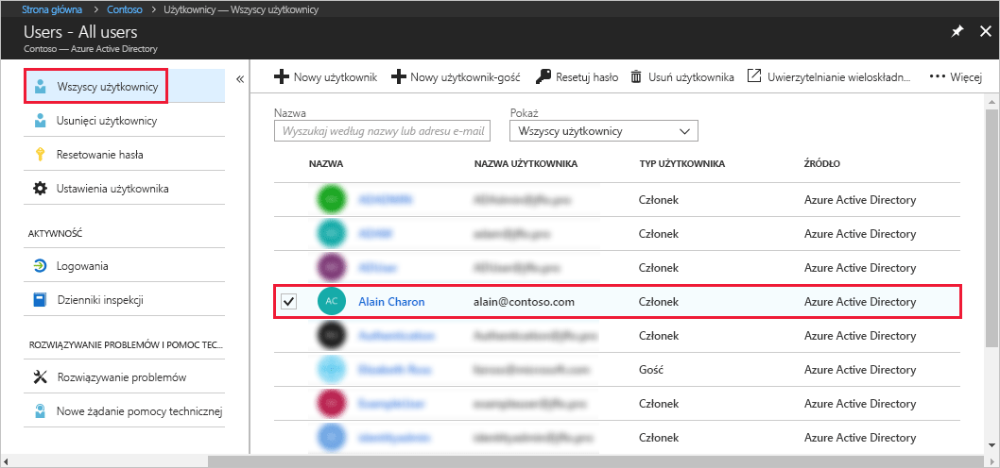
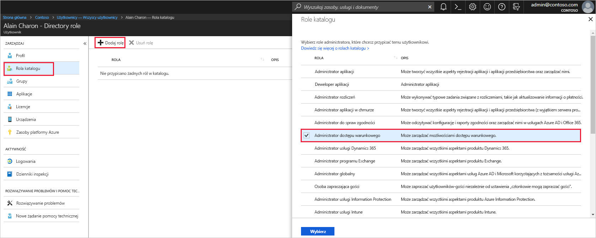

# Przypisywanie użytkownika do ról administratorów w usłudze Azure Active Directory
W tym artykule wyjaśniono, jak przypisać użytkownikowi rolę administracyjną w usłudze Azure Active Directory (Azure AD). Aby uzyskać informacje dotyczące dodawania nowych użytkowników w organizacji, zobacz [Dodawanie nowych użytkowników do usługi Azure Active Directory](../add-users-azure-active-directory.md). Dodani użytkownicy domyślnie nie mają uprawnień administratora, ale możesz przypisać im role w dowolnym momencie.

## Przypisywanie użytkownikowi roli
1. Zaloguj się w witrynie [Azure Portal](https://portal.azure.com) przy użyciu konta, które jest administratorem globalnym lub administratorem ról uprzywilejowanych dla katalogu.

2. Wybierz usługę **Azure Active Directory**, wybierz pozycję **Użytkownicy**, a następnie wybierz z listy określonego użytkownika.

    

3. Dla wybranego użytkownika wybierz pozycję **Role katalogu**, wybierz polecenie **Dodaj rolę**, a następnie wybierz odpowiednie role administratora z listy **Role katalogu**, na przykład **Administrator dostępu warunkowego**. Aby uzyskać więcej informacji o rolach administratorów, zobacz [Przypisywanie ról administratorów w usłudze Azure AD](../users-groups-roles/directory-assign-admin-roles.md). 

    

1. Naciśnij pozycję **Wybierz**, aby zapisać.

## Następne kroki
* [Szybki start: dodawanie i usuwanie użytkowników w usłudze Azure Active Directory](add-users-azure-active-directory.md)
* [Zarządzanie profilami użytkowników](active-directory-users-profile-azure-portal.md)
* [Dodawanie użytkowników-gości z innego katalogu](../b2b/what-is-b2b.md) 
* [Przypisywanie użytkownika do roli w usłudze Azure AD](active-directory-users-assign-role-azure-portal.md)
* [Przywracanie usuniętego użytkownika](active-directory-users-restore.md)
