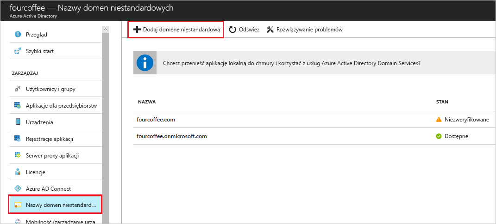

# Dodawanie niestandardowej nazwy domeny przy użyciu portalu usługi Azure Active Directory

Każda nowa dzierżawa usługi Azure AD ma początkową nazwę domeny, * \<nazwę domeny>.onmicrosoft.com.* Nie można zmienić ani usunąć początkowej nazwy domeny, ale można dodać nazwy organizacji. Dodanie niestandardowych nazw domen ułatwia tworzenie nazw użytkowników znanych użytkownikom, takich jak *alain\@contoso.com*.

## Przed rozpoczęciem

Aby dodać niestandardową nazwę domeny, utwórz nazwę domeny u rejestratora domen. Zobacz też: Rejestratorzy akredytowani w domenie [icann.](https://www.icann.org/registrar-reports/accredited-list.html)

## Tworzenie katalogu w usłudze Azure AD

Po otrzymasz nazwę domeny, można utworzyć pierwszy katalog usługi Azure AD. Zaloguj się do witryny Azure portal dla swojego katalogu, przy użyciu konta z roli **właściciela** dla subskrypcji.

Utwórz nowy katalog, wykonując czynności opisane w [aplikacji Utwórz nową dzierżawę dla organizacji](active-directory-access-create-new-tenant.md#create-a-new-tenant-for-your-organization).

>[!IMPORTANT]
>Osoba, która tworzy dzierżawę jest automatycznie administratorem globalnym dla tej dzierżawy. Administrator globalny może dodać dodatkowych administratorów do dzierżawy.

Aby uzyskać więcej informacji na temat ról subskrypcji, zobacz [Role usługi Azure RBAC](../../role-based-access-control/rbac-and-directory-admin-roles.md#azure-rbac-roles).

>[!TIP]
> Jeśli planujesz połączyć lokalne usługi Windows Server AD z usługą Azure AD, musisz wybrać **opcję Planuję skonfigurować tę domenę do logowania jednokrotnego za pomocą lokalnej usługi Active Directory** po uruchomieniu narzędzia Azure AD Connect w celu zsynchronizowania katalogów.
>
> Należy również zarejestrować tę samą nazwę domeny, która została wybrana do sfederowania z katalogiem lokalnym w kroku **Domena usługi Azure AD** w kreatorze. Aby zobaczyć, jak wygląda ta konfiguracja, zobacz [Sprawdzanie domeny usługi Azure AD wybranej dla federacji](../hybrid/how-to-connect-install-custom.md#verify-the-azure-ad-domain-selected-for-federation). Jeśli nie masz narzędzia Azure AD Connect, możesz [go pobrać tutaj](https://go.microsoft.com/fwlink/?LinkId=615771).

## Dodawanie niestandardowej nazwy domeny do usługi Azure AD

Po utworzeniu katalogu można dodać niestandardową nazwę domeny.

1. Zaloguj się w witrynie [Azure Portal](https://portal.azure.com/) przy użyciu konta administratora globalnego dla katalogu.

1. Wyszukaj i wybierz *usługę Azure Active Directory* z dowolnej strony. Następnie wybierz pozycję **Niestandardowe nazwy** > domen**Dodaj domenę niestandardową**.

    

1. W **obszarze Niestandardowa nazwa domeny**wprowadź nową nazwę organizacji w tym przykładzie *contoso.com*. Wybierz opcję **Add domain** (Dodaj domenę).

    

    >[!IMPORTANT]
    >Aby to działało poprawnie, należy dołączyć *plik .com*, *.net*lub inne rozszerzenie najwyższego poziomu.

    Dodawana jest niezweryfikowana domena. Zostanie **wyświetlona strona contoso.com** z informacjami DNS. Zapisz te informacje. Należy go później utworzyć rekord TXT do skonfigurowania dns.

    

## Dodawanie informacji DNS do rejestratora domen

Po dodaniu niestandardowej nazwy domeny do usługi Azure AD należy powrócić do rejestratora domen i dodać informacje o usługach Azure AD DNS z skopiowanego pliku TXT. Utworzenie tego rekordu TXT dla domeny weryfikuje własność nazwy domeny.

Wróć do rejestratora domen i utwórz nowy rekord TXT dla domeny na podstawie skopiowanych informacji DNS. Ustaw czas na żywo (TTL) na 3600 sekund (60 minut), a następnie zapisz rekord.

>[!IMPORTANT]
>Możesz zarejestrować dowolną liczbę nazw domen. Jednak każda domena pobiera swój własny rekord TXT z usługi Azure AD. Należy zachować ostrożność podczas wprowadzania informacji o pliku TXT u rejestratora domen. Jeśli przez pomyłkę wprowadzisz nieprawidłowe lub zduplikowane informacje, musisz poczekać, aż czas wygaśnięcia (60 minut) zostanie przekroczył (60 minut), zanim będzie można spróbować ponownie.

## Weryfikowanie niestandardowej nazwy domeny

Po zarejestrowaniu niestandardowej nazwy domeny upewnij się, że jest prawidłowa w usłudze Azure AD. Propagacja z rejestratora domeny do usługi Azure AD może być natychmiastowa lub może potrwać kilka dni, w zależności od rejestratora domeny.

Aby zweryfikować niestandardową nazwę domeny, wykonaj następujące czynności:

1. Zaloguj się w witrynie [Azure Portal](https://portal.azure.com/) przy użyciu konta administratora globalnego dla katalogu.

1. Wyszukaj i wybierz *usługę Azure Active Directory* z dowolnej strony, a następnie wybierz **pozycję Niestandardowe nazwy domen**.

1. W **obszarze Niestandardowe nazwy domen**wybierz niestandardową nazwę domeny. W tym przykładzie wybierz **contoso.com**.

    

1. Na stronie **contoso.com** wybierz pozycję **Sprawdź,** aby upewnić się, że domena niestandardowa jest poprawnie zarejestrowana i jest prawidłowa dla usługi Azure AD.

    

Po zweryfikowaniu niestandardowej nazwy domeny możesz usunąć weryfikacyjny plik TXT lub MX.

## Typowe problemy z weryfikacją

Jeśli usługa Azure AD nie może zweryfikować niestandardowej nazwy domeny, wypróbuj następujące sugestie:

- **Odczekaj co najmniej godzinę i spróbuj ponownie**. Rekordy DNS muszą zostać poddane propagacji, aby usługa Azure AD mogła zweryfikować domenę. Ten proces może potrwać godzinę lub dłużej.

- **Upewnij się, że rekord DNS jest poprawny.** Wróć do witryny rejestratora nazw domen. Upewnij się, że wpis jest tam i że jest zgodny z informacjami o wpisie DNS dostarczonymi przez usługę Azure AD.

  Jeśli nie możesz zaktualizować rekordu w witrynie rejestratora, udostępnij go osobie, która ma uprawnienia do dodania wpisu i sprawdzenia jego poprawności.

- **Upewnij się, że nazwa domeny nie jest jeszcze używana w innym katalogu.** Nazwę domeny można zweryfikować tylko w jednym katalogu. Jeśli nazwa domeny jest obecnie weryfikowana w innym katalogu, nie można jej również zweryfikować w nowym katalogu. Aby rozwiązać ten problem z powielaniem, należy usunąć nazwę domeny ze starego katalogu. Aby uzyskać więcej informacji na temat usuwania nazw domen, zobacz [Zarządzanie niestandardowymi nazwami domen](../users-groups-roles/domains-manage.md).

- **Upewnij się, że nie masz żadnych niezarządzanych dzierżawy usługi Power BI.** Jeśli użytkownicy aktywowali usługę Power BI za pośrednictwem samoobsługowej rejestracji i utworzyli niezarządzaną dzierżawę dla organizacji, musisz przejąć zarządzanie jako administrator wewnętrzny lub zewnętrzny przy użyciu programu PowerShell. Aby uzyskać więcej informacji, zobacz temat [Take over an unmanaged directory as administrator in Azure Active Directory](../users-groups-roles/domains-admin-takeover.md) (Przejmowanie niezarządzanego katalogu jako administrator w usłudze Azure Active Directory).

## Następne kroki

- Dodaj innego administratora globalnego do katalogu. Aby uzyskać więcej informacji, zobacz [Jak przypisać role i administratorów](active-directory-users-assign-role-azure-portal.md).

- Dodaj użytkowników do swojej domeny. Aby uzyskać więcej informacji, zobacz [Jak dodawać lub usuwać użytkowników](add-users-azure-active-directory.md).

- Zarządzaj informacjami o nazwie domeny w usłudze Azure AD. Aby uzyskać więcej informacji, zobacz [Zarządzanie niestandardowymi nazwami domen](../users-groups-roles/domains-manage.md).

- Jeśli masz lokalne wersje systemu Windows Server, których chcesz używać obok usługi Azure Active Directory, zobacz [Integrowanie katalogów lokalnych z usługą Azure Active Directory](../connect/active-directory-aadconnect.md).
