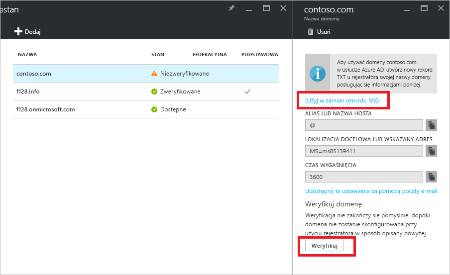

# Szybki start: dodawanie niestandardowej nazwy domeny do usługi Azure Active Directory

Każdy katalog usługi Azure AD jest dostarczany z początkową nazwą domeny w postaci *nazwa_domeny*.onmicrosoft.com. Początkowej nazwy domeny nie można zmienić ani usunąć, ale można dodać również nazwę domeny firmowej do usługi Azure AD. Na przykład Twoja organizacja ma prawdopodobnie inne nazwy domen używane do prowadzenia działalności oraz użytkowników logujących się przy użyciu nazwy domeny firmowej. Dzięki dodaniu niestandardowych nazw domen do usługi Azure AD można przypisać w katalogu nazwy użytkowników znane użytkownikom, takie jak „alice@contoso.com” zamiast „alice@*nazwa_domeny*.onmicrosoft.com”. Proces jest prosty:

1. Dodawanie niestandardowej nazwy domeny do katalogu
2. Dodawanie wpisu DNS dla nazwy domeny w rejestratorze nazw domen
3. Weryfikowanie niestandardowej nazwy domeny w usłudze Azure AD

## Dodawanie niestandardowej nazwy domeny do katalogu
1. Zaloguj się do witryny [Azure Portal](https://aad.portal.azure.com/#blade/Microsoft_AAD_IAM/ActiveDirectoryMenuBlade/Overview) przy użyciu konta, które jest administratorem globalnym katalogu.
2. Po lewej stronie wybierz pozycję **Nazwy domen niestandardowych**.
3. Wybierz pozycję **Dodaj domenę niestandardową**.
   
   
5. W obszarze **Nazwy domen niestandardowych** wprowadź w polu nazwę domeny niestandardowej, na przykład „contoso.com”, a następnie wybierz pozycję **Dodaj domenę**. Należy uwzględnić rozszerzenie .com, .net lub inne rozszerzenie najwyższego poziomu.
6. W bloku ***nazwa_domeny*** (oznacza to, że tytułem jest nowa nazwa domeny) zbierz informacje o wpisie DNS, które będą używane później do zweryfikowania niestandardowej nazwy domeny w usłudze Azure AD.
   
   

> [!TIP]
> Jeśli zamierzasz sfederować lokalną usługę AD systemu Windows Server z usługą Azure AD, zaznacz pole wyboru **Planuję skonfigurować tę domenę do logowania jednokrotnego przy użyciu lokalnej usługi Active Directory** podczas uruchamiania narzędzia Azure AD Connect, aby zsynchronizować katalogi. Należy również zarejestrować tę samą nazwę domeny, która została wybrana do sfederowania z katalogiem lokalnym w kroku **Domena usługi Azure AD** w kreatorze. Wygląd tego kroku w Kreatorze można zobaczyć w [tych instrukcjach](./../connect/active-directory-aadconnect-get-started-custom.md#verify-the-azure-ad-domain-selected-for-federation). Jeśli nie masz narzędzia Azure AD Connect, możesz [pobrać jej tutaj](http://go.microsoft.com/fwlink/?LinkId=615771).

## Dodawanie wpisu DNS dla nazwy domeny w rejestratorze nazw domen
Następnym krokiem do korzystania z niestandardowej nazwy domeny w usłudze Azure AD jest zaktualizowanie pliku strefy DNS dla domeny. Umożliwi to usłudze Azure AD sprawdzenie, czy organizacja jest właścicielem niestandardowej nazwy domeny. Możesz użyć usługi [Azure DNS](https://docs.microsoft.com/azure/dns/dns-getstarted-portal) dla rekordów DNS platformy Azure/usługi Office 365/zewnętrznych na platformie Azure lub dodać wpis DNS u [innego rejestratora DNS](https://support.office.com/article/Create-DNS-records-for-Office-365-when-you-manage-your-DNS-records-b0f3fdca-8a80-4e8e-9ef3-61e8a2a9ab23/).

1. Zaloguj się do rejestratora nazw domen dla domeny. Jeśli nie masz dostępu potrzebnego do zaktualizowania wpisu DNS, poproś osobę lub zespół, którzy mają odpowiedni dostęp, o wykonanie kroku 2 i powiadomienie Cię o jego zakończeniu.
2. Zaktualizuj plik strefy DNS dla domeny, dodając wpis DNS udostępniony przez usługę Azure AD. Ten wpis DNS nie zmienia żadnych zachowań, takich jak routing poczty lub hosting sieci Web.

## Weryfikowanie niestandardowej nazwy domeny w usłudze Azure AD
Po dodaniu wpisu DNS można przystąpić do weryfikowania nazwy domeny w usłudze Azure AD. Nazwę domeny można zweryfikować tylko po wykonaniu propagacji rekordów DNS. Propagacja często zajmuje tylko kilka sekund, ale czasami może potrwać godzinę lub dłużej. Jeśli weryfikacja nie zadziała za pierwszym razem, spróbuj ponownie później.

1. Zaloguj się w [usłudze Azure AD](https://aad.portal.azure.com/#blade/Microsoft_AAD_IAM/ActiveDirectoryMenuBlade/Overview) przy użyciu konta, które jest administratorem globalnym dzierżawy.
2. Wybierz pozycję **Niestandardowe nazwy domen**.
3. Wybierz niezweryfikowaną nazwę domeny, którą chcesz zweryfikować.
4. Sprawdź wpisy, a następnie kliknij przycisk **Weryfikuj**, aby ukończyć weryfikację.

Teraz możesz [przypisać nazwy użytkowników, które zawierają niestandardową nazwę domeny](../users-groups-roles/domains-manage.md). Przy użyciu niestandardowej nazwy domeny możesz utworzyć konta użytkowników w chmurze lub zaktualizować wcześniej zsynchronizowane informacje o lokalnych kontach użytkowników. Możesz również zmienić informacje o sufiksie domeny zsynchronizowanego konta użytkownika przy użyciu programu [Microsoft PowerShell](https://msdn.microsoft.com/library/azure/e1ef403f-3347-4409-8f46-d72dafa116e0#BKMK_ManageDomains) lub [interfejsu API programu Graph](https://msdn.microsoft.com/Library/Azure/Ad/Graph/api/domains-operations).

> [!TIP]
> Możesz dodać maksymalnie 900 nazw domen zarządzanych. Jeśli konfigurujesz wszystkie domeny federacyjnej w celu federacji lokalnej z usługą Active Directory, możesz dodać maksymalnie 450 nazw domeny w każdym katalogu. Aby uzyskać więcej informacji, zobacz [Nazwy domen federacyjnych i zarządzanych](https://docs.microsoft.com/azure/active-directory/active-directory-add-domain-concepts#federated-and-managed-domain-names).

## Rozwiązywanie problemów
Jeśli nie można zweryfikować niestandardowej nazwy domeny, spróbuj wykonać następujące kroki rozwiązywania problemów:

1. **Zaczekaj godzinę**. Rekordy DNS muszą zostać poddane propagacji, aby usługa Azure AD mogła zweryfikować domenę. Ten proces może potrwać godzinę lub dłużej.
2. **Upewnij się, że wprowadzono rekord DNS i że jest on poprawny**. Ten krok należy wykonać w witrynie sieci Web u rejestratora nazw domen dla domeny. Usługa Azure AD nie może zweryfikować nazwy domeny, jeżeli: 
  * Wpis DNS nie istnieje w pliku strefy DNS.
  * Nie jest on identyczny z wpisem DNS dostarczonym przez usługę Azure AD. 
  
  Jeśli nie masz dostępu do aktualizowania rekordów DNS domeny w rejestrze nazw domen, udostępnij wpis DNS osobie lub zespołowi w organizacji, którzy mają taki dostęp, i poproś o dodanie wpisu DNS.
3. **Usuń nazwę domeny z innego katalogu w usłudze Azure AD**. Nazwę domeny można weryfikować tylko w jednym katalogu. Jeśli nazwa domeny jest obecnie weryfikowana w innym katalogu, nie można jej zweryfikować w nowym katalogu, dopóki nie zostanie usunięta w poprzednim. Aby dowiedzieć się więcej na temat usuwania nazw domen, przeczytaj artykuł [Zarządzanie niestandardowymi nazwami domen](../users-groups-roles/domains-manage.md).    

Dla każdej dodawanej nazwy domeny wykonaj kroki opisane w tym artykule.

## Dowiedz się więcej
[Omówienie pojęć dotyczących niestandardowych nazw domen w usłudze Azure AD](../users-groups-roles/domains-manage.md)

[Zarządzanie niestandardowymi nazwami domen](../users-groups-roles/domains-manage.md)

## Następne kroki
W tym przewodniku Szybki start opisano sposób dodawania domeny niestandardowej do usługi Azure AD. 

Możesz użyć poniższego linku, aby dodać nową domenę niestandardową w usłudze Azure AD za pomocą witryny Azure Portal.

> [!div class="nextstepaction"]
> [Dodawanie domeny niestandardowej](https://aad.portal.azure.com/#blade/Microsoft_AAD_IAM/ActiveDirectoryMenuBlade/QuickStart) 