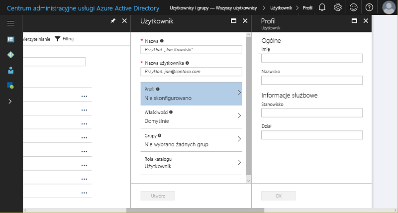
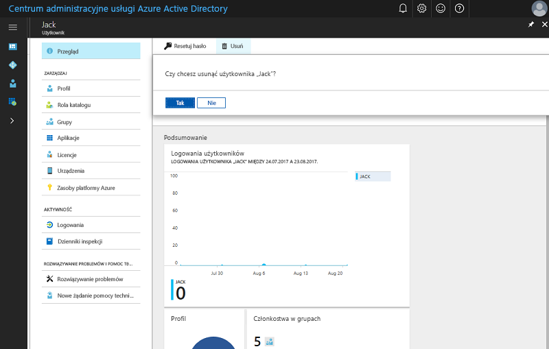

# Szybki start: dodawanie nowych użytkowników w usłudze Azure Active Directory
W tym artykule wyjaśniono, jak usunąć lub dodać użytkowników w organizacji do dzierżawy usługi Azure Active Directory (Azure AD) przy użyciu witryny Azure Portal lub poprzez synchronizację danych kont użytkowników lokalnej usługi AD systemu Windows Server. 

## Dodawanie użytkowników w chmurze
1. Zaloguj się w [centrum administracyjnym usługi Azure Active Directory](https://aad.portal.azure.com) przy użyciu konta, które jest administratorem globalnym katalogu.
2. Wybierz pozycję **Azure Active Directory**, a następnie **Użytkownicy i grupy**.
3. W obszarze **Użytkownicy i grupy** wybierz pozycję **Wszyscy użytkownicy**, a następnie **Nowy użytkownik**.
   
4. Wprowadź dane użytkownika, na przykład **Nazwisko** i **Nazwę użytkownika**. Część nazwy domeny w nazwie użytkownika musi zawierać domyślną początkową nazwę domeny „[nazwa domeny].onmicrosoft.com” lub zweryfikowaną, niefederacyjną [niestandardową nazwę domeny](add-custom-domain.md), na przykład „contoso.com”.
5. Skopiuj lub w inny sposób zanotuj wygenerowane hasło użytkownika, aby przekazać je użytkownikowi po ukończeniu tego procesu.
6. Opcjonalnie możesz otworzyć sekcje **Profil**, **Grupy** lub **Rola katalogu** dla użytkownika i uzupełnić w nich informacje. Aby uzyskać więcej informacji dotyczących ról użytkowników i administratorów, zobacz [Przypisywanie ról administratorów w usłudze Azure AD](../users-groups-roles/directory-assign-admin-roles.md).
7. W obszarze **Użytkownik** wybierz pozycję **Utwórz**.
8. Bezpiecznie przekaż wygenerowane hasło nowemu użytkownikowi, aby mógł się zalogować.

> [!TIP]
> Możesz także zsynchronizować dane konta użytkownika z lokalnej usługi AD systemu Windows Server. Rozwiązania firmy Microsoft do obsługi tożsamości obejmują zarówno funkcje lokalne, jak i chmurowe, tworząc jedną tożsamość użytkownika na potrzeby uwierzytelniania i autoryzacji w kontekście wszystkich zasobów, niezależnie od lokalizacji. Nazywamy to tożsamością hybrydową. Program [Azure AD Connect](https://docs.microsoft.com/azure/active-directory/connect/active-directory-aadconnect) umożliwia integrowanie katalogów lokalnych z usługą Azure Active Directory w scenariuszach z użyciem tożsamości hybrydowej. Dzięki temu użytkownicy mogą posługiwać się wspólną tożsamością dla usługi Office 365, platformy Azure i aplikacji SaaS zintegrowanych z usługą Azure AD. 

## Usuwanie użytkowników z usługi Azure AD
1. Zaloguj się w [centrum administracyjnym usługi Azure Active Directory](https://aad.portal.azure.com) przy użyciu konta, które jest administratorem globalnym katalogu.
2. Wybierz pozycję **Użytkownicy i grupy**.
3. W bloku **Użytkownicy i grupy** wybierz użytkownika, którego chcesz usunąć z listy. 
4. W bloku wybranego użytkownika wybierz pozycję **Przegląd**, a następnie na pasku poleceń wybierz polecenie **Usuń**.
   

### Dowiedz się więcej 
* [Dodawanie użytkowników-gości z innego katalogu](../b2b/what-is-b2b.md) 
* [Przypisywanie użytkownika do roli w usłudze Azure AD](active-directory-users-assign-role-azure-portal.md)
* [Zarządzanie profilami użytkowników](active-directory-users-profile-azure-portal.md)
* [Przywracanie usuniętego użytkownika](active-directory-users-restore.md)

## Następne kroki
W tym przewodniku Szybki start wyjaśniono, w jaki sposób dodawać nowych użytkowników do usługi Azure AD — wersja Premium. 

Poniższy link umożliwia utworzenie nowego użytkownika w usłudze Azure AD za pomocą witryny Azure Portal.

>[!div class="nextstepaction"]
>[Dodawanie użytkowników do usługi Azure AD](https://aad.portal.azure.com/#blade/Microsoft_AAD_IAM/UserManagementMenuBlade/)