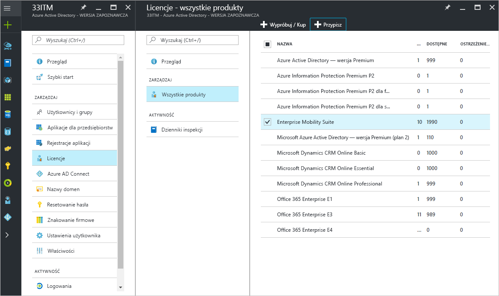
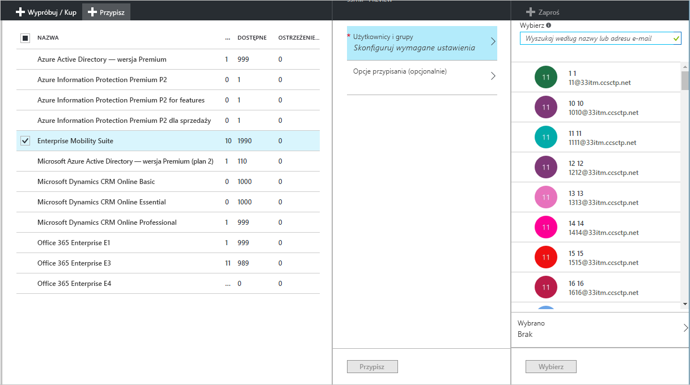
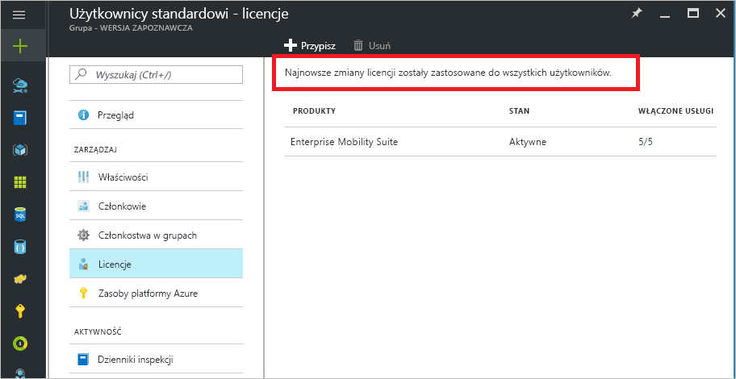
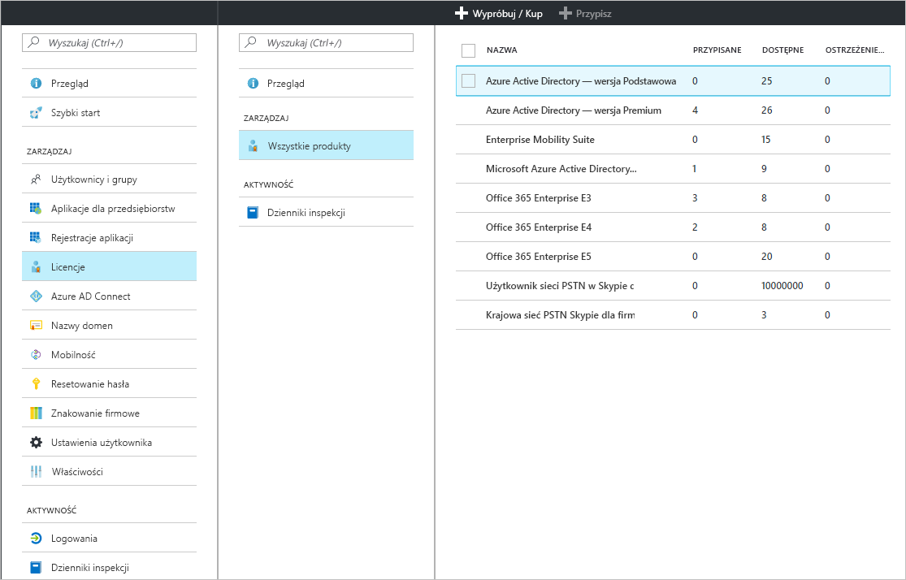
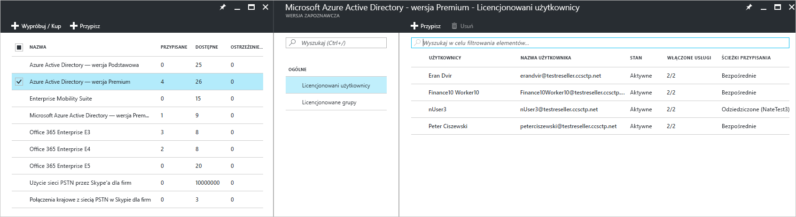
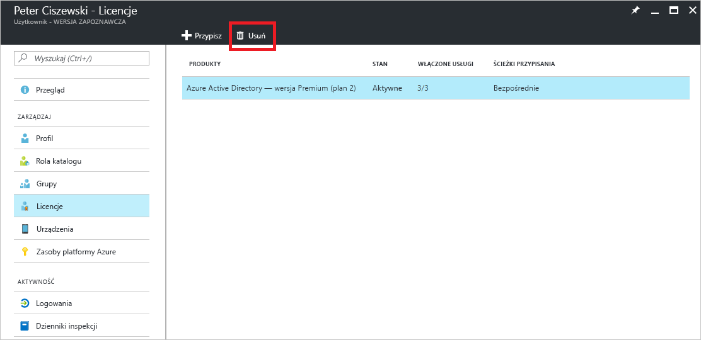

# Szybki start: przypisywanie licencji do użytkowników w usłudze Azure Active Directory
Usługi Azure AD oparte na licencjach wymagają aktywowania subskrypcji usługi Azure Active Directory (Azure AD) w dzierżawie platformy Azure. Po aktywowaniu subskrypcji administratorzy usługi Azure AD zarządzają funkcjami usługi, a licencjonowani użytkownicy korzystają z nich. Gdy kupisz rozwiązanie Enterprise Mobility + Security, Azure AD — wersja Premium lub Azure AD — wersja Podstawowa, Twoja dzierżawa zostanie zaktualizowana w celu uwzględnienia nowej subskrypcji, w tym jej okresu ważności oraz licencji przedpłaconych. Informacje dotyczące subskrypcji, w tym liczby przypisanych lub dostępnych licencji, są dostępne w obszarze **Azure Active Directory** w witrynie Azure Portal po otwarciu kafelka **Licencje**. Blok **Licencje** to również najlepsze miejsce do zarządzania przypisaniami licencji.

Mimo że do skonfigurowania płatnych opcji wystarczy uzyskanie subskrypcji, płatne funkcje usługi Azure AD wymagają przypisania licencji do użytkowników. Każdy użytkownik, który powinien mieć dostęp do płatnej funkcji usługi Azure AD lub który jest za jej pośrednictwem zarządzany, musi mieć przypisaną licencję. Przypisanie licencji to mapowanie pomiędzy użytkownikiem a zakupioną usługą, na przykład Azure AD — wersja Premium lub Podstawowa albo Enterprise Mobility + Security.

Możesz użyć [przypisywania licencji opartego na grupach](active-directory-licensing-whatis-azure-portal.md), aby skonfigurować zasady takie jak wymienione poniżej:
* Wszyscy użytkownicy w Twoim katalogu automatycznie otrzymują licencję
* Każda osoba z właściwym stanowiskiem otrzymuje licencję
* Możesz delegować decyzję do innych kierowników w organizacji (korzystając z [grup samoobsługi](../users-groups-roles/groups-self-service-management.md))

> [!TIP]
> Aby zapoznać się ze szczegółowym omówieniem przypisywania licencji do grup, w tym ze scenariuszami zaawansowanymi oraz scenariuszami dotyczącymi licencjonowania usługi Office 365, zobacz [Assign licenses to users by group membership in Azure Active Directory (Przypisywanie licencji do użytkowników przez członkostwo w grupie w usłudze Azure Active Directory)](../users-groups-roles/licensing-groups-assign.md).

## Przypisywanie licencji do użytkowników i grup
Korzystając z aktywnej subskrypcji, należy najpierw przypisać licencję sobie, a następnie odświeżyć przeglądarkę, aby mieć pewność, że wyświetlane są wszystkie oczekiwane funkcje subskrypcji. Kolejnym krokiem jest przypisanie licencji do użytkowników, którzy potrzebują dostępu do płatnych funkcji usługi Azure AD. Łatwym sposobem przypisywania licencji jest przypisanie licencji do grup użytkowników zamiast do poszczególnych użytkowników. Po przypisaniu licencji do grupy wszyscy członkowie grupy otrzymają licencję. Po dodaniu użytkowników do grupy lub ich usunięciu właściwa licencja zostanie automatycznie przypisana lub usunięta. 

> [!NOTE]
> Nie wszystkie usługi firmy Microsoft są dostępne we wszystkich lokalizacjach. Aby można było przypisać licencję do użytkownika, administrator musi określić właściwość **Lokalizacja użycia** dla użytkownika. Tę właściwość można ustawić w obszarze **Użytkownik** &gt; **Profil** &gt; **Ustawienia** w witrynie Azure Portal. Podczas przypisywania licencji do grupy każdy użytkownik, którego lokalizacja użycia nie jest określona, dziedziczy lokalizację katalogu.

Aby przypisać licencję, wybierz co najmniej jeden produkt w obszarze **Azure Active Directory** &gt; **Licencje** &gt; **Wszystkie produkty**, a następnie wybierz polecenie **Przypisz** na pasku poleceń.

Za pomocą bloku **Użytkownicy i grupy** możesz wybrać wielu użytkowników lub wiele grup, a także wyłączyć plany usługi dla produktu. Użyj pola wyszukiwania u góry, aby wyszukać nazwy użytkowników i grup.

Gdy przypiszesz licencje do grupy, odziedziczenie licencji przez wszystkich użytkowników może zająć trochę czasu — zależy to od rozmiaru grupy. Stan przetwarzania możesz sprawdzić w bloku **Grupa** kafelka **Licencje**.

Podczas przypisywania licencji usługi Azure AD mogą wystąpić błędy przypisania, ale w przypadku zarządzania produktami Azure AD i Enterprise Mobility + Security są one relatywnie rzadkie. Potencjalne błędy przypisania to:
- Konflikt przypisania: użytkownikowi wcześniej przypisano licencję, która jest niezgodna z obecną licencją. W takim przypadku przed przypisaniem nowej licencji należy usunąć bieżącą licencję.
- Przekroczono liczbę dostępnych licencji: gdy liczba użytkowników w przypisanych grupach przekracza liczbę dostępnych licencji, stan przypisania użytkownika wskazuje na brak możliwości przypisania z powodu braku licencji.

### Licencjonowanie w ramach współpracy B2B w usłudze Azure AD

Współpraca B2B umożliwia zaproszenie użytkowników-gości do dzierżawy usługi Azure AD w celu zapewnienia im dostępu do usług Azure AD i wszelkich udostępnianych zasobów platformy Azure.  

Zaproszenie użytkowników B2B i przypisanie ich do aplikacji w usłudze Azure AD jest bezpłatne. Dla użytkowników współpracy B2B dostępnych jest również bezpłatnie do 10 aplikacji na użytkownika-gościa i 3 podstawowe raporty. Jeśli użytkownik-gość ma przypisane odpowiednie licencje w dzierżawie usługi Azure AD partnera, będzie również traktowany jako licencjonowany w Twojej dzierżawie.

Nie jest to wymagane, ale jeśli chcesz umożliwić tym użytkownikom-gościom dostęp do płatnych funkcji usługi Azure AD, muszą oni mieć odpowiednie licencje usługi Azure AD. W ramach dzierżawy z płatną licencją usługi Azure AD, do której zaproszono gości, można przypisać użytkownikom współpracy B2B prawa do dodania dodatkowych pięciu użytkowników-gości do dzierżawy. Informacje i scenariusze znajdują się w artykule [Wskazówki dotyczące licencjonowania funkcji współpracy między firmami przy użyciu usługi Azure Active Directory](../b2b/licensing-guidance.md).

## Wyświetlanie przypisanych licencji

Podsumowanie przypisanych i dostępnych licencji znajduje się w sekcji **Azure Active Directory** &gt; **Licencje** &gt; **Wszystkie produkty**.

Szczegółowa lista przypisanych użytkowników i grup jest dostępna po wybraniu konkretnego produktu. Lista **Licencjonowani użytkownicy** pokazuje również wszystkich użytkowników, którzy aktualnie korzystają z licencji, i informuje, czy licencja została przypisana bezpośrednio do użytkownika, czy została odziedziczona od grupy.

Podobnie lista **Licencjonowane grupy** zawiera wszystkie grupy, do których przypisano licencje. Wybierz użytkownika lub grupę, aby otworzyć blok **Licencje**, w którym widoczne są wszystkie licencje przypisane do tego obiektu.

## Usuwanie licencji

Aby usunąć licencję, przejdź do użytkownika lub grupy, a następnie otwórz kafelek **Licencje**. Wybierz licencję, a następnie kliknij pozycję **Usuń**.

Licencje odziedziczone przez użytkownika od grupy nie mogą być usunięte bezpośrednio. Zamiast tego należy usunąć użytkownika z grupy, od której dziedziczy licencję.

## Następne kroki
W tym przewodniku Szybki start wyjaśniono, w jaki sposób można przypisać licencje do użytkowników i grup w usłudze Azure AD. 

Poniższego linku możesz użyć do skonfigurowania przypisań licencji subskrypcji w usłudze Azure AD za pomocą witryny Azure Portal.

> [!div class="nextstepaction"]
> [Przypisywanie licencji usługi Azure AD](https://aad.portal.azure.com/#blade/Microsoft_AAD_IAM/LicensesMenuBlade/Overview) 