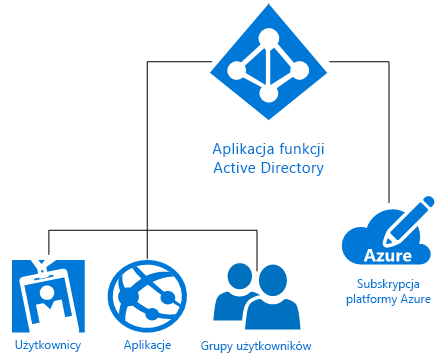

# Co to jest usługa Microsoft Azure identity?
Usługa Microsoft Azure Active Directory (Azure AD) to rozwiązanie do zarządzania tożsamościami i dostępem w chmurze, które oferuje usługi katalogowe, nadzór nad tożsamościami i zarządzanie dostępem do aplikacji. Usługa Azure AD umożliwia [szybkie logowanie jednokrotne (SSO)](https://docs.microsoft.com/azure/active-directory/active-directory-enterprise-apps-manage-sso) do tysięcy wstępnie zintegrowanych aplikacji komercyjnych i niestandardowych w [galerii aplikacji usługi Azure AD](https://azure.microsoft.com/marketplace/active-directory/all/). Wielu z tych aplikacji najprawdopodobniej już używasz, np. Office 365, Salesforce.com, Box, ServiceNow i Workday.

Pojedynczy katalog usługi Azure AD jest automatycznie kojarzony z subskrypcją platformy Azure podczas jej tworzenia. Następnie usługa Azure AD, jako usługa zarządzania tożsamościami na platformie Azure, zapewnia wszystkie funkcje związane z zarządzaniem tożsamościami i kontrolą dostępu dla zasobów opartych na chmurze. Te zasoby mogą obejmować użytkowników, aplikacje i grupy dla pojedynczej dzierżawy (organizacji), jak pokazano na poniższym diagramie:

Platforma Microsoft Azure oferuje kilka sposobów wykorzystania obsługi tożsamości jako usługi (IDaaS) z różnymi poziomami złożoności, aby spełniać potrzeby poszczególnych organizacji. W pozostałej części tego artykułu przedstawiono podstawową terminologię i pojęcia związane z tożsamościami na platformie Azure, a także rekomendacje, dzięki którym można podejmować najlepsze decyzje, wybierając spośród dostępnych możliwości.

## Terminy, które warto poznać

Przed podjęciem decyzji dotyczącej wyboru rozwiązania do obsługi tożsamości na platformie Azure dla organizacji warto poznać podstawowe terminy typowo używane w przypadku usług zarządzania tożsamościami na platformie Azure.

|Termin do poznania| Opis|
|-----|-----|
|Subskrypcja platformy Azure |Subskrypcje są używane do opłacania usług w chmurze na platformie Azure i zazwyczaj są powiązane z kartą kredytową. Możesz mieć wiele subskrypcji, ale współużytkowanie zasobów między nimi może być trudne.|
|Dzierżawa platformy Azure | Dzierżawa usługi Azure AD jest reprezentatywna dla jednej organizacji. Jest to dedykowane, zaufane wystąpienie usługi Azure AD, które jest automatycznie tworzone, gdy organizacja rejestruje się w subskrypcji usługi w chmurze firmy Microsoft, np. na platformie Azure, w usłudze Intune lub Office 365. Dzierżawy mogą uzyskać dostęp do usług w dedykowanym środowisku (jedna dzierżawa) lub w środowisku współdzielonym z innymi organizacjami (rozwiązanie wielodostępne).|
|Katalog usługi Azure AD | Każda dzierżawa platformy Azure ma dedykowany, zaufany katalog usługi Azure AD, który obejmuje użytkowników, grupy i aplikacje dzierżawy. Służy on do obsługi funkcji związanych z zarządzaniem tożsamościami i dostępem wobec zasobów dzierżawy. Ponieważ unikatowy katalog usługi Azure AD jest automatycznie aprowizowany, aby reprezentować organizację podczas rejestracji w usłudze w chmurze firmy Microsoft, np. na platformie Azure, w usłudze Microsoft Intune lub Office 365, czasami napotkasz terminy *dzierżawa*, *Azure AD* i *katalog usługi Azure AD* używane zamiennie. |
|Domena niestandardowa | Podczas pierwszej rejestracji subskrypcji usługi w chmurze firmy Microsoft dzierżawa (organizacja) będzie używać nazwy domeny *.onmicrosoft.com*. Jednak większość organizacji posiada jedną lub kilka nazw domen, których organizacje używają do prowadzenia działalności biznesowej, a użytkownicy końcowi do uzyskiwania dostępu do zasobów firmowych. Możesz dodać niestandardową nazwę domeny do usługi Azure AD, aby nazwa domeny była znana użytkownikom, np. *alice@contoso.com* zamiast *alice@contoso.onmicrosoft.com*. |
|Konto Azure AD | Są to tożsamości tworzone poprzez używanie usługi Azure AD lub innej usługi w chmurze firmy Microsoft, np. usługi Office 365. Są one przechowywane w usłudze Azure AD i dostępne dla dowolnych subskrypcji usług w chmurze organizacji. |
|Administrator subskrypcji platformy Azure| Administrator konta to osoba, która zarejestrowała lub kupiła subskrypcję platformy Azure. Może ona używać [Centrum konta](https://account.azure.com/Subscriptions), aby wykonywać różne zadania zarządzania, np. tworzyć subskrypcje, anulować subskrypcje, zmieniać rozliczenia za subskrypcję lub zmieniać administratora usługi. |
|Administrator globalny usługi Azure AD | Administratorzy globalni usługi Azure AD mają pełny dostęp do wszystkich funkcji administracyjnych usługi Azure AD. Osoba, która zarejestruje się w subskrypcji usługi w chmurze firmy Microsoft, domyślnie automatycznie zostaje administratorem globalnym. Możesz mieć więcej niż jednego administratora globalnego, ale tylko administratorzy globalni mogą przydzielać jakiekolwiek [inne role administratorów](https://docs.microsoft.com/azure/active-directory/active-directory-assign-admin-roles-azure-portal) do użytkowników. |
|Konto Microsoft | Konta Microsoft (utworzone do użytku osobistego) zapewniają dostęp do produktów i usług w chmurze firmy Microsoft nakierowanych na klienta, np. usług Outlook (Hotmail), OneDrive, Xbox LIVE lub Office 365. Te tożsamości są tworzone i przechowywane w systemie kont tożsamości klientów Microsoft obsługiwanym przez firmę Microsoft.|
|Konta służbowe | Konta służbowe (wystawione przez administratora na potrzeby biznesowe/akademickie) zapewniają dostęp do usług firmy Microsoft w chmurze na poziomie biznesowym i firmowym, np. do platformy Azure, usługi Intune lub Office 365.|

## Pojęcia do poznania

Skoro znasz już podstawowe terminy związane z tożsamościami na platformie Azure, dowiedz się więcej na ich temat, dzięki czemu łatwiej podejmiesz świadome decyzje dotyczące usługi zarządzania tożsamościami na platformie Azure.

|Pojęcie do zrozumienia |Opis|
|-----|-----|
|[Jak subskrypcje platformy Azure są kojarzone z usługą Azure Active Directory](https://docs.microsoft.com/azure/active-directory/active-directory-how-subscriptions-associated-directory) |Każda subskrypcja platformy Azure ma relację zaufania z katalogiem usługi Azure AD do uwierzytelniania użytkowników, usług i urządzeń. *Wiele subskrypcji może ufać temu samemu katalogowi usługi Azure AD, ale jedna subskrypcja zawsze będzie ufać jednemu katalogowi usługi Azure AD*. Relacja zaufania różni się od relacji subskrypcji z innymi zasobami na platformie Azure (witrynami internetowymi, bazami danych itd.), które przypominają bardziej podrzędne zasoby subskrypcji. Jeśli subskrypcja wygaśnie, dostęp do zasobów skojarzonych z subskrypcją inną niż subskrypcja usługi Azure AD również nie będzie możliwy. Jednak katalog usługi Azure AD pozostanie na platformie Azure, aby można było skojarzyć z nim inną subskrypcję i kontynuować zarządzanie zasobami dzierżawy.|
|[Jak działa licencjonowanie usługi Azure AD](https://docs.microsoft.com/azure/active-directory/active-directory-licensing-get-started-azure-portal) | Gdy kupisz lub aktywujesz rozwiązanie Enterprise Mobility Suite, Azure AD — wersja Premium lub Azure AD — wersja Podstawowa, Twój katalog zostanie zaktualizowany w celu uwzględnienia nowej subskrypcji, w tym jej okresu ważności oraz licencji przedpłaconych. Po aktywowaniu subskrypcji administratorzy globalni usługi Azure AD zarządzają usługą, a licencjonowani użytkownicy korzystają z niej. Informacje dotyczące subskrypcji, w tym liczby przypisanych lub dostępnych licencji, są dostępne w bloku **Azure Active Directory** > **Licencje** w witrynie Azure Portal. Jest to również najlepsze miejsce do zarządzania przypisaniami licencji.|
|[Kontrola dostępu oparta na rolach w witrynie Azure Portal](https://docs.microsoft.com/azure/role-based-access-control/overview)|Kontrola dostępu oparta na rolach (Role-Based Access Control, RBAC) na platformie Azure pomaga w precyzyjnym zarządzaniu dostępem do zasobów platformy Azure. Zbyt wiele uprawnień może spowodować narażenie konta na działania osób atakujących. Za mało uprawnień może oznaczać, że pracownicy nie będą w stanie efektywnie wykonywać swojej pracy. Korzystając z modelu RBAC, możesz przydzielić pracownikom dokładnie dobrane uprawnienia, których potrzebują, w oparciu o trzy podstawowe role mające zastosowanie do wszystkich grup zasobów: właściciel, współautor, czytelnik. Możesz też utworzyć do 2000 własnych [niestandardowych ról RBAC](https://docs.microsoft.com/azure/role-based-access-control/custom-roles), aby sprostać konkretnym potrzebom. |
|[Tożsamość hybrydowa](https://docs.microsoft.com/azure/active-directory/connect/active-directory-aadconnect)|Tożsamość hybrydowa jest osiągana poprzez zintegrowanie lokalnej usługi Active Directory w systemie Windows Server (AD DS) z usługą Azure AD przy użyciu programu [Azure AD Connect](https://docs.microsoft.com/azure/active-directory/connect/active-directory-aadconnect). Dzięki temu użytkownicy mogą posługiwać się wspólną tożsamością dla usługi Office 365, platformy Azure i aplikacji lokalnych lub aplikacji SaaS zintegrowanych z usługą Azure AD. Tożsamość hybrydowa umożliwia efektywne rozszerzanie środowiska lokalnego na chmurę w zakresie tożsamości i dostępu.|

### Różnice między usługą AD DS w systemie Windows Server a usługą Azure AD
Zarówno usługa Azure Active Directory (Azure AD), jak i lokalna usługa Active Directory (Active Directory Domain Services lub AD DS) są systemami przechowującymi dane katalogu i zarządzającymi komunikacją pomiędzy użytkownikami i zasobami, w tym procesami logowania użytkowników, uwierzytelnianiem i wyszukiwaniami w katalogu.

Jeżeli już znasz lokalną usługę Active Directory Domain Services (AD DS) w systemie Windows Server, najpierw wprowadzoną w systemie Windows 2000 Server, to prawdopodobnie rozumiesz podstawowe pojęcia usługi zarządzania tożsamościami. Jednak ważne jest również zrozumienie, że usługa Azure AD nie jest tylko kontrolerem domeny w chmurze. Jest to całkowicie nowy sposób zapewnienia obsługi tożsamości jako usługi (IDaaS) na platformie Azure, który wymaga całkowicie nowego sposobu myślenia, aby w pełni wykorzystać możliwości oparte na chmurze i chronić swoją organizację przed współczesnymi zagrożeniami. 

Usługa AD DS jest rolą serwera w systemie Windows Server, co oznacza, że można ją wdrożyć na maszynach fizycznych i wirtualnych. Ma strukturę hierarchiczną opartą na standardzie X.500. Usługa używa systemu nazw domen (DNS) do lokalizowania obiektów, można wejść z nią w interakcję przy użyciu protokołu LDAP oraz głównie używa protokołu Kerberos na potrzeby uwierzytelniania. Usługa Active Directory umożliwia także jednostkom organizacyjnym (OU) oraz obiektom zasad grupy (GPO) dołączanie maszyn do domeny oraz utworzenie relacji zaufania pomiędzy domenami.

Działy IT zabezpieczały swoje otoczenie od lat za pomocą usługi AD DS, ale współczesne, niekorzystające z najbliższych obwodów przedsiębiorstwa obsługujące tożsamości dla pracowników, klientów i partnerów wymagają nowej płaszczyzny kontroli. Usługa Azure AD jest tą płaszczyzną kontroli. Zabezpieczenia zostały przeniesione poza firmową zaporę do chmury, w której usługa Azure AD chroni zasoby firmowe i dostęp, zapewniając jedną wspólną tożsamość dla użytkowników (lokalnie lub w chmurze). Dzięki temu użytkownicy zyskują elastyczność i mogą bezpiecznie uzyskiwać dostęp do aplikacji, których potrzebują do pracy, niemal z każdego urządzenia. Bezproblemowa kontrola nad ochroną danych bazująca na ryzyku i wsparcie ze strony funkcji uczenia maszynowego oraz szczegółowego raportowania zapewniają działom IT narzędzia do utrzymywania bezpieczeństwa danych firmowych.

Usługa Azure AD jest publiczną usługą katalogową dla wielu klientów, co oznacza, że w usłudze Azure AD możesz utworzyć dzierżawę dla serwerów i aplikacji w chmurze, np. usługi Office 365. Użytkownicy i grupy są tworzone w płaskiej strukturze bez jednostek organizacyjnych i obiektów zasad grupy. Uwierzytelnianie jest wykonywane za pośrednictwem protokołów takich jak SAML, WS-Federation i OAuth. Istnieje możliwość wysłania zapytania do usługi Azure AD, niemniej zamiast protokołu LDAP należy użyć interfejsu API REST o nazwie AD Graph API. To rozwiązanie działa w przypadku protokołów HTTP i HTTPS.

### Rozszerzanie funkcji zarządzania i zabezpieczeń usługi Office 365
Korzystasz już z usługi Office 365? Przyspiesz transformację cyfrową, rozszerzając wbudowane funkcje usługi Office 365 przy użyciu usługi Azure AD, aby zabezpieczyć wszystkie zasoby, zapewniając bezpieczną produktywność dla wszystkich pracowników. Korzystając z usługi Azure AD, poza funkcjami oferowanymi przez usługę Office 365, możesz zabezpieczyć całe portfolio aplikacji przy użyciu jednej tożsamości, która zapewni logowanie jednokrotne dla wszystkich aplikacji. Możesz rozszerzyć funkcje dostępu warunkowego i korzystać z nich nie tylko na podstawie stanu urządzenia, ale także z uwzględnieniem użytkownika, lokalizacji, aplikacji i ryzyka. Funkcje uwierzytelniania wieloskładnikowego (MFA) zapewniają jeszcze lepsze zabezpieczenia, gdy ich potrzebujesz. Zyskasz dodatkowy wgląd w uprawnienia użytkowników i zapewnisz dostęp administracyjny just in time na żądanie. Twoi użytkownicy będą produktywniejsi i będą tworzyć mniej biletów pomocy technicznej dzięki samoobsługowym możliwościom usługi Azure AD, np. funkcji resetowania zapomnianych haseł, żądań dostępu do aplikacji oraz tworzenia grup i zarządzania nimi.

> [!TIP]
> Chcesz dowiedzieć się więcej o używaniu zarządzania tożsamościami usługi Azure AD z usługą Office 365? [Pobierz książkę elektroniczną](https://info.microsoft.com/Extend-Office-365-security-with-EMS.html).

## Rozwiązania do obsługi tożsamości na platformie Microsoft Azure

Platforma Microsoft Azure oferuje kilka sposobów na zarządzanie tożsamościami użytkowników, niezależnie od tego, czy są utrzymywane w pełni lokalnie, tylko w chmurze lub gdzieś pomiędzy. Obejmują one funkcje „zrób to sam” usługi AD DS na platformie Azure, usługę Azure Active Directory (Azure AD), tożsamość hybrydową i usługę Azure AD Domain Services.

### Funkcje „zrób to sam” usługi AD DS
W przypadku firm, które potrzebują jedynie niewielkiej przestrzeni w chmurze, można użyć funkcji **zrób to sam usługi AD DS** na platformie Azure. Ta opcja obsługuje wiele scenariuszy usługi AD DS w systemie Windows Server, które są dobrze dostosowane pod kątem wdrożenia w formie maszyn wirtualnych na platformie Azure. Przykładowo możesz utworzyć maszynę wirtualną na platformie Azure jako kontroler domeny uruchomiony w odległym centrum danych, który ma połączenie z siecią zdalną. Z tego miejsca maszyna wirtualna może obsługiwać żądania uwierzytelniania od zdalnych użytkowników i poprawiać wydajność uwierzytelniania. Ta opcja jest również odpowiednia jako względnie ekonomiczny substytut droższych lokacji odzyskiwania po awarii poprzez hostowanie niewielkiej liczby kontrolerów domen oraz jednej sieci wirtualnej na platformie Azure. Ponadto może być konieczne wdrożenie aplikacji na platformie Azure, np. programu SharePoint, który wymaga usługi AD DS w systemie Windows Server, ale nie jest zależny od sieci lokalnej lub firmowej usługi Active Directory w systemie Windows Server. W takim przypadku możesz wdrożyć odizolowany las na platformie Azure, aby spełnić wymagania farmy serwerów programu SharePoint. Ponadto obsługiwana jest możliwość wdrożenia aplikacji sieciowych, które wymagają łączności z siecią lokalną oraz lokalną usługą Active Directory.

### Azure Active Directory (Azure AD)
**Autonomiczna usługa Azure AD** to całkowicie oparte na chmurze rozwiązanie do zarządzania tożsamościami i dostępem jako usługa (IDaaS). Usługa Azure AD zapewnia niezawodny zestaw funkcji umożliwiających zarządzanie użytkownikami i grupami. Ułatwia zabezpieczenie dostępu do aplikacji lokalnych i aplikacji w chmurze, w tym usług internetowych firmy Microsoft, takich jak Office 365, oraz wielu aplikacji typu „oprogramowanie jako usługa” (SaaS, Software as a Service) firm innych niż Microsoft. Usługa Azure AD jest dostępna w trzech wersjach: Bezpłatna, Podstawowa i Premium. Usługa Azure AD zwiększa wydajność organizacyjną i rozszerza zabezpieczenia poza obwodową zaporę na nową płaszczyznę kontrolną chronioną przez uczenie maszynowe platformy Azure oraz inne zaawansowane funkcje bezpieczeństwa.

### Tożsamość hybrydowa
Zamiast wybierać pomiędzy lokalnymi lub opartymi na chmurze rozwiązaniami do obsługi tożsamości, wielu myślących o przyszłości dyrektorów działów IT oraz wiele firm, które rozpoczęły przewidywanie kierunku działania w kontekście długookresowym, rozszerza swoje katalogi lokalne na chmurę za pośrednictwem rozwiązań **tożsamości hybrydowej**. Dzięki tożsamości hybrydowej zyskujesz w pełni globalne rozwiązanie do zarządzania tożsamościami i dostępem, które zapewnia bezpieczny i produktywny dostęp do aplikacji potrzebnych użytkownikom do wykonywania zadań.

> [!TIP]
> Aby dowiedzieć się więcej o tym, w jaki sposób dyrektorzy działów IT korzystają z usługi Azure Active Directory jako centralnej części strategii IT, pobierz [Przewodnik dyrektorów działów IT dotyczący usługi Azure Active Directory](https://aka.ms/AzureADCIOGuide).

### Azure AD Domain Services
**Usługa Azure AD Domain Services** zapewnia opartą na chmurze opcję używania usługi AD DS na potrzeby lekkiej kontroli konfiguracji maszyn wirtualnych na platformie Azure oraz sposób sprostania lokalnym wymaganiom z zakresu tożsamości na potrzeby tworzenia i testowania aplikacji sieciowych. Usługa Azure AD Domain Services nie jest przeznaczona do migracji metodą „lift-and-shift” lokalnej infrastruktury usługi AD DS na maszyny wirtualne platformy Azure zarządzane przy użyciu usługi Azure AD Domain Services. Zamiast tego maszyny wirtualne platformy Azure w domenach zarządzanych powinny być używane do obsługiwania programowania, testowania i przenoszenia aplikacji lokalnych, które wymagają metod uwierzytelniania AD DS, do chmury.

## Typowe scenariusze i zalecenia

Poniżej przedstawiono kilka typowych scenariuszy związanych z tożsamościami i dostępem wraz z zaleceniami co do tego, która opcja obsługi tożsamości na platformie Azure może być najbardziej odpowiednia w danym przypadku.

|Scenariusz dotyczący tożsamości| Zalecenie|
|-----|-----|
|Moja organizacja sporo zainwestowała w lokalną usługę Active Directory w systemie Windows Server, ale chcemy przenieść obsługę tożsamości do chmury.| Najczęściej używanym rozwiązaniem do obsługi tożsamości na platformie Azure jest [tożsamość hybrydowa](https://docs.microsoft.com/azure/active-directory/active-directory-hybrid-identity-design-considerations-overview). Jeżeli już poczyniono inwestycje w lokalną usługę AD DS, możesz z łatwością rozszerzyć tożsamość na chmurę przy użyciu programu Azure AD Connect.|
|Moja firma powstała w chmurze i nie mamy żadnych inwestycji w lokalne rozwiązania do obsługi tożsamości.| [Usługa Azure Active Directory](https://docs.microsoft.com/azure/active-directory/active-directory-whatis) jest najlepszym wyborem dla firm działających wyłącznie w chmurze bez inwestycji lokalnych.|
|Potrzebuję lekkiego narzędzia do konfiguracji i kontroli maszyny wirtualnej na platformie Azure, aby spełnić wymagania dotyczące lokalnej obsługi tożsamości na potrzeby programowania i testowania aplikacji.|[Usługa Azure AD Domain Services](https://docs.microsoft.com/azure/active-directory-domain-services/active-directory-ds-overview) jest dobrym wyborem, jeżeli musisz użyć usługi AD DS na potrzeby lekkiego kontrolowania konfiguracji maszyny wirtualnej na platformie Azure lub chcesz programować bądź migrować starsze aplikacje lokalne oparte na katalogach do chmury.|  
|Chcę obsługiwać kilka maszyn wirtualnych na platformie Azure, ale moja firma nadal ma duże inwestycje w lokalną usługę Active Directory (AD DS).|Skorzystaj z funkcji [„zrób to sam” w usłudze AD DS](https://docs.microsoft.com/azure/active-directory-domain-services/active-directory-ds-comparison#do-it-yourself-diy-ad-deployment-options), aby użyć maszyn wirtualnych platformy Azure, jeżeli chcesz obsługiwać kilka maszyn wirtualnych i masz duże inwestycje w lokalną usługę AD DS. |

## Gdzie mogę dowiedzieć się więcej?
Mamy mnóstwo przydatnych zasobów online, dzięki którym dowiesz się wszystkiego o usłudze Azure AD. Poniżej przedstawiono listę doskonałych artykułów, które ułatwią rozpoczęcie pracy:

* [Włączanie katalogu do zarządzania hybrydowego przy użyciu programu Azure AD Connect](../connect/active-directory-aadconnect.md)
* [Dodatkowe zabezpieczenia dla połączonego świata](../authentication/multi-factor-authentication.md)
* [Automatyzacja aprowizacji i cofania aprowizacji użytkowników dla aplikacji SaaS przy użyciu usługi Azure Active Directory](../manage-apps/user-provisioning.md)
* [Zarządzanie hasłami z dowolnego miejsca](../user-help/active-directory-passwords-update-your-own-password.md)
* [Czym jest dostęp do aplikacji i logowanie jednokrotne za pomocą usługi Azure Active Directory?](../manage-apps/what-is-single-sign-on.md)
* [Automatyzacja aprowizacji i cofania aprowizacji użytkowników dla aplikacji SaaS przy użyciu usługi Azure Active Directory](../manage-apps/user-provisioning.md)
* [Jak zapewnić bezpieczny, zdalny dostęp do aplikacji lokalnych](../manage-apps/application-proxy.md)
* [Zarządzanie dostępem do zasobów za pomocą grup usługi Azure Active Directory](active-directory-manage-groups.md)
* [Co to jest licencjonowanie usługi Microsoft Azure Active Directory?](active-directory-licensing-whatis-azure-portal.md)
* [Jak odnajdywać niezaakceptowane oficjalnie aplikacje w chmurze, które są używane w mojej organizacji?](../manage-apps/cloud-app-discovery.md)

## Kolejne kroki

Teraz, gdy znasz już pojęcia dotyczące tożsamości na platformie Azure oraz dostępne opcje, możesz użyć następujących zasobów, aby rozpocząć wdrażanie wybranej opcji:

[Dowiedz się więcej o rozwiązaniach tożsamości hybrydowej platformy Azure](https://docs.microsoft.com/azure/active-directory/choose-hybrid-identity-solution)

[Dowiedz się więcej w środowisku weryfikacji koncepcji na platformie Azure](https://aka.ms/aad-poc)
