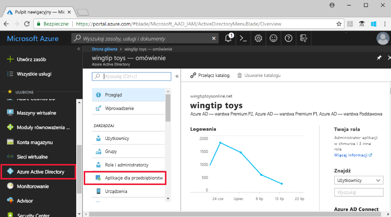
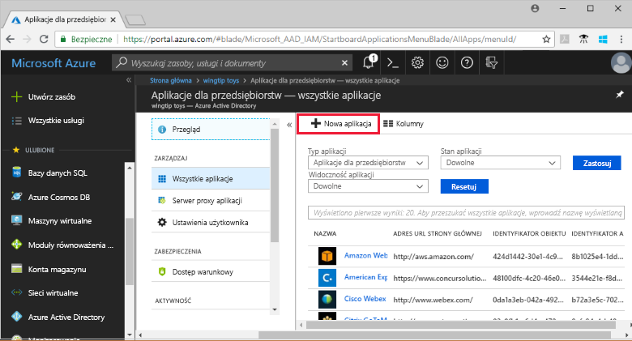
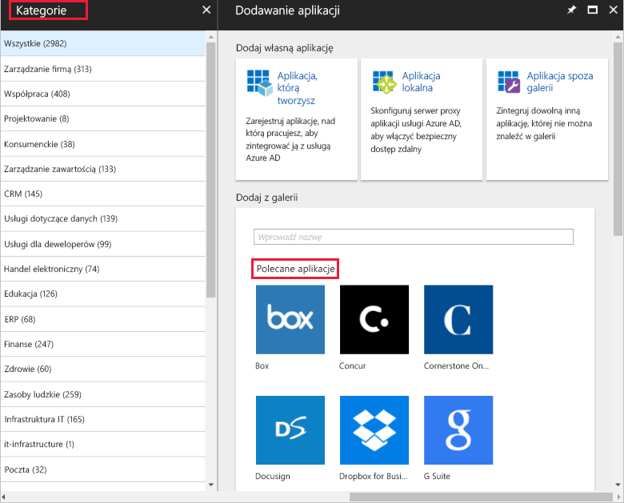
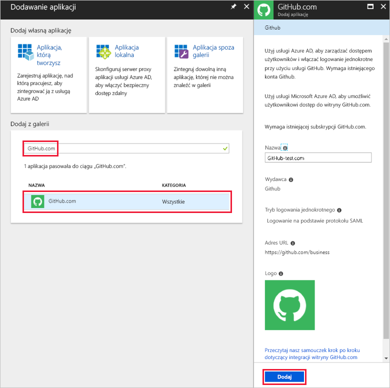
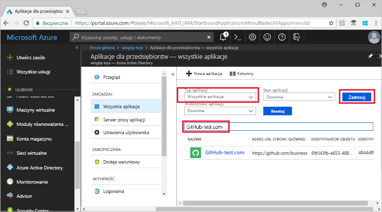
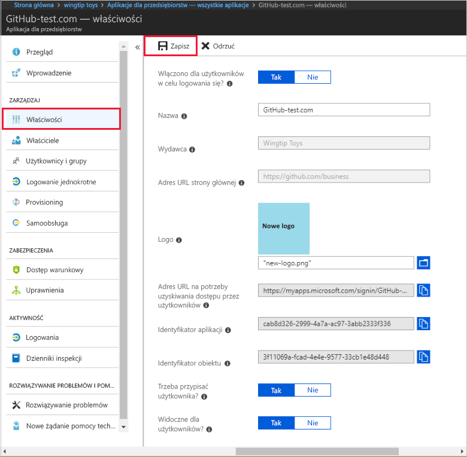
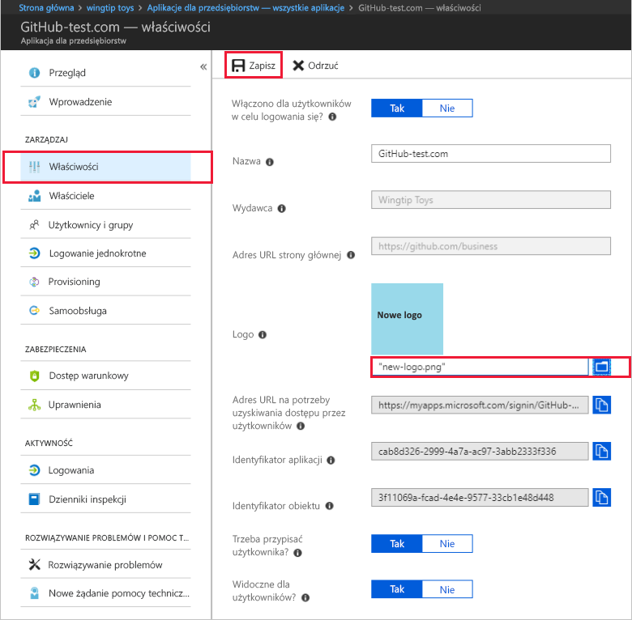

# Szybki start: dodawanie aplikacji do dzierżawy usługi Azure Active Directory

Usługa Azure Active Directory (Azure AD) udostępnia galerię, która zawiera tysiące wstępnie zintegrowanych aplikacji. Niektóre z aplikacji używanych w Twojej organizacji prawdopodobnie znajdują się w galerii. Ten przewodnik Szybki start używa witryny Azure Portal do dodawania aplikacji z galerii do dzierżawy usługi Azure Active Directory (Azure AD).

Po dodaniu aplikacji do dzierżawy usługi Azure AD, można:

- Zarządzanie dostępem użytkowników do aplikacji za pomocą zasad dostępu warunkowego.
- Konfigurować konta użytkowników do logowania jednokrotnego do aplikacji za pomocą kont usługi Azure AD.

## Przed rozpoczęciem

Aby dodać aplikację do swojej dzierżawy, potrzebujesz:

- Subskrypcji usługi Azure AD
- Subskrypcji z włączonym logowaniem jednokrotnym dla aplikacji

Zaloguj się do witryny [Azure Portal](https://portal.azure.com) jako administrator globalny dzierżawy usługi Azure AD, administrator aplikacji w chmurze lub administrator aplikacji.

Aby przetestować kroki opisane w tym samouczku, zalecamy użycie środowiska innego niż produkcyjne. Jeśli nie masz nieprodukcyjnego środowiska usługi Azure AD, możesz skorzystać z [miesięcznej wersji próbnej](https://azure.microsoft.com/pricing/free-trial/).

## Dodawanie aplikacji do dzierżawy usługi Azure AD

Aby dodać aplikację z galerii do dzierżawy usługi Azure AD:

1. W [witryny Azure portal](https://portal.azure.com), w panelu nawigacyjnym po lewej stronie wybierz **usługi Azure Active Directory**.

1. W **usługi Azure Active Directory** okienku wybierz **aplikacje dla przedsiębiorstw**.

    

1. **Wszystkie aplikacje** zostanie otwarte okienko, aby pokazać losowej próbki aplikacji w dzierżawie usługi Azure AD. Wybierz **nową aplikację** w górnej części **wszystkie aplikacje** okienka.

    

1. W **kategorie** okienku zostaną wyświetlone ikony w obszarze **polecane aplikacje** obszar, który jest losowej próbki z galerii aplikacji.  Aby wyświetlić więcej aplikacji, można wybrać **Pokaż więcej**. Jednak nie zaleca się wyszukiwanie w ten sposób, ponieważ istnieją tysiące aplikacji w galerii.

    

1. Aby wyszukać aplikację, w obszarze **Dodaj z galerii**, wprowadź nazwę aplikacji, które chcesz dodać. Wybierz aplikację z wyników, a następnie wybierz **Dodaj**. W poniższym przykładzie przedstawiono formularz **Dodaj aplikację**, który pojawia się w przypadku wyszukiwania witryny GitHub.com.

    

1. W formularzu specyficznym dla aplikacji można zmienić informacje o właściwościach. Można na przykład edytować nazwę aplikacji, aby odpowiadała potrzebom organizacji. W tym przykładzie jest używana nazwa **GitHub-test**.

1. Po zakończeniu wprowadzania zmian do właściwości, wybierz **Dodaj**.

1. Zostanie wyświetlona strona wprowadzenia z opcjami konfigurowania aplikacji w organizacji.

Dodaniu aplikacji. Możesz zrobić sobie przerwę. W kolejnych sekcjach pokazano, jak zmienić logo i edytować inne właściwości aplikacji.

## Znajdowanie aplikacji dzierżawy usługi Azure AD

Załóżmy, że po przerwie wracasz do konfigurowania swojej aplikacji. Najpierw należy jest, Znajdź aplikację.

1. W  **[witryny Azure portal](https://portal.azure.com)** , w panelu nawigacyjnym po lewej stronie wybierz **usługi Azure Active Directory**.

1. W **usługi Azure Active Directory** okienku wybierz **aplikacje dla przedsiębiorstw**.

1. Z **typ aplikacji** menu rozwijanego wybierz opcję **wszystkie aplikacje**, a następnie wybierz pozycję **Zastosuj**. Aby dowiedzieć się więcej na temat opcji wyświetlania, zobacz [View tenant applications (Wyświetlanie aplikacji dzierżawy)](view-applications-portal.md).

1. Zostanie wyświetlona lista wszystkich aplikacji w dzierżawie usługi Azure AD. Lista jest przykładem losowym. Aby wyświetlić więcej aplikacji, wybierz **Pokaż więcej** jeden lub więcej razy.

1. Aby szybko znaleźć aplikację w dzierżawie, wprowadź nazwę aplikacji w polu wyszukiwania, a następnie wybierz **Zastosuj**. W tym przykładzie wyszukuje aplikacji GitHub test dodane wcześniej.

    

## Konfigurowanie właściwości logowania użytkownika

Teraz, gdy Ci się znaleźć aplikacji, możesz go otworzyć i skonfigurować właściwości aplikacji.

Aby edytować właściwości aplikacji:

1. Wybierz aplikację, aby go otworzyć.
1. Wybierz **właściwości** aby otworzyć okienko właściwości do edycji.

    

1. Poświęć chwilę na zapoznanie się z opcjami logowania. Opcje określają, jak użytkownicy, którzy są przypisani lub nieprzypisane do aplikacji może zalogować się do aplikacji. I opcje określają, jeśli użytkownik może wyświetlić aplikację w panelu dostępu.

    - Opcja **Włączono dla użytkowników w celu logowania się** określa, czy użytkownicy przypisani do aplikacji mogą się logować.
    - **Wymagane przypisanie użytkownika** Określa, czy użytkownicy, którzy nie zostali przypisani do aplikacji mogą się logować.
    - Opcja **Widoczne dla użytkownika** określa, czy użytkownicy przypisani do aplikacji mogą ją widzieć w panelu dostępu i narzędziu do uruchamiania aplikacji usługi O365.

1. Użyj następujących tabel, ułatwiające wybór najlepszych opcji do własnych potrzeb.

   - Zachowanie w przypadku użytkowników **przypisanych**:

       | Ustawienia właściwości aplikacji | | | Środowisko użytkowników przypisanych | |
       |---|---|---|---|---|
       | Włączono dla użytkowników w celu logowania się? | Wymagane przypisanie użytkownika? | Widoczne dla użytkowników? | Czy przypisani użytkownicy mogą się logować? | Czy przypisani użytkownicy widzą aplikację?* |
       | tak | tak | tak | tak | tak  |
       | tak | tak | nie  | tak | nie   |
       | tak | nie  | tak | tak | tak  |
       | tak | nie  | nie  | tak | nie   |
       | nie  | tak | tak | nie  | nie   |
       | nie  | tak | nie  | nie  | nie   |
       | nie  | nie  | tak | nie  | nie   |
       | nie  | nie  | nie  | nie  | nie   |

   - Zachowanie w przypadku użytkowników **nieprzypisanych**:

       | Ustawienia właściwości aplikacji | | | Środowisko użytkowników nieprzypisanych | |
       |---|---|---|---|---|
       | Włączone dla użytkownicy mogą logować się? | Wymagane przypisanie użytkownika? | Widoczne dla użytkowników? | Czy nieprzypisani użytkownicy mogą się logować? | Czy nieprzypisani użytkownicy widzą aplikację?* |
       | tak | tak | tak | nie  | nie   |
       | tak | tak | nie  | nie  | nie   |
       | tak | nie  | tak | tak | nie   |
       | tak | nie  | nie  | tak | nie   |
       | nie  | tak | tak | nie  | nie   |
       | nie  | tak | nie  | nie  | nie   |
       | nie  | nie  | tak | nie  | nie   |
       | nie  | nie  | nie  | nie  | nie   |

     *Czy użytkownik widzi aplikację w panelu dostępu i narzędziu do uruchamiania aplikacji usługi Office 365?

## Używanie logo niestandardowego

Aby użyć logo niestandardowego:

1. Utwórz logo o rozmiarze 215 x 215 pikseli i zapisz je w formacie PNG.
1. Wybierz aplikację, ponieważ został już znaleziony aplikacji.
1. W okienku po lewej stronie wybierz **właściwości**.
1. Przekaż logo.
1. Gdy skończysz, wybierz pozycję **Zapisz**.

    

## Kolejne kroki

W tym przewodniku Szybki start przedstawiono sposób dodawania aplikacji z galerii do dzierżawy usługi Azure AD. Przedstawiono sposób edytowania właściwości aplikacji.

Teraz możesz przystąpić do konfigurowania aplikacji pod kątem logowania jednokrotnego.

> [!div class="nextstepaction"]
> [Skonfiguruj logowanie jednokrotne](configure-single-sign-on-portal.md)

