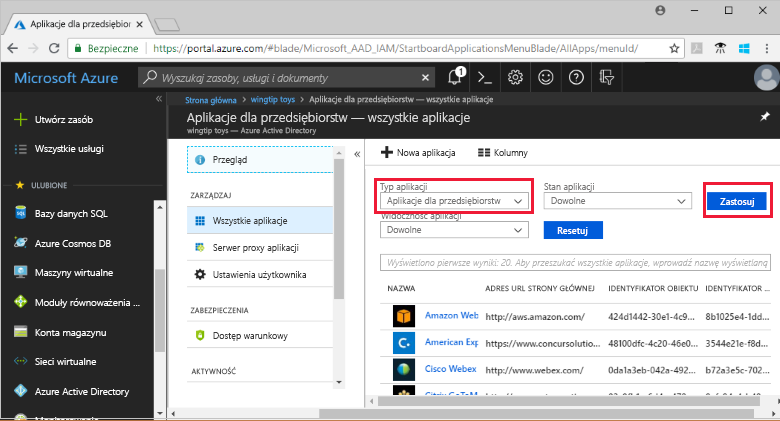
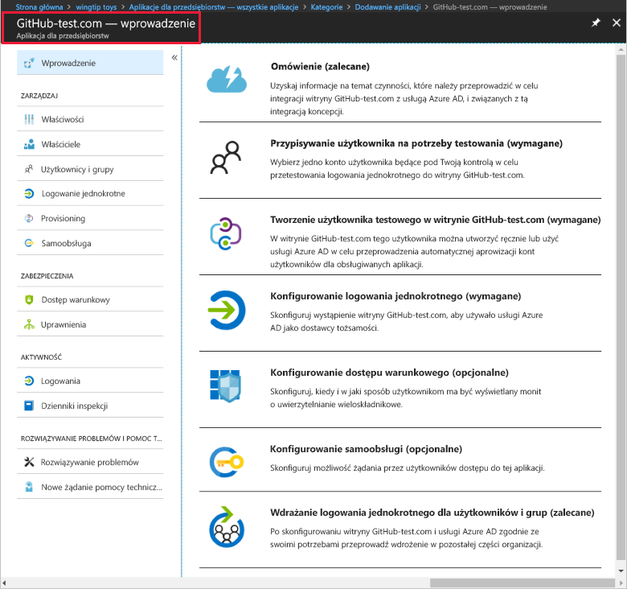

# Szybki start: dodawanie aplikacji do dzierżawy usługi Azure Active Directory

Usługa Azure Active Directory (Azure AD) udostępnia galerię, która zawiera tysiące wstępnie zintegrowanych aplikacji. Niektóre z aplikacji używanych w Twojej organizacji prawdopodobnie znajdują się w galerii. Ten przewodnik Szybki start używa witryny Azure Portal do dodawania aplikacji z galerii do dzierżawy usługi Azure Active Directory (Azure AD).

Po dodaniu aplikacji do dzierżawy usługi Azure AD, można:

- Zarządzać dostępem użytkowników do aplikacji za pomocą zasad dostępu warunkowego.
- Konfigurować konta użytkowników do logowania jednokrotnego do aplikacji za pomocą kont usługi Azure AD.

## Przed rozpoczęciem

Aby dodać aplikację do swojej dzierżawy, potrzebujesz:

- Subskrypcji usługi Azure AD
- Subskrypcji z włączonym logowaniem jednokrotnym dla aplikacji

Zaloguj się do witryny [Azure Portal](https://portal.azure.com) jako administrator globalny dzierżawy usługi Azure AD, administrator aplikacji w chmurze lub administrator aplikacji.

Aby przetestować kroki opisane w tym samouczku, zalecamy użycie środowiska innego niż produkcyjne. Jeśli nie masz nieprodukcyjnego środowiska usługi Azure AD, możesz skorzystać z [miesięcznej wersji próbnej](https://azure.microsoft.com/pricing/free-trial/).

## Dodawanie aplikacji do dzierżawy usługi Azure AD

Aby dodać aplikację z galerii do dzierżawy usługi Azure AD:

1. W witrynie [Azure Portal](https://portal.azure.com) w panelu nawigacyjnym po lewej stronie kliknij pozycję **Azure Active Directory**.

2. W bloku **Azure Active Directory** kliknij pozycję **Aplikacje dla przedsiębiorstw**.

    

3. Zostanie otwarty blok **Wszystkie aplikacje** zawierający losowy przykład aplikacji w dzierżawie usługi Azure AD.

    

4. Kliknij pozycję **Nowa aplikacja** w górnej części bloku **Wszystkie aplikacje**.

    

5. Najprostszym sposobem wyświetlenia listy aplikacji w galerii jest użycie pozycji **Kategorie**, ponieważ ikony w obszarze **Polecane aplikacje** to losowy przykład aplikacji z galerii.

    

    Aby wyświetlić więcej aplikacji, możesz kliknąć przycisk **Pokaż więcej**. Takie wyszukiwanie nie jest zalecane, ponieważ galeria zawiera tysiące aplikacji.

6. Aby wyszukać aplikację, w obszarze **Dodaj z galerii** wprowadź nazwę aplikacji, którą chcesz dodać. Spośród wyników wybierz aplikację, a następnie kliknij pozycję **Dodaj**. W poniższym przykładzie przedstawiono formularz **Dodaj aplikację**, który pojawia się w przypadku wyszukiwania witryny GitHub.com.

    

6. W formularzu specyficznym dla aplikacji można zmienić informacje o właściwościach. Można na przykład edytować nazwę aplikacji, aby odpowiadała potrzebom organizacji. W tym przykładzie jest używana nazwa **GitHub-test**.

8. Po zakończeniu wprowadzania zmian właściwości kliknij pozycję **Dodaj**.

9. Zostanie wyświetlona strona wprowadzenia z opcjami konfigurowania aplikacji w organizacji.

    

Zakończono dodawanie aplikacji. Możesz zrobić sobie przerwę. W kolejnych sekcjach pokazano, jak zmienić logo i edytować inne właściwości aplikacji.

## Znajdowanie aplikacji dzierżawy usługi Azure AD

Załóżmy, że po przerwie wracasz do konfigurowania swojej aplikacji. Pierwszą rzeczą, jaką musisz zrobić, jest wyszukanie aplikacji.

1. W witrynie **[Azure Portal](https://portal.azure.com)** w panelu nawigacyjnym po lewej stronie kliknij pozycję **Azure Active Directory**.

2. W bloku Azure Active Directory kliknij pozycję **Aplikacje dla przedsiębiorstw**.

3. Z menu rozwijanego **Typ aplikacji** wybierz pozycję **Wszystkie aplikacje** i kliknij pozycję **Zastosuj**. Aby dowiedzieć się więcej na temat opcji wyświetlania, zobacz [View tenant applications (Wyświetlanie aplikacji dzierżawy)](view-applications-portal.md).

4. Zostanie wyświetlona lista wszystkich aplikacji w dzierżawie usługi Azure AD. Lista jest przykładem losowym. Aby wyświetlić więcej aplikacji, kliknij pozycję **Pokaż więcej** co najmniej raz.

5. Aby szybko znaleźć aplikację w dzierżawie, wprowadź nazwę aplikacji w polu wyszukiwania i kliknij pozycję **Zastosuj**. W tym przykładzie jest wyszukiwana dodana poprzednio aplikacja GitHub-test.

    

## Konfigurowanie właściwości logowania użytkownika

Teraz, gdy aplikacja została znaleziona, możesz ją otworzyć i skonfigurować właściwości aplikacji.

Aby edytować właściwości aplikacji

1. Kliknij aplikację, aby ją otworzyć.
2. Kliknij pozycję **Właściwości**, aby otworzyć blok właściwości do edycji.

    

3. Poświęć chwilę na zapoznanie się z opcjami logowania. Opcje **Włączono dla użytkowników w celu logowania się**, **Wymagane przypisanie użytkownika** i **Widoczne dla użytkownika** są łączone w celu określenia, czy użytkownicy przypisani lub nieprzypisani do aplikacji mogą się logować. Określają one również, czy użytkownik może wyświetlić aplikację w panelu dostępu.

    - Opcja **Włączono dla użytkowników w celu logowania się** określa, czy użytkownicy przypisani do aplikacji mogą się logować.
    - Opcja **Wymagane przypisanie użytkownika** określa, czy użytkownicy nieprzypisani do aplikacji mogą się logować.
    - Opcja **Widoczne dla użytkownika** określa, czy użytkownicy przypisani do aplikacji mogą ją widzieć w panelu dostępu i narzędziu do uruchamiania aplikacji usługi O365.

4. Skorzystaj z poniższych tabel, które pomogą Ci wybrać opcje najlepiej spełniające Twoje potrzeby.

   - Zachowanie w przypadku użytkowników **przypisanych**:

       | Ustawienia właściwości aplikacji | | | Środowisko użytkowników przypisanych | |
       |---|---|---|---|---|
       | Włączono dla użytkowników w celu logowania się? | Wymagane przypisanie użytkownika? | Widoczne dla użytkowników? | Czy przypisani użytkownicy mogą się logować? | Czy przypisani użytkownicy widzą aplikację?* |
       | tak | tak | tak | tak | tak  |
       | tak | tak | nie  | tak | nie   |
       | tak | nie  | tak | tak | tak  |
       | tak | nie  | nie  | tak | nie   |
       | nie  | tak | tak | nie  | nie   |
       | nie  | tak | nie  | nie  | nie   |
       | nie  | nie  | tak | nie  | nie   |
       | nie  | nie  | nie  | nie  | nie   |

   - Zachowanie w przypadku użytkowników **nieprzypisanych**:

       | Ustawienia właściwości aplikacji | | | Środowisko użytkowników nieprzypisanych | |
       |---|---|---|---|---|
       | Włączono dla użytkowników w celu logowania się? | Wymagane przypisanie użytkownika? | Widoczne dla użytkowników? | Czy nieprzypisani użytkownicy mogą się logować? | Czy nieprzypisani użytkownicy widzą aplikację?* |
       | tak | tak | tak | nie  | nie   |
       | tak | tak | nie  | nie  | nie   |
       | tak | nie  | tak | tak | nie   |
       | tak | nie  | nie  | tak | nie   |
       | nie  | tak | tak | nie  | nie   |
       | nie  | tak | nie  | nie  | nie   |
       | nie  | nie  | tak | nie  | nie   |
       | nie  | nie  | nie  | nie  | nie   |

     *Czy użytkownik widzi aplikację w panelu dostępu i narzędziu do uruchamiania aplikacji usługi Office 365?

## Używanie logo niestandardowego

Aby użyć logo niestandardowego:

1. Utwórz logo o rozmiarze 215 x 215 pikseli i zapisz je w formacie PNG.
2. Ponieważ aplikacja została już znaleziona, kliknij ją.
2. W lewym bloku kliknij pozycję **Właściwości**.
4. Przekaż logo.
5. Po zakończeniu kliknij pozycję **Zapisz**.

    

## Kolejne kroki

W tym przewodniku Szybki start przedstawiono sposób dodawania aplikacji z galerii do dzierżawy usługi Azure AD. Przedstawiono sposób edytowania właściwości aplikacji.

Teraz możesz przystąpić do konfigurowania aplikacji pod kątem logowania jednokrotnego.

> [!div class="nextstepaction"]
> [Skonfiguruj logowanie jednokrotne](configure-single-sign-on-portal.md)

