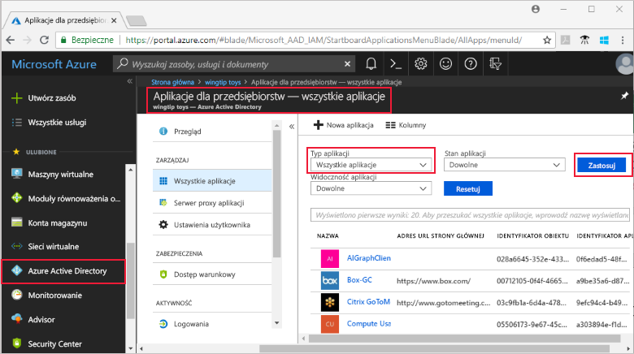
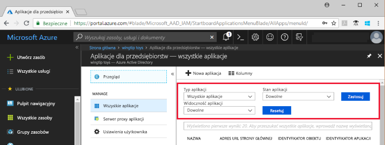

# Wyświetlanie aplikacji dzierżawy usługi Azure Active Directory

W tym przewodniku Szybki start opisano wyświetlanie aplikacji w dzierżawie usługi Azure Active Directory (Azure AD) przy użyciu witryny Azure Portal.

## Przed rozpoczęciem

Aby zobaczyć wyniki, musisz mieć co najmniej jedną aplikację w dzierżawie usługi Azure AD. Aby dodać aplikację, zobacz przewodnik Szybki start [Dodawanie aplikacji](add-application-portal.md).

Zaloguj się do witryny [Azure Portal](https://portal.azure.com) jako administrator globalny dzierżawy usługi Azure AD, administrator aplikacji w chmurze lub administrator aplikacji.

## Wyszukiwanie listy aplikacji dzierżawy

Aplikacje dzierżawy usługi Azure AD można wyświetlić w sekcji **Aplikacje dla przedsiębiorstw** witryny Azure Portal.

Aby znaleźć swoje aplikacje dzierżawy, wykonaj następujące czynności:

1. W witrynie **[Azure Portal](https://portal.azure.com)** w panelu nawigacyjnym po lewej stronie kliknij pozycję **Azure Active Directory**. 

2. W bloku Azure Active Directory kliknij pozycję **Aplikacje dla przedsiębiorstw**. 

3. Z menu rozwijanego **Typ aplikacji** wybierz pozycję **Wszystkie aplikacje** i kliknij pozycję **Zastosuj**. Zostanie wyświetlona losowa próbka aplikacji dzierżawy.

    
   
4. Aby wyświetlić więcej aplikacji, kliknij pozycję **Pokaż więcej** w dolnej części listy. W zależności od liczby aplikacji w dzierżawie może być łatwiej [wyszukać konkretną aplikację](#search-for-a-tenant-application) zamiast przewijać listę.

## Wybieranie opcje wyświetlania

W tej sekcji wybierz odpowiednie opcje w zależności od tego, czego szukasz.

1. Możesz przejrzeć aplikacje według opcji dla **Typu aplikacji**, **Stanu aplikacji** i **Widoczności aplikacji**. 

    

2. W obszarze **Typ aplikacji** wybierz jedną z następujących opcji:

    - Opcja **Aplikacje dla przedsiębiorstw** wyświetla aplikacje firm innych niż Microsoft.
    - Opcja **Aplikacje firmy Microsoft** wyświetla aplikacji firmy Microsoft.
    - Opcja **Wszystkie aplikacje** wyświetla zarówno aplikacje firm innych niż Microsoft, jak i aplikacje firmy Microsoft.

3. W obszarze **Stan aplikacji** wybierz pozycję **Dowolne**, **Wyłączono** lub **Włączono**. Opcja **Dowolne** obejmuje zarówno aplikacje wyłączone, jak i włączone.

4. W obszarze **Widoczność aplikacji** wybierz pozycję **Dowolne** lub **Ukryte**. Opcja **Ukryte** wyświetla aplikacje, które znajdują się w dzierżawie, ale nie są widoczne dla użytkowników.

5. Po wybraniu odpowiedniej opcji kliknij pozycję **Zastosuj**.
 

## Wyszukiwanie aplikacji dzierżawy

Aby wyszukać określoną aplikację, wykonaj następujące czynności:

1. W menu **Typ aplikacji** wybierz pozycję **Wszystkie aplikacje** i kliknij pozycję **Zastosuj**.

2. Wprowadź nazwę aplikacji, którą chcesz znaleźć. Jeśli aplikacja została dodana do dzierżawy usługi Azure AD, pojawi się w wynikach wyszukiwania. W tym przykładzie widać, że serwis GitHub nie został dodany do aplikacji dzierżawy.

    

3. Spróbuj wprowadzić kilka pierwszych liter nazwy aplikacji.  W tym przykładzie pokazano wszystkie aplikacje, których nazwy zaczynają się od **Sales**.

    

## Następne kroki

W tym przewodniku Szybki start przedstawiono sposób wyświetlania aplikacji w dzierżawie usługi Azure AD oraz sposób filtrowania listy aplikacji według typu, stanu i widoczności aplikacji. Przedstawiono również sposób wyszukiwania określonej aplikacji.

Teraz, gdy znaleziono już odpowiednią aplikację, możesz [dodać więcej aplikacji do dzierżawy](add-application-portal.md) lub kliknąć aplikację, aby wyświetlić lub edytować właściwości i opcje konfiguracji. Możesz na przykład skonfigurować logowanie jednokrotne. 

> [!div class="nextstepaction"]
> [Konfigurowanie logowania jednokrotnego](configure-single-sign-on-portal.md)

