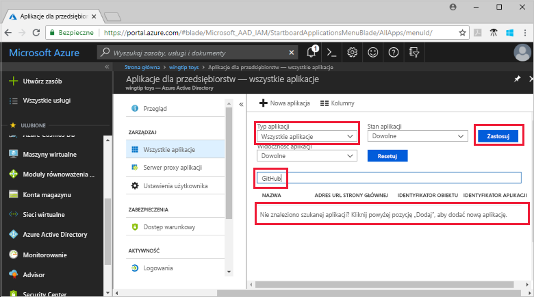
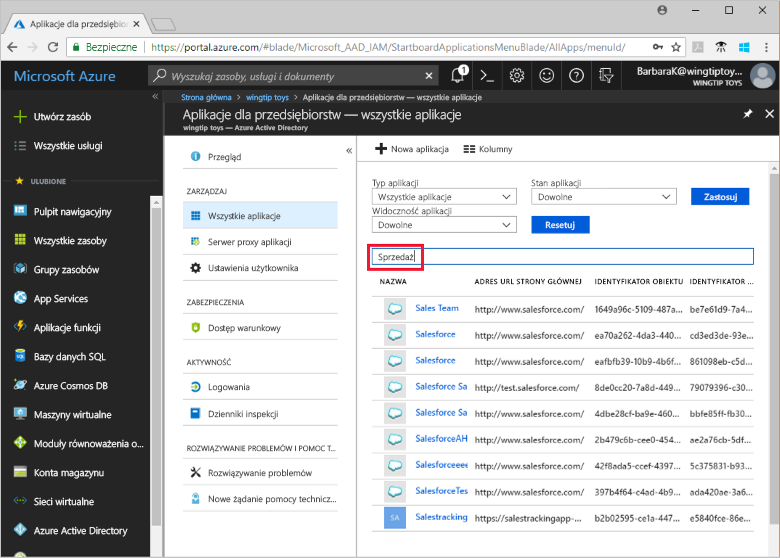

# Wyświetlanie aplikacji dzierżawy usługi Azure Active Directory

W tym przewodniku Szybki start opisano wyświetlanie aplikacji w dzierżawie usługi Azure Active Directory (Azure AD) przy użyciu witryny Azure Portal.

## Przed rozpoczęciem

Aby zobaczyć wyniki, musisz mieć co najmniej jedną aplikację w dzierżawie usługi Azure AD. Aby dodać aplikację, zobacz przewodnik Szybki start [Dodawanie aplikacji](add-application-portal.md).

Zaloguj się do witryny [Azure Portal](https://portal.azure.com) jako administrator globalny dzierżawy usługi Azure AD, administrator aplikacji w chmurze lub administrator aplikacji.

## Wyszukiwanie listy aplikacji dzierżawy

Aplikacje dzierżawy usługi Azure AD można wyświetlić w sekcji **Aplikacje dla przedsiębiorstw** witryny Azure Portal.

Aby znaleźć swoje aplikacje dzierżawy, wykonaj następujące czynności:

1. W  **[witryny Azure portal](https://portal.azure.com)**, w panelu nawigacyjnym po lewej stronie wybierz **usługi Azure Active Directory**. 

1. W **usługi Azure Active Directory** okienku wybierz **aplikacje dla przedsiębiorstw**. 

1. Z **typ aplikacji** menu rozwijanego wybierz opcję **wszystkie aplikacje**i wybierz polecenie **Zastosuj**. Zostanie wyświetlona losowa próbka aplikacji dzierżawy.
   
1. Aby wyświetlić więcej aplikacji, wybierz **Załaduj więcej** w dolnej części listy. W zależności od liczby aplikacji w dzierżawie może być łatwiej [wyszukać konkretną aplikację](#search-for-a-tenant-application) zamiast przewijać listę.

## Wybieranie opcje wyświetlania

Wybierz opcje zgodnie z czego szukasz.

1. Można przejrzeć aplikacje przez **typ aplikacji**, **stan aplikacji**, i **widoczność aplikacji**. 

1. W obszarze **Typ aplikacji** wybierz jedną z następujących opcji:

    - Opcja **Aplikacje dla przedsiębiorstw** wyświetla aplikacje firm innych niż Microsoft.
    - Opcja **Aplikacje firmy Microsoft** wyświetla aplikacji firmy Microsoft.
    - Opcja **Wszystkie aplikacje** wyświetla zarówno aplikacje firm innych niż Microsoft, jak i aplikacje firmy Microsoft.

1. W obszarze **Stan aplikacji** wybierz pozycję **Dowolne**, **Wyłączono** lub **Włączono**. Opcja **Dowolne** obejmuje zarówno aplikacje wyłączone, jak i włączone.

1. W obszarze **Widoczność aplikacji** wybierz pozycję **Dowolne** lub **Ukryte**. **Ukryty** opcja umożliwia pokazanie aplikacje, które są w dzierżawie, ale nie są widoczne dla użytkowników.

1. Po wybraniu wybrane opcje, wybierz **Zastosuj**.
 

## Wyszukiwanie aplikacji dzierżawy

Aby wyszukać określoną aplikację:

1. W **typ aplikacji** menu, wybierz opcję **wszystkie aplikacje**i wybierz polecenie **Zastosuj**.

1. Wprowadź nazwę aplikacji, którą chcesz znaleźć. Jeśli aplikacja została dodana do dzierżawy usługi Azure AD, zostanie wyświetlony w wynikach wyszukiwania. Ten przykład pokazuje, że GitHub nie został dodany do aplikacji dzierżawy.

    

1. Spróbuj wprowadzić kilka pierwszych liter nazwy aplikacji. W tym przykładzie pokazano wszystkie aplikacje, których nazwy zaczynają się od **Sales**.

    

## Kolejne kroki

W tym przewodniku Szybki Start przedstawiono sposób wyświetlania aplikacji w dzierżawie usługi Azure AD. Pokazaliśmy ci, jak filtrować listę aplikacji według typu aplikacji, stanu i widoczności. Przedstawiono również sposób wyszukiwania określonej aplikacji.

Teraz, gdy Ci się znaleźć aplikacji zostały znalezione dla można kontynuować [Dodawanie większej liczby aplikacji z dzierżawą](add-application-portal.md). Alternatywnie można wybrać aplikację, aby wyświetlić lub edytować właściwości i opcje konfiguracji. Możesz na przykład skonfigurować logowanie jednokrotne. 

> [!div class="nextstepaction"]
> [Konfigurowanie logowania jednokrotnego](configure-single-sign-on-portal.md)

