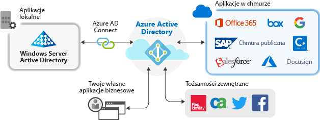

# Zarządzanie aplikacjami przy użyciu usługi Azure Active Directory

Azure Active Directory (Azure AD) upraszcza sposób Zarządzanie aplikacjami, zapewniając system jednej tożsamości dla Twoich aplikacji w chmurze i lokalnych. Można dodać swoje oprogramowanie jako usługa (SaaS) aplikacji, aplikacje lokalne i aplikacje biznesowe (LOB) do usługi Azure AD. Następnie użytkownik zalogować jeden raz sposób bezpieczny i bezproblemowy dostęp do aplikacji, wraz z usługi Office 365 i innych aplikacji biznesowych firmy Microsoft. Można zmniejszyć koszty administracyjne dzięki automatyzacji, inicjowanie obsługi użytkowników. Aby zapewnić dostęp do bezpiecznych aplikacji, można użyć uwierzytelniania wieloskładnikowego i zasady dostępu warunkowego.

## Dlaczego warto zarządzać aplikacjami przy użyciu rozwiązania w chmurze?

Organizacje mają często setki aplikacji, których użytkownicy potrzebują do wykonania swojej pracy. Użytkownicy uzyskują dostęp do tych aplikacji z wielu urządzeń i lokalizacji. Nowe aplikacje są dodawane, tworzone i wycofywane każdego dnia. Wiele aplikacji i punktów dostępu jest ważniejsze niż kiedykolwiek do użycia oparte na chmurze rozwiązanie do zarządzania dostępem użytkowników do wszystkich aplikacji.

## Jakie aplikacje można zintegrować z usługą Azure AD?
Istnieją cztery główne typy aplikacji, które można dodać do swojej **aplikacje dla przedsiębiorstw** i zarządzanie nimi za pomocą usługi Azure AD:

-   **Aplikacje usługi Azure AD galerii** — usługa Azure AD ma galerii, który zawiera tysiące aplikacji, które zostały wstępnie zintegrowanych, aby uzyskać logowanie jednokrotne z usługą Azure AD. Niektóre z aplikacji używanych w Twojej organizacji prawdopodobnie znajdują się w galerii. [Więcej informacji na temat planowania usługi integracji aplikacji](plan-an-application-integration.md), lub uzyskać kroki integracji szczegółowe dla poszczególnych aplikacji w [samouczki aplikacji SaaS](https://docs.microsoft.com/azure/active-directory/saas-apps/). 

-   **Lokalne aplikacje przy użyciu serwera Proxy aplikacji** — serwer Proxy aplikacji usługi AD w przypadku usług Azure, aplikacje sieci web w środowisku lokalnym można zintegrować z usługą Azure AD w celu obsługi logowania jednokrotnego. Następnie użytkownicy końcowi mogą uzyskiwać dostęp aplikacji sieci web w środowisku lokalnym w taki sam sposób uzyskiwania dostępu do usługi Office 365 i innych aplikacji SaaS. [Dowiedz się, dlaczego używać serwera Proxy aplikacji i sposób jej działania](what-is-application-proxy.md).

-   **Aplikacje niestandardowe** — podczas kompilowania aplikacji line-of-business, można zintegrować je z usługą Azure AD w celu obsługi logowania jednokrotnego. Rejestrując aplikację z usługą Azure AD, masz kontrolę nad zasady uwierzytelniania dla aplikacji. Aby uzyskać więcej informacji, zobacz [wskazówki dla deweloperów](developer-guidance-for-integrating-applications.md).

-   **Aplikacje spoza galerii** — Przenoszenie własnych aplikacji! Obsługuje logowanie jednokrotne dla innych aplikacji przez dodanie ich do usługi Azure AD. Można zintegrować dowolny link sieci web, który ma lub dowolnej aplikacji, która renderuje pole nazwy użytkownika i hasła, obsługuje protokoły SAML lub OpenID Connect lub obsługuje standard SCIM. Aby uzyskać więcej informacji, zobacz [skonfigurować logowanie jednokrotne dla aplikacji spoza galerii](configure-single-sign-on-non-gallery-applications.md).

## Zarządzanie ryzykiem przy użyciu zasad dostępu warunkowego
Sprzężenia Azure AD logowania jednokrotnego (SSO) przy użyciu [dostępu warunkowego](https://docs.microsoft.com/azure/active-directory/conditional-access/overview) zapewnia wysoki poziom zabezpieczeń do uzyskiwania dostępu do aplikacji. Możliwości zabezpieczeń obejmują ochronę tożsamości w skali chmury, kontrolę dostępu opartą na ryzyku, natywne uwierzytelnianie wieloskładnikowe oraz zasady dostępu warunkowego. Te funkcje pozwalają na stosowanie zasad szczegółowej kontroli w oparciu o aplikacje lub grupy, które potrzebują wyższego poziomu zabezpieczeń.

## Zwiększanie produktywności dzięki logowaniu jednokrotnemu
Włączenie logowania jednokrotnego w aplikacjach i usłudze Office 365 zapewnia doskonałe środowisko logowania dla istniejących użytkowników dzięki ograniczeniu lub wyeliminowaniu monitów dotyczących logowania. Środowisko użytkownika wydaje się bardziej spójne i mniej rozpraszające bez wielu monitów i potrzeby zarządzania wieloma hasłami. Grupa biznesowa może zarządzać dostępem i zatwierdzać go za pośrednictwem samoobsługi i członkostwa dynamicznego. Zezwolenie odpowiednim osobom osób w firmie na zarządzanie dostępem do aplikacji zwiększa bezpieczeństwo systemu tożsamości.

Logowanie jednokrotne zwiększa bezpieczeństwo. *Bez logowania jednokrotnego* administratorzy muszą tworzyć i aktualizować konta użytkowników dla poszczególnych aplikacji, co zajmuje czas. Ponadto użytkownicy muszą śledzić wiele poświadczeń, aby uzyskiwać dostęp do swoich aplikacji. W rezultacie użytkownicy zwykle notują hasła lub używają innych rozwiązań do zarządzania hasłami, które wprowadzają zagrożenia bezpieczeństwa danych. [Dowiedz się więcej o rejestracji jednokrotnej](what-is-single-sign-on.md).

## Obsługa zarządzania i zgodności
Dzięki usłudze Azure AD można monitorować logowania do aplikacji za pomocą raportów korzystających z narzędzi do zarządzania informacjami i zdarzeniami zabezpieczeń (SIEM). Raporty są dostępne z poziomu portalu lub interfejsów API. Można również programowo przeprowadzać inspekcję użytkowników z dostępem do aplikacji i usuwać prawa dostępu do nieaktywnych użytkowników za pośrednictwem przeglądów dostępu.

## Zarządzanie kosztami
Dzięki migracji do usługi Azure AD można obniżyć koszty i rozwiązać problemy związane z zarządzaniem infrastrukturą lokalną. Usługa Azure AD oferuje również samoobsługowy dostęp do aplikacji, co pozwala zaoszczędzić czas pracy administratorów i użytkowników. Logowanie jednokrotne eliminuje hasła specyficzne dla aplikacji. Możliwość zalogowania się tylko raz pozwala zmniejszyć koszty związane z resetowaniem haseł aplikacji oraz utratą produktywności podczas pobierania haseł.

## Kolejne kroki

- [Co to jest serwer Proxy aplikacji?](what-is-application-proxy.md)
- [Szybki start: Dodawanie aplikacji z galerii do dzierżawy usługi Azure AD](add-application-portal.md)
