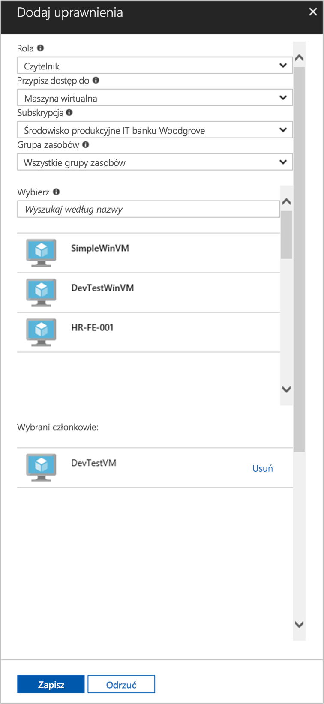

# <a name="use-a-linux-vm-system-assigned-managed-identity-to-access-azure-resource-manager"></a>Używanie przypisanej przez system tożsamości zarządzanej maszyny wirtualnej z systemem Linux do uzyskiwania dostępu do usługi Azure Resource Manager

[!INCLUDE [preview-notice](../../../includes/active-directory-msi-preview-notice.md)]

Ten samouczek przedstawia sposób używania tożsamości przypisanej przez system do maszyny wirtualnej z systemem Linux w celu uzyskania dostępu do interfejsu API usługi Azure Resource Manager. Tożsamości zarządzane dla zasobów platformy Azure są automatycznie zarządzane przez platformę Azure. Umożliwiają uwierzytelnianie w usługach obsługujących uwierzytelnianie usługi Azure AD bez potrzeby wprowadzania poświadczeń do kodu. Omawiane kwestie:

> [!div class="checklist"]
> * Udzielanie maszynie wirtualnej dostępu do grupy zasobów w usłudze Azure Resource Manager 
> * Uzyskiwanie tokenu dostępu przy użyciu tożsamości maszyny wirtualnej oraz używanie go do wywołania usługi Azure Resource Manager 

## <a name="prerequisites"></a>Wymagania wstępne

[!INCLUDE [msi-tut-prereqs](../../../includes/active-directory-msi-tut-prereqs.md)]

## <a name="grant-your-vm-access-to-a-resource-group-in-azure-resource-manager"></a>Udzielanie maszynie wirtualnej dostępu do grupy zasobów w usłudze Azure Resource Manager 

Używając tożsamości zarządzanych dla zasobów platformy Azure, kod może uzyskiwać tokeny dostępu, aby uwierzytelniać się w zasobach obsługujących uwierzytelnianie usługi Azure AD. Interfejs API usługi Azure Resource Manager obsługuje uwierzytelnianie usługi Azure AD. Najpierw musimy zapewnić tożsamości tej maszyny wirtualnej dostęp do zasobu w usłudze Azure Resource Manager — w tym przypadku do grupy zasobów, która zawiera maszynę wirtualną.  

1. Przejdź do karty **Grupy zasobów**.
2. Wybierz określoną **grupę zasobów**, która została utworzona wcześniej.
3. Przejdź do pozycji **Kontrola dostępu (IAM)** w panelu po lewej stronie.
4. Kliknij, aby **dodać** nowy przydział roli do maszyny wirtualnej. W pozycji **Rola** wybierz opcję **Czytelnik**.
5. Na następnej liście rozwijanej **Przypisz dostęp do** zasobu **Maszyna wirtualna**.
6. Następnie upewnij się, że odpowiednia subskrypcja znajduje się na liście rozwijanej **Subskrypcja**. W pozycji **Grupa zasobów** wybierz opcję **Wszystkie grupy zasobów**.
7. Na koniec w pozycji **Wybierz** użyj listy rozwijanej, aby wybrać maszynę wirtualną z systemem Linux, i kliknij przycisk **Zapisz**.

    

## <a name="get-an-access-token-using-the-vms-system-assigned-managed-identity-and-use-it-to-call-resource-manager"></a>Uzyskiwanie tokenu dostępu przy użyciu przypisanej przez system tożsamości zarządzanej maszyny wirtualnej i używanie jej do wywołania usługi Resource Manager 

Aby wykonać te kroki, będziesz potrzebować klienta SSH. Jeśli używasz systemu Windows, możesz użyć klienta SSH w pozycji [Podsystem Windows dla systemu Linux](https://msdn.microsoft.com/commandline/wsl/about). Jeżeli potrzebujesz pomocy w konfigurowaniu kluczy klienta SSH, zobacz [Jak używać kluczy SSH z systemem Windows na platformie Azure](../../virtual-machines/linux/ssh-from-windows.md) lub [Jak utworzyć i użyć parę publicznego i prywatnego klucza SSH dla maszyn wirtualnych z systemem Linux na platformie Azure](../../virtual-machines/linux/mac-create-ssh-keys.md).

1. W portalu przejdź do maszyny wirtualnej z systemem Linux i w pozycji **Przegląd** kliknij opcję **Połącz**.  
2. **Połącz** się z maszyną wirtualną przy użyciu wybranego klienta SSH. 
3. W oknie terminala wyślij za pomocą narzędzia `curl` żądanie do lokalnego punktu końcowego tożsamości zarządzanych dla zasobów platformy Azure, aby uzyskać token dostępu do usługi Azure Resource Manager.  
 
    Żądanie programu `curl` dla tokenu dostępu znajduje się poniżej.  
    
    ```bash
    curl 'http://169.254.169.254/metadata/identity/oauth2/token?api-version=2018-02-01&resource=https://management.azure.com/' -H Metadata:true   
    ```
    
    > [!NOTE]
    > Wartość parametru „resource” musi być dokładnie dopasowana do tego, czego oczekujemy od usługi Azure AD.  In the case of the Resource Manager resource ID, you must include the trailing slash on the URI. 
    
    Odpowiedź zawiera token dostępu wymagany do uzyskania dostępu do usługi Azure Resource Manager. 
    
    Odpowiedź:  

    ```bash
    {"access_token":"eyJ0eXAiOi...",
    "refresh_token":"",
    "expires_in":"3599",
    "expires_on":"1504130527",
    "not_before":"1504126627",
    "resource":"https://management.azure.com",
    "token_type":"Bearer"} 
    ```
    
    Możesz użyć tego tokenu dostępu w celu uzyskania dostępu do usługi Azure Resource Manager, np. aby odczytać właściwości grupy zasobów, do której wcześniej udzielono dostępu tej maszynie wirtualnej. Replace the values of \<SUBSCRIPTION ID\>, \<RESOURCE GROUP\>, and \<ACCESS TOKEN\> with the ones you created earlier. 
    
    > [!NOTE]
    > W adresie URL rozróżniana jest wielkość liter, więc upewnij się, że użyto takich samych wartości jak wcześniej, podczas nazywania grupy zasobów — z wielką literą „G” w nazwie „resourceGroup”.  
    
    ```bash 
    curl https://management.azure.com/subscriptions/<SUBSCRIPTION ID>/resourceGroups/<RESOURCE GROUP>?api-version=2016-09-01 -H "Authorization: Bearer <ACCESS TOKEN>" 
    ```
    
    Odpowiedz przy użyciu konkretnych informacji o grupie zasobów:    
    ```bash
    {"id":"/subscriptions/98f51385-2edc-4b79-bed9-7718de4cb861/resourceGroups/DevTest","name":"DevTest","location":"westus","properties":{"provisioningState":"Succeeded"}} 
    ```

## <a name="next-steps"></a>Następne kroki

W tym przewodniku Szybki start przedstawiono sposób używania tożsamości zarządzanej przypisanej przez system w celu uzyskania dostępu do interfejsu API usługi Azure Resource Manager.  Aby dowiedzieć się więcej o usłudze Azure Resource Manager, zobacz:

> [!div class="nextstepaction"]
>[Azure Resource Manager](/azure/azure-resource-manager/resource-group-overview)
>[Create, list or delete a user-assigned managed identity using Azure PowerShell](how-to-manage-ua-identity-powershell.md)
