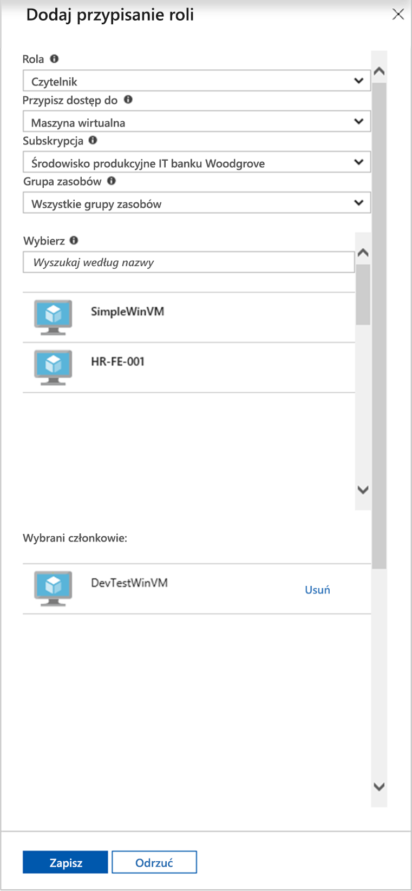

# <a name="use-a-windows-vm-system-assigned-managed-identity-to-access-resource-manager"></a>Używanie przypisanej przez system tożsamości zarządzanej maszyny wirtualnej z systemem Windows do uzyskiwania dostępu do usługi Resource Manager

[!INCLUDE [preview-notice](../../../includes/active-directory-msi-preview-notice.md)]

Ten podręcznik Szybki start przedstawia sposób uzyskiwania dostępu do interfejsu API usługi Azure Resource Manager za pomocą maszyny wirtualnej z systemem Windows z włączoną tożsamością zarządzaną przypisaną przez system. Tożsamości zarządzane dla zasobów platformy Azure są automatycznie zarządzane przez platformę Azure. Umożliwiają uwierzytelnianie w usługach obsługujących uwierzytelnianie usługi Azure AD bez potrzeby wprowadzania poświadczeń do kodu. Omawiane kwestie:

> [!div class="checklist"] 
> * Udzielanie maszynie wirtualnej dostępu do grupy zasobów w usłudze Azure Resource Manager 
> * Uzyskiwanie tokenu dostępu przy użyciu tożsamości maszyny wirtualnej oraz używanie go do wywołania usługi Azure Resource Manager

## <a name="prerequisites"></a>Wymagania wstępne

[!INCLUDE [msi-tut-prereqs](../../../includes/active-directory-msi-tut-prereqs.md)]

## <a name="grant-your-vm-access-to-a-resource-group-in-resource-manager"></a>Udzielanie maszynie wirtualnej dostępu do grupy zasobów w usłudze Resource Manager
Używając tożsamości zarządzanych dla zasobów platformy Azure, kod może uzyskiwać tokeny dostępu, aby uwierzytelniać się w zasobach obsługujących uwierzytelnianie usługi Azure AD.  Usługa Azure Resource Manager obsługuje uwierzytelnianie usługi Azure AD.  Najpierw musimy zapewnić tożsamości zarządzanej przypisanej przez system tej maszyny wirtualnej dostęp do zasobu w usłudze Resource Manager, w tym przypadku do grupy zasobów, która zawiera maszynę wirtualną.  

1.  Przejdź do karty **Grupy zasobów**. 
2.  Wybierz konkretną **grupę zasobów**, która została utworzona na potrzeby **maszyny wirtualnej z systemem Windows**. 
3.  Przejdź do pozycji **Kontrola dostępu (IAM)** w panelu po lewej stronie. 
4.  Następnie **Dodaj** nowy przydział roli do **maszyny wirtualnej z systemem Windows**.  W pozycji **Rola** wybierz opcję **Czytelnik**. 
5.  Na następnej liście rozwijanej **Przypisz dostęp do** zasobu **Maszyna wirtualna**. 
6.  Następnie upewnij się, że odpowiednia subskrypcja znajduje się na liście rozwijanej **Subskrypcja**. W pozycji **Grupa zasobów** wybierz opcję **Wszystkie grupy zasobów**. 
7.  Na koniec w pozycji **Wybierz** użyj listy rozwijanej, aby wybrać maszynę wirtualną z systemem Windows i kliknij przycisk **Zapisz**.

    

## <a name="get-an-access-token-using-the-vms-system-assigned-managed-identity-and-use-it-to-call-azure-resource-manager"></a>Uzyskiwanie tokenu dostępu przy użyciu przypisanej przez system tożsamości zarządzanej maszyny wirtualnej i używanie jej do wywołania usługi Azure Resource Manager 

W tej części musisz użyć programu **PowerShell**.  Jeśli program **PowerShell** nie został zainstalowany, pobierz go [stąd](https://docs.microsoft.com/powershell/azure/overview?view=azurermps-4.3.1). 

1.  W portalu przejdź do pozycji **Maszyny wirtualne**, a następnie przejdź do swojej maszyny wirtualnej z systemem Windows i w pozycji **Przegląd** kliknij przycisk **Połącz**. 
2.  Wprowadź **nazwę użytkownika** i **hasło** dodane podczas tworzenia maszyny wirtualnej z systemem Windows. 
3.  Teraz, po utworzeniu **połączenia pulpitu zdalnego** z maszyną wirtualną, otwórz program **PowerShell** w sesji zdalnej. 
4.  Używając polecenia Invoke-WebRequest programu PowerShell, wyślij żądanie do lokalnego punktu końcowego tożsamości zarządzanej dla zasobów platformy Azure, aby uzyskać token dostępu na potrzeby usługi Azure Resource Manager.

    ```powershell
       $response = Invoke-WebRequest -Uri 'http://169.254.169.254/metadata/identity/oauth2/token?api-version=2018-02-01&resource=https%3A%2F%2Fmanagement.azure.com%2F' -Method GET -Headers @{Metadata="true"}
    ```
    
    > [!NOTE]
    > Wartość parametru „resource” musi być dokładnie dopasowana do tego, czego oczekujemy od usługi Azure AD. W przypadku użycia identyfikatora zasobu usługi Azure Resource Manager należy uwzględnić końcowy ukośnik w identyfikatorze URI.
    
    Następnie wyodrębnij pełną odpowiedź, która jest przechowywana w ciągu w formacie JavaScript Object Notation (JSON) w obiekcie $response. 
    
    ```powershell
    $content = $response.Content | ConvertFrom-Json
    ```
    Następnie wyodrębnij token dostępu z odpowiedzi.
    
    ```powershell
    $ArmToken = $content.access_token
    ```
    
    Na koniec wywołaj usługę Azure Resource Manager przy użyciu tokenu dostępu. W tym przykładzie używamy również polecenia Invoke-WebRequest programu PowerShell, aby wysłać wywołanie do usługi Azure Resource Manager i uwzględnić token dostępu w nagłówku autoryzacji.
    
    ```powershell
    (Invoke-WebRequest -Uri https://management.azure.com/subscriptions/<SUBSCRIPTION ID>/resourceGroups/<RESOURCE GROUP>?api-version=2016-06-01 -Method GET -ContentType "application/json" -Headers @{ Authorization ="Bearer $ArmToken"}).content
    ```
    > [!NOTE] 
    > W adresie URL rozróżniana jest wielkość liter, więc upewnij się, że użyto takich samych wartości jak wcześniej, podczas nazywania grupy zasobów — z wielką literą „G” w nazwie „resourceGroups”.
        
    Poniższe polecenie zwraca szczegóły grupy zasobów:

    ```powershell
    {"id":"/subscriptions/98f51385-2edc-4b79-bed9-7718de4cb861/resourceGroups/DevTest","name":"DevTest","location":"westus","properties":{"provisioningState":"Succeeded"}}
    ```

## <a name="next-steps"></a>Następne kroki

W tym przewodniku Szybki start przedstawiono sposób używania tożsamości zarządzanej przypisanej przez system w celu uzyskania dostępu do interfejsu API usługi Azure Resource Manager.  Aby dowiedzieć się więcej o usłudze Azure Resource Manager, zobacz:

> [!div class="nextstepaction"]
>[Azure Resource Manager](/azure/azure-resource-manager/resource-group-overview)

