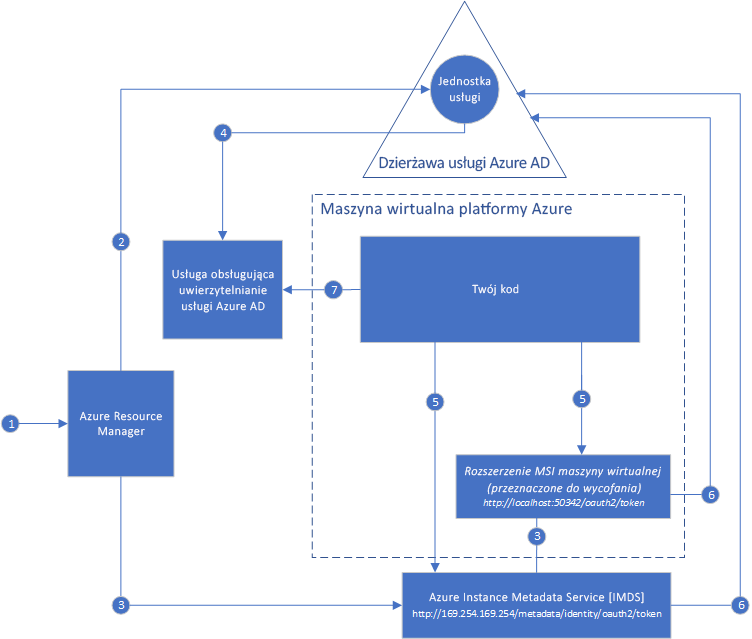

# Co to jest tożsamość usługi zarządzanej dla zasobów platformy Azure?

[!INCLUDE[preview-notice](../../../includes/active-directory-msi-preview-notice.md)]

Typowym wyzwaniem podczas kompilowania aplikacji w chmurze jest sposób zarządzania poświadczeniami w kodzie w przypadku uwierzytelniania przy użyciu usług w chmurze. Zabezpieczanie poświadczeń to ważne zadanie. W idealnej sytuacji poświadczenia nie są nigdy wyświetlane na stacjach roboczych deweloperów ani zaewidencjonowane do kontroli źródła. Usługa Azure Key Vault oferuje bezpieczny sposób przechowywania poświadczeń, wpisów tajnych i innych kluczy, ale w celu ich pobrania należy uwierzytelnić kod w usłudze Key Vault. 

Funkcja tożsamości usługi zarządzanej w usłudze Azure Active Directory (Azure AD) rozwiązuje ten problem. Funkcja ta udostępnia usługom platformy Azure automatycznie zarządzaną tożsamość w usłudze Azure AD. Za pomocą tej tożsamości można uwierzytelnić się w dowolnej usłudze obsługującej uwierzytelnianie usługi Azure AD, w tym w usłudze Key Vault, bez konieczności umieszczania poświadczeń w kodzie.

Funkcja tożsamości usługi zarządzanej jest bezpłatna w usłudze Azure AD dla subskrypcji platformy Azure. Nie ma żadnych dodatkowych kosztów.

## Jak działa funkcja?

Istnieją dwa typy tożsamości zarządzanych:

- **Tożsamość przypisana przez system** jest włączana bezpośrednio w wystąpieniu usługi platformy Azure. Po włączeniu tożsamości platforma Azure tworzy tożsamość wystąpienia w dzierżawie usługi Azure AD, która jest zaufaną dzierżawą subskrypcji wystąpienia. Po utworzeniu tożsamości poświadczenia są aprowizowane w wystąpieniu. Cykl życiowy tożsamości przypisanej przez system jest bezpośrednio powiązany z wystąpieniem usługi platformy Azure, w którym została ona włączona. Usunięcie wystąpienia spowoduje, że platforma Azure automatycznie oczyści poświadczenia i tożsamość w usłudze Azure AD.
- **Tożsamość przypisana przez użytkownika** jest tworzona jako autonomiczny zasób platformy Azure. W ramach procesu tworzenia platforma Azure tworzy tożsamość w dzierżawie usługi Azure AD, której ufa używana subskrypcja. Utworzoną tożsamość można przypisać do co najmniej jednego wystąpienia usługi platformy Azure. Cykl życiowy tożsamości przypisanej przez użytkownika jest zarządzany oddzielnie od cyklu życiowego wystąpień usługi platformy Azure, do których została przypisana.

Przy użyciu tożsamości usługi zarządzanej kod może zażądać tokenów dostępu dla usług obsługujących uwierzytelnianie usługi Azure AD. Platforma Azure zapewnia stopniową obsługę poświadczeń, które są używane przez wystąpienie usługi.

Na poniższym diagramie pokazano, jak tożsamości usługi zarządzanej współpracują z maszynami wirtualnymi platformy Azure:

### Jak tożsamość przypisana przez system współpracuje z maszyną wirtualną platformy Azure

1. Usługa Azure Resource Manager otrzymuje żądanie włączenia tożsamości przypisanej przez system na maszynie wirtualnej.
2. Usługa Azure Resource Manager tworzy w usłudze Azure AD jednostkę usługi potrzeby tożsamości maszyny wirtualnej. Jednostka usługi jest tworzona w dzierżawie usługi Azure AD, która jest zaufana w ramach subskrypcji.
3. Usługa Azure Resource Manager konfiguruje tożsamość na maszynie wirtualnej:
    1. Aktualizuje punkt końcowy tożsamości usługi Azure Instance Metadata Service przy użyciu certyfikatu i identyfikatora klienta jednostki usługi.
    1. Aprowizuje rozszerzenie maszyny wirtualnej oraz dodaje certyfikat i identyfikator klienta jednostki usługi. (Ten krok ma zostać uznany za przestarzały).
4. Teraz, gdy maszyna wirtualna zyskała tożsamość, używamy informacji o jednostce usługi w celu przyznania maszynie wirtualnej dostępu do zasobów platformy Azure. Aby wywołać usługę Azure Resource Manager, należy użyć kontroli dostępu opartej na rolach (RBAC) w usłudze Azure AD w celu przypisania odpowiedniej roli do jednostki usługi maszyny wirtualnej. Aby wywołać usługę Key Vault, należy przyznać kodowi dostęp do określonego wpisu tajnego lub klucza w usłudze Key Vault.
5. Kod uruchomiony na maszynie wirtualnej może żądać tokenu z dwóch punktów końcowych, które są dostępne jedynie z poziomu maszyny wirtualnej:

    - Punkt końcowy tożsamości usługi Azure Instance Metadata Service (opcja zalecana): `http://169.254.169.254/metadata/identity/oauth2/token`
        - Parametr zasobu określa usługę, do której jest wysyłany token. Aby przeprowadzić uwierzytelnianie w usłudze Azure Resource Manager, należy użyć elementu `resource=https://management.azure.com/`.
        - Parametr wersji interfejsu API określa wersję usługi IMDS, użyj wartości api-version=2018-02-01 lub nowszej.
    - Rozszerzenie punktu końcowego maszyny wirtualnej (opcja zaplanowana do uznania za przestarzałą): `http://localhost:50342/oauth2/token` 
        - Parametr zasobu określa usługę, do której jest wysyłany token. Aby przeprowadzić uwierzytelnianie w usłudze Azure Resource Manager, należy użyć elementu `resource=https://management.azure.com/`.

6. W usłudze Azure AD jest wykonywane wywołanie żądające tokenu dostępu (jak określono w kroku 5) przy użyciu certyfikatu i identyfikatora klienta skonfigurowanego w kroku 3. Usługa Azure AD zwraca token dostępu powiązany z internetowym tokenem JSON (JWT, JSON Web Token).
7. Kod wysyła token dostępu w wywołaniu do usługi, która obsługuje uwierzytelnianie w usłudze Azure AD.

### Jak tożsamość przypisana przez użytkownika współpracuje z maszyną wirtualną platformy Azure

1. Usługa Azure Resource Manager otrzymuje żądanie włączenia tożsamości przypisanej przez użytkownika.
2. Usługa Azure Resource Manager tworzy w usłudze Azure AD jednostkę usługi na potrzeby tożsamości przypisanej przez użytkownika. Jednostka usługi jest tworzona w dzierżawie usługi Azure AD, która jest zaufana w ramach subskrypcji.
3. Usługa Azure Resource Manager otrzymuje żądanie skonfigurowania tożsamości przypisanej przez użytkownika na maszynie wirtualnej:
    1. Aktualizuje punkt końcowy tożsamości usługi Azure Instance Metadata Service przy użyciu certyfikatu i identyfikatora klienta jednostki usługi tożsamości przypisanej przez użytkownika.
    1. Aprowizuje rozszerzenie maszyny wirtualnej i dodaje certyfikat i identyfikator klienta jednostki usługi tożsamości przypisanej przez użytkownika. (Ten krok ma zostać uznany za przestarzały).
4. Po utworzeniu tożsamości przypisanej przez użytkownika należy użyć informacji o jednostce usługi w celu przyznania dostępu do zasobów platformy Azure. Aby wywołać usługę Azure Resource Manager, należy użyć funkcji RBAC w usłudze Azure AD w celu przypisania odpowiedniej roli do jednostki usługi tożsamości przypisanej przez użytkownika. Aby wywołać usługę Key Vault, należy przyznać kodowi dostęp do określonego wpisu tajnego lub klucza w usłudze Key Vault.

   > [!Note]
   > Ten krok można również wykonać przed krokiem 3.

5. Kod uruchomiony na maszynie wirtualnej może żądać tokenu z dwóch punktów końcowych, które są dostępne jedynie z poziomu maszyny wirtualnej:

    - Punkt końcowy tożsamości usługi Azure Instance Metadata Service (opcja zalecana): `http://169.254.169.254/metadata/identity/oauth2/token`
        - Parametr zasobu określa usługę, do której jest wysyłany token. Aby przeprowadzić uwierzytelnianie w usłudze Azure Resource Manager, należy użyć elementu `resource=https://management.azure.com/`.
        - Parametr Identyfikator klienta określa tożsamość, dla której jest żądany token. Ta wartość jest wymagana do przeprowadzenia uściślania, gdy na jednej maszynie wirtualnej znajduje się więcej niż jedna tożsamość przypisana przez użytkownika.
        - Parametr wersji interfejsu API określa wersję usługi Azure Instance Metadata Service. Należy użyć wersji `api-version=2018-02-01` lub nowszej.

    - Rozszerzenie punktu końcowego maszyny wirtualnej (opcja zaplanowana do uznania za przestarzałą): `http://localhost:50342/oauth2/token`
        - Parametr zasobu określa usługę, do której jest wysyłany token. Aby przeprowadzić uwierzytelnianie w usłudze Azure Resource Manager, należy użyć elementu `resource=https://management.azure.com/`.
        - Parametr Identyfikator klienta określa tożsamość, dla której jest żądany token. Ta wartość jest wymagana do przeprowadzenia uściślania, gdy na jednej maszynie wirtualnej znajduje się więcej niż jedna tożsamość przypisana przez użytkownika.
6. W usłudze Azure AD jest wykonywane wywołanie żądające tokenu dostępu (jak określono w kroku 5) przy użyciu certyfikatu i identyfikatora klienta skonfigurowanego w kroku 3. Usługa Azure AD zwraca token dostępu powiązany z internetowym tokenem JSON (JWT, JSON Web Token).
7. Kod wysyła token dostępu w wywołaniu do usługi, która obsługuje uwierzytelnianie w usłudze Azure AD.

## Jak mogę używać tożsamości usługi zarządzanej?

Aby dowiedzieć się, jak uzyskiwać dostęp do różnych zasobów platformy Azure za pomocą tożsamości usługi zarządzanej, wypróbuj te samouczki.

Dowiedz się, jak używać tożsamości usługi zarządzanej z maszyną wirtualną z systemem Windows:

* [Uzyskiwanie dostępu do usługi Azure Data Lake Store](tutorial-windows-vm-access-datalake.md)
* [Uzyskiwanie dostępu do usługi Azure Resource Manager](tutorial-windows-vm-access-arm.md)
* [Uzyskiwanie dostępu do usługi Azure SQL](tutorial-windows-vm-access-sql.md)
* [Uzyskiwanie dostępu do usługi Azure Storage przy użyciu klucza dostępu](tutorial-windows-vm-access-storage.md)
* [Uzyskiwanie dostępu do usługi Azure Storage przy użyciu sygnatur dostępu współdzielonego](tutorial-windows-vm-access-storage-sas.md)
* [Uzyskiwanie dostępu do zasobu spoza usługi Azure AD przy użyciu usługi Azure Key Vault](tutorial-windows-vm-access-nonaad.md)

Dowiedz się, jak używać tożsamości usługi zarządzanej z maszyną wirtualną z systemem Linux:

* [Uzyskiwanie dostępu do usługi Azure Data Lake Store](tutorial-linux-vm-access-datalake.md)
* [Uzyskiwanie dostępu do usługi Azure Resource Manager](tutorial-linux-vm-access-arm.md)
* [Uzyskiwanie dostępu do usługi Azure Storage przy użyciu klucza dostępu](tutorial-linux-vm-access-storage.md)
* [Uzyskiwanie dostępu do usługi Azure Storage przy użyciu sygnatur dostępu współdzielonego](tutorial-linux-vm-access-storage-sas.md)
* [Uzyskiwanie dostępu do zasobu spoza usługi Azure AD przy użyciu usługi Azure Key Vault](tutorial-linux-vm-access-nonaad.md)

Dowiedz się, jak używać tożsamości usługi zarządzanej z innymi usługami platformy Azure:

* [Azure App Service](/azure/app-service/app-service-managed-service-identity)
* [Azure Functions](/azure/app-service/app-service-managed-service-identity)
* [Azure Service Bus](../../service-bus-messaging/service-bus-managed-service-identity.md)
* [Azure Event Hubs](../../event-hubs/event-hubs-managed-service-identity.md)
* [Azure API Management](../../api-management/api-management-howto-use-managed-service-identity.md)

## Jakie usługi platformy Azure obsługują funkcję?

Tożsamości usługi zarządzanej mogą służyć do uwierzytelniania w usługach obsługujących uwierzytelnianie usługi Azure AD. Listę usług platformy Azure, które obsługują funkcję tożsamości usługi zarządzanej, można znaleźć w temacie [Services that support Managed Service Identity (Usługi, które obsługują tożsamość usługi zarządzanej)](services-support-msi.md).

## Następne kroki

Rozpocznij pracę z funkcją tożsamości usługi zarządzanej, korzystając z następujących przewodników Szybki start:

* [Używanie tożsamości usługi zarządzanej na maszynie wirtualnej z systemem Windows do uzyskiwania dostępu do usługi Resource Manager](tutorial-windows-vm-access-arm.md)
* [Używanie tożsamości usługi zarządzanej na maszynie wirtualnej z systemem Linux do uzyskiwania dostępu do usługi Resource Manager](tutorial-linux-vm-access-arm.md)
