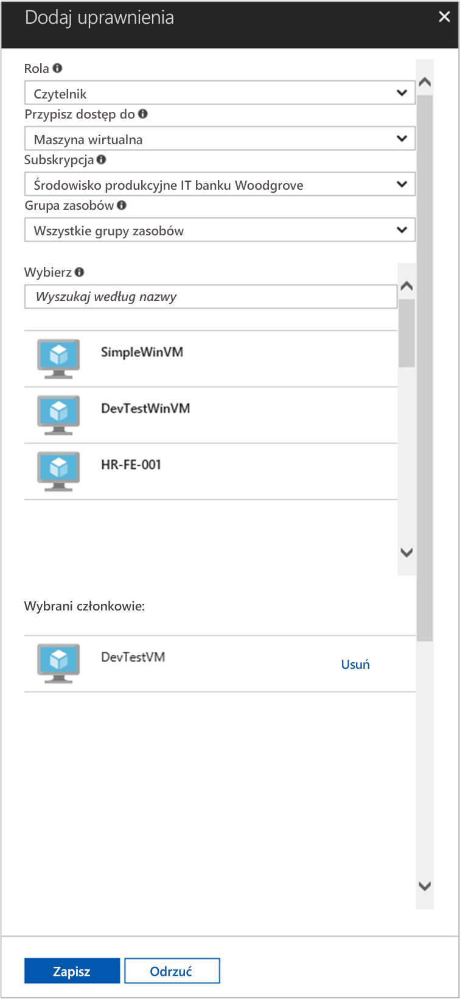

# <a name="use-a-linux-vm-managed-service-identity-msi-to-access-azure-resource-manager"></a>Używanie tożsamości usługi zarządzanej (MSI) na maszynie wirtualnej z systemem Linux do uzyskiwania dostępu do usługi Azure Resource Manager

[!INCLUDE[preview-notice](../../../includes/active-directory-msi-preview-notice.md)]

Ten samouczek przedstawia sposób włączania tożsamości usługi zarządzanej (MSI) dla maszyny wirtualnej z systemem Linux, a następnie użycia tej tożsamości do uzyskania dostępu do usługi Azure Resource Manager. Tożsamości usługi zarządzanej są automatycznie zarządzane przez platformę Azure. Umożliwiają uwierzytelnianie w usługach obsługujących uwierzytelnianie usługi Azure AD bez potrzeby wprowadzania poświadczeń do kodu. Omawiane kwestie:

> [!div class="checklist"]
> * Włączanie tożsamości usługi zarządzanej na maszynie wirtualnej z systemem Linux 
> * Udzielanie maszynie wirtualnej dostępu do grupy zasobów w usłudze Azure Resource Manager 
> * Uzyskiwanie tokenu dostępu przy użyciu tożsamości maszyny wirtualnej oraz używanie go do wywołania usługi Azure Resource Manager 

## <a name="prerequisites"></a>Wymagania wstępne

[!INCLUDE [msi-qs-configure-prereqs](../../../includes/active-directory-msi-qs-configure-prereqs.md)]

[!INCLUDE [msi-tut-prereqs](../../../includes/active-directory-msi-tut-prereqs.md)]

## <a name="sign-in-to-azure"></a>Logowanie do platformy Azure

Zaloguj się do witryny Azure Portal pod adresem [https://portal.azure.com](https://portal.azure.com).

## <a name="create-a-linux-virtual-machine-in-a-new-resource-group"></a>Tworzenie maszyny wirtualnej z systemem Linux w nowej grupie zasobów

W tym samouczku utworzymy nową maszynę wirtualną z systemem Linux. Możesz też włączyć tożsamość usługi zarządzanej na istniejącej maszynie wirtualnej.

1. Kliknij przycisk **Utwórz zasób** (+) znajdujący się w lewym górnym rogu witryny Azure Portal.
2. Wybierz pozycję **Wystąpienia obliczeniowe**, a następnie wybierz pozycję **Ubuntu Server 16.04 LTS**.
3. Wprowadź informacje o maszynie wirtualnej. W obszarze **Typ uwierzytelniania** wybierz pozycję **Klucz publiczny SSH** lub **Hasło**. Utworzone poświadczenia umożliwiają logowanie na maszynie wirtualnej.

    

4. Wybierz **subskrypcję** dla maszyny wirtualnej z listy rozwijanej.
5. Aby wybrać nową **grupę zasobów**, w której chcesz utworzyć maszynę wirtualną, wybierz pozycję **Utwórz nową**. Po zakończeniu kliknij przycisk **OK**.
6. Wybierz rozmiar maszyny wirtualnej. Aby wyświetlić więcej rozmiarów, wybierz pozycję **Wyświetl wszystkie** lub zmień filtr Obsługiwany typ dysku. W bloku ustawień pozostaw ustawienia domyślne i kliknij przycisk **OK**.

## <a name="enable-msi-on-your-vm"></a>Włączanie tożsamości usługi zarządzanej na maszynie wirtualnej

Tożsamość usługi zarządzanej maszyny wirtualnej umożliwia uzyskanie tokenów dostępu z usługi Azure AD bez potrzeby wprowadzania poświadczeń do kodu. Włączenie tożsamości usługi zarządzanej na maszynie wirtualnej powoduje wykonanie dwóch czynności: zapewnia rejestrację maszyny wirtualnej w usłudze Azure Active Directory, aby utworzyć tożsamość zarządzaną, oraz konfiguruje tożsamość na maszynie wirtualnej.

1. Wybierz **maszynę wirtualną**, dla której chcesz włączyć tożsamość usługi zarządzanej.
2. Na lewym pasku nawigacyjnym kliknij opcję **Konfiguracja**.
3. Zobaczysz ekran **Tożsamość usługi zarządzanej**. Aby zarejestrować i włączyć tożsamość usługi zarządzanej, wybierz opcję **Tak**. Jeśli chcesz ją wyłączyć, wybierz opcję Nie.
4. Pamiętaj, aby kliknąć przycisk **Zapisz** w celu zapisania konfiguracji.

    

## <a name="grant-your-vm-access-to-a-resource-group-in-azure-resource-manager"></a>Udzielanie maszynie wirtualnej dostępu do grupy zasobów w usłudze Azure Resource Manager 

Przy użyciu tożsamości usługi zarządzanej kod może uzyskać tokeny dostępu, aby uwierzytelniać zasoby obsługujące uwierzytelnianie usługi Azure AD. Interfejs API usługi Azure Resource Manager obsługuje uwierzytelnianie usługi Azure AD. Najpierw musimy zapewnić tożsamości tej maszyny wirtualnej dostęp do zasobu w usłudze Azure Resource Manager — w tym przypadku do grupy zasobów, która zawiera maszynę wirtualną.  

1. Przejdź do karty **Grupy zasobów**.
2. Wybierz określoną **grupę zasobów**, która została utworzona wcześniej.
3. Przejdź do pozycji **Kontrola dostępu (IAM)** w panelu po lewej stronie.
4. Kliknij, aby **dodać** nowy przydział roli do maszyny wirtualnej. W pozycji **Rola** wybierz opcję **Czytelnik**.
5. Na następnej liście rozwijanej **Przypisz dostęp do** zasobu **Maszyna wirtualna**.
6. Następnie upewnij się, że odpowiednia subskrypcja znajduje się na liście rozwijanej **Subskrypcja**. W pozycji **Grupa zasobów** wybierz opcję **Wszystkie grupy zasobów**.
7. Na koniec w pozycji **Wybierz** użyj listy rozwijanej, aby wybrać maszynę wirtualną z systemem Linux, i kliknij przycisk **Zapisz**.

    

## <a name="get-an-access-token-using-the-vms-identity-and-use-it-to-call-resource-manager"></a>Uzyskiwanie tokenu dostępu przy użyciu tożsamości maszyny wirtualnej oraz używanie go do wywołania usługi Resource Manager 

Aby wykonać te kroki, będziesz potrzebować klienta SSH. Jeśli używasz systemu Windows, możesz użyć klienta SSH w pozycji [Podsystem Windows dla systemu Linux](https://msdn.microsoft.com/commandline/wsl/about). Jeżeli potrzebujesz pomocy w konfigurowaniu kluczy klienta SSH, zobacz [Jak używać kluczy SSH z systemem Windows na platformie Azure](../../virtual-machines/linux/ssh-from-windows.md) lub [Jak utworzyć i użyć parę publicznego i prywatnego klucza SSH dla maszyn wirtualnych z systemem Linux na platformie Azure](../../virtual-machines/linux/mac-create-ssh-keys.md).

1. W portalu przejdź do maszyny wirtualnej z systemem Linux i w pozycji **Przegląd** kliknij opcję **Połącz**.  
2. **Połącz** się z maszyną wirtualną przy użyciu wybranego klienta SSH. 
3. W oknie terminalu, używając programu CURL, wyślij żądanie do lokalnego punktu końcowego tożsamości usługi zarządzanej, aby uzyskać token dostępu do usługi Azure Resource Manager.  
 
    Żądanie programu CURL dla tokenu dostępu znajduje się poniżej.  
    
    ```bash
    curl 'http://169.254.169.254/metadata/identity/oauth2/token?api-version=2018-02-01&resource=https%3A%2F%2Fmanagement.azure.com%2F' -H Metadata:true   
    ```
    
    > [!NOTE]
    > Wartość parametru „resource” musi być dokładnie dopasowana do tego, czego oczekujemy od usługi Azure AD.  W przypadku użycia identyfikatora zasobu usługi Resource Manager należy uwzględnić końcowy ukośnik w identyfikatorze URI. 
    
    Odpowiedź zawiera token dostępu wymagany do uzyskania dostępu do usługi Azure Resource Manager. 
    
    Odpowiedź:  

    ```bash
    {"access_token":"eyJ0eXAiOi...",
    "refresh_token":"",
    "expires_in":"3599",
    "expires_on":"1504130527",
    "not_before":"1504126627",
    "resource":"https://management.azure.com",
    "token_type":"Bearer"} 
    ```
    
    Możesz użyć tego tokenu dostępu w celu uzyskania dostępu do usługi Azure Resource Manager, np. aby odczytać właściwości grupy zasobów, do której wcześniej udzielono dostępu tej maszynie wirtualnej. Zastąp wartości \<IDENTYFIKATOR SUBSKRYPCJI\>, \<GRUPA ZASOBÓW\> oraz \<TOKEN DOSTĘPU\> wcześniej utworzonymi. 
    
    > [!NOTE]
    > W adresie URL rozróżniana jest wielkość liter, więc upewnij się, że użyto takich samych wartości jak wcześniej, podczas nazywania grupy zasobów — z wielką literą „G” w nazwie „resourceGroup”.  
    
    ```bash 
    curl https://management.azure.com/subscriptions/<SUBSCRIPTION ID>/resourceGroups/<RESOURCE GROUP>?api-version=2016-09-01 -H "Authorization: Bearer <ACCESS TOKEN>" 
    ```
    
    Odpowiedz przy użyciu konkretnych informacji o grupie zasobów: 
     
    ```bash
    {"id":"/subscriptions/98f51385-2edc-4b79-bed9-7718de4cb861/resourceGroups/DevTest","name":"DevTest","location":"westus","properties":{"provisioningState":"Succeeded"}} 
    ```     

## <a name="next-steps"></a>Następne kroki

W tym samouczku przedstawiono sposób tworzenia tożsamości przypisanej przez użytkownika i dołączania jej do maszyny wirtualnej platformy Azure w celu uzyskania dostępu do interfejsu API usługi Azure Resource Manager.  Aby dowiedzieć się więcej o usłudze Azure Resource Manager, zobacz:

> [!div class="nextstepaction"]
>[Azure Resource Manager](/azure/azure-resource-manager/resource-group-overview)