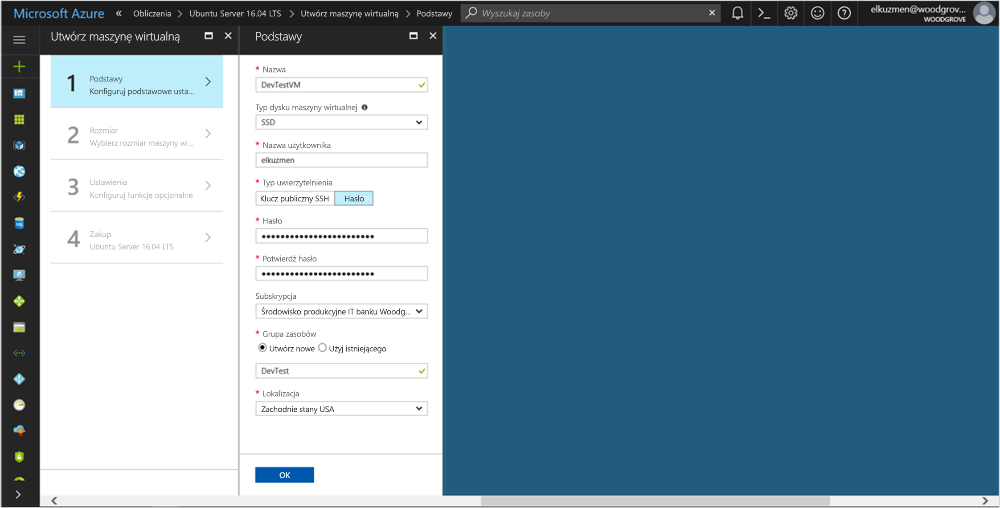

# <a name="tutorial-use-a-linux-vms-managed-identity-to-access-azure-storage"></a>Samouczek: Korzystania z tożsamości zarządzanego maszyny Wirtualnej systemu Linux dostęp do magazynu Azure 

[!INCLUDE[preview-notice](../../../includes/active-directory-msi-preview-notice.md)]


Ten samouczek przedstawia sposób tworzenia i korzystania z tożsamości zarządzanego maszyny Wirtualnej systemu Linux dostęp do magazynu Azure. Omawiane kwestie:

> [!div class="checklist"]
> * Utwórz maszynę wirtualną systemu Linux w nowej grupy zasobów
> * Włącz zarządzane tożsamości na maszynie wirtualnej systemu Linux (VM)
> * Tworzenie kontenera obiektów blob na koncie magazynu
> * Udziel dostępu zarządzane tożsamości maszyny Wirtualnej systemu Linux do kontenera magazynu Azure
> * Uzyskaj token dostępu i użyć go do wywołania usługi Azure Storage

> [!NOTE]
> Azure uwierzytelniania usługi Active Directory dla usługi Azure Storage znajduje się w publicznej wersji zapoznawczej.

## <a name="prerequisites"></a>Wymagania wstępne

Jeśli nie masz jeszcze konta platformy Azure, [Załóż bezpłatne konto](https://azure.microsoft.com) przed kontynuowaniem.

[!INCLUDE [msi-tut-prereqs](~/includes/active-directory-msi-tut-prereqs.md)]

Aby uruchomić przykłady skryptów interfejsu wiersza polecenia, w tym samouczku, masz dwie opcje:

- Użyj [powłoki chmury Azure](~/articles/cloud-shell/overview.md) w portalu Azure lub za pośrednictwem **spróbuj on** przycisk znajdujący się w prawym górnym rogu każdej blok kodu.
- [Zainstaluj najnowszą wersję interfejsu wiersza polecenia 2.0](https://docs.microsoft.com/cli/azure/install-azure-cli) (2.0.23 lub nowsza), jeśli wolisz korzystać z konsoli lokalnej interfejsu wiersza polecenia.

## <a name="sign-in-to-azure"></a>Logowanie do platformy Azure

Zaloguj się do witryny Azure Portal pod adresem [https://portal.azure.com](https://portal.azure.com).

## <a name="create-a-linux-virtual-machine-in-a-new-resource-group"></a>Utwórz maszynę wirtualną systemu Linux w nowej grupy zasobów

W tej sekcji utworzysz maszynę Wirtualną systemu Linux, która otrzymuje później tożsamością zarządzane.

1. Wybierz **nowy** przycisk w lewym górnym rogu portalu Azure.
2. Wybierz pozycję **Wystąpienia obliczeniowe**, a następnie wybierz pozycję **Ubuntu Server 16.04 LTS**.
3. Wprowadź informacje o maszynie wirtualnej. Aby uzyskać **typ uwierzytelniania**, wybierz pozycję **klucz publiczny SSH** lub **hasło**. Utworzony poświadczenia umożliwiają Zaloguj się do maszyny Wirtualnej.

   

4. W **subskrypcji** listy, wybierz subskrypcję dla maszyny wirtualnej.
5. Aby wybrać nową grupę zasobów, interesujące maszyny wirtualnej zostały utworzone w, zaznacz **grupy zasobów** > **Utwórz nowy**. Gdy skończysz, wybierz **OK**.
6. Wybierz rozmiar maszyny wirtualnej. Aby wyświetlić więcej rozmiarów, wybierz pozycje **Wyświetl wszystkie** lub zmień filtr **Obsługiwany typ dysku**. W okienku ustawienia Zachowaj wartości domyślne, a następnie wybierz **OK**.

## <a name="enable-managed-identity-on-your-vm"></a>Włącz zarządzane tożsamości na maszynie Wirtualnej

Tożsamość zarządzane maszyny wirtualnej umożliwia pobieranie tokenów dostępu z usługi Azure AD bez konieczności umieścić poświadczeń w kodzie. W obszarze obejmuje włączenie zarządzane tożsamości na maszynie wirtualnej za pośrednictwem portalu Azure wykonuje dwie czynności: rejestruje maszyny Wirtualnej z usługą Azure AD można utworzyć tożsamości zarządzanych oraz konfiguruje tożsamości na maszynie Wirtualnej.

1. Przejdź do grupy zasobów nowej maszyny wirtualnej, a następnie wybierz maszynę wirtualną, utworzony w poprzednim kroku.
2. W obszarze **ustawienia** kategorii, kliknij polecenie **konfiguracji**.
3. Aby włączyć tożsamości zarządzanego, wybierz **tak**.
4. Kliknij przycisk **zapisać** Aby zastosować konfigurację. 

## <a name="create-a-storage-account"></a>Tworzenie konta magazynu 

W tej sekcji utworzysz konto magazynu. 

1. Kliknij przycisk **+ Utwórz zasób** znaleziono przycisku w lewym górnym rogu portalu Azure.
2. Kliknij przycisk **magazynu**, następnie **konta magazynu — obiekt blob, plików, tabeli, kolejki**.
3. W obszarze **nazwa**, wprowadź nazwę konta magazynu.  
4. **Model wdrażania** i **konta rodzaju** powinien być ustawiony na **Menedżera zasobów** i **magazynu (ogólnego przeznaczenia v1)**. 
5. Upewnij się, **subskrypcji** i **grupy zasobów** odpowiadały określony podczas tworzenia maszyny Wirtualnej w poprzednim kroku.
6. Kliknij przycisk **Utwórz**.

    

## <a name="create-a-blob-container-and-upload-a-file-to-the-storage-account"></a>Tworzenie kontenera obiektów blob i przekazywanie pliku do konta magazynu

Pliki wymagają magazynu obiektów blob, dlatego należy utworzyć kontener obiektów blob do przechowywania pliku. Następnie możesz przekazać plik do kontenera obiektów blob na koncie magazynu.

1. Przejdź z powrotem do użytkownika nowo utworzone konto magazynu.
2. W obszarze **usługa Blob**, kliknij przycisk **kontenery**.
3. Kliknij przycisk **+ kontener** górnej części strony.
4. W obszarze **nowy kontener**, wprowadź nazwę dla kontenera, a następnie w obszarze **poziom dostępu publicznego** zachować wartość domyślną.

    

5. Za pomocą edytora wybranym, Utwórz plik zatytułowany *hello world.txt* na komputerze lokalnym.  Otwórz plik i dodać tekst (bez cudzysłowów) "Witaj świecie! :) ", a następnie zapisz go. 

6. Przekaż plik na nowo utworzony kontenera, klikając nazwę kontenera, następnie **Przekaż**
7. W **przekazywanie obiektu blob** okienku w obszarze **pliki**, kliknij ikonę folderu i przejdź do pliku **hello_world.txt** na komputerze lokalnym, wybierz plik, a następnie kliknij przycisk **Przekazać**.

    

## <a name="grant-your-vm-access-to-an-azure-storage-container"></a>Przyznać uprawnienia maszyny Wirtualnej do kontenera magazynu Azure 

Korzystania z tożsamości zarządzanego maszyny Wirtualnej, aby pobrać dane z obiektu blob magazynu Azure.   

1. Przejdź z powrotem do użytkownika nowo utworzone konto magazynu.  
2. Kliknij przycisk **(IAM) kontroli dostępu** łącze w lewym panelu.  
3. Kliknij przycisk **+ Dodaj** u góry strony, aby dodać nowe przypisanie roli dla maszyny Wirtualnej.
4. W obszarze **roli**, wybierz z listy rozwijanej, **czytnik danych magazynu obiektów Blob (wersja zapoznawcza)**. 
5. Na liście rozwijanej dalej w obszarze **przypisany dostęp**, wybierz **maszyny wirtualnej**.  
6. Następnie sprawdź odpowiednie subskrypcji znajduje się w **subskrypcji** listy rozwijanej, a następnie ustaw **grupy zasobów** do **wszystkich grup zasobów**.  
7. W obszarze **wybierz**, wybrać maszyny Wirtualnej, a następnie kliknij przycisk **zapisać**.

    

## <a name="get-an-access-token-and-use-it-to-call-azure-storage"></a>Uzyskaj token dostępu i użyć go do wywołania usługi Azure Storage

Magazyn Azure natywnie obsługuje usługi Azure AD uwierzytelnianie, więc bezpośrednio może akceptować tokeny dostępu uzyskany przy użyciu tożsamości usługi zarządzane. To jest częścią usługi Azure Storage integracji z usługą Azure AD i różni się od podawania poświadczeń w parametrach połączenia.

Aby wykonać następujące kroki, potrzebujesz do pracy z maszyny Wirtualnej utworzone wcześniej, i należy klienta SSH do nawiązania połączenia. Jeśli korzystasz z systemu Windows, możesz użyć klienta SSH w [podsystemu systemu Windows dla systemu Linux](https://msdn.microsoft.com/commandline/wsl/about). Jeśli potrzebujesz pomocy w konfigurowaniu kluczy klienta SSH, zobacz [sposobu użycia SSH kluczy systemu Windows Azure](~/articles/virtual-machines/linux/ssh-from-windows.md), lub [sposobu tworzenia i używania SSH publiczne i prywatne parę kluczy dla maszyn wirtualnych systemu Linux na platformie Azure](~/articles/virtual-machines/linux/mac-create-ssh-keys.md).

1. W portalu Azure, przejdź do **maszyn wirtualnych**, przejdź do maszyny wirtualnej systemu Linux, następnie z **omówienie** kliknij **Connect**. Skopiuj ciąg, aby nawiązać połączenie z maszyną Wirtualną.
2. **Połącz** do maszyny Wirtualnej przy użyciu klienta SSH wybranych przez użytkownika. 
3. W oknie terminalu przy użyciu programu CURL, Wyślij żądanie do lokalnego punktu końcowego zarządzanych tożsamości do Uzyskaj token dostępu usługi Azure Storage.
    
    ```bash
    curl 'http://169.254.169.254/metadata/identity/oauth2/token?api-version=2018-02-01&resource=https%3A%2F%2Fstorage.azure.com%2F' -H Metadata:true
    ```
4. Teraz używać tokenu dostępu, dostęp do magazynu Azure, na przykład w celu odczytu zawartości przykładowy plik, który został wcześniej przekazany do kontenera. Zastąp wartości `<STORAGE ACCOUNT>`, `<CONTAINER NAME>`, i `<FILE NAME>` z wartościami określone wcześniej, i `<ACCESS TOKEN>` z tokenem zwracanej w poprzednim kroku.

   ```bash
   curl https://<STORAGE ACCOUNT>.blob.core.windows.net/<CONTAINER NAME>/<FILE NAME> -H "x-ms-version: 2017-11-09" -H "Authorization: Bearer <ACCESS TOKEN>"
   ```

   Odpowiedź zawiera zawartość pliku:

   ```bash
   Hello world! :)
   ```

## <a name="next-steps"></a>Kolejne kroki

W tym samouczku przedstawiono sposób włączenia maszyny wirtualnej systemu Linux tożsamości zarządzanego dostępu do magazynu Azure.  Aby dowiedzieć się więcej o usłudze Azure Storage, zobacz:

> [!div class="nextstepaction"]
> [Azure Storage](/azure/storage/common/storage-introduction)
