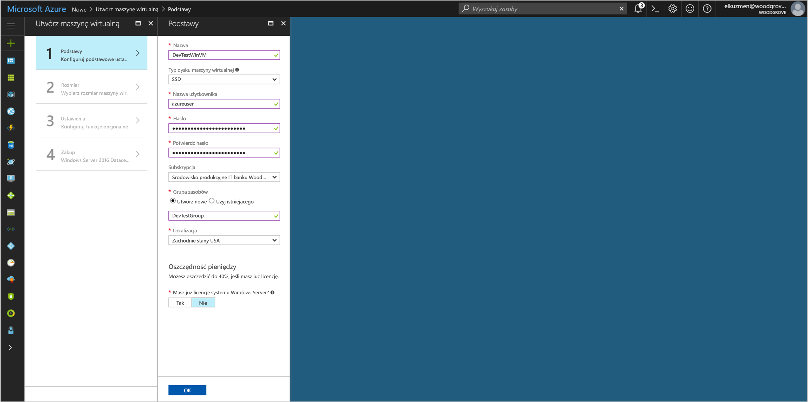
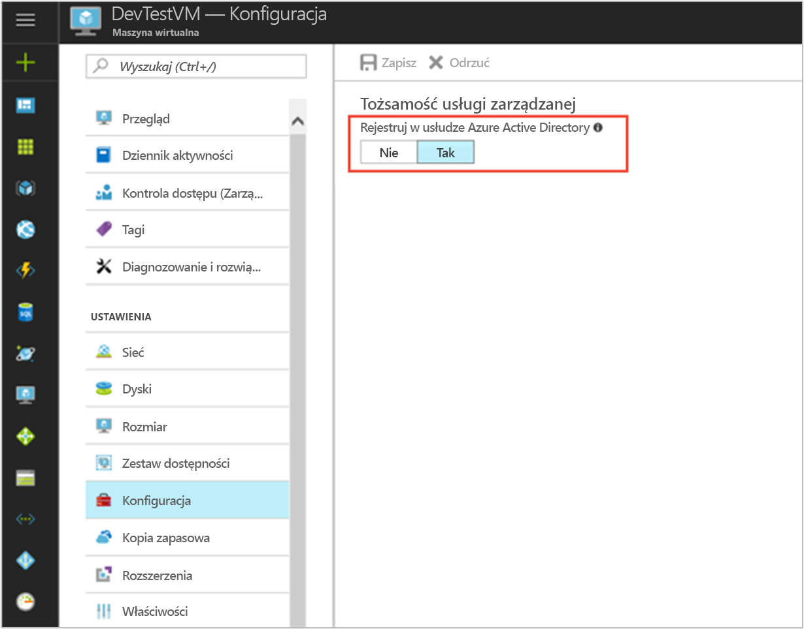

# <a name="tutorial-use-a-windows-vm-msi-to-access-azure-cosmos-db"></a>Samouczek: Umożliwia dostęp do bazy danych Azure rozwiązania Cosmos MSI maszyny Wirtualnej systemu Windows

[!INCLUDE[preview-notice](../../../includes/active-directory-msi-preview-notice.md)]

W tym samouczku przedstawiono sposób tworzenia i używania MSI maszyny Wirtualnej systemu Windows można uzyskać dostępu do bazy danych rozwiązania Cosmos. Omawiane kwestie:

> [!div class="checklist"]
> * Tworzenie maszyny Wirtualnej systemu Windows włączono MSI 
> * Tworzenie konta usługi Cosmos DB
> * MSI maszyny Wirtualnej systemu Windows Udziel dostępu do kluczy dostępu konta DB rozwiązania Cosmos
> * Uzyskaj token dostępu za pomocą Instalatora MSI maszyny Wirtualnej systemu Windows do wywołania usługi Azure Resource Manager
> * Uzyskaj klucze dostępu z usługi Azure Resource Manager w celu wykonywania wywołań DB rozwiązania Cosmos

## <a name="prerequisites"></a>Wymagania wstępne

[!INCLUDE [msi-qs-configure-prereqs](../../../includes/active-directory-msi-qs-configure-prereqs.md)]

[!INCLUDE [msi-tut-prereqs](../../../includes/active-directory-msi-tut-prereqs.md)]


## <a name="sign-in-to-azure"></a>Logowanie do platformy Azure

Zaloguj się do witryny Azure Portal pod adresem [https://portal.azure.com](https://portal.azure.com).

## <a name="create-a-windows-virtual-machine-in-a-new-resource-group"></a>Utwórz maszynę wirtualną systemu Windows w nowej grupy zasobów

W tym samouczku utworzymy nową maszynę Wirtualną systemu Windows.  Można również włączyć MSI na istniejącej maszyny Wirtualnej.

1. Kliknij przycisk **Utwórz zasób** (+) znajdujący się w lewym górnym rogu witryny Azure Portal.
2. Wybierz pozycję **Wystąpienia obliczeniowe**, a następnie wybierz pozycję **Windows Server 2016 Datacenter**. 
3. Wprowadź informacje o maszynie wirtualnej. **Username** i **hasło** utworzony, w tym miejscu jest poświadczeń umożliwia logowanie do maszyny wirtualnej.
4. Wybierz odpowiednią **subskrypcji** dla maszyny wirtualnej na liście rozwijanej.
5. Aby wybrać nowy **grupy zasobów** w której chcesz utworzyć maszynę wirtualną, wybrać **Utwórz nowy**. Po zakończeniu kliknij przycisk **OK**.
6. Wybierz rozmiar maszyny wirtualnej. Aby wyświetlić więcej rozmiarów, wybierz pozycje **Wyświetl wszystkie** lub zmień filtr **Obsługiwany typ dysku**. Na stronie ustawienia Zachowaj wartości domyślne, a następnie kliknij przycisk **OK**.

   

## <a name="enable-msi-on-your-vm"></a>Włącz MSI na maszynie Wirtualnej 

MSI maszyny wirtualnej umożliwia pobieranie tokenów dostępu z usługi Azure AD bez konieczności umieścić poświadczeń w kodzie. W obszarze obejmuje włączenie MSI w maszynie wirtualnej za pośrednictwem portalu Azure wykonuje dwie czynności: rejestruje maszyny Wirtualnej z usługą Azure AD można utworzyć tożsamości zarządzanych oraz konfiguruje tożsamości na maszynie Wirtualnej.

1. Wybierz **maszyny wirtualnej** chcesz włączyć MSI.  
2. Na pasku nawigacyjnym po lewej stronie kliknij **konfiguracji**. 
3. Zostanie wyświetlony **zarządzane tożsamość usługi**. Aby zarejestrować i włączyć MSI, wybierz **tak**, jeśli chcesz ją wyłączyć, wybierz opcję nie. 
4. Upewnij się, możesz kliknąć przycisk **zapisać** Aby zapisać konfigurację.  
   

## <a name="create-a-cosmos-db-account"></a>Tworzenie konta usługi Cosmos DB 

Jeśli nie masz jeszcze jednego, Utwórz konto DB rozwiązania Cosmos. Można pominąć ten krok i użyj istniejącego konta DB rozwiązania Cosmos. 

1. Kliknij przycisk **+/ Utwórz nową usługę** znaleziono przycisku w lewym górnym rogu portalu Azure.
2. Kliknij przycisk **baz danych**, następnie **bazy danych Azure rozwiązania Cosmos**i nowy "nowe konto" Wyświetla panelu.
3. Wprowadź **identyfikator** dla konta rozwiązania Cosmos bazy danych, które można użyć później.  
4. **Interfejs API** powinien być ustawiony na "SQL". Podejście opisane w tym samouczku mogą być używane z innych dostępnych typów interfejsu API, ale czynności opisane w tym samouczku są dla interfejsu API SQL.
5. Upewnij się, **subskrypcji** i **grupy zasobów** odpowiadały określony podczas tworzenia maszyny Wirtualnej w poprzednim kroku.  Wybierz **lokalizacji** gdzie dostępna jest opcja DB rozwiązania Cosmos.
6. Kliknij przycisk **Utwórz**.

## <a name="create-a-collection-in-the-cosmos-db-account"></a>Tworzenie kolekcji w ramach konta bazy danych rozwiązania Cosmos

Następnie dodaj zbierania danych w ramach konta rozwiązania Cosmos bazy danych, które można zbadać w kolejnych krokach.

1. Przejdź do nowo utworzonego konta DB rozwiązania Cosmos.
2. Na **omówienie** kliknij kartę **+/ Dodaj kolekcji** przycisk i "Dodaj"kolekcji panelu slajdów wychodzących.
3. Nadaj kolekcji select ID, identyfikator kolekcji bazy danych o pojemności, wprowadź klucz partycji, wprowadź wartość przepływności, a następnie kliknij **OK**.  W tym samouczku wystarczy użyć "Test", jak identyfikator bazy danych, identyfikator kolekcji, wybierz stały pojemności i najniższego przepływności (400 RU/s).  

## <a name="grant-windows-vm-msi-access-to-the-cosmos-db-account-access-keys"></a>MSI maszyny Wirtualnej systemu Windows Udziel dostępu do kluczy dostępu konta DB rozwiązania Cosmos

Rozwiązania cosmos bazy danych nie obsługuje natywnie uwierzytelniania usługi Azure AD. Można jednak aby pobrać klucz dostępu DB rozwiązania Cosmos z Menedżera zasobów, użyj Instalatora MSI i umożliwia dostęp do bazy danych rozwiązania Cosmos klucza. W tym kroku należy przyznać uprawnienia MSI kluczy do konta DB rozwiązania Cosmos.

Aby udzielić dostępu tożsamości MSI na koncie DB rozwiązania Cosmos w usłudze Azure Resource Manager przy użyciu programu PowerShell, należy zaktualizować wartości `<SUBSCRIPTION ID>`, `<RESOURCE GROUP>`, i `<COSMOS DB ACCOUNT NAME>` dla danego środowiska. Zastąp `<MSI PRINCIPALID>` z `principalId` właściwości zwróconej przez `az resource show` w [pobrać principalID msi maszyny Wirtualnej systemu Linux](#retrieve-the-principalID-of-the-linux-VM's-MSI).  Rozwiązania cosmos bazy danych obsługuje dwa poziomy szczegółowości klawiszy dostępu: odczytu/zapisu dostępu do konta, a także dostęp tylko do odczytu do konta.  Przypisz `DocumentDB Account Contributor` roli, jeśli chcesz pobrać klucze odczytu/zapisu dla konta lub przypisać `Cosmos DB Account Reader Role` roli, jeśli chcesz pobrać klucze tylko do odczytu dla konta:

```azurepowershell
$spID = (Get-AzureRMVM -ResourceGroupName myRG -Name myVM).identity.principalid
New-AzureRmRoleAssignment -ObjectId $spID -RoleDefinitionName "Reader" -Scope "/subscriptions/<mySubscriptionID>/resourceGroups/<myResourceGroup>/providers/Microsoft.Storage/storageAccounts/<myStorageAcct>"
```

## <a name="get-an-access-token-using-the-windows-vms-msi-to-call-azure-resource-manager"></a>Uzyskaj token dostępu za pomocą Instalatora MSI maszyny Wirtualnej systemu Windows do wywołania usługi Azure Resource Manager

W pozostałej części tego samouczka firma Microsoft będzie działać z maszyny Wirtualnej, utworzony wcześniej. 

Należy użyć poleceń cmdlet programu PowerShell usługi Azure Resource Manager w tej części.  Jeśli nie jest zainstalowany, [Pobierz najnowszą wersję](https://docs.microsoft.com/powershell/azure/overview) przed kontynuowaniem.

Należy również zainstalować najnowszą wersję [Azure CLI 2.0](https://docs.microsoft.com/cli/azure/install-azure-cli) na maszynie Wirtualnej systemu Windows.

1. W portalu Azure, przejdź do **maszyn wirtualnych**, przejdź do maszyny wirtualnej systemu Windows, następnie z **omówienie** kliknij **Connect** u góry. 
2. Wprowadź w Twojej **Username** i **hasło** dla którego zostanie dodane po utworzeniu maszyny Wirtualnej systemu Windows. 
3. Teraz, po utworzeniu **Podłączanie pulpitu zdalnego** z maszyną wirtualną, Otwórz program PowerShell w sesji zdalnej.
4. Przy użyciu programu Powershell w Invoke-WebRequest, Wyślij żądanie do lokalnego punktu końcowego MSI do Uzyskaj token dostępu usługi Azure Resource Manager.

    ```powershell
        $response = Invoke-WebRequest -Uri 'http://169.254.169.254/metadata/identity/oauth2/token?api-version=2018-02-01&resource=https%3A%2F%2Fmanagement.azure.com%2F' -Method GET -Headers @{Metadata="true"}
    ```

    > [!NOTE]
    > Wartość parametru "zasobu" musi być dokładnego dopasowania dla oczekiwano przez usługę Azure AD. Podczas korzystania z usługi Azure Resource Manager identyfikator zasobu, należy dołączyć końcowy ukośnik w identyfikatorze URI.
    
    Następnie wyodrębnić elementu "Zawartość", który jest przechowywany jako ciąg w formacie JavaScript Object Notation (JSON) w obiekcie $response. 
    
    ```powershell
    $content = $response.Content | ConvertFrom-Json
    ```
    Następnie Wyodrębnij token dostępu z odpowiedzi.
    
    ```powershell
    $ArmToken = $content.access_token
    ```

## <a name="get-access-keys-from-azure-resource-manager-to-make-cosmos-db-calls"></a>Uzyskaj klucze dostępu z usługi Azure Resource Manager w celu wykonywania wywołań DB rozwiązania Cosmos

Do wywołania usługi Resource Manager można pobrać klucz dostępu do konta rozwiązania Cosmos DB przy użyciu tokenu dostępu pobrany w poprzedniej sekcji za pomocą programu PowerShell. Gdy będziemy mieć klucz dostępu, możemy zapytania DB rozwiązania Cosmos. Pamiętaj zastąpić `<SUBSCRIPTION ID>`, `<RESOURCE GROUP>`, i `<COSMOS DB ACCOUNT NAME>` wartości parametrów z własne wartości. Zastąp `<ACCESS TOKEN>` wartość przy użyciu tokenu dostępu został wcześniej pobrany.  Jeśli chcesz pobrać klucze odczytu/zapisu, użyj operacji klucza typu `listKeys`.  Jeśli chcesz pobrać klucze tylko do odczytu, użyj typu klucza operacji `readonlykeys`:

```powershell
Invoke-WebRequest -Uri https://management.azure.com/subscriptions/<SUBSCRIPTION-ID>/resourceGroups/<RESOURCE-GROUP>/providers/Microsoft.DocumentDb/databaseAccounts/<COSMOS DB ACCOUNT NAME>/listKeys/?api-version=2016-12-01 -Method POST -Headers @{Authorization="Bearer $ARMToken"}
```
Odpowiedź nadaj listy kluczy.  Na przykład, jeśli zostanie wyświetlony tylko do odczytu klucze:

```powershell
{"primaryReadonlyMasterKey":"bWpDxS...dzQ==",
"secondaryReadonlyMasterKey":"38v5ns...7bA=="}
```
Teraz, po klucz dostępu dla konta rozwiązania Cosmos bazy danych, możesz przekazać go do SDK DB rozwiązania Cosmos i wywoływać w celu uzyskania dostępu do konta.  Na przykład szybki można przekazać klucz dostępu do wiersza polecenia platformy Azure.  Możesz uzyskać <COSMOS DB CONNECTION URL> z **omówienie** kartę w bloku konta DB rozwiązania Cosmos w portalu Azure.  Zastąp <ACCESS KEY> o wartości otrzymanych powyżej:

```bash
az cosmosdb collection show -c <COLLECTION ID> -d <DATABASE ID> --url-connection "<COSMOS DB CONNECTION URL>" --key <ACCESS KEY>
```

To polecenie interfejsu wiersza polecenia zwraca szczegółowe informacje o kolekcji:

```bash
{
  "collection": {
    "_conflicts": "conflicts/",
    "_docs": "docs/",
    "_etag": "\"00006700-0000-0000-0000-5a8271e90000\"",
    "_rid": "Es5SAM2FDwA=",
    "_self": "dbs/Es5SAA==/colls/Es5SAM2FDwA=/",
    "_sprocs": "sprocs/",
    "_triggers": "triggers/",
    "_ts": 1518498281,
    "_udfs": "udfs/",
    "id": "Test",
    "indexingPolicy": {
      "automatic": true,
      "excludedPaths": [],
      "includedPaths": [
        {
          "indexes": [
            {
              "dataType": "Number",
              "kind": "Range",
              "precision": -1
            },
            {
              "dataType": "String",
              "kind": "Range",
              "precision": -1
            },
            {
              "dataType": "Point",
              "kind": "Spatial"
            }
          ],
          "path": "/*"
        }
      ],
      "indexingMode": "consistent"
    }
  },
  "offer": {
    "_etag": "\"00006800-0000-0000-0000-5a8271ea0000\"",
    "_rid": "f4V+",
    "_self": "offers/f4V+/",
    "_ts": 1518498282,
    "content": {
      "offerIsRUPerMinuteThroughputEnabled": false,
      "offerThroughput": 400
    },
    "id": "f4V+",
    "offerResourceId": "Es5SAM2FDwA=",
    "offerType": "Invalid",
    "offerVersion": "V2",
    "resource": "dbs/Es5SAA==/colls/Es5SAM2FDwA=/"
  }
}
```

## <a name="next-steps"></a>Kolejne kroki

- Omówienie MSI, zobacz [omówienie zarządzane tożsamość usługi](overview.md).
