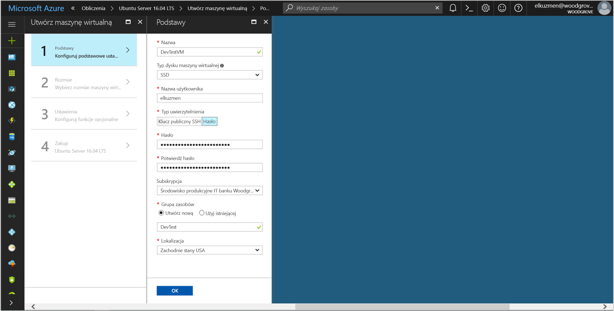
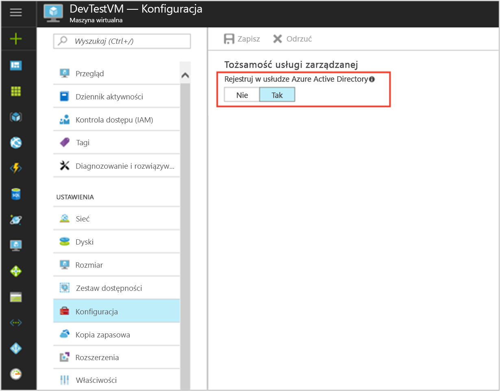

# <a name="use-a-linux-vm-managed-service-identity-to-access-azure-storage-via-a-sas-credential"></a>Umożliwia dostęp do usługi Azure Storage za pomocą poświadczeń sygnatury dostępu Współdzielonego Linux VM tożsamości usługi zarządzanej

[!INCLUDE[preview-notice](~/includes/active-directory-msi-preview-notice-ua.md)]

Ten samouczek pokazuje, jak włączyć tożsamości usługi zarządzanej (MSI) dla maszyny wirtualnej systemu Linux, a następnie Uzyskiwanie poświadczeń sygnatury dostępu współdzielonego (SAS) magazynu przy użyciu pliku MSI. W szczególności [poświadczeń sygnatury dostępu Współdzielonego usługi](~/articles/storage/common/storage-dotnet-shared-access-signature-part-1.md?toc=%2fazure%2fstorage%2fblobs%2ftoc.json#types-of-shared-access-signatures). 

Sygnatury dostępu Współdzielonego usługi umożliwia przyznawanie ograniczonego dostępu do obiektów na koncie magazynu przez ograniczony czas i określonej usługi (w naszym przypadku na usługę blob service), bez narażania klucz dostępu konta. Możesz użyć poświadczeń sygnatury dostępu Współdzielonego w zwykły sposób podczas wykonywania operacji magazynu, na przykład w przypadku korzystania z zestawu SDK usługi Storage. W tym samouczku pokażemy, przekazywanie i pobieranie obiektu blob przy użyciu wiersza polecenia platformy Azure Storage. Pokażemy ci, jak:


> [!div class="checklist"]
> * Włączanie tożsamości usługi Zarządzanej na maszynie wirtualnej systemu Linux 
> * Udzielanie maszynie Wirtualnej dostęp do konta magazynu sygnatur dostępu Współdzielonego w usłudze Resource Manager 
> * Uzyskiwanie tokenu dostępu przy użyciu tożsamości maszyny Wirtualnej i przy jego użyciu pobrania sygnatury dostępu Współdzielonego usługi Resource Manager 

## <a name="prerequisites"></a>Wymagania wstępne

[!INCLUDE [msi-core-prereqs](~/includes/active-directory-msi-core-prereqs-ua.md)]

[!INCLUDE [msi-tut-prereqs](~/includes/active-directory-msi-tut-prereqs.md)]

## <a name="sign-in-to-azure"></a>Logowanie do platformy Azure
Zaloguj się do witryny Azure Portal pod adresem [https://portal.azure.com](https://portal.azure.com).


## <a name="create-a-linux-virtual-machine-in-a-new-resource-group"></a>Utwórz maszynę wirtualną systemu Linux w nowej grupie zasobów

W tym samouczku utworzymy nową maszynę Wirtualną systemu Linux. Można również włączyć tożsamości usługi Zarządzanej istniejącej maszyny wirtualnej.

1. Kliknij przycisk **+/ Utwórz nową usługę** znajdujący się w lewym górnym rogu witryny Azure portal.
2. Wybierz pozycję **Wystąpienia obliczeniowe**, a następnie wybierz pozycję **Ubuntu Server 16.04 LTS**.
3. Wprowadź informacje o maszynie wirtualnej. Aby uzyskać **typ uwierzytelniania**, wybierz opcję **klucz publiczny SSH** lub **hasło**. Utworzono poświadczenia umożliwiają logowanie do maszyny Wirtualnej.

    

4. Wybierz **subskrypcji** dla maszyny wirtualnej na liście rozwijanej.
5. Aby wybrać nowy **grupy zasobów** chcesz maszyny wirtualnej pod kątem można tworzyć w **Utwórz nowy**. Po zakończeniu kliknij przycisk **OK**.
6. Wybierz rozmiar maszyny wirtualnej. Aby wyświetlić więcej rozmiarów, wybierz pozycję **Wyświetl wszystkie** lub zmień filtr obsługiwany typ dysku. W bloku ustawień pozostaw ustawienia domyślne i kliknij przycisk **OK**.

## <a name="enable-msi-on-your-vm"></a>Włączanie tożsamości usługi Zarządzanej na maszynie Wirtualnej

Z tożsamości usługi Zarządzanej maszyny wirtualnej umożliwia uzyskiwanie tokenów dostępu z usługi Azure AD bez konieczności umieścić poświadczeń w kodzie. Włączanie tożsamości usługi Zarządzanej w sposób niewidoczny wykonuje dwie czynności: instaluje rozszerzenia tożsamości usługi Zarządzanej maszyny Wirtualnej na maszynie Wirtualnej oraz umożliwia tożsamości usługi zarządzanej dla maszyny Wirtualnej.  

1. Przejdź do grupy zasobów z nową maszyną wirtualną, a następnie wybierz maszynę wirtualną, utworzonej w poprzednim kroku.
2. W ramach maszyny Wirtualnej "Ustawienia" po lewej stronie kliknij pozycję **konfiguracji**.
3. Aby zarejestrować i włączyć plik MSI, wybierz **tak**, jeśli chcesz ją wyłączyć, wybierz pozycję nie.
4. Upewnij się, możesz kliknąć pozycję **Zapisz** Aby zapisać konfigurację.

    

5. Jeśli chcesz sprawdzić, jakie rozszerzenia na maszynie Wirtualnej, kliknij przycisk **rozszerzenia**. Po włączeniu tożsamości usługi Zarządzanej **ManagedIdentityExtensionforLinux** pojawia się na liście.

    

## <a name="create-a-storage-account"></a>Tworzenie konta magazynu 

Jeśli nie masz jeszcze jeden, teraz utworzysz konto magazynu.  Można również pominąć ten krok i przyznać tożsamości usługi Zarządzanej maszyny Wirtualnej dostępu do kluczy istniejącego konta magazynu. 

1. Kliknij przycisk **+/ Utwórz nową usługę** znajdujący się w lewym górnym rogu witryny Azure portal.
2. Kliknij przycisk **magazynu**, następnie **konta magazynu**, i wyświetla nowy panel "Tworzenie konta magazynu".
3. Wprowadź **nazwa** dla konta magazynu, w którym będzie on potrzebny później.  
4. **Model wdrażania** i **rodzaj konta** powinna być równa "Resource manager" i "Zastosowania ogólne", odpowiednio. 
5. Upewnij się, **subskrypcji** i **grupy zasobów** są zgodne z typami, które zostały określone podczas tworzenia maszyny Wirtualnej w poprzednim kroku.
6. Kliknij przycisk **Utwórz**.

    

## <a name="create-a-blob-container-in-the-storage-account"></a>Utwórz kontener obiektów blob na koncie magazynu

Firma Microsoft będzie później Przekaż i pobierze plik do nowego konta magazynu. Ponieważ pliki wymagają magazynu obiektów blob, należy utworzyć kontener obiektów blob, w której chcesz zapisać plik.

1. Przejdź z powrotem do Twojej nowo utworzone konto magazynu.
2. Kliknij przycisk **kontenery** łącze w panelu po lewej stronie w obszarze "Usługi obiektów Blob".
3. Kliknij przycisk **+ kontener** u góry strony i "nowy kontener" panelu wysuwa się.
4. Nadaj nazwę kontenera, wybierz poziom dostępu, a następnie kliknij przycisk **OK**. Podana nazwa będzie używana w dalszej części tego samouczka. 

    

## <a name="grant-your-vms-msi-access-to-use-a-storage-sas"></a>Udzielanie dostępu tożsamości usługi Zarządzanej maszyny Wirtualnej do używania magazynu SAS 

Usługa Azure Storage nie obsługuje natywnie uwierzytelniania usługi Azure AD.  Jednak można pobrać magazynu sygnatur dostępu Współdzielonego z usługi Resource Manager przy użyciu pliku MSI. następnie dostępu do magazynu przy użyciu sygnatury dostępu Współdzielonego.  W tym kroku udzielasz dostępu do usługi Zarządzanej maszyny Wirtualnej do swojego konta magazynu, sygnatury dostępu Współdzielonego.   

1. Przejdź z powrotem do swojego konta nowo utworzonego magazynu...   
2. Kliknij przycisk **kontrola dostępu (IAM)** łącze w panelu po lewej stronie.  
3. Kliknij przycisk **+ Dodaj** na górze strony Aby dodać nowe przypisanie roli maszyny wirtualnej
4. Ustaw **roli** do "Współautor konta magazynu", w prawej części strony. 
5. Na następnej liście rozwijanej, ustaw **Przypisz dostęp do** zasobu "Maszyny wirtualnej".  
6. Następnie upewnij się, odpowiednie subskrypcji znajduje się w **subskrypcji** listy rozwijanej, a następnie ustaw **grupy zasobów** na "Wszystkie grupy zasobów".  
7. Na koniec w obszarze **wybierz** wybierz maszyny wirtualnej systemu Linux na liście rozwijanej, a następnie kliknij przycisk **Zapisz**.  

    

## <a name="get-an-access-token-using-the-vms-identity-and-use-it-to-call-azure-resource-manager"></a>Uzyskiwanie tokenu dostępu przy użyciu tożsamości maszyny Wirtualnej i użyć go do wywołania usługi Azure Resource Manager

W pozostałej części tego samouczka firma Microsoft będzie działać z maszyny Wirtualnej utworzony wcześniej.

Aby wykonać te kroki, konieczne będzie klienta SSH. Jeśli używasz Windows, możesz użyć klienta SSH w [podsystem Windows dla systemu Linux](https://msdn.microsoft.com/commandline/wsl/install_guide). Jeśli potrzebujesz pomocy w konfigurowaniu klucze Twój klient SSH, zobacz [jak klucze używanie protokołu SSH z Windows Azure](~/articles/virtual-machines/linux/ssh-from-windows.md), lub [sposobu tworzenia i używania publicznych i prywatnych pary kluczy SSH dla maszyn wirtualnych systemu Linux na platformie Azure](~/articles/virtual-machines/linux/mac-create-ssh-keys.md).

1. W witrynie Azure portal przejdź do **maszyn wirtualnych**, przejdź do maszyny wirtualnej systemu Linux, następnie z **Przegląd** kliknij **Connect** u góry. Skopiuj parametry, które umożliwiają połączenie z maszyną wirtualną. 
2. Łączenie z maszyną wirtualną przy użyciu klienta SSH.  
3. Następnie użytkownik jest monitowany o podanie w swojej **hasło** dodany podczas tworzenia **maszyny Wirtualnej systemu Linux**. Możesz następnie się pomyślnie zalogować.  
4. Korzystanie z programu CURL w celu uzyskania tokenu dostępu usługi Azure Resource Manager.  

    CURL żądania i odpowiedzi dla tokenu dostępu znajduje się poniżej:
    
    ```bash
    curl http://localhost:50342/oauth2/token --data "resource=https://management.azure.com/" -H Metadata:true    
    ```
    
    > [!NOTE]
    > W żądaniu poprzedniej wartości parametru "resource" musi być dokładnie dopasowany do oczekiwań przez usługę Azure AD. Korzystając z Identyfikatora zasobu usługi Azure Resource Manager, należy dołączyć końcowy ukośnik w identyfikatorze URI.
    > W poniższym odpowiedzi elementu access_token, ponieważ została skrócona w celu skrócenia programu.
    
    ```bash
    {"access_token":"eyJ0eXAiOiJ...",
    "refresh_token":"",
    "expires_in":"3599",
    "expires_on":"1504130527",
    "not_before":"1504126627",
    "resource":"https://management.azure.com",
    "token_type":"Bearer"} 
     ```

## <a name="get-a-sas-credential-from-azure-resource-manager-to-make-storage-calls"></a>Pobierz poświadczenia sygnatury dostępu Współdzielonego z usługi Azure Resource Manager do nawiązywania połączeń z magazynu

Teraz za pomocą programu CURL wywołania usługi Resource Manager przy użyciu tokenu dostępu, możemy pobrać w poprzedniej sekcji, aby utworzyć poświadczenia sygnatury dostępu Współdzielonego magazynu. Gdy będziemy już mieć poświadczenia sygnatury dostępu Współdzielonego, możemy wywołać magazyn — liczba operacji pobierania/przekazywania.

Dla tego żądania użyjemy postępuj zgodnie z parametrów żądania HTTP do tworzenia poświadczeń sygnatury dostępu Współdzielonego:

```JSON
{
    "canonicalizedResource":"/blob/<STORAGE ACCOUNT NAME>/<CONTAINER NAME>",
    "signedResource":"c",              // The kind of resource accessible with the SAS, in this case a container (c).
    "signedPermission":"rcw",          // Permissions for this SAS, in this case (r)ead, (c)reate, and (w)rite.  Order is important.
    "signedProtocol":"https",          // Require the SAS be used on https protocol.
    "signedExpiry":"<EXPIRATION TIME>" // UTC expiration time for SAS in ISO 8601 format, for example 2017-09-22T00:06:00Z.
}
```

Te parametry są objęte treść wpisu wniosku o poświadczenia sygnatury dostępu Współdzielonego. Aby uzyskać więcej informacji na temat parametrów do tworzenia poświadczeń sygnatury dostępu Współdzielonego, zobacz [dokumentacja interfejsu REST sygnatury dostępu Współdzielonego usługi listy](/rest/api/storagerp/storageaccounts/listservicesas).

Użyj następującego żądania programu CURL, aby uzyskać poświadczenia sygnatury dostępu Współdzielonego. Koniecznie Zastąp `<SUBSCRIPTION ID>`, `<RESOURCE GROUP>`, `<STORAGE ACCOUNT NAME>`, `<CONTAINER NAME>`, i `<EXPIRATION TIME>` wartości parametrów własnymi wartościami. Zastąp `<ACCESS TOKEN>` wartość przy użyciu tokenu dostępu pobranym wcześniej:

```bash 
curl https://management.azure.com/subscriptions/<SUBSCRIPTION ID>/resourceGroups/<RESOURCE GROUP>/providers/Microsoft.Storage/storageAccounts/<STORAGE ACCOUNT NAME>/listServiceSas/?api-version=2017-06-01 -X POST -d "{\"canonicalizedResource\":\"/blob/<STORAGE ACCOUNT NAME>/<CONTAINER NAME>\",\"signedResource\":\"c\",\"signedPermission\":\"rcw\",\"signedProtocol\":\"https\",\"signedExpiry\":\"<EXPIRATION TIME>\"}" -H "Authorization: Bearer <ACCESS TOKEN>"
```

> [!NOTE]
> Tekst w poprzednich adres URL jest uwzględniana wielkość liter, dlatego upewnij się, jeśli używasz małymi literami górnego dla grup zasobów, aby uwzględnić go odpowiednio. Ponadto jest ważne, aby dowiedzieć się, że jest to żądanie POST nie żądanie GET.

Odpowiedzi programu CURL zwraca poświadczenia sygnatury dostępu Współdzielonego:  

```bash 
{"serviceSasToken":"sv=2015-04-05&sr=c&spr=https&st=2017-09-22T00%3A10%3A00Z&se=2017-09-22T02%3A00%3A00Z&sp=rcw&sig=QcVwljccgWcNMbe9roAJbD8J5oEkYoq%2F0cUPlgriBn0%3D"} 
```

Utwórz przykładowy plik obiektu blob do przekazania do kontenera magazynu obiektów blob. Na maszynie Wirtualnej systemu Linux można to zrobić za pomocą następującego polecenia. 

```bash
echo "This is a test file." > test.txt
```

Następnie uwierzytelnianie za pomocą interfejsu wiersza polecenia `az storage` polecenia przy użyciu poświadczeń sygnatury dostępu Współdzielonego i przekazać plik do kontenera obiektów blob. W tym kroku musisz [zainstalować najnowszego interfejsu wiersza polecenia platformy Azure](https://docs.microsoft.com/cli/azure/install-azure-cli) na maszynie Wirtualnej, jeśli jeszcze go.

```azurecli-interactive
 az storage blob upload --container-name 
                        --file 
                        --name
                        --account-name 
                        --sas-token
```

Odpowiedź: 

```JSON
Finished[#############################################################]  100.0000%
{
  "etag": "\"0x8D4F9929765C139\"",
  "lastModified": "2017-09-21T03:58:56+00:00"
}
```

Ponadto można pobrać pliku za pomocą wiersza polecenia platformy Azure i uwierzytelniania przy użyciu poświadczeń sygnatury dostępu Współdzielonego. 

Żądanie: 

```azurecli-interactive
az storage blob download --container-name
                         --file 
                         --name 
                         --account-name
                         --sas-token
```

Odpowiedź: 

```JSON
{
  "content": null,
  "metadata": {},
  "name": "testblob",
  "properties": {
    "appendBlobCommittedBlockCount": null,
    "blobType": "BlockBlob",
    "contentLength": 16,
    "contentRange": "bytes 0-15/16",
    "contentSettings": {
      "cacheControl": null,
      "contentDisposition": null,
      "contentEncoding": null,
      "contentLanguage": null,
      "contentMd5": "Aryr///Rb+D8JQ8IytleDA==",
      "contentType": "text/plain"
    },
    "copy": {
      "completionTime": null,
      "id": null,
      "progress": null,
      "source": null,
      "status": null,
      "statusDescription": null
    },
    "etag": "\"0x8D4F9929765C139\"",
    "lastModified": "2017-09-21T03:58:56+00:00",
    "lease": {
      "duration": null,
      "state": "available",
      "status": "unlocked"
    },
    "pageBlobSequenceNumber": null,
    "serverEncrypted": false
  },
  "snapshot": null
}
```

## <a name="next-steps"></a>Kolejne kroki

- Aby uzyskać omówienie MSI, zobacz [Przegląd tożsamości usługi zarządzanej](msi-overview.md).
- Aby dowiedzieć się, jak to zrobić w tym samouczku ten sam za pomocą klucza konta magazynu, zobacz [umożliwia dostęp do magazynu Azure Linux VM tożsamości usługi zarządzanej](msi-tutorial-linux-vm-access-storage.md)
- Aby uzyskać więcej informacji na temat funkcji sygnatury dostępu Współdzielonego konta usługi Azure Storage zobacz:
  - [Używanie sygnatur dostępu współdzielonego (SAS)](~/articles/storage/common/storage-dotnet-shared-access-signature-part-1.md)
  - [Utworzenie sygnatury dostępu Współdzielonego usługi](/rest/api/storageservices/Constructing-a-Service-SAS.md)

W poniższej sekcji komentarzy umożliwia opinią i Pomóż nam analizy i połącz kształt naszej zawartości.
