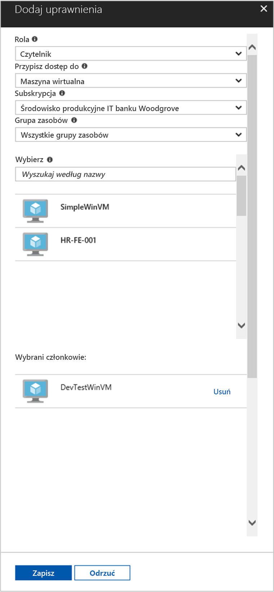

# <a name="use-a-windows-vm-managed-service-identity-msi-to-access-resource-manager"></a>Umożliwia dostęp do usługi Resource Manager Windows VM tożsamość usługi zarządzanej (MSI)

[!INCLUDE[preview-notice](~/includes/active-directory-msi-preview-notice-ua.md)]

W tym samouczku dowiesz się, jak włączyć tożsamości usługi zarządzanej (MSI) dla maszyny wirtualnej (VM) Windows. Można następnie użyć tej tożsamości dostępu do interfejsu API usługi Resource Manager platformy Azure. Tożsamości usługi zarządzanej są zarządzane automatycznie przez platformę Azure i umożliwiają uwierzytelniania do usług, które obsługują uwierzytelnianie usługi Azure AD bez konieczności Wstaw poświadczeń do kodu. Omawiane kwestie:

> [!div class="checklist"]
> * Włączanie tożsamości usługi Zarządzanej w Windows maszyny Wirtualnej 
> * Udzielanie dostępu do sieci maszyny Wirtualnej do grupy zasobów w usłudze Azure Resource Manager 
> * Uzyskiwanie tokenu dostępu przy użyciu tożsamości maszyny Wirtualnej i użyć go do wywołania usługi Azure Resource Manager

## <a name="prerequisites"></a>Wymagania wstępne

[!INCLUDE [msi-core-prereqs](~/includes/active-directory-msi-core-prereqs-ua.md)]

[!INCLUDE [msi-tut-prereqs](~/includes/active-directory-msi-tut-prereqs.md)]

## <a name="sign-in-to-azure"></a>Logowanie do platformy Azure
Zaloguj się do witryny Azure Portal pod adresem [https://portal.azure.com](https://portal.azure.com).

## <a name="create-a-windows-virtual-machine-in-a-new-resource-group"></a>Utwórz maszynę wirtualną Windows w nowej grupie zasobów

W tym samouczku utworzymy nową maszynę Wirtualną Windows.  Można również włączyć tożsamości usługi Zarządzanej istniejącej maszyny wirtualnej.

1.  Kliknij przycisk **Utwórz zasób** w lewym górnym rogu witryny Azure portal.
2.  Wybierz pozycję **Wystąpienia obliczeniowe**, a następnie wybierz pozycję **Windows Server 2016 Datacenter**. 
3.  Wprowadź informacje o maszynie wirtualnej. **Username** i **hasło** utworzony, w tym miejscu jest poświadczenia, których używasz do logowania do maszyny wirtualnej.
4.  Wybierz odpowiednią **subskrypcji** dla maszyny wirtualnej na liście rozwijanej.
5.  Aby wybrać nowy **grupy zasobów** w której chcesz utworzyć maszynę wirtualną, wybrać **Utwórz nowy**. Po zakończeniu kliknij przycisk **OK**.
6.  Wybierz rozmiar maszyny wirtualnej. Aby wyświetlić więcej rozmiarów, wybierz pozycje **Wyświetl wszystkie** lub zmień filtr **Obsługiwany typ dysku**. Na stronie ustawień pozostaw wartości domyślne, a następnie kliknij przycisk **OK**.

    

## <a name="enable-msi-on-your-vm"></a>Włączanie tożsamości usługi Zarządzanej na maszynie Wirtualnej 

Zarządzanej maszyny Wirtualnej umożliwia uzyskiwanie tokenów dostępu z usługi Azure AD bez konieczności umieścić poświadczeń w kodzie. Włączanie tożsamości usługi Zarządzanej informuje Azure w celu utworzenia tożsamości zarządzanej dla maszyny Wirtualnej. Włączanie tożsamości usługi Zarządzanej w sposób niewidoczny wykonuje dwie czynności: instaluje rozszerzenia tożsamości usługi Zarządzanej maszyny Wirtualnej na maszynie Wirtualnej oraz umożliwia tożsamości usługi Zarządzanej w usłudze Azure Resource Manager.

1.  Wybierz **maszyny wirtualnej** chcesz włączyć tożsamości usługi Zarządzanej.  
2.  Na pasku nawigacyjnym po lewej stronie kliknij **konfiguracji**. 
3.  Zostanie wyświetlony **tożsamości usługi zarządzanej**. Aby zarejestrować i włączyć plik MSI, wybierz **tak**, jeśli chcesz ją wyłączyć, wybierz pozycję nie. 
4.  Upewnij się, możesz kliknąć pozycję **Zapisz** Aby zapisać konfigurację.  
    

5. Jeśli użytkownik chce Sprawdź i upewnij się, jakie rozszerzenia są na tej maszynie Wirtualnej, kliknij przycisk **rozszerzenia**. Jeśli plik MSI jest włączona, następnie **ManagedIdentityExtensionforWindows** pojawi się na liście.

    

## <a name="grant-your-vm-access-to-a-resource-group-in-resource-manager"></a>Udzielanie dostępu do sieci maszyny Wirtualnej do grupy zasobów w usłudze Resource Manager
Za pomocą pliku MSI kodu można uzyskać tokenów dostępu w celu uwierzytelniania w zasobach, które obsługują uwierzytelnianie usługi Azure AD.  Usługi Azure Resource Manager obsługuje uwierzytelnianie w usłudze Azure AD.  Najpierw należy udzielić tej maszyny Wirtualnej tożsamości dostępu do zasobów w usłudze Resource Manager, w tym przypadku grupy zasobów, w którym znajduje się maszyna wirtualna.  

1.  Przejdź do karty dla **grup zasobów**. 
2.  Wybierz konkretne **grupy zasobów** utworzone dla Twojego **Windows VM**. 
3.  Przejdź do **kontrola dostępu (IAM)** w panelu po lewej stronie. 
4.  Następnie **Dodaj** nowe przypisanie roli dla usługi **Windows VM**.  Wybierz **roli** jako **czytnika**. 
5.  W następnej listy rozwijanej **Przypisz dostęp do** zasobu **maszyny wirtualnej**. 
6.  Następnie upewnij się, odpowiednie subskrypcji znajduje się w **subskrypcji** listy rozwijanej. I **grupy zasobów**, wybierz opcję **wszystkich grup zasobów**. 
7.  Na koniec w **wybierz** wybierz maszynę Wirtualną Windows listy rozwijanej, a następnie kliknij przycisk **Zapisz**.

    

## <a name="get-an-access-token-using-the-vm-identity-and-use-it-to-call-azure-resource-manager"></a>Uzyskiwanie tokenu dostępu przy użyciu tożsamości maszyny Wirtualnej i użyć go do wywołania usługi Azure Resource Manager 

Należy użyć **PowerShell** w tej części.  Jeśli nie został zainstalowany, pobierz ją [tutaj](https://docs.microsoft.com/powershell/azure/overview?view=azurermps-4.3.1). 

1.  W portalu, przejdź do **maszyn wirtualnych** i przejdź do maszyny wirtualnej Windows w **Przegląd**, kliknij przycisk **Connect**. 
2.  Wprowadź w swojej **Username** i **hasło** dla którego można dodać podczas tworzenia maszyny Wirtualnej Windows. 
3.  Teraz, po utworzeniu **Podłączanie pulpitu zdalnego** z maszyną wirtualną Otwórz **PowerShell** w sesji zdalnej. 
4.  Przy użyciu programu Powershell Invoke-WebRequest, wysłać żądanie do lokalnego punktu końcowego pliku MSI do uzyskania tokenu dostępu usługi Azure Resource Manager.

    ```powershell
       $response = Invoke-WebRequest -Uri http://localhost:50342/oauth2/token -Method GET -Body @{resource="https://management.azure.com/"} -Headers @{Metadata="true"}
    ```
    
    > [!NOTE]
    > Wartość parametru "resource" musi być dokładnie dopasowany do oczekiwań przez usługę Azure AD. Korzystając z Identyfikatora zasobu usługi Azure Resource Manager, należy dołączyć końcowy ukośnik w identyfikatorze URI.
    
    Następnie Wyodrębnij pełnej odpowiedzi, który jest przechowywany jako ciąg w formacie JavaScript Object Notation (JSON) w obiekcie $response. 
    
    ```powershell
    $content = $response.Content | ConvertFrom-Json
    ```
    Następnie Wyodrębnij token dostępu z odpowiedzi.
    
    ```powershell
    $ArmToken = $content.access_token
    ```
    
    Na koniec Wywołaj usługi Azure Resource Manager przy użyciu tokenu dostępu. W tym przykładzie również używamy programu PowerShell Invoke-WebRequest w celu podejmowania wywołań do usługi Azure Resource Manager i zawierać token dostępu w nagłówku autoryzacji.
    
    ```powershell
    (Invoke-WebRequest -Uri https://management.azure.com/subscriptions/<SUBSCRIPTION ID>/resourceGroups/<RESOURCE GROUP>?api-version=2016-06-01 -Method GET -ContentType "application/json" -Headers @{ Authorization ="Bearer $ArmToken"}).content
    ```
    > [!NOTE] 
    > Adres URL jest uwzględniana wielkość liter, dlatego upewnij się, jeśli używasz tego samego dokładnej, jak została użyta wcześniej podczas nosi nazwę grupy zasobów i wielkie litery "G" w "resourceGroups."
        
    Poniższe polecenie zwraca szczegóły grupy zasobów:

    ```powershell
    {"id":"/subscriptions/98f51385-2edc-4b79-bed9-7718de4cb861/resourceGroups/DevTest","name":"DevTest","location":"westus","properties":{"provisioningState":"Succeeded"}}
    ```

## <a name="related-content"></a>Powiązana zawartość

- Aby uzyskać omówienie MSI, zobacz [Przegląd tożsamości usługi zarządzanej](msi-overview.md).

W poniższej sekcji komentarzy umożliwia opinią i Pomóż nam analizy i połącz kształt naszej zawartości.

