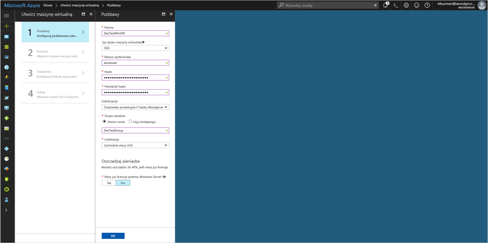

# <a name="use-a-windows-vm-managed-service-identity-msi-to-access-azure-data-lake-store"></a>Umożliwia dostęp do usługi Azure Data Lake Store Windows VM tożsamość usługi zarządzanej (MSI)

[!INCLUDE[preview-notice](~/includes/active-directory-msi-preview-notice-ua.md)]

W tym samouczku dowiesz się, jak za pomocą tożsamość usługi zarządzanej (MSI) dla maszyny wirtualnej (VM) Windows dostęp do usługi Azure Data Lake Store. Tożsamości usługi zarządzanej są zarządzane automatycznie przez platformę Azure i umożliwiają uwierzytelniania do usług, które obsługują uwierzytelnianie usługi Azure AD bez konieczności Wstaw poświadczeń do kodu. Omawiane kwestie:

> [!div class="checklist"]
> * Włączanie tożsamości usługi Zarządzanej w Windows maszyny Wirtualnej 
> * Udzielanie dostępu do sieci maszyny Wirtualnej do usługi Azure Data Lake Store
> * Uzyskiwanie tokenu dostępu przy użyciu tożsamości maszyny Wirtualnej i przy jego użyciu dostęp do usługi Azure Data Lake Store

## <a name="prerequisites"></a>Wymagania wstępne

[!INCLUDE [msi-core-prereqs](~/includes/active-directory-msi-core-prereqs-ua.md)]

[!INCLUDE [msi-tut-prereqs](~/includes/active-directory-msi-tut-prereqs.md)]

## <a name="sign-in-to-azure"></a>Logowanie do platformy Azure

Zaloguj się do witryny Azure Portal pod adresem [https://portal.azure.com](https://portal.azure.com).

## <a name="create-a-windows-virtual-machine-in-a-new-resource-group"></a>Utwórz maszynę wirtualną Windows w nowej grupie zasobów

W tym samouczku utworzymy nową maszynę Wirtualną Windows.  Można również włączyć tożsamości usługi Zarządzanej istniejącej maszyny wirtualnej.

1. Kliknij przycisk **Utwórz zasób** w lewym górnym rogu witryny Azure portal.
2. Wybierz pozycję **Wystąpienia obliczeniowe**, a następnie wybierz pozycję **Windows Server 2016 Datacenter**. 
3. Wprowadź informacje o maszynie wirtualnej. **Username** i **hasło** utworzony, w tym miejscu jest poświadczenia, których używasz do logowania do maszyny wirtualnej.
4. Wybierz odpowiednią **subskrypcji** dla maszyny wirtualnej na liście rozwijanej.
5. Aby wybrać nowy **grupy zasobów** w której chcesz utworzyć maszynę wirtualną, wybrać **Utwórz nowy**. Po zakończeniu kliknij przycisk **OK**.
6. Wybierz rozmiar maszyny wirtualnej. Aby wyświetlić więcej rozmiarów, wybierz pozycje **Wyświetl wszystkie** lub zmień filtr **Obsługiwany typ dysku**. Na stronie ustawień pozostaw wartości domyślne, a następnie kliknij przycisk **OK**.

   

## <a name="enable-msi-on-your-vm"></a>Włączanie tożsamości usługi Zarządzanej na maszynie Wirtualnej 

Zarządzanej maszyny Wirtualnej umożliwia uzyskiwanie tokenów dostępu z usługi Azure AD bez konieczności umieścić poświadczeń w kodzie. Włączanie tożsamości usługi Zarządzanej informuje Azure w celu utworzenia tożsamości zarządzanej dla maszyny Wirtualnej. Włączanie tożsamości usługi Zarządzanej w sposób niewidoczny wykonuje dwie czynności: instaluje rozszerzenia tożsamości usługi Zarządzanej maszyny Wirtualnej na maszynie Wirtualnej oraz umożliwia tożsamości usługi Zarządzanej w usłudze Azure Resource Manager.

1. Wybierz **maszyny wirtualnej** chcesz włączyć tożsamości usługi Zarządzanej.  
2. Na pasku nawigacyjnym po lewej stronie kliknij **konfiguracji**. 
3. Zostanie wyświetlony **tożsamości usługi zarządzanej**. Aby zarejestrować i włączyć plik MSI, wybierz **tak**, jeśli chcesz ją wyłączyć, wybierz pozycję nie. 
4. Upewnij się, możesz kliknąć pozycję **Zapisz** Aby zapisać konfigurację.  
   

5. Jeśli użytkownik chce Sprawdź i upewnij się, jakie rozszerzenia są na tej maszynie Wirtualnej, kliknij przycisk **rozszerzenia**. Jeśli plik MSI jest włączona, następnie **ManagedIdentityExtensionforWindows** pojawia się na liście.

   

## <a name="grant-your-vm-access-to-azure-data-lake-store"></a>Udzielanie dostępu do sieci maszyny Wirtualnej do usługi Azure Data Lake Store

Teraz można udzielać dostępu do sieci maszyny Wirtualnej, do plików i folderów w usłudze Azure Data Lake Store.  W tym kroku możesz użyć istniejącej w Data Lake Store lub Utwórz nową.  Aby utworzyć nowy Store jeziora danych przy użyciu portalu Azure, postępuj zgodnie z tym [szybkiego startu usługi Azure Data Lake Store](~/articles/data-lake-store/data-lake-store-get-started-portal.md). Dostępne są także Przewodniki Szybki Start, użyj wiersza polecenia platformy Azure i programu Azure PowerShell w [dokumentacji usługi Azure Data Lake Store](~/articles/data-lake-store/data-lake-store-overview.md).

W usługi Data Lake Store Utwórz nowy folder i przyznaj uprawnienie usługi Zarządzanej maszyny Wirtualnej do odczytu, zapisu i wykonywania plików w tym folderze:

1. W witrynie Azure portal kliknij pozycję **Data Lake Store** w obszarze nawigacji po lewej stronie.
2. Kliknij pozycję Data Lake Store, którego chcesz użyć na potrzeby tego samouczka.
3. Kliknij przycisk **Eksplorator danych** na pasku poleceń.
4. W folderze głównym Data Lake Store jest zaznaczone.  Kliknij przycisk **dostępu** na pasku poleceń.
5. Kliknij pozycję **Add** (Dodaj).  W **wybierz** pole, wprowadź nazwę maszyny wirtualnej, na przykład **DevTestVM**.  Kliknij, aby wybrać maszynę Wirtualną z poziomu wyników wyszukiwania, a następnie kliknij przycisk **wybierz**.
6. Kliknij przycisk **wybierz uprawnienia**.  Wybierz **odczytu** i **Execute**, Dodaj do **ten folder**i Dodaj jako **uprawnienie**.  Kliknij przycisk **OK**.  Uprawnienia powinny zostać dodane pomyślnie.
7. Zamknij **dostępu** bloku.
8. Utwórz nowy folder na potrzeby tego samouczka.  Kliknij przycisk **nowy Folder** w pasku poleceń, a także pozwalają nowy folder na przykład nazwa **TestFolder**.  Kliknij przycisk **OK**.
9. Kliknij utworzony folder, a następnie kliknij przycisk **dostępu** na pasku poleceń.
10. Podobne do kroku 5, kliknij przycisk **Dodaj**w **wybierz** pole, wprowadź nazwę maszyny Wirtualnej, zaznacz go i kliknij **wybierz**.
11. Podobne do kroku 6, kliknij przycisk **wybierz uprawnienia**, wybierz opcję **odczytu**, **zapisu**, i **Execute**, Dodaj do **ten folder**i Dodaj jako **wpis uprawnień dostępu i domyślny wpis uprawnień**.  Kliknij przycisk **OK**.  Uprawnienia powinny zostać dodane pomyślnie.

Usługi Zarządzanej maszyny Wirtualnej można teraz wykonywać wszystkie operacje na plikach w folderze, który został utworzony.  Aby więcej informacji na temat zarządzania dostępem do programu Data Lake Store, przeczytaj ten artykuł w witrynie [kontroli dostępu w Data Lake Store](~/articles/data-lake-store/data-lake-store-access-control.md).

## <a name="get-an-access-token-using-the-vm-msi-and-use-it-to-call-the-azure-data-lake-store-filesystem"></a>Uzyskiwanie tokenu dostępu przy użyciu Zarządzanej maszyny Wirtualnej i użyć go do wywołania w systemie plików usługi Azure Data Lake Store

Azure Data Lake Store natywnie obsługuje usługi Azure AD uwierzytelniania, dzięki czemu bezpośrednio może akceptować tokeny dostępu uzyskany przy użyciu tożsamości usługi Zarządzanej.  Do uwierzytelniania w systemie plików Data Lake Store możesz wysłać token dostępu wystawiony przez usługę Azure AD do usługi Data Lake Store filesystem punktu końcowego w nagłówku autoryzacji w formacie "Bearer < ACCESS_TOKEN_VALUE >".  Aby dowiedzieć się więcej na temat obsługi Data Lake Store uwierzytelniania usługi Azure AD, przeczytaj [uwierzytelniania za pomocą programu Data Lake Store przy użyciu usługi Azure Active Directory](~/articles/data-lake-store/data-lakes-store-authentication-using-azure-active-directory.md)

> [!NOTE]
> Zestawy SDK klientów systemu plików Data Lake Store nie jest jeszcze obsługiwany tożsamości usługi zarządzanej.  W tym samouczku zostaną zaktualizowane, gdy obsługa zostanie dodany do zestawu SDK.

W tym samouczku uwierzytelniania w systemie plików Data Lake Store, żądań interfejsu API REST przy użyciu programu PowerShell, aby REST. Do uwierzytelniania tożsamości usługi Zarządzanej maszyny Wirtualnej, musisz wprowadzić żądania z maszyny Wirtualnej.

1. W portalu, przejdź do **maszyn wirtualnych**, przejdź do maszyny Wirtualnej Windows, a w **Przegląd** kliknij **Connect**.
2. Wprowadź w swojej **Username** i **hasło** dla którego można dodać podczas tworzenia maszyny Wirtualnej Windows. 
3. Teraz, po utworzeniu **Podłączanie pulpitu zdalnego** z maszyną wirtualną Otwórz **PowerShell** w sesji zdalnej. 
4. Przy użyciu programu PowerShell `Invoke-WebRequest`, wysłać żądanie do lokalnego punktu końcowego pliku MSI do uzyskania tokenu dostępu dla usługi Azure Data Lake Store.  Identyfikator zasobu Data Lake Store jest "https://datalake.azure.net/".  Usługa Data Lake nie dokładnego dopasowania identyfikatora zasobu i ważne jest, końcowy ukośnik.

   ```powershell
   $response = Invoke-WebRequest -Uri http://localhost:50342/oauth2/token -Method GET -Body @{resource="https://datalake.azure.net/"} -Headers @{Metadata="true"}
   ```
    
   Konwertowanie odpowiedzi z obiektu JSON na obiekt programu PowerShell. 
    
   ```powershell
   $content = $response.Content | ConvertFrom-Json
   ```

   Wyodrębnij token dostępu z odpowiedzi.
    
   ```powershell
   $AccessToken = $content.access_token
   ```

5. Przy użyciu programu PowerShell "Invoke-WebRequest", należy wysłać żądanie do punktu końcowego REST usługi Data Lake Store firmy, aby wyświetlić listę folderów w folderze głównym.  Jest to prosty sposób w celu sprawdzenia, czy wszystko jest poprawnie skonfigurowane.  Jest ważne, że ciąg "Bearer" w nagłówku autoryzacji ma wielkiej litery "B".  Można znaleźć nazwy usługi Data Lake Store, w **Przegląd** części bloku Data Lake Store w witrynie Azure portal.

   ```powershell
   Invoke-WebRequest -Uri https://<YOUR_ADLS_NAME>.azuredatalakestore.net/webhdfs/v1/?op=LISTSTATUS -Headers @{Authorization="Bearer $AccessToken"}
   ```

   Odpowiedź oznaczająca Powodzenie wygląda następująco:

   ```powershell
   StatusCode        : 200
   StatusDescription : OK
   Content           : {"FileStatuses":{"FileStatus":[{"length":0,"pathSuffix":"TestFolder","type":"DIRECTORY", "blockSize":0,"accessTime":1507934941392, "modificationTime":1507944835699,"replication":0, "permission":"770","ow..."
   RawContent        : HTTP/1.1 200 OK
                       Pragma: no-cache
                       x-ms-request-id: b4b31e16-e968-46a1-879a-3474aa7d4528
                       x-ms-webhdfs-version: 17.04.22.00
                       Status: 0x0
                       X-Content-Type-Options: nosniff
                       Strict-Transport-Security: ma...
   Forms             : {}
   Headers           : {[Pragma, no-cache], [x-ms-request-id, b4b31e16-e968-46a1-879a-3474aa7d4528],
                       [x-ms-webhdfs-version, 17.04.22.00], [Status, 0x0]...}
   Images            : {}
   InputFields       : {}
   Links             : {}
   ParsedHtml        : System.__ComObject
   RawContentLength  : 556
   ```

6. Teraz możesz wypróbować, przekazując plik do usługi Data Lake Store.  Najpierw utwórz plik do przekazania.

   ```powershell
   echo "Test file." > Test1.txt
   ```

7. Przy użyciu programu PowerShell `Invoke-WebRequest`, wysłać żądanie do punktu końcowego REST usługi Data Lake Store firmy, aby przekazać plik do folderu utworzonego wcześniej.  To żądanie ma dwa kroki.  W pierwszym kroku możesz zgłosić wniosek i uzyskać przekierowania, do której można przekazać pliku.  W drugim kroku faktycznie Przekaż plik.  Pamiętaj, aby ustawić nazwę folderu i pliku odpowiednie, jeśli użyto wartości innej niż w ramach tego samouczka. 

   ```powershell
   $HdfsRedirectResponse = Invoke-WebRequest -Uri https://<YOUR_ADLS_NAME>.azuredatalakestore.net/webhdfs/v1/TestFolder/Test1.txt?op=CREATE -Method PUT -Headers @{Authorization="Bearer $AccessToken"} -Infile Test1.txt -MaximumRedirection 0
   ```

   Jeśli sprawdzenie wartości `$HdfsRedirectResponse` powinien on wyglądać podobnie następującą odpowiedź:

   ```powershell
   PS C:\> $HdfsRedirectResponse

   StatusCode        : 307
   StatusDescription : Temporary Redirect
   Content           : {}
   RawContent        : HTTP/1.1 307 Temporary Redirect
                       Pragma: no-cache
                       x-ms-request-id: b7ab492f-b514-4483-aada-4aa0611d12b3
                       ContentLength: 0
                       x-ms-webhdfs-version: 17.04.22.00
                       Status: 0x0
                       X-Content-Type-Options: nosn...
   Headers           : {[Pragma, no-cache], [x-ms-request-id, b7ab492f-b514-4483-aada-4aa0611d12b3], 
                       [ContentLength, 0], [x-ms-webhdfs-version, 17.04.22.00]...}
   RawContentLength  : 0
   ```

   Zakończyć przekazywanie, wysyłając żądanie do punktu końcowego przekierowania:

   ```powershell
   Invoke-WebRequest -Uri $HdfsRedirectResponse.Headers.Location -Method PUT -Headers @{Authorization="Bearer $AccessToken"} -Infile Test1.txt -MaximumRedirection 0
   ```

   Zobacz odpowiedź oznaczająca Powodzenie, takich jak:

   ```powershell
   StatusCode        : 201
   StatusDescription : Created
   Content           : {}
   RawContent        : HTTP/1.1 201 Created
                       Pragma: no-cache
                       x-ms-request-id: 1e70f36f-ead1-4566-acfa-d0c3ec1e2307
                       ContentLength: 0
                       x-ms-webhdfs-version: 17.04.22.00
                       Status: 0x0
                       X-Content-Type-Options: nosniff
                       Strict...
   Headers           : {[Pragma, no-cache], [x-ms-request-id, 1e70f36f-ead1-4566-acfa-d0c3ec1e2307],
                       [ContentLength, 0], [x-ms-webhdfs-version, 17.04.22.00]...}
   RawContentLength  : 0
   ```

Przy użyciu innego systemu plików Data Lake Store interfejsów API można dołączyć do plików, pobierania plików i inne.

Gratulacje!  Uwierzytelniono do systemu plików Data Lake Store za pomocą Zarządzanej maszyny Wirtualnej.

## <a name="related-content"></a>Powiązana zawartość

- Aby uzyskać omówienie MSI, zobacz [Przegląd tożsamości usługi zarządzanej](msi-overview.md).
- Do zarządzania operations Data Lake Store używa usługi Azure Resource Manager.  Aby uzyskać więcej informacji na temat korzystania z tożsamości usługi Zarządzanej maszyny Wirtualnej w celu uwierzytelnienia do usługi Resource Manager, przeczytaj [umożliwia dostęp do usługi Resource Manager Linux VM tożsamość usługi zarządzanej (MSI)](../managed-service-identity/msi-tutorial-linux-vm-access-arm.md).
- Dowiedz się więcej o [uwierzytelniania za pomocą programu Data Lake Store przy użyciu usługi Azure Active Directory](~/articles/data-lake-store/data-lakes-store-authentication-using-azure-active-directory.md).
- Dowiedz się więcej o [operacje systemu plików w usługi Azure Data Lake Store, przy użyciu interfejsu API REST](~/articles/data-lake-store/data-lake-store-data-operations-rest-api.md) lub [interfejsów API systemu plików WebHDFS](https://docs.microsoft.com/rest/api/datalakestore/webhdfs-filesystem-apis).
- Dowiedz się więcej o [kontroli dostępu w Data Lake Store](~/articles/data-lake-store/data-lake-store-access-control.md).

W poniższej sekcji komentarzy umożliwia opinią i Pomóż nam analizy i połącz kształt naszej zawartości.