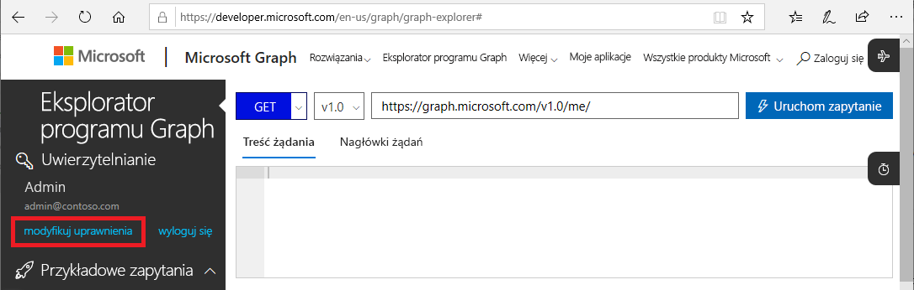
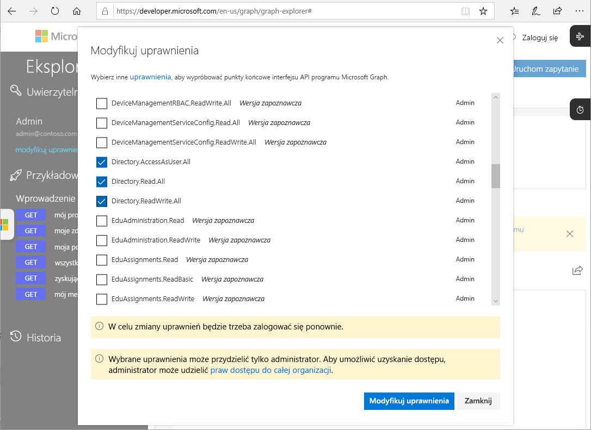

# Microsoft Graph interfejsów API dla Privileged Identity Management (wersja zapoznawcza)

Wszystkie Privileged Identity Management zadania można wykonać przy użyciu [Microsoft Graph interfejsów API](https://developer.microsoft.com/graph/docs/concepts/overview) dla Azure Active Directory. W tym artykule opisano ważne koncepcje dotyczące używania Microsoft Graph interfejsów API dla Privileged Identity Management.

Szczegółowe informacje na temat interfejsów API programu Microsoft Graph można znaleźć w [dokumentacji interfejsu API usługi Azure AD Privileged Identity Management](https://developer.microsoft.com/graph/docs/api-reference/beta/resources/privilegedidentitymanagement_root).

> [!IMPORTANT]
> Interfejsy API w wersji beta w programie Microsoft Graph są w wersji zapoznawczej i mogą ulec zmianie. Te interfejsy API nie są obsługiwane w zastosowaniach produkcyjnych.
>
> Mimo że wszystkie operacje PIM są obsługiwane za pomocą naszych poleceń interfejs API programu Graph, do zatwierdzania żądań aktywacji używany jest inny system. Interfejs API programu Graph do zatwierdzenia jest obecnie opracowywany i zostanie opublikowany w ciągu następnych kilku miesięcy.

## Wymagane uprawnienia

Aby wywołać Microsoft Graph interfejsów API dla Privileged Identity Management, musisz mieć **co najmniej jedno** z następujących uprawnień:

- `Directory.AccessAsUser.All`
- `Directory.Read.All`
- `Directory.ReadWrite.All`
- `PrivilegedAccess.ReadWrite.AzureAD`

### Ustawianie uprawnień

Aby aplikacje mogły wywołać Microsoft Graph interfejsów API dla Privileged Identity Management, muszą mieć wymagane uprawnienia. Najprostszym sposobem określenia wymaganych uprawnień jest użycie [platformy wyrażania zgody w usłudze Azure AD](../develop/consent-framework.md).

### Ustawianie uprawnień w Eksploratorze programu Graph

Jeśli do testowania wywołań używasz Eksploratora programu Graph, możesz określić uprawnienia w tym narzędziu.

1. Zaloguj się do [Eksploratora programu Graph](https://developer.microsoft.com/graph/graph-explorer) jako administrator globalny.

1. Kliknij pozycję **Modyfikuj uprawnienia**.

    

1. Zaznacz pola wyboru obok uprawnień, które chcesz uwzględnić. Uprawnienia `PrivilegedAccess.ReadWrite.AzureAD` nie są jeszcze dostępne w Eksploratorze programu Graph.

    

1. Kliknij pozycję **Modyfikuj uprawnienia**, aby zastosować zmiany uprawnień.

## Następne kroki

- [Dokumentacja interfejsu API usługi Azure AD Privileged Identity Management](https://developer.microsoft.com/graph/docs/api-reference/beta/resources/privilegedidentitymanagement_root)
