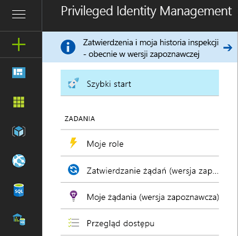
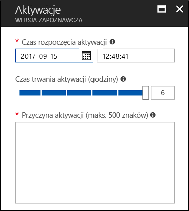
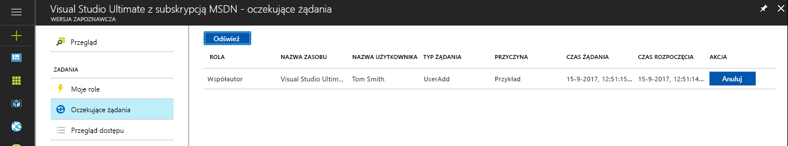
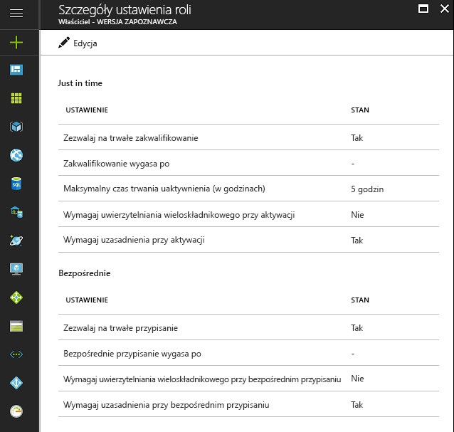

# Co to jest usługa Azure AD Privileged Identity Management?

Usługa Azure Active Directory (Azure AD) Privileged Identity Management umożliwia kontrolę i monitorowanie dostępu, a także zarządzanie nim w ramach danej organizacji. Dotyczy to również dostępu do zasobów platformy Azure oraz zasobów w usłudze Azure AD i w innych usługach online firmy Microsoft, takich jak Office 365 lub Microsoft Intune.

> [!NOTE]
> W przypadku włączenia usługi Privileged Identity Management dla dzierżawy licencja płatna lub licencja wersji próbnej Azure AD Premium P2 lub Enterprise Mobility + Security E5 jest wymagana dla każdego użytkownika, który wchodzi w interakcję z usługą lub otrzymuje korzyść z tej usługi. Przykłady obejmują użytkowników/użytkowników w grupie, którzy:
>
>- Są przypisani do roli Administrator ról uprzywilejowanych. 
>- Są przypisani jako uprawnieni do innych ról katalogu, którymi można zarządzać za pośrednictwem usługi PIM. 
>- Mogą zatwierdzać/odrzucać żądania w usłudze PIM. 
>- Są przypisani do roli zasobów platformy Azure za pomocą przypisań dostępu dokładnie na czas (just in time) lub bezpośrednich (na podstawie czasu).  
>- Są przypisani do przeglądu dostępu.
>
>Aby uzyskać więcej informacji, zobacz [Wersje usługi Azure Active Directory](../fundamentals/active-directory-whatis.md).

Organizacje dążą do zminimalizowania liczby osób, które mają dostęp do zabezpieczonych informacji lub zasobów, ponieważ zmniejsza to prawdopodobieństwo uzyskania dostępu do nich przez użytkownika mającego złe zamiary lub przypadkowej modyfikacji poufnych zasobów przez osobę uprawnioną.  Jednak użytkownicy nadal muszą wykonywać operacje uprzywilejowane w usłudze Azure AD, na platformie Azure, w usłudze Office 365 i w aplikacjach SaaS. Organizacje mogą przyznać użytkownikom dostęp uprzywilejowany do zasobów platformy Azure, takich jak subskrypcje i usługa Azure AD. Istnieje potrzeba nadzorowania sposobu, w jaki ci użytkownicy korzystają z uprawnień administratora. Usługa Azure AD Privileged Identity Management pomaga zmniejszyć ryzyko związane z nadmiernymi, niepotrzebnymi lub niewłaściwie używanymi prawami dostępu.

Usługa Azure AD Privileged Identity Management ułatwia organizacji:

- Sprawdzanie, którzy użytkownicy mają przypisane role uprzywilejowane do zarządzania zasobami platformy Azure oraz którzy użytkownicy mają przypisane role administracyjne w usłudze Azure AD.
- Włączanie dostępu administracyjnego „just in time” na żądanie do usług online firmy Microsoft, takich jak usługa Office 365 i usługa Intune, oraz do zasobów platformy Azure w postaci subskrypcji, grup zasobów i poszczególnych zasobów, na przykład maszyn wirtualnych. 
- Wyświetlanie historii aktywności administratorów, w tym zmian wprowadzanych przez administratorów w zasobach platformy Azure.
- Otrzymywanie alertów o zmianach wprowadzonych w przypisaniach administratorów.
- Wymaganie zatwierdzenia w celu aktywacji uprzywilejowanych ról administratora usługi Azure AD.
- Przeglądanie członkostwa w rolach administracyjnych i wymaganie od użytkowników uzasadnienia dalszego członkostwa.

W usłudze Azure AD usługa Azure AD Privileged Identity Management umożliwia zarządzanie użytkownikami przypisanymi do wbudowanych ról usługi Azure AD w organizacji, takich jak Administrator globalny. Na platformie Azure usługa Azure AD Privileged Identity Management umożliwia zarządzanie użytkownikami i grupami przypisanymi za pośrednictwem ról RBAC platformy Azure, takich jak Właściciel lub Współautor.

## Dostęp just in time administratora

W przeszłości można było przypisać użytkownika do roli administratora za pomocą witryny Azure Portal, portali innych usług online firmy Microsoft lub poleceń cmdlet usługi Azure AD w programie Windows PowerShell. W efekcie użytkownik ten stawał się **administratorem trwałym**, zawsze aktywnym w przypisanej roli. Usługa Azure AD Privileged Identity Management wprowadza koncepcję **administratora uprawnionego**. Administratorami uprawnionymi powinni być użytkownicy, którzy potrzebują dostępu uprzywilejowanego co jakiś czas, ale nie codziennie przez całą dobę. Rola pozostaje nieaktywna, a gdy użytkownik potrzebuje dostępu, przechodzi proces aktywacji i staje się aktywnym administratorem na określony z góry czas. Coraz więcej organizacji wybiera taką metodę w celu ograniczenia lub wyeliminowania „stałego dostępu administratora” do ról uprzywilejowanych.

## Terminologia

*Uprawniony użytkownik roli* — użytkownik w organizacji, który został przypisany do roli usługi Azure AD jako uprawniony (rola wymaga uaktywnienia).

*Delegowana osoba zatwierdzająca* — co najmniej jedna osoba lub grupa w usłudze Azure AD odpowiedzialna za zatwierdzanie żądań uaktywniania ról.

## Scenariusze

Usługa Privileged Identity Management obsługuje następujące scenariusze:

**Administrator ról uprzywilejowanych ma następujące możliwości:**

- Włączanie zatwierdzeń dla określonych ról
- Określanie osób i/lub grup zatwierdzających żądania zatwierdzenia
- Wyświetlanie historii żądań i zatwierdzeń dla wszystkich ról uprzywilejowanych

**Wyznaczona osoba zatwierdzająca ma następujące możliwości:**

- Wyświetlanie oczekujących zatwierdzeń (żądań)
- Zatwierdzanie lub odrzucanie żądań podniesienia uprawnień ról (pojedyncze i/lub zbiorcze)
- Uzasadnianie zatwierdzeń/odrzuceń 

**Uprawniony użytkownik roli ma następujące możliwości:**

- Żądanie aktywacji roli wymagającej zatwierdzenia
- Wyświetlanie stanu żądania uaktywnienia
- Wykonywanie zadania w usłudze Azure AD w przypadku zatwierdzenia uaktywnienia

## Kto i co może wykonywać w usłudze PIM

Jeśli jesteś pierwszą osobą używającą usługi PIM, będziesz mieć automatycznie przypisane role [Administrator zabezpieczeń](../users-groups-roles/directory-assign-admin-roles.md#security-administrator) i [Administrator ról uprzywilejowanych](../users-groups-roles/directory-assign-admin-roles.md#privileged-role-administrator) w katalogu.

W przypadku ról usługi Azure AD tylko użytkownik należący do roli Administrator ról uprzywilejowanych może zarządzać przypisaniami innych administratorów w usłudze PIM. Możesz [przyznać dostęp innym administratorom do zarządzania usługą PIM](pim-how-to-give-access-to-pim.md). Administratorzy globalni, administratorzy zabezpieczeń i czytelnicy zabezpieczeń mogą wyświetlać przypisania ról usługi Azure AD w usłudze PIM.

W przypadku ról zasobów platformy Azure tylko administrator subskrypcji, właściciel zasobu lub administrator dostępu użytkowników zasobu może zarządzać przypisaniami innych administratorów w usłudze PIM. Użytkownicy będący administratorami ról uprzywilejowanych, administratorami zabezpieczeń lub czytelnikami zabezpieczeń nie mają domyślnie uprawnień do wyświetlania przypisań ról zasobów platformy Azure w usłudze PIM.

## Privileged Identity Management — przegląd (punkt wejścia)

Usługa Azure AD Privileged Identity Management obsługuje administrowanie rolami katalogu usługi Azure AD i rolami dla zasobów platformy Azure. Funkcja ról dla zasobów platformy Azure jest inna niż funkcja ról administracyjnych w usłudze Azure AD. Role zasobów platformy Azure zapewniają szczegółowe uprawnienia dotyczące zasobu, dla którego są przypisywane, oraz wszystkich zasobów podrzędnych w hierarchii zasobów (co nazywa się dziedziczeniem). [Dowiedz się więcej na temat kontroli dostępu opartej na rolach (RBAC), hierarchii zasobów i dziedziczenia](../../role-based-access-control/role-assignments-portal.md). Aby administrować usługą PIM dla ról katalogu usługi Azure AD i zasobów platformy Azure, użyj odpowiedniego linku w sekcji Zarządzanie w lewym menu nawigacji punktu wejścia PIM — przegląd.

Sekcja Zadania w menu nawigacji po lewej stronie zapewnia wygodny dostęp do funkcji usługi PIM: aktywowania ról, wyświetlania oczekujących aktywacji/żądań, oczekujących zatwierdzeń (dla ról katalogu usługi Azure AD) i przeglądów oczekujących na odpowiedź.

Gdy przejdziesz do dowolnego elementu menu Zadania z punktu wejścia Przegląd, widok będzie zawierał wyniki dotyczące ról katalogu usługi Azure AD i ról zasobów platformy Azure.

W obszarze Moje role znajduje się lista przypisań ról — aktywnych i kwalifikujących się — w katalogu usługi Azure AD i w zasobach platformy Azure. [Dowiedz się więcej na temat aktywowania kwalifikujących się przypisań ról](pim-how-to-activate-role.md).

Aktywacja ról dla zasobów platformy Azure wprowadza nową funkcję, która umożliwia kwalifikującym się członkom roli zaplanowanie aktywacji na przyszłą datę/godzinę i wybranie czasu trwania konkretnej aktywacji w ramach maksymalnego czasu dozwolonego przez administratorów.

Jeśli okaże się, że zaplanowana aktywacja nie jest już wymagana, użytkownicy mogą anulować swoje oczekujące żądanie, przechodząc do oczekujących żądań za pomocą menu nawigacji po lewej stronie, a następnie klikając polecenie Anuluj obok żądania.

## Pulpit nawigacyjny administratora usługi Privileged Identity Management

Usługa Azure AD Privileged Identity Manager udostępnia pulpit nawigacyjny administratora, zawierający ważne informacje, takie jak:

* Alerty, które wskazują możliwości poprawy bezpieczeństwa.
* Liczba użytkowników przypisanych do poszczególnych ról uprzywilejowanych.  
* Liczba administratorów uprawnionych i trwałych.
* Wykres aktywacji ról uprzywilejowanych w katalogu.
* Liczba przypisań just in time, ograniczonych czasowo i trwałych dla ról zasobów platformy Azure.
* Użytkownicy i grupy z nowymi przypisaniami roli w ciągu ostatnich 30 dni (role zasobów platformy Azure).

## Zarządzanie rolami uprzywilejowanymi

Za pomocą usługi Azure AD Privileged Identity Management można zarządzać administratorami, dodając lub usuwając administratorów trwałych i uprawnionych w poszczególnych rolach katalogu usługi Azure AD. Za pomocą usługi PIM dla zasobów platformy Azure właściciele, administratorzy dostępu użytkowników i administratorzy globalni, którzy włączą zarządzanie subskrypcjami w ramach dzierżawy, mogą przypisywać użytkowników lub grupy do ról zasobów platformy Azure jako uprawnionych (dostęp just in time), z dostępem ograniczonym czasowo (bez konieczności aktywacji) przy użyciu daty/godziny rozpoczęcia i zakończenia lub trwale (jeśli włączono tę opcję w ustawieniach roli).

## Konfigurowanie ustawień aktywacji roli

Za pomocą [ustawień roli](pim-how-to-change-default-settings.md) można skonfigurować właściwości aktywacji kwalifikujących się ról katalogu usługi Azure AD, w tym:

* Czas trwania aktywacji roli.
* Powiadomienie dotyczące aktywacji roli.
* Informacje, które użytkownik musi podać w procesie aktywacji roli.
* Numer zdarzenia lub biletu usługi.
* [Wymagania dotyczące przepływu pracy zatwierdzania](./azure-ad-pim-approval-workflow.md).

Zwróć uwagę, że na ilustracji przyciski usługi **Multi-Factor Authentication** są wyłączone. W przypadku niektórych, wysoko uprzywilejowanych ról w celu zapewnienia podwyższonej ochrony jest wymaganie uwierzytelnianie wieloskładnikowe.

Ustawienia ról zasobów platformy Azure umożliwiają administratorom skonfigurowanie ustawień przypisań just in time i bezpośrednich, w tym:

- Możliwość przypisywania użytkowników lub grup do ról bez daty/godziny zakończenia (przypisanie trwałe).
- Domyślny czas trwania przypisania (jeśli nie jest trwałe).
- Maksymalny czas trwania aktywacji (w przypadku aktywacji roli dla osoby uprawnionej).
- Informacje, które użytkownik musi podać w procesie aktywacji roli (w przypadku przypisań just in time) lub przypisania (w przypadku przypisań bezpośrednich).

## Aktywacja roli

Aby [aktywować rolę](pim-how-to-activate-role.md), administrator uprawniony żąda ograniczonej czasowo aktywacji roli. Aktywacji można zażądać za pomocą opcji **Aktywuj moją rolę** w usłudze Azure AD Privileged Identity Management.

Administrator, który chce aktywować rolę, musi zainicjować usługę Azure AD Privileged Identity Management w witrynie Azure Portal.

Aktywacje roli można dostosowywać. W ustawieniach usługi PIM można określić czas trwania aktywacji i informacje, które administrator musi podać w celu uaktywnienia roli.

## Przegląd działań roli

Istnieją dwa sposoby, aby śledzić, jak pracownicy i administratorzy korzystają z ról uprzywilejowanych. Pierwszą opcją jest korzystanie z [historii inspekcji ról katalogu](pim-how-to-use-audit-log.md). W dziennikach historii inspekcji są rejestrowane zmiany w przypisaniach ról uprzywilejowanych, historia aktywacji ról oraz zmiany ustawień ról zasobów platformy Azure. 

Drugą opcją jest skonfigurowanie regularnych [przeglądów dostępu](pim-how-to-start-security-review.md). Te przeglądy dostępu mogą być wykonywane przez przypisanego recenzenta (na przykład kierownika zespołu) lub przez samych pracowników. To najlepszy sposób monitorowania, kto nadal potrzebuje dostępu, a kto już go nie potrzebuje.

## Usługa Azure AD PIM w momencie wygaśnięcia subskrypcji

Przed rozpoczęciem korzystania z usługi Azure AD PIM należy uzyskać subskrypcję usługi Azure AD Premium P2 (lub EMS E5) w wersji próbnej lub płatnej w ramach swojej dzierżawy.  Ponadto należy przypisać licencje do administratorów dzierżawy.  Ściślej mówiąc, należy przypisać licencje do administratorów w rolach usługi Azure AD zarządzanych za pomocą usługi Azure AD PIM, administratorów w rolach RBAC platformy Azure zarządzanych za pomocą usługi Azure AD PIM oraz wszystkich użytkowników bez uprawnień administratora, którzy wykonują przeglądy dostępu.
Jeśli organizacja nie odnowi subskrypcji usługi Azure AD Premium P2 lub wersja próbna wygaśnie, funkcje usługi Azure AD PIM nie będą już dostępne w dzierżawie, kwalifikujące się przypisania ról zostaną usunięte, a użytkownicy nie będą już mogli aktywować ról. Aby uzyskać więcej informacji, zobacz [Azure AD PIM subscription requirements (Wymagania usługi AD PIM dotyczące subskrypcji)](./subscription-requirements.md).

## Następne kroki

- [Rozpoczynanie korzystania z usługi PIM](pim-getting-started.md)
- [Wymagania dotyczące korzystania z usługi PIM w ramach subskrypcji](subscription-requirements.md)
- [Zabezpieczanie uprzywilejowanego dostępu dla wdrożeń hybrydowych i wdrożeń w chmurze w usłudze Azure AD](../users-groups-roles/directory-admin-roles-secure.md?toc=%2fazure%2factive-directory%2fprivileged-identity-management%2ftoc.json)
