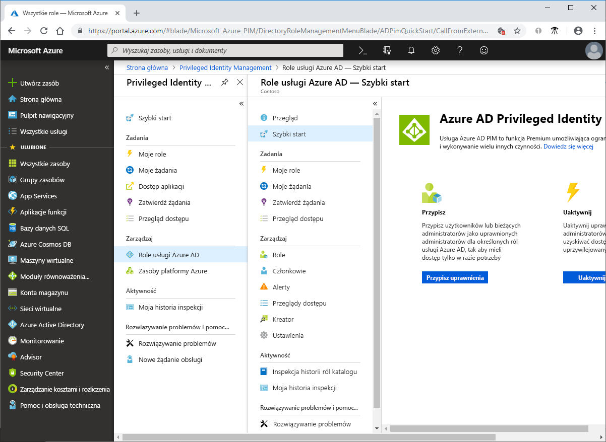

# Co to jest usługa Azure AD Privileged Identity Management?

Usługa Azure Active Directory (Azure AD) Privileged Identity Management (PIM) to usługa, która umożliwia zarządzanie i sterowanie dostępem do ważnych zasobów w organizacji oraz monitorowanie go. Dotyczy to również dostępu do zasobów platformy Azure oraz zasobów w usłudze Azure AD i w innych usługach online firmy Microsoft, takich jak Office 365 lub Microsoft Intune.

## Dlaczego warto używać usługi PIM?

Organizacje dążą do zminimalizowania liczby osób, które mają dostęp do zabezpieczonych informacji lub zasobów, ponieważ zmniejsza to prawdopodobieństwo uzyskania dostępu do nich przez użytkownika mającego złe zamiary lub przypadkowej modyfikacji poufnych zasobów przez osobę uprawnioną. Jednak użytkownicy nadal muszą wykonywać operacje uprzywilejowane w usłudze Azure AD, na platformie Azure, w usłudze Office 365 i w aplikacjach SaaS. Organizacje mogą przyznać użytkownikom dostęp uprzywilejowany just-in-time (JIT) do zasobów platformy Azure i do usługi Azure AD. Istnieje potrzeba nadzorowania sposobu, w jaki ci użytkownicy korzystają z uprawnień administratora. Usługa PIM pomaga zmniejszyć ryzyko związane z nadmiernymi, niepotrzebnymi lub niewłaściwie używanymi prawami dostępu.

## Co można zrobić za pomocą usługi PIM?

Usługa PIM zasadniczo pomaga w zarządzaniu obszarami „kto, co, kiedy, gdzie i dlaczego” dla ważnych zasobów. Oto niektóre kluczowe funkcje usługi PIM:

- Zapewnianie dostępu uprzywilejowanego **just-in-time** do usługi Azure AD i zasobów platformy Azure
- Przypisywanie **czasowego** dostępu do zasobów przy użyciu daty rozpoczęcia i zakończenia
- Wymaganie **zatwierdzenia** aktywowania ról uprzywilejowanych
- Wymuszanie **uwierzytelniania wieloskładnikowego** w celu aktywowania jakiejkolwiek roli
- Używanie **uzasadnień** w celu uzyskania informacji, dlaczego użytkownicy aktywują role
- Otrzymywanie **powiadomień** o aktywowaniu ról uprzywilejowanych
- Przeprowadzanie **przeglądów dostępu** w celu upewnienia się, że użytkownicy nadal potrzebują ról
- Pobieranie **historii inspekcji** w celu przeprowadzenia inspekcji wewnętrznej lub zewnętrznej

## Terminologia

Aby lepiej zrozumieć usługę PIM i jej dokumentację, zapoznaj się z poniższymi terminami.

| Termin lub pojęcie | Kategoria przypisania roli | Opis |
| --- | --- | --- |
| kwalifikowanie się | Type | Przypisanie roli, które wymaga od użytkownika wykonania jednej lub kilku akcji w celu użycia tej roli. Jeśli użytkownik został zakwalifikowany do roli, oznacza to, że może aktywować tę rolę, kiedy musi wykonać zadanie uprzywilejowane. Nie ma żadnej różnicy między dostępem udzielonym komuś za pomocą trwałego przypisania roli i przypisania kwalifikowania się do roli. Jedyna różnica polega na tym, że niektórzy użytkownicy nie potrzebują tego dostępu przez cały czas. |
| aktywne | Type | Przypisanie roli, które nie wymaga od użytkownika wykonywania żadnych akcji w celu użycia tej roli. Użytkownicy przypisani jako aktywni mają uprawnienia przypisane do danej roli. |
| aktywuj |  | Proces wykonywania jednej lub kilku akcji w celu użycia roli, do której użytkownik został zakwalifikowany. Akcje te mogą obejmować przeprowadzenie uwierzytelniania wieloskładnikowego (MFA), podanie uzasadnienia biznesowego lub żądanie zatwierdzenia od wyznaczonych osób zatwierdzających. |
| przypisano | Stan | Użytkownik, który ma aktywne przypisanie roli. |
| aktywowano | Stan | Użytkownik, który ma przypisanie kwalifikowania się do roli, wykonał akcje w celu aktywowania roli i jest teraz aktywny.  Po aktywowaniu roli użytkownik może z niej korzystać przez wstępnie skonfigurowany czas, po którym rola będzie musiała być ponownie aktywowana. |
| trwałe kwalifikowanie się | Czas trwania | Przypisanie roli, w którym użytkownik jest zawsze zakwalifikowany do aktywowania roli. |
| trwałe aktywne | Czas trwania | Przypisanie roli, w którym użytkownik zawsze może używać roli bez wykonywania żadnych akcji. |
| kwalifikowanie się z wygaśnięciem | Czas trwania | Przypisanie roli, w którym użytkownik jest zakwalifikowany do aktywowania roli w okresie określonym datą rozpoczęcia i zakończenia. |
| aktywne z wygaśnięciem | Czas trwania | Przypisanie roli, w którym użytkownik może używać roli bez wykonywania żadnych akcji w okresie określonym datą rozpoczęcia i zakończenia. |
| dostęp just-in-time (JIT) |  | Model, w którym użytkownicy uzyskują tymczasowe uprawnienia do wykonywania uprzywilejowanych zadań, dzięki czemu złośliwi lub nieautoryzowani użytkownicy nie mogą uzyskać dostępu po wygaśnięciu uprawnienia. Dostęp jest udzielany tylko wtedy, gdy użytkownicy go potrzebują. |
| zasada dostępu z najniższymi uprawnieniami |  | Zalecane rozwiązanie dotyczące zabezpieczeń, w którym każdy użytkownik ma minimalne uprawnienia wymagane do wykonania zadania, które mu przydzielono. Takie rozwiązanie pozwala zminimalizować liczbę administratorów globalnych i zamiast tego korzystać ze specyficznych ról administratorów dla konkretnych scenariuszy. |

## Jak wygląda usługa PIM?

Po skonfigurowaniu usługi PIM w menu nawigacji po lewej stronie zostaną wyświetlone opcje **Zadania**, **Zarządzanie** i **Aktywność**. Jako administrator możesz wybrać między zarządzaniem **rolami usługi Azure AD** i rolami **zasobów platformy Azure**. Po wybraniu typu ról do zarządzania zostanie wyświetlony podobny zestaw opcji dla danego typu roli.

## Kto może wykonywać zadania w usłudze PIM i jakie mogą one być?

Jeśli jesteś pierwszą osobą używającą usługi PIM, będziesz mieć automatycznie przypisane role [Administrator zabezpieczeń](../users-groups-roles/directory-assign-admin-roles.md#security-administrator) i [Administrator ról uprzywilejowanych](../users-groups-roles/directory-assign-admin-roles.md#privileged-role-administrator) w katalogu.

W przypadku ról usługi Azure AD tylko użytkownik należący do roli Administrator ról uprzywilejowanych może zarządzać przypisaniami innych administratorów w usłudze PIM. Możesz [przyznać dostęp innym administratorom do zarządzania usługą PIM](pim-how-to-give-access-to-pim.md). Administratorzy globalni, administratorzy zabezpieczeń i czytelnicy zabezpieczeń mogą wyświetlać przypisania ról usługi Azure AD w usłudze PIM.

W przypadku ról zasobów platformy Azure tylko administrator subskrypcji, właściciel zasobu lub administrator dostępu użytkowników zasobu może zarządzać przypisaniami innych administratorów w usłudze PIM. Użytkownicy będący administratorami ról uprzywilejowanych, administratorami zabezpieczeń lub czytelnikami zabezpieczeń nie mają domyślnie uprawnień do wyświetlania przypisań ról zasobów platformy Azure w usłudze PIM.

## Scenariusze

Usługa PIM obsługuje następujące scenariusze:

**Administrator ról uprzywilejowanych ma następujące możliwości:**

- Włączanie zatwierdzeń dla określonych ról
- Określanie osób i/lub grup zatwierdzających żądania zatwierdzenia
- Wyświetlanie historii żądań i zatwierdzeń dla wszystkich ról uprzywilejowanych

**Osoba zatwierdzająca ma następujące możliwości:**

- Wyświetlanie oczekujących zatwierdzeń (żądań)
- Zatwierdzanie lub odrzucanie żądań podniesienia uprawnień ról (pojedyncze i/lub zbiorcze)
- Uzasadnianie zatwierdzeń/odrzuceń 

**Użytkownik z kwalifikowaniem się do roli ma następujące możliwości:**

- Żądanie aktywacji roli wymagającej zatwierdzenia
- Wyświetlanie stanu żądania uaktywnienia
- Wykonywanie zadania w usłudze Azure AD w przypadku zatwierdzenia uaktywnienia

## Wymagania licencyjne

[!INCLUDE [Azure AD Premium P2 license](../../../includes/active-directory-p2-license.md)]

Aby uzyskać informacje o licencjach dla użytkowników, zobacz [Wymagania licencyjne dotyczące korzystania z usługi PIM](subscription-requirements.md).

## Kolejne kroki

- [Wymagania licencyjne dotyczące korzystania z usługi PIM](subscription-requirements.md)
- [Zabezpieczanie uprzywilejowanego dostępu dla wdrożeń hybrydowych i wdrożeń w chmurze w usłudze Azure AD](../users-groups-roles/directory-admin-roles-secure.md?toc=%2fazure%2factive-directory%2fprivileged-identity-management%2ftoc.json)
- [Wdrażanie usługi PIM](pim-deployment-plan.md)
