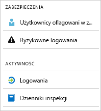

# Co to są raporty usługi Azure Active Directory?

Dzięki raportom usługi Azure Active Directory możesz uzyskać szczegółowe informacje na temat działania środowiska.  
Na podstawie udostępnionych danych można:

- Określać, jak usługi i aplikacje są wykorzystywane przez użytkowników
- Wykrywać potencjalne zagrożenia wpływające na kondycję środowiska
- Rozwiązywać problemy uniemożliwiające użytkownikom wykonywanie pracy  

Architektura raportów opiera się na dwóch głównych filarach:

- Raporty dotyczące zabezpieczeń
- Raporty dotyczące działań

## Raporty dotyczące zabezpieczeń

Raporty dotyczące zabezpieczeń w usłudze Azure Active Directory pomagają chronić tożsamości w organizacji.  
W usłudze Azure Active Directory istnieją dwa typy raportów dotyczących zabezpieczeń:

- **Użytkownicy oflagowani w związku z ryzykiem** — [raport zabezpieczeń dotyczący użytkowników oflagowanych w związku z ryzykiem](concept-user-at-risk.md) zawiera omówienie kont użytkowników, których zabezpieczenia mogły zostać naruszone.

- **Ryzykowne logowania** — [raport zabezpieczeń dotyczący ryzykownych logowań](concept-risky-sign-ins.md) jest wskaźnikiem próby logowania, które mogło zostać wykonane przez osobę, która nie jest prawowitym właścicielem konta użytkownika. 

**Jaka licencja usługi Azure AD jest wymagana w celu uzyskania dostępu do raportu zabezpieczeń?**  

Wszystkie wersje usługi Azure Active Directory zapewniają dostęp do raportów użytkowników oflagowanych w związku z ryzykiem oraz ryzykownych logowań.  
Jednak poziom szczegółowości raportu zależy od wersji: 

- W **usłudze Azure Active Directory w wersji Bezpłatna i Podstawowa** masz już dostęp do listy użytkowników oflagowanych w związku z ryzykiem i ryzykownych logowań. 

- Wersja **Azure Active Directory Premium 1** rozszerza ten model, umożliwiając również badanie niektórych podstawowych zdarzeń związanych z ryzykiem, które uwzględniono w poszczególnych raportach. 

- Wersja **Azure Active Directory Premium 2** oferuje najbardziej szczegółowe informacje na temat zdarzeń związanych z ryzykiem i umożliwia również konfigurowanie zasad zabezpieczeń, które automatycznie reagują na wystąpienie skonfigurowanych poziomów ryzyka.

## Raporty dotyczące działań

W usłudze Azure Active Directory istnieją dwa typy raportów dotyczących działań:

- **Dzienniki inspekcji** — [raport działań dotyczący dzienników inspekcji](concept-audit-logs.md) zapewnia dostęp do historii wszystkich zadań wykonanych w dzierżawie.

- **Logowania** — przy użyciu [raportu działań dotyczącego logowań](concept-sign-ins.md) można określić, kto wykonał zadania zgłoszone w raporcie dzienników inspekcji.

**Raport dzienników inspekcji** dostarcza informacji na temat aktywności systemu pod kątem zgodności. Te dane pozwalają reagować na typowe scenariusze, takie jak:

- Ktoś w mojej dzierżawie uzyskał dostęp do grupy administratorów. Kto udzielił tej osobie prawa dostępu? 

- Chcę zobaczyć listę użytkowników, którzy logowali się do określonej aplikacji od momentu jej dołączenia oraz sprawdzić, jak działa aplikacja

- Chcę wiedzieć, ile operacji resetowania hasła jest wykonywanych w mojej dzierżawie

**Jaka licencja usługi Azure AD jest wymagana w celu uzyskania dostępu do raportu dzienników inspekcji?**  

Raport dzienników inspekcji jest dostępny w przypadku funkcji, do których masz licencje. Jeśli masz licencję określonej funkcji, masz również dostęp do informacji z dotyczącego jej dziennika inspekcji.

Aby uzyskać więcej informacji, zobacz sekcję **Porównanie ogólnie dostępnych funkcji w wersjach Bezpłatna, Podstawowa i Premium** na stronie [funkcji i możliwości usługi Azure Active Directory](https://www.microsoft.com/cloud-platform/azure-active-directory-features).   

**Raport aktywności związanej z logowaniem** zawiera odpowiedzi na pytania, takie jak:

- Co to jest wzorzec logowania użytkownika?
- Ilu użytkowników zalogowało się w ciągu tygodnia?
- Jaki jest stan tych logowań?

**Jaka licencja usługi Azure AD jest wymagana w celu uzyskania dostępu do raportu działań związanych z logowaniem?**  

Aby uzyskać dostęp do raportu działań związanych z logowaniem, dzierżawa musi mieć skojarzoną licencję usługi Azure AD w wersji Premium.

## Dostęp programowy

Oprócz interfejsu użytkownika funkcja raportowania w usłudze Azure Active Directory zapewnia [dostęp programowy ](concept-reporting-api.md) do danych raportów. Dane z tych raportów mogą być bardzo przydatne w aplikacjach, takich jak systemy SIEM oraz narzędzia do inspekcji i analizy biznesowej. Interfejsy API raportów usługi Azure AD umożliwiają dostęp programowy do danych za pomocą zestawu interfejsów API opartych na architekturze REST. Te interfejsy API można wywoływać przy użyciu różnych języków i narzędzi do programowania. 

## Następne kroki

- [Raport dotyczący ryzykownych logowań](concept-risky-sign-ins.md)
- [Raport dotyczący dzienników inspekcji](concept-audit-logs.md)
- [Raport dotyczący dzienników logowania](concept-sign-ins.md)