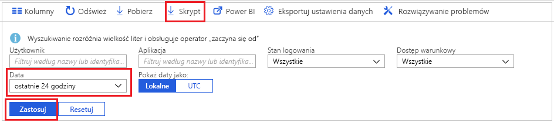
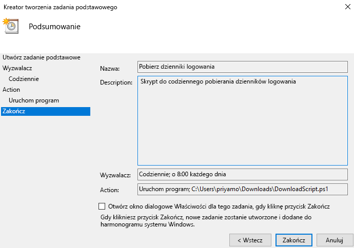

# Samouczek: jak pobrać skrypt w celu uzyskania dostępu do dzienników logowania i jak go używać

Jeśli chcesz pracować z danymi dotyczącymi działań związanych z logowaniem poza witryną Azure Portal, możesz je pobrać. Opcja **Pobierz** w witrynie Azure Portal umożliwia utworzenie pliku CSV zawierającego 5000 najnowszych rekordów. Jeśli potrzebujesz większej elastyczności, na przykład chcesz pobrać więcej niż 5000 rekordów jednocześnie lub pobierać dzienniki w zaplanowanych odstępach czasu, możesz użyć przycisku **Skrypt**, aby wygenerować skrypt programu PowerShell do pobierania danych.

W tym samouczku pokazano, jak wygenerować skrypt w celu pobierania wszystkich dzienników logowania z ostatnich 24 godzin i zaplanować wykonywanie tego skryptu codziennie. 

## Wymagania wstępne

Potrzebne elementy:

* Dzierżawa usługi Azure Active Directory z licencją premium (P1/P2). Pamiętaj, że jeśli przed uaktualnieniem nie istniały żadne dane działań, po przejściu na licencję premium może minąć kilka dni, zanim te dane pojawią się w raportach. 
* Użytkownik mający rolę **administratora globalnego**, **administratora zabezpieczeń**, **czytelnika zabezpieczeń** lub **czytelnika raportów** dla dzierżawy. Ponadto każdy użytkownik może uzyskiwać dostęp do informacji o swoim logowaniu. 
* Jeśli chcesz uruchomić pobrany skrypt na maszynie z systemem Windows 10, [skonfiguruj moduł programu Azure PowerShell i ustaw zasady wykonywania](concept-sign-ins.md#running-the-script-on-a-windows-10-machine).

## Samouczek

1. Przejdź do witryny [Azure Portal](https://portal.azure.com) i wybierz swój katalog.
2. Wybierz pozycję **Azure Active Directory**, a następnie pozycję **Logowania** w sekcji **Monitorowanie**. 
3. Z listy rozwijanej filtru **Zakres dat** wybierz pozycję **24 godziny**, aby uzyskać dane z ostatnich 24 godzin. 
4. Wybierz pozycję **Zastosuj** i sprawdź, czy filtr został zastosowany zgodnie z oczekiwaniami. 
5. Wybierz przycisk **Skrypt** z menu w górnej części ekranu, aby pobrać skrypt programu PowerShell z zastosowanymi filtrami.

     
     
6. Otwórz aplikację **Harmonogram zadań** na maszynie z systemem Windows i wybierz pozycję **Utwórz zadanie podstawowe**.
7. Wprowadź nazwę i opis zadania, a następnie kliknij przycisk **Dalej**.
8. Wybierz przycisk radiowy **Codziennie**, aby zadanie było wykonywane codziennie, a następnie wprowadź datę i godzinę rozpoczęcia.
9. W menu akcji wybierz pozycję **Uruchom program**, a następnie wybierz pobrany skrypt i przycisk **Dalej**. 
10. Przejrzyj zaplanowane zadanie, a następnie wybierz przycisk **Zakończ**, aby je utworzyć.

     

Utworzone zadanie będzie uruchamiane codziennie, zapisując rekordy dzienników logowania z ostatnich 24 godzin w pliku o nazwie w formacie **AAD_SignInReport_RRRRMMDD_GGMMSS.csv**. Możesz również edytować pobrany skrypt programu PowerShell, aby zmienić nazwę zapisywanego pliku lub liczbę pobieranych rekordów. 

## Następne kroki

* [Azure Active Directory report retention policies](reference-reports-data-retention.md) (Zasady przechowywania raportów w usłudze Azure Active Directory)
* [Wprowadzenie do interfejsu API raportów usługi Azure Active Directory](concept-reporting-api.md)
* [Access the reporting API with certificates (Uzyskiwanie dostępu do interfejsu API raportowania za pomocą certyfikatów)](tutorial-access-api-with-certificates.md)
