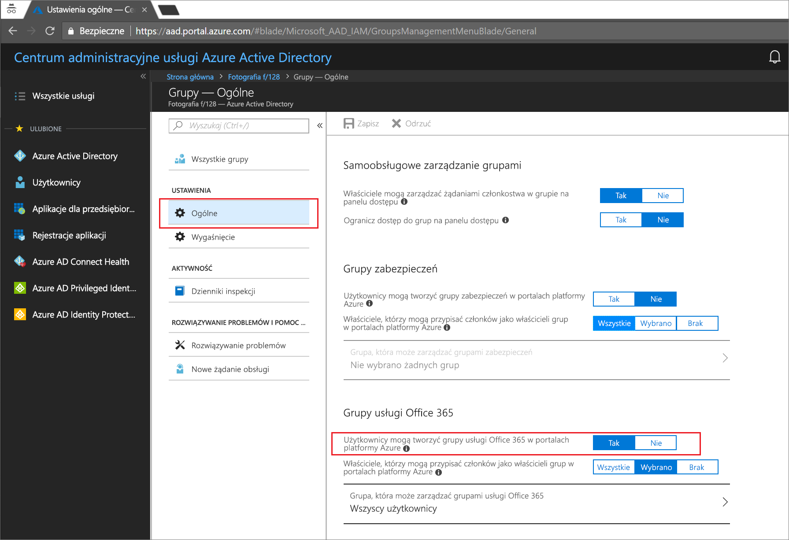
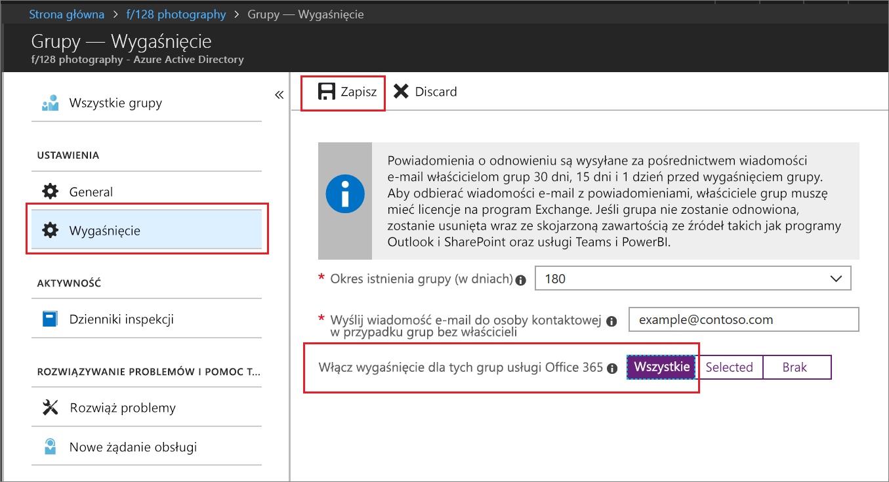

# Szybki start: Konfigurowanie wygasania grup usługi Office 365 w usłudze Azure Active Directory

W tym przewodniku Szybki start ustawisz zasady wygasania grup usługi Office 365. Umożliwienie użytkownikom tworzenia własnych grup może prowadzić do powstania wielu nieużywanych grup. Jednym ze sposobów radzenia sobie z nieużywanymi grupami jest skonfigurowanie wygasania tych grup, co pozwala uniknąć konieczności ich ręcznego usuwania.

Zasady wygasania są proste:

* Właściciele grupy są powiadamiani o konieczności odnowienia wygasającej grupy
* Grupa, która nie zostanie odnowiona, zostanie usunięta
* Usunięta grupa usługi Office 365 może zostać przywrócona w ciągu 30 dni przez właściciela grupy lub administratora usługi Azure AD

Jeśli nie masz subskrypcji platformy Azure, przed rozpoczęciem [utwórz bezpłatne konto](https://azure.microsoft.com/free/).

## Wymaganie wstępne

 Rola najmniej uprzywilejowane, wymagane do skonfigurowania wygaśnięcie grupy jest administrator użytkowników w organizacji.

## Włączanie tworzenia grup przez użytkowników

1. Zaloguj się do [witryny Azure portal](https://portal.azure.com) przy użyciu konta administratora użytkowników.

2. Wybierz pozycję **Grupy**, a następnie wybierz pozycję **Ogólne**.
  
   

3. Zmień wartość ustawienia **Użytkownicy mogą tworzyć grupy usługi Office 365** na **Tak**.

4. Wybierz pozycję **Zapisz**, aby zapisać ustawienia grup, gdy wszytko będzie gotowe.

## Ustawianie czasu wygaśnięcia grup

1. Zaloguj się do [witryny Azure portal](https://portal.azure.com), wybierz opcję **usługi Azure Active Directory** > **grup** > **wygaśnięcia** do Otwórz ustawienia wygaśnięcia.
  
   

2. Ustaw interwał wygasania. Wybierz wstępnie zdefiniowaną wartość lub wprowadź niestandardową wartość większą niż 31 dni. 

3. Podaj adres e-mail, na który mają być wysyłane powiadomienia dotyczące wygaśnięcia, jeśli grupa nie ma właściciela.

4. Na potrzeby tego podręcznika Szybki start ustaw opcję **Włącz wygaśnięcie dla tych grup usługi Office 365** na wartość **Wszystkie**.

5. Wybierz przycisk **Zapisz**, aby zapisać ustawienia wygasania, gdy wszystko będzie gotowe.

To wszystko! W tym przewodniku Szybki start pomyślnie ustawiono zasady wygasania dla wybranych grup usługi Office 365.

## Oczyszczanie zasobów

### Aby usunąć zasady wygasania

1. Zaloguj się w witrynie [Azure Portal](https://portal.azure.com) przy użyciu konta administratora globalnego dzierżawy.
2. Wybierz pozycję **Azure Active Directory** > **Grupy** > **Wygasanie**.
3. Ustaw opcję **Włącz wygaśnięcie dla tych grup usługi Office 365** na wartość **Brak**.

### Aby wyłączyć tworzenie użytkownika w grupach

1. Wybierz pozycję **Azure Active Directory** > **Grupy** > **Ogólne**. 
2. Ustaw opcję **Użytkownicy mogą tworzyć grupy usługi Office 365 w portalach platformy Azure** na wartość **Nie**.

## Kolejne kroki

Aby uzyskać więcej informacji na temat wygaśnięcia, w tym instrukcje dotyczące programu PowerShell i ograniczenia techniczne zobacz następujący artykuł:

> [!div class="nextstepaction"]
> [Zasady wygasania programu PowerShell](groups-lifecycle.md)
